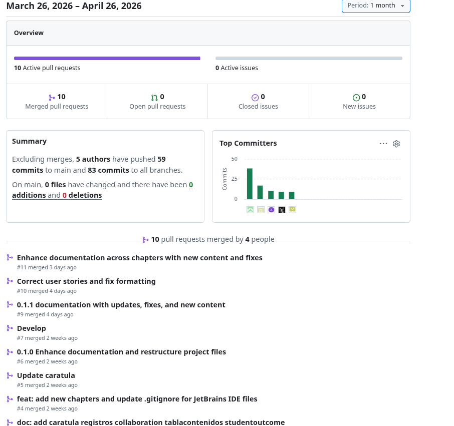
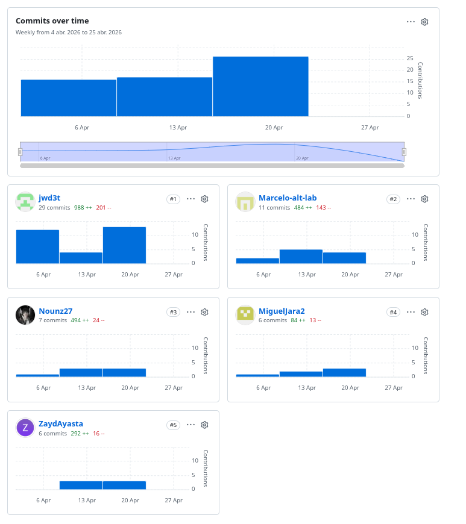

# Project Report Collaboration Insights
Todas las actividades asignadas para la entrega del AV1 se encuentran documentadas en el repositorio de GitHub de la organización del equipo, accesible en: [https://github.com/Aurora-AplicacionesWeb](https://github.com/Aurora-AplicacionesWeb) En cuanto al informe, cada miembro del equipo participó redactando y elaborando gráficos en formato Markdown de acuerdo con los temas asignados, registrando su progreso mediante commits en el repositorio correspondiente, encontrándose en el siguiente enlace: [https://github.com/Aurora-AplicacionesWeb/Aurora](https://github.com/Aurora-AplicacionesWeb/Aurora) Aqui se pueden aprecion todos los commits hechos en la TB1 evidenciando el trabajo colaborativo.

## Insights

