# Capítulo II: Requirements Elicitation & Analysis.

## 2.1. Competidores

En esta sección se realizará un análisis competitivo sobre distintas plataformas de gestión de restaurantes y proveedores que se encuentran en el mercado, que cumplan funciones similares a nosotros. De esta manera podremos conocer nuestra posición frente a posibles competidores.

Las siguientes plataformas son de las más relevantes en el mercado de gestión de restaurantes y proveedores, cada una con enfoques y características distintas que las hacen destacar en diferentes aspectos del sector:

**1. Apicbase**

- Es un sistema operativo para la gestión de alimentos y bebidas diseñado específicamente para operaciones multi-unidad, como cadenas de restaurantes y hoteles. Unifica recetas, menús y compras en todos los locales, asegurando consistencia en la calidad y los costos e incluye módulos avanzados para trazabilidad de ingredientes, gestión de alérgenos y cumplimiento de normas HACCP (Apicbase, s.f.)[^1].

**2. MarketMan**

- Plataforma "todo en uno" para el control de inventarios y suministros, ideal para optimizar los flujos de trabajo administrativos (back-of-house). Utiliza análisis predictivos para automatizar pedidos a proveedores y detectar fluctuaciones de precios en tiempo real y calcula el costo exacto de cada plato integrando las facturas de compra con las ventas del punto de venta (TPV) (MarketMan, s.f.)[^2].

**3. WISK.ai**

- App móvil que se destaca por su precisión técnica, ofreciendo una de las soluciones de inventario más rápidas y precisas del mercado gracias al uso intensivo de inteligencia artificial. Su app móvil puede identificar botellas y productos mediante la cámara, agilizando el conteo de existencias, ofrece herramientas muy detalladas para bares y hoteles, permitiendo un seguimiento exacto de mermas en licores y bebidas mezcladas y su IA puede predecir la demanda basándose no solo en ventas pasadas, sino también en factores externos como el clima o eventos locales (WISK.ai, s.f.)[^3].

**4. Restaurant365**

- Plataforma de gestión empresarial integral basada en la nube, diseñada específicamente para el sector de la hospitalidad. Incluye una red contable específica para restaurantes que automatiza facturas, cuentas por pagar y conciliaciones bancarias, permite rastrear ingredientes en tiempo real, gestionar pedidos automáticos a proveedores y analizar el costo teórico frente al real para reducir mermas, utiliza IA para predecir la demanda futura, optimizar los horarios de trabajo y generar informes de pérdidas y ganancias (P&L) en tiempo real y se integra con cientos de sistemas de punto de venta (TPV/POS), bancos y proveedores de alimentos para que los datos fluyan automáticamente sin necesidad de hojas de cálculo manuales (Restaurant365, s.f.)[^4].

### 2.1.1. Análisis Competitivo

<table>
    <tr>
        <td colspan="7" align="center">
            <b>Competitive Analysis Landscape</b>
        </td>
    </tr>
    <tr>
        <td colspan="2" align="center">
            ¿Porqué llevar a cabo este análisis?
        </td>
        <td colspan="5">
        El objetivo de este análisis es identificar las fortalezas, debilidades, oportunidades y amenazas del entorno competitivo en el sector de gestión de resturantes y proveedores, con el fin de definir la ventaja competitiva de SupplyWok frente a las alternativas existentes y orientar las estrategias de diferenciación e innovación.</td>
    </tr>
   <tr>
        <td colspan="2" align="center">
            <b>Competidores</b>
        </td>
        <td align="center">
            <p><b>SupplyWok</b></p>
            
        </td>
        <td align="center">
            <p><b>Apicbase</b></p>
            
        </td>
        <td align="center">
            <p><b>MarketMan</b></p>
            
        </td>
        <td align="center">
            <p><b>WISK.ai</b></p>
            
        </td>
        <td align="center">
            <p><b>Restaurant365</b></p>
            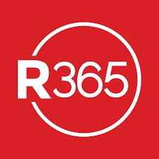    
    </tr>
    <tr>
        <td rowspan="2" align="center">
            <b>Perfil</b>
        </td>
        <td align="center">
            <b>Overview</b>
        </td>
        <td align="center">
            <p>
                Plataforma web que optimiza y agiliza la gestión operativa y de abastecimiento en restaurantes tipo chifa mediante soluciones tecnológicas inteligentes. 
            </p>
        </td>
        <td align="center">
            <p>
                Plataformaa basada en la nube diseñada para centralizar la gestión de alimentos y bebidas en cadenas de restaurantes y hoteles.
            </p>
        </td>
        <td align="center">
            <p>
                Plataforma basada en la nube especializada en automatizar el inventario y las compras para restaurantes, conectando el almacén directamente con los proveedores.
            </p>
        </td>
        <td align="center">
            <p>
                Plataforma basada en IA que se especializa en la gestión ultraprecisa de inventarios, usando reconocimiento de imágen para agilizar el conteo de existencias mediante el móvil.
            </p>
        </td>
        <td align="center">
            <p>
                Plataforma de gestión empresarial que unifica en un solo sistema la contabilidad, el control de inventarios, las compras y la gestión del personal.
            </p>
        </td>
    </tr>
     <tr>
        <td align="center">
            <b>Ventaja competitiva ¿Qué valor ofrece a los clientes?</b>
        </td>
        <td align="center">
            <p>
                Plataforma centralizada y escalable que optimiza la cadena de suministro mediante analítica predictiva, garantizando eficiencia operativa, prevención de accidentes y una colaboración inteligente entre restaurantes y proveedores para una gestión sostenible.
            </p>
        </td>
        <td align="center">
            <p>
                Gestión centralizada de recetas y menús para múltiples locales, con enfoque en trazabilidad alimentaria, control de alérgenos y estandarización de la producción a gran escala.
            </p>
        </td>
        <td align="center">
            <p>
                Automatización integral del inventario y compras que utiliza análisis predictivos para sugerir pedidos, detectar variaciones de precios y maximizar la rentabilidad operativa.
            </p>
        </td>
        <td align="center">
            <p>
                Control de inventario ultrapeciso mediante inteligencia artificial y reconocimiento visual, especializado en la reducción de mermas y optimización de costos en bebidas y licores.
            </p>
        </td>
        <td align="center">
            <p>
                Sistema ERP unificado que integra contabilidad financiera, inventarios y gestión de personal, conectando el flujo de caja con la operación diaria en una sola plataforma.
            </p>
        </td>
    </tr>
    <tr>
        <td rowspan="2" align="center">
            <b>Perfil de Marketing</b>
        </td>
        <td align="center">
            <b>Mercado objetivo</b>
        </td>
        <td align="center">
            <p>
                Restaurantes de gastronomía peruano-china (chifas), aquellos con una operación moderada a alta complejidad que enfrentan retos críticos en la frescura de insumos y seguridad laboral.
            </p>
        </td>
        <td align="center">
            <p>
                Grupos de hospitalidad, hoteles y empresas de catering. Negocios con múltiples unidades y cocinas centrales que necesitan estandarizar recetas y producción a gran escala.
            </p>
        </td>
        <td align="center">
            <p>
                Restaurantes individuales y pequeñas cadenas enfocados principalmente en gestión de alimentos.
            </p>
        </td>
        <td align="center">
            <p>
                Establecimientos con un alto volumen de bebidas, como bares, clubes nocturnos y restaurantes de alta gama.
            </p>
        </td>
        <td align="center">
            <p>
                Operadores de nivel empresarial y franquicias que requieren una solución contable robusta.
            </p>
        </td>
    </tr>
     <tr>
        <td align="center">
            <b>Estrategias de marketing</b>
        </td>
        <td align="center">
            <p>
                Promocionar el uso de sensores IoT, contenido especializado en seguridad y prevención de riegos en cocina, y co-marketing con proveedores de insumos orientales.
            </p>
        </td>
        <td align="center">
            <p>
                Contenido educativo profundo, usando una biblioteca técnica para profesionales F&B, marketing basado en casos de éxito y enfoque emocional para chefs.
            </p>
        </td>
        <td align="center">
            <p>
                Estrategia de Co-Marketing, colaborando con socios tecnológicos, SEO y guías prácticas y prueba social masiva.
            </p>
        </td>
        <td align="center">
            <p>
                Marketing de comparación con otros competidores, calculadoras de ROI y lead magnets gratuitos.
            </p>
        </td>
        <td align="center">
            <p>
                Webinars de nivel eje ejecutivo, eventos de grandes franquicias y networking y marketing de datos unificados.
            </p>
        </td>
    </tr>
    <tr>
        <td rowspan="3" align="center">
            <b>Perfil de Producto</b>
        </td>
        <td align="center">
            <b>Productos & Servicios</b>
        </td>
        <td align="center">
            <p>
                Gestión de inventario, comandas y abastecimiento, monitoreo de seguridad en cocina mediante sensores, analítica predictiva para demanda y alertas de bajo stock.
            </p>
        </td>
        <td align="center">
            <p>
                Gestión de recetas y menús, planificación de producción, módulo de inventario, trazabilidad de alérgenos, ventas y analítica.
            </p>
        </td>
        <td align="center">
            <p>
                Gestión de compras, escaneo de facturas, control de inventario, alertas de precios y libro de cocina digital.
            </p>
        </td>
        <td align="center">
            <p>
                Inventario de bebidas (Bar), base de datos global para licores y vinos, inteligencia de pedidos y análisis de costos. 
            </p>
        </td>
        <td align="center">
            <p>
                Contabilidad, gestión de mano de obra, inventario y recetas, reporting empresarial y servicios de nómina.
            </p>
        </td>
    </tr>
<tr>
        <td align="center">
            <b>Precios & costos</b>
        </td>
        <td align="center">
            <p>
                Modelo de Suscripción; Wok: S/ 119.99 al mes por ubicación. Wok Enterprise: Precio personalizado según necesidades y tamaño del cliente.
            </p>
        </td>
        <td align="center">
            <p>
                Modelo de Suscripción; Basic: $265 aprox. al mes por establecimiento 
            </p>
        </td>
        <td align="center">
            <p>
                Modelo de Suscripción; Starter: Desde $199 al mes. Crecimiento: Desde $299 al mes. 
            </p>
        </td>
        <td align="center">
            <p>
                Modelo de Suscripción; Essentials: Desde $189 al mes. Professional: Desde $249 al mes. Premium: Desde $499 al mes.
            </p>
        </td>
        <td align="center">
            <p>
                Modelo de Suscripción; Eseential: Desde $399 o $435 al mes por ubicación. Professional: Aproximadamente $635 al mes.
            </p>
        </td>
    </tr>
    <tr>
        <td align="center">
            <b>Canales y distribución (Web y/o móvil)</b>
        </td>
        <td align="center">
            <p>
                Web (Escritorio) y móvil.
            </p>
        </td>
        <td align="center">
            <p>
                Web (Escritorio) y móvil.
            </p>
        </td>
        <td align="center">
            <p>
                Web (Escritorio) y móvil (iOS y Android).
            </p>
        </td>
        <td align="center">
            <p>
                Web (Escritorio) y móvil (iOS y Android).
            </p>
        </td>
        <td align="center">
            <p>
                Web (Escritorio) y móvil (iOS y Android).
            </p>
        </td>
    </tr>
    <tr>
        <td rowspan="4" align="center">
            <b>Análisis SWOT</b>
        </td>
        <td align="center">
            <b>Fortalezas</b>
        </td>
        <td align="center">
            <p>
                Diferenciador de seguridad, visión colaborativa y enfoque de sostenibilidad y escalabilidad.
            </p>
        </td>
        <td align="center">
            <p>
                Gestión visual de recetas de altísima calidad y control estricto de alérgenos/HACCP.
            </p>
        </td>
        <td align="center">
            <p>
                Enorme red de proveedores ya integrados y facilidad para escanear facturas.
            </p>
        </td>
        <td align="center">
            <p>
                Tecnología de escaneo de botellas y uso de IA para predecir demanda externa.
            </p>
        </td>
        <td align="center">
            <p>
                Unificación total de contabilidad, nómina y operación en un solo sistema financiero.
            </p>
        </td>
    </tr>
    <tr>
        <td align="center">
            <b>Debilidades</b>
        </td>
        <td align="center">
            <p>
                Barrera tecnológica inicial, dependencia de la data del proveedor y recursos de desarrollo.
            </p>
        </td>
        <td align="center">
            <p>
                Curva de aprendizaje elevada y precio alto para restaurantes individuales
            </p>
        </td>
        <td align="center">
            <p>
                Interfaz móvil no tan intuitiva respecto a la competencia 
            </p>
        </td>
        <td align="center">
            <p>
                Enfoque limitado a bebidas, la gestión de alimentos no es tan robusta como la de Apicbase.
            </p>
        </td>
        <td align="center">
            <p>
                Implementación extremedamente costosa y lenta, con un enfoque más contable que operativo.
            </p>
        </td>
    </tr>
    <tr>
        <td align="center">
            <b>Oportunidades</b>
        </td>
        <td align="center">
            <p>
                Nicho Especilizado (Chifas), crecimiento del sector en Latinoamérica y datos para el sector objetivo.  
            </p>
        </td>
        <td align="center">
            <p>
                Expansión en el sector hotelero de lujo y grandes canteras de catering.
            </p>
        </td>
        <td align="center">
            <p>
                Integración con sistemas de pago para el proceso directo de compras.
            </p>
        </td>
        <td align="center">
            <p>
                Convertirse en el estándar para auditorías de inventario en bares de alta gama y casinos.
            </p>
        </td>
        <td align="center">
            <p>
                Adquisición de plataformas más pequeñas para dominar el mercado de franquicias.
            </p>
        </td>
    </tr>
    <tr>
        <td align="center">
            <b>Amenazas</b>
        </td>
        <td align="center">
            <p>
                Competencia consolidada de grandes empresas, inestabilidad económica en Latinoamérica y resistencia al cambio cultural
            </p>
        </td>
        <td align="center">
            <p>
                Nuevos competidores con interfaces más ágiles y menos burocráticas como SupplyWok.
            </p>
        </td>
        <td align="center">
            <p>
                Pérdida de mercado frente a soluciones especializadas en nichos (como SupplyWok).
            </p>
        </td>
        <td align="center">
            <p>
                Que los sistemas de Punto de Venta (TPV) desarrollen sus propios escáneres nativos.
            </p>
        </td>
        <td align="center">
            <p>
                Software de contabilidad general, como QuickBook, que mejoren sus módulos de restaurante.
            </p>
        </td>
    </tr>
</table>

<sub>*Tabla 3. Análisis Competitivo*</sub>

### 2.1.2. Estrategias y tácticas frente a competidores

| **Estrategia / Táctica**                 | **Descripción**                                                                                                                                                     |  
|:-----------------------------------------|:--------------------------------------------------------------------------------------------------------------------------------------------------------------------|
| **Módulo de Seguridad Activa**           | Implementar "Checklists de Seguridad" en cocina obligatorios al abrir/cerrar turnos.                                                                                | 
| **Marketing Segmentado**                 | Diseñar campañas digitales en redes sociales, enfocadas en restaurantes peruano-chino (chifa), destacando el impacto innovador en sus negocios y el costo moderado. | 
| **Coordinación con Proveedores Locales** | Crear un portal simple (no gratuito) para los proveedores locales, facilitando el envío de pedidos mediante canales digitales.                                      | 
| **Pago por Local Escalable**             | Modelo de suscripción "Pay as you grow", ofreciendo precios accesibles para chifas de barrio, pero que escala con funciones avanzadas para cadenas grandes.         |
| **Rotación de Mesas**                    | Uso de sensores para calcular el promedio de ocupación. Si una mesa está libre, el sistema alerta al anfitrión o actualiza la app.                                  |

<sub>*Tabla 4. Estrategias y tácticas frente a competidores*</sub>

---

## 2.2. Entrevistas

### 2.2.1. Diseño de entrevistas

Para comprender mejor a nuestros usuarios y construir arquetipos representativos, diseñamos preguntas para las entrevistas de los dos segmentos objetivos identificados.

**Segmento 1: Dueños de restaurantes chifa y administradores**

**Objetivo de la entrevista:** Identificar cómo gestionan actualmente su inventario, abastecimiento, control operativo y monitoreo de procesos internos; además de reconocer sus principales frustraciones, necesidades y disposición para adoptar una plataforma digital con servicios IoT que les ayude a mejorar la toma de decisiones.

**Preguntas:**
- ¿Cuál es su nombre, edad y distrito donde se ubica su restaurante?
- ¿Cuál es su cargo o rol dentro del negocio?
- ¿Hace cuánto tiempo administra o trabaja en el restaurante?
- ¿Qué tipo de insumos manejan con mayor frecuencia en su operación?
- ¿Cómo realizan actualmente el control de inventario y el registro de stock?
- ¿Qué dificultades enfrenta al momento de prever la demanda de insumos o platos?
- ¿Con qué frecuencia tiene problemas de sobrestock o desabastecimiento?
- ¿Cómo coordinan actualmente los pedidos con sus proveedores?
- ¿Qué información considera más útil para tomar decisiones sobre abastecimiento?
- ¿Qué tan importante sería para usted recibir alertas automáticas sobre bajo stock?
- ¿Le sería útil visualizar proyecciones de demanda antes de hacer pedidos?
- ¿Qué tan dispuesto estaría a usar una plataforma web para controlar inventario, pedidos y monitoreo operativo?
- ¿Cuál de las siguientes funcionalidades considera más importante en una herramienta de este tipo? (Control de inventario alertas de stock bajo, registro de pedidos a proveedores, proyección de demanda, monitoreo de temperatura)
- ¿Qué le fastidia de la manera actual de gestionar la operación del restaurante?
- ¿Qué tan seguido cree que usaría una plataforma como esta: diario, semanal o solo cuando tenga problemas?

**Preguntas complementarias:**
- ¿Qué herramientas digitales usa actualmente para el negocio?
- ¿Qué redes sociales usa con mayor frecuencia?
- ¿Ha usado sensores o sistemas de monitoreo en su restaurante?
- ¿Qué tan cómodo se siente usando smartphones o aplicaciones móviles?

**Segmento 2: Proveedores de insumos para restaurantes**

**Objetivo de la entrevista:** Comprender cómo gestionan sus entregas, cómo se coordinan con sus clientes y qué información les sería útil para planificar mejor su abastecimiento, rutas y atención comercial a través de una plataforma digital.

**Preguntas:**
- ¿Cuál es su nombre, edad y tipo de negocio?
- ¿Qué productos o insumos distribuye a restaurantes?
- ¿Cuánto tiempo lleva trabajando como proveedor?
- ¿Cómo coordina actualmente los pedidos con sus clientes?
- ¿Qué canales usa para recibir pedidos o solicitudes de abastecimiento?
- ¿Qué dificultades enfrenta al planificar entregas o rutas?
- ¿Qué tan frecuente es que reciba pedidos imprevistos o urgentes?
- ¿Qué información le sería útil para anticipar la demanda de sus clientes?
- ¿Le ayudaría visualizar pedidos pendientes o proyecciones de compra?
- ¿Qué tan importante sería para usted conocer el consumo o stock aproximado de sus clientes?
- ¿Qué funcionalidades considera más valiosas en una plataforma para proveedores?
- ¿Qué le frustra de la forma actual de coordinar entregas y abastecimiento?
- ¿Qué tan dispuesto estaría a usar una plataforma digital para gestionar clientes y pedidos?
- ¿Con qué frecuencia cree que usaría una herramienta como esta?

**Preguntas complementarias:**
- ¿Qué herramientas usa hoy para organizar sus rutas o pedidos?
- ¿Usa algún sistema para seguimiento de entregas?
- ¿Qué datos le gustaría consultar antes de salir a repartir?
- ¿Cómo se podría usar una herramienta digital para mejorar la coordinación con restaurantes?

**Preguntas transversales para ambos segmentos**
- ¿Qué problemas considera más urgentes dentro de la operación actual?
- ¿Qué beneficios esperaría obtener de una plataforma como SupplyWok?
- ¿Qué tan importante sería para usted que la información esté centralizada en un solo lugar?
- ¿Qué tipo de reportes o indicadores le ayudarían más en su trabajo diario?
- ¿Qué tan útil le parecería una solución que combine gestión de inventario, pedidos, alertas y monitoreo operativo?
- ¿Qué preocupaciones tendría al usar una nueva plataforma digital para su negocio?
---
### 2.2.2. Registro de entrevistas.


#### Segmento #1: Dueños de restaurantes chifa y administradores
- **Entrevista #1**

<p align="center">
  
</p>

**Resumen de entrevista:**

Ana Chen, dueña de un chifa en La Perla (Callao) con 22 años de experiencia, gestiona su restaurante basándose principalmente en su experiencia y cálculo mental, especialmente para el manejo de inventario y abastecimiento de insumos como pollo, verduras y otros productos. No utiliza herramientas digitales ni considera necesarias funciones como alertas de stock o predicción de demanda, ya que confía en su conocimiento práctico y en la compra diaria según precios y necesidades. Actualmente realiza pedidos de forma directa (llamadas) y percibe que una plataforma podría complicar su proceso. Sin embargo, muestra cierto interés en herramientas orientadas a atraer más clientes, como una mejor presentación del menú, y solo usaría una solución digital en casos puntuales cuando lo considere necesario.

<br>
<div align="center">

| Detalle          | Información                                |
|------------------|--------------------------------------------|
| **Entrevistador** | Juan Sung Jau Wang Chen            |
| **Entrevistado**  | Ana Chen                |
| **Edad**          | 50 años                                    |
| **Ubicacion**     | La Perla, Callao                             |
| **Duración / Empieza en**      | 7:38 minutos / 0:19                           |
| **Enlace**        | [Ver entrevista](https://upcedupe-my.sharepoint.com/:v:/g/personal/u202318609_upc_edu_pe/IQDQHa7uwWb0SpGufV03qReqAdJZ63c91J2peSXSFxW63_U?e=CLpwrJ) |

</div>

<sub>*Tabla 5. Entrevista 1*</sub>

- **Entrevista #2**
<p align="center">
  
</p>

**Resumen de entrevista:**

El entrevistado Weiquan Wang, un cocinero y dueño de un chifa en La Perla (Callao) con aproximadamente 20 años de experiencia, gestiona su restaurante de forma muy tradicional, basándose principalmente en la compra directa y la comunicación por teléfono con proveedores. No lleva un control formal de inventario y suele darse cuenta de la falta de insumos cada pocos días, lo que genera problemas recurrentes de abastecimiento. Muestra interés en herramientas digitales, reconoce que sería útil contar con alertas de stock y sistemas que indiquen cuánto comprar, especialmente para evitar faltantes. También considera importante mejorar la rapidez en la entrega de pedidos y estaría dispuesto a usar una plataforma diariamente si esta le ayudara a resolver estos problemas de manera automática y sencilla.

<br>
<div align="center">

| Detalle          | Información                                |
|------------------|--------------------------------------------|
| **Entrevistador** | Juan Sung Jau Wang Chen            |
| **Entrevistado**  | Weiquan Wang               |
| **Edad**          | 55 años                                    |
| **Ubicacion**     | La Perla, Callao                             |
| **Duración / Empieza en**      | 8:46 minutos / 0:20                 |
| **Enlace**        | [Ver entrevista](https://upcedupe-my.sharepoint.com/:v:/g/personal/u202318609_upc_edu_pe/IQDEAnd2qgv5RrhlW47RT0uwAeMEyqi6KVvTeeECfeDlJLw?nav=eyJyZWZlcnJhbEluZm8iOnsicmVmZXJyYWxBcHAiOiJTdHJlYW1XZWJBcHAiLCJyZWZlcnJhbFZpZXciOiJTaGFyZURpYWxvZy1MaW5rIiwicmVmZXJyYWxBcHBQbGF0Zm9ybSI6IldlYiIsInJlZmVycmFsTW9kZSI6InZpZXcifX0%3D&e=ftyrCl) |

</div>

<sub>*Tabla 6. Entrevista 2*</sub>
- **Entrevista #2**
<p align="center">
  
</p>

**Resumen de entrevista:**

La entrevistada, Lili (54 años), dueña y encargada de cocina de un chifa con 10 años de experiencia, gestiona su restaurante de manera empírica, sin un control formal de inventario, revisando manualmente y comprando cuando nota que faltan insumos como carne, pollo, verduras y bebidas. Coordina los pedidos principalmente por llamadas y, en ocasiones, debe ir personalmente a adquirir los productos. No percibe grandes dificultades en su operación diaria, aunque reconoce que todo el proceso puede resultar molesto. A diferencia de otros casos, muestra apertura hacia una solución digital: considera importante recibir alertas de stock bajo y ve útil contar con proyecciones de demanda para planificar compras. Estaría dispuesta a usar una plataforma que automatice estas funciones y acepte diversas herramientas (inventario, pedidos, predicción), utilizándola de forma frecuente si le facilita la gestión del negocio.

<br>
<div align="center">

| Detalle          | Información                                |
|------------------|--------------------------------------------|
| **Entrevistador** | Juan Sung Jau Wang Chen            |
| **Entrevistado**  | Lily 蔡                |
| **Edad**          | 54 años                |
| **Ubicacion**     | La Perla, Callao       |
| **Duración / Empieza en**      | 12:49 minutos / 0:36  |
| **Enlace**        | [Ver entrevista](https://upcedupe-my.sharepoint.com/personal/u202318609_upc_edu_pe/_layouts/15/stream.aspx?id=%2Fpersonal%2Fu202318609%5Fupc%5Fedu%5Fpe%2FDocuments%2Fentrevista3%2Downers%201%2Emov&nav=eyJyZWZlcnJhbEluZm8iOnsicmVmZXJyYWxBcHAiOiJTdHJlYW1XZWJBcHAiLCJyZWZlcnJhbFZpZXciOiJTaGFyZURpYWxvZy1MaW5rIiwicmVmZXJyYWxBcHBQbGF0Zm9ybSI6IldlYiIsInJlZmVycmFsTW9kZSI6InZpZXcifX0&ga=1&referrer=StreamWebApp%2EWeb&referrerScenario=AddressBarCopied%2Eview%2Ec4f1f5f8%2Db63d%2D4413%2D84a5%2Dd4920163ad74) |

</div>

<sub>*Tabla 7. Entrevista 3*</sub>
<!-- Segmento objetivo: Proveedores-->
---
#### Segmento #2: Proveedores de insumos para restaurantes
- **Entrevista #1**

<p align="center">
  
</p>

**Resumen de entrevista:**

El entrevistado, Alberto Copa Villa (37 años, La Perla – Callao), es un proveedor de carne y pollo con 7 años de experiencia que gestiona sus pedidos principalmente por WhatsApp. Su trabajo es inmediato y diario, ya que los restaurantes compran para el momento, lo que genera como principal problema que muchos clientes pidan tarde, dificultando la disponibilidad de productos y su organización. No muestra interés en herramientas de predicción de demanda ni en conocer el consumo o stock de sus clientes, ya que considera que el consumo es constante. Sin embargo, sí valora una solución digital simple que le permita visualizar pedidos pendientes y recibir recordatorios o alertas, con el fin de evitar olvidos y mejorar su gestión diaria.
<br>
<div align="center">

| Detalle          | Información                                |
|------------------|--------------------------------------------|
| **Entrevistador** | Juan Sung Jau Wang Chen            |
| **Entrevistado**  | Alberto Copa Villa                |
| **Edad**          | 37 años                                    |
| **Ubicacion**     | La Perla, Callao                             |
| **Duración / Empieza en**      | 5:26 minutos / 0:31                           |
| **Enlace**        | [Ver entrevista](https://upcedupe-my.sharepoint.com/:v:/g/personal/u202318609_upc_edu_pe/IQAz-yZWPjdaTYEhhCMiX-lwAbe6dgRCmz--mI4NhxnP9zk?e=bCvRPf&nav=eyJyZWZlcnJhbEluZm8iOnsicmVmZXJyYWxBcHAiOiJTdHJlYW1XZWJBcHAiLCJyZWZlcnJhbFZpZXciOiJTaGFyZURpYWxvZy1MaW5rIiwicmVmZXJyYWxBcHBQbGF0Zm9ybSI6IldlYiIsInJlZmVycmFsTW9kZSI6InZpZXcifX0%3D) |

</div>

<sub>*Tabla 8. Entrevista 4*</sub>

### 2.2.3 Análisis de entrevistas.

El análisis de las entrevistas realizadas permite identificar patrones claros en los dos segmentos objetivo de SupplyWok: dueños de restaurantes chifa y proveedores. A partir de las entrevistas, se evidencian tanto comportamientos comunes como diferencias en la adopción tecnológica, sustentados en la frecuencia de respuestas observadas.

---

## Segmento 1: Dueños de restaurantes chifa y administradores

<p align="center">
    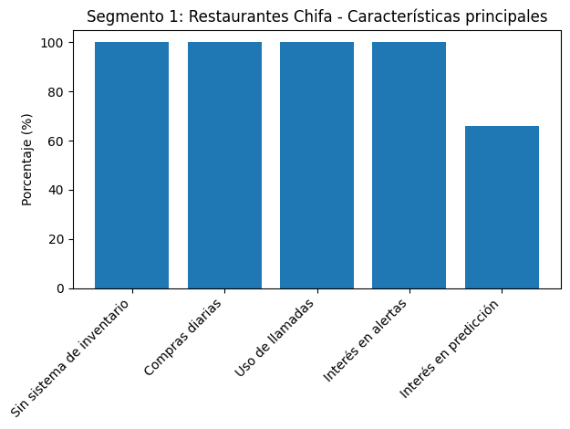
</p>

Este segmento agrupa a propietarios con amplia experiencia (entre 10 y 22 años en los casos entrevistados), quienes gestionan sus negocios de manera empírica.

### Gestión del Inventario
El 100% de los entrevistados indicó que no utiliza sistemas formales de inventario, dependiendo de la memoria o revisión visual. Esto genera situaciones donde los insumos se acaban sin planificación previa, obligando a compras reactivas.

### Abastecimiento y compras
El 100% realiza compras diarias o frecuentes, basándose en la demanda inmediata o en variaciones de precios (especialmente en productos como el pollo). No existe planificación a mediano plazo.

### Canales de comunicación
El 100% coordina pedidos mediante llamadas telefónicas, manteniendo procesos tradicionales.

### Percepción de problemas
Aproximadamente el 66% reconoce problemas operativos, como falta de insumos o retrasos en abastecimiento, aunque algunos los consideran parte normal del negocio. El 34% restante percibe su operación como estable, pese a no tener control estructurado.

### Adopción tecnológica
Se identifican dos subgrupos:

- **Resistentes (≈33%)**: consideran innecesarias las herramientas digitales y prefieren métodos tradicionales.
- **Abiertos (≈67%)**: muestran interés en soluciones si estas simplifican su trabajo.

### Funcionalidades de interés
- El 67% valora alertas de stock bajo y herramientas que automaticen el cálculo de compras.  
- Un 66% considera útil la predicción de demanda, especialmente para evitar faltantes.

---

## Segmento 2: Proveedores de insumos

<p align="center">
    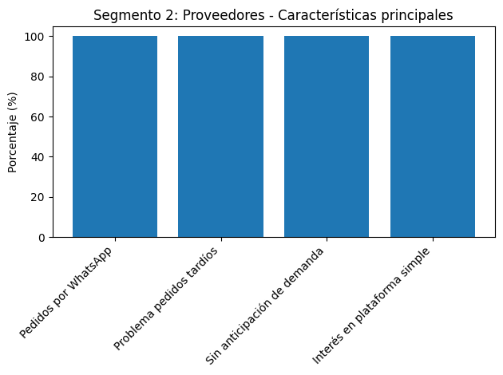
</p>

Este segmento incluye proveedores con experiencia (ej. 7 años), que operan en entornos de alta inmediatez.

### Gestión de pedidos
El 100% recibe pedidos mediante WhatsApp, lo que genera desorden y dependencia de mensajes informales.

### Problemas principales
El 100% identifica como principal dificultad los pedidos tardíos, lo que afecta la planificación y disponibilidad de productos.

### Planificación de demanda
El 100% indica que no puede anticipar la demanda, debido a que los restaurantes compran para el momento.

### Necesidades tecnológicas
El 100% muestra interés en herramientas simples, especialmente:

- Visualización de pedidos pendientes  
- Recordatorios o alertas  

Sin embargo, el 0% muestra interés en analítica avanzada o predicciones complejas.

---

## Conclusiones para el diseño de arquetipos

### Automatización simple y práctica
Dado que el 100% de restaurantes no usa sistemas formales, la plataforma debe automatizar procesos sin requerir esfuerzo adicional del usuario.

### Diferenciación de valor por segmento
- **Restaurantes**: valoran evitar faltantes y facilitar decisiones de compra.  
- **Proveedores**: necesitan orden en los pedidos y anticipación.

### Reducción de fricción
El sistema debe reemplazar llamadas y WhatsApp (usados por el 100%) con una solución igual de rápida, pero estructurada.

### Oportunidad clave
Existe una adopción potencial en el ≈67% de restaurantes, siempre que la solución sea simple, directa y no complique su operación.

## 2.3. Needfinding.

### 2.3.1. User Personas.

<p align="center">
  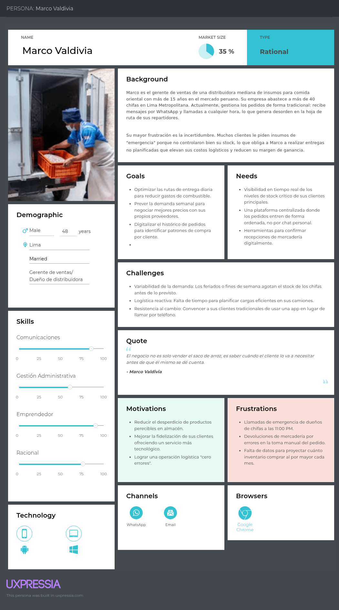
</p><br>

<sub>*Ilustración. User Persona proveedores de insumos para restaurantes*</sub>

<p align="center">
  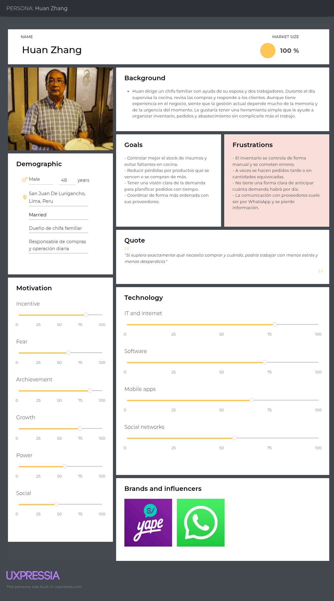
</p>

<sub>*Ilustración. User Persona dueños de restaurantes chifa y administradores*</sub>

### 2.2.2. User Task Matrix.

- **Segmento objetivo 1: Dueños de restaurantes chifa y administradores**

| User Task                                                                  | Frecuencia | Importancia |
|----------------------------------------------------------------------------|------------|-------------|
| Registrar y actualizar el inventario de insumos del restaurante            | Alta       | Alta        |
| Monitorear el stock de productos críticos en almacén                       | Alta       | Alta        |
| Revisar alertas de bajo stock para prevenir desabastecimiento              | Alta       | Alta        |
| Controlar las comandas y el estado de atención de los pedidos              | Alta       | Alta        |
| Supervisar la demanda estimada de platos e insumos                         | Media      | Alta        |
| Verificar la temperatura de cocina y almacenamiento mediante sensores IoT  | Alta       | Alta        |
| Identificar posibles riesgos operativos o de seguridad en cocina           | Media      | Alta        |
| Coordinar pedidos de abastecimiento con proveedores                        | Media      | Alta        |
| Consultar el historial de pedidos y consumo de insumos                     | Media      | Media       |
| Revisar el flujo de clientela en mesa para apoyar la proyección de demanda | Alta       | Alta        |
| Tomar decisiones de compra y abastecimiento con base en datos              | Media      | Alta        |
| Recibir notificaciones sobre eventos relevantes de operación               | Alta       | Alta        |

<sub>*Tabla 9. User Task para el segmento de dueños de restaurantes chifa*</sub>

- **Segmento objetivo 2: Proveedores de insumos para restaurantes**

| User Task                                                                           | Frecuencia | Importancia |
|-------------------------------------------------------------------------------------|------------|-------------|
| Registrar y gestionar pedidos recibidos de los restaurantes                         | Alta       | Alta        |
| Consultar el estado de los pedidos y su historial                                   | Alta       | Alta        |
| Revisar la demanda proyectada de sus clientes                                       | Media      | Alta        |
| Planificar rutas de entrega según pedidos y ubicaciones                             | Media      | Alta        |
| Coordinar entregas con mayor anticipación y precisión                               | Media      | Alta        |
| Monitorear información relacionada con el almacenamiento de sus clientes            | Media      | Alta        |
| Identificar necesidades de reposición según consumo estimado                        | Media      | Alta        |
| Consultar alertas o cambios relevantes en los pedidos                               | Alta       | Alta        |
| Revisar patrones de compra de los restaurantes atendidos                            | Media      | Media       |
| Organizar su operación logística en función de la demanda prevista                  | Media      | Alta        |
| Mejorar la puntualidad y eficiencia en las entregas                                 | Alta       | Alta        |
| Mantener comunicación más clara con los restaurantes sobre pedidos y abastecimiento | Alta       | Alta        |

<sub>*Tabla 10. User Task para el segmento de proveedores de chifas*</sub>

### 2.3.3. User Journey Mapping.

- **Segmento objetivo 1: Dueños de restaurantes chifa y administradores**

<p align="center">
  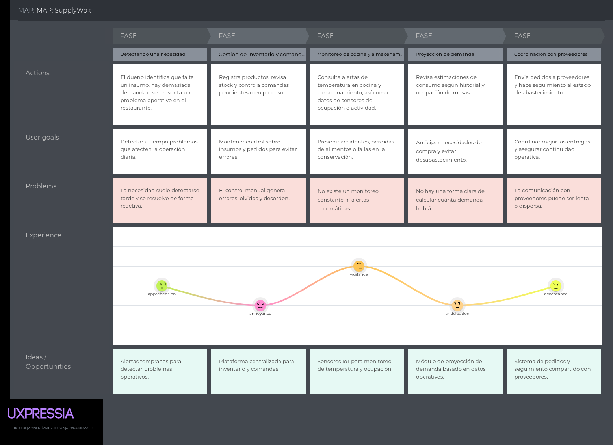
</p>

<sub>*Ilustración. User Journey Mapping - Segmento 1*</sub><br></br>

- **Segmento objetivo 2: Proveedores de insumos para restaurantes**

<p align="center">
  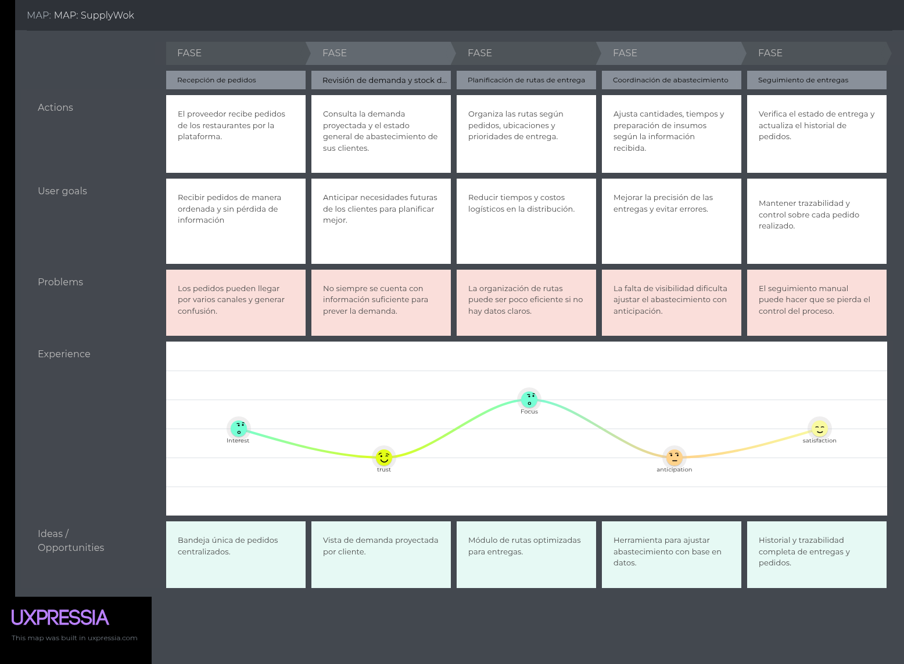
</p>

<sub>*Ilustración. User Journey Mapping - Segmento 2*</sub><br></br>

### 2.3.4. Empathy Mapping.

- **Segmento objetivo 1: Dueños de restaurantes chifa y administradores**

<p align="center">
  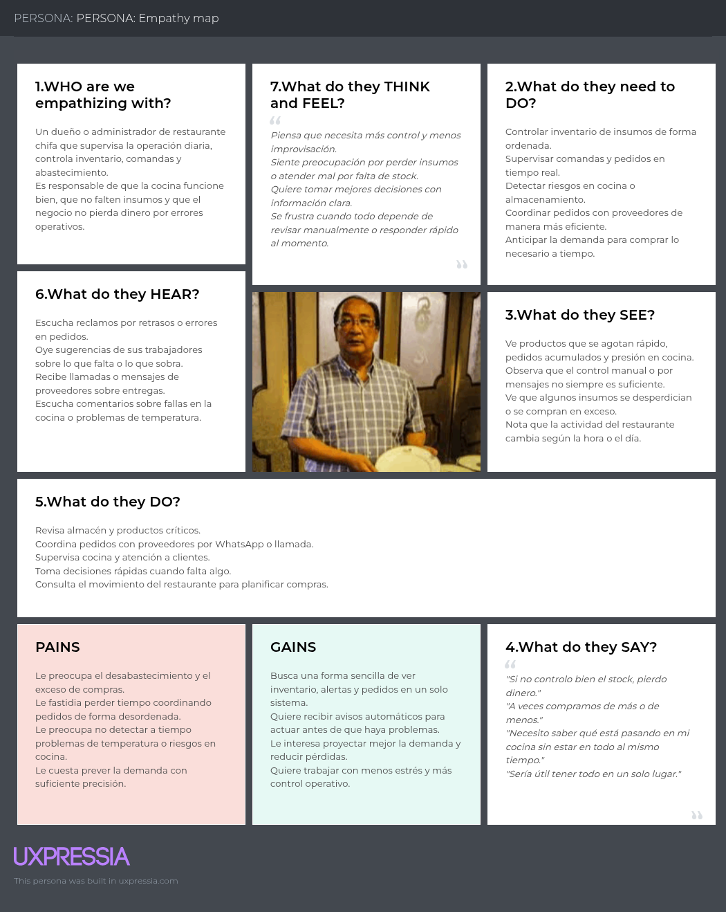
</p>

<sub>*Ilustración. Empathy Map - Segmento 1*</sub><br></br>

- **Segmento objetivo 2: Proveedores de insumos para restaurantes**

<p align="center">
  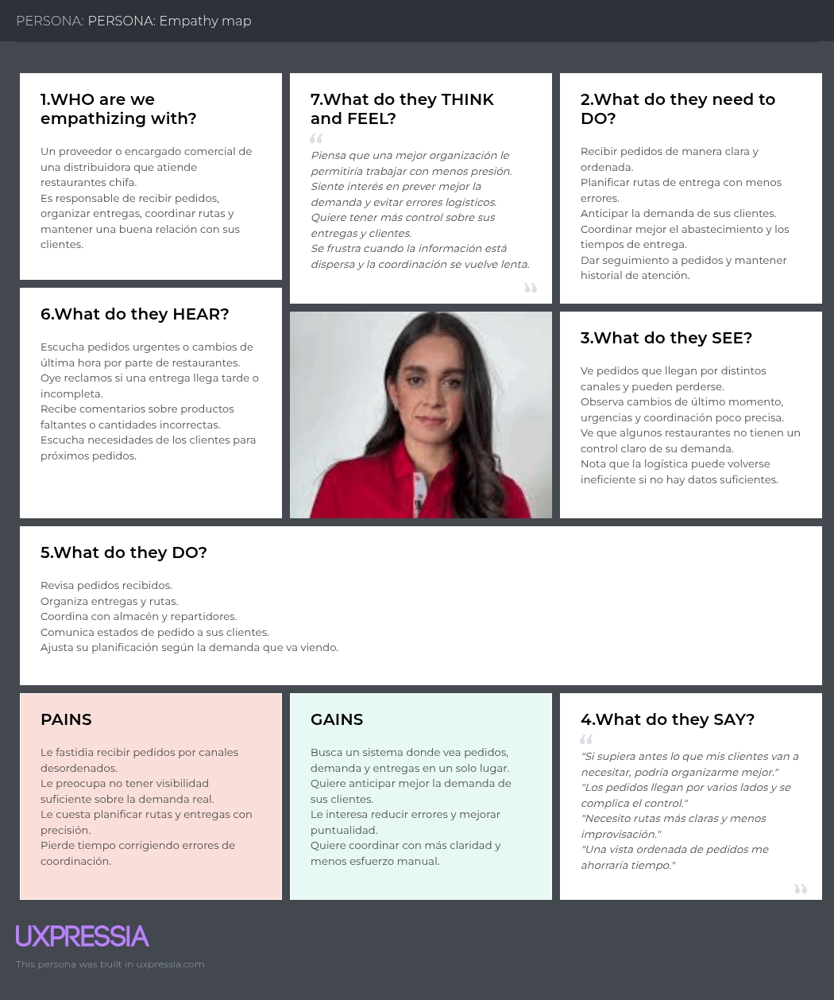
</p>

<sub>*Ilustración. Empathy Map - Segmento 2*</sub><br></br>

## 2.4. Big Picture EventStorming.

En esta sección, el equipo resume el proceso y presenta los resultados de nuestra sesión colaborativa de Big Picture EventStorming. El objetivo principal de esta dinámica fue comprender el dominio del negocio de Aurora en su totalidad, plasmando cronológicamente los eventos más significativos que ocurren en la interacción entre los restaurantes tipo chifa y sus proveedores.

Este ejercicio sirvió como una primera aproximación visual de alto nivel para explorar el landscape del negocio. A través de este mapa, logramos identificar los procesos clave de la cadena de suministro, problemas operativos y oportunidades de mejora que nuestra solución digital busca resolver.

#### Step 1: Unstructured Exploration

En esta fase inicial, todos los miembros del equipo escriben tantos eventos de dominio como puedan en post-its naranjas. El objetivo es generar una lluvia de ideas masiva sobre lo que ocurre en el negocio de Aurora, sin preocuparse por el orden. 

<p align="center">
  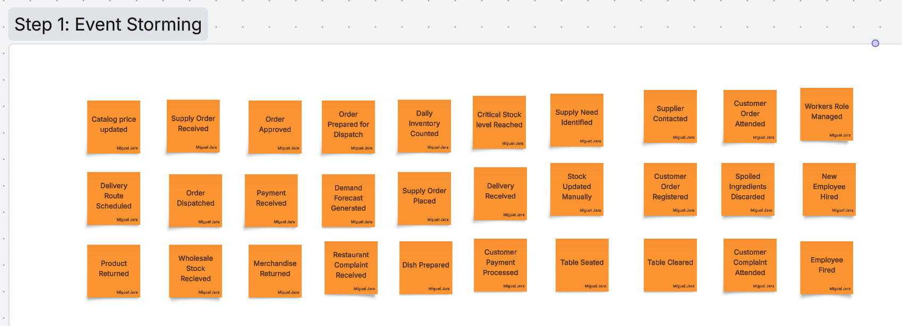
</p>

#### Step 2: Structured Organization

Después de listar los eventos desestructurados, el equipo los organiza en una línea de tiempo narrativa, identificando las relaciones de causalidad entre ellos. Se agrupan eventos relacionados y se identifican patrones o flujos comunes. En esta fase se busca entender cómo los eventos interactúan entre sí y cómo se relacionan con los procesos del negocio.

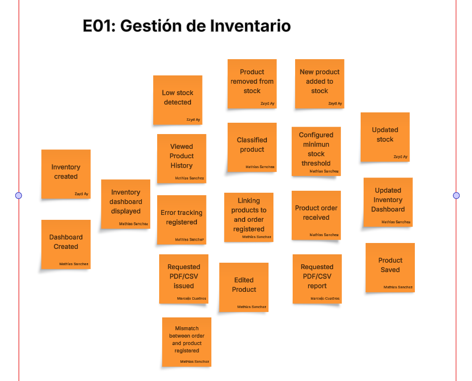

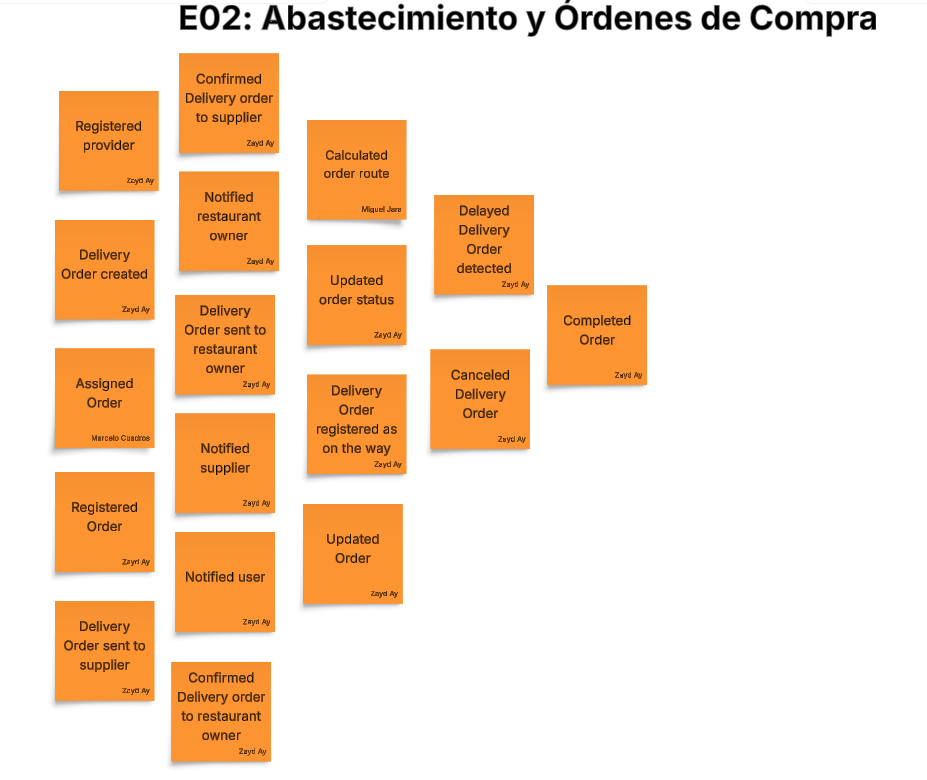

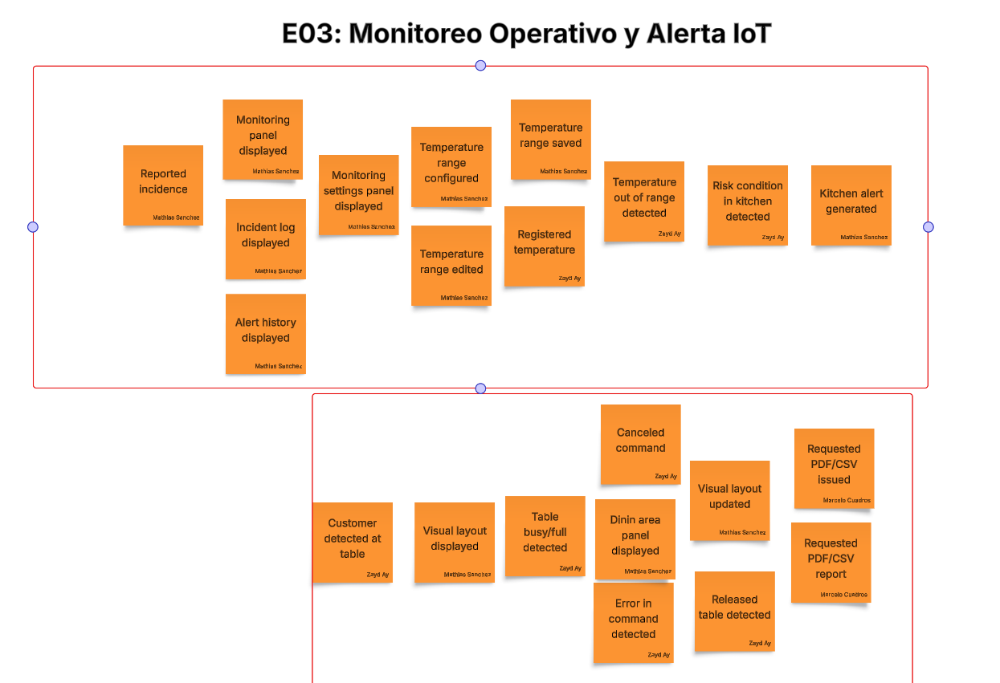

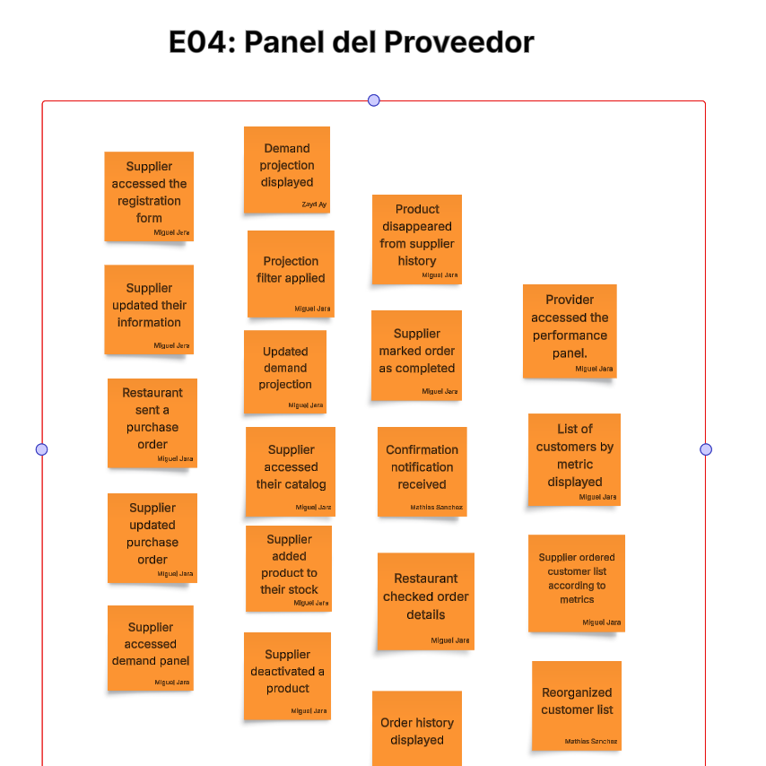

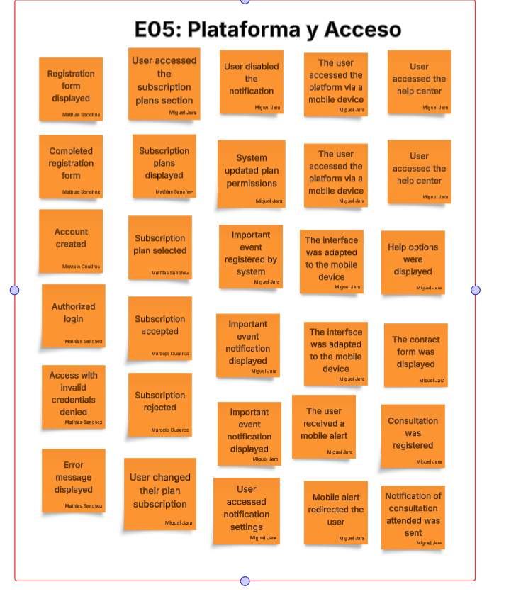

## 2.5. Ubiquitous Language.

El Ubiquitous Language es el lenguaje común compartido entre el equipo técnico, los stakeholders y los usuarios del negocio. Para SupplyWok, hemos identificado y definido los términos clave del dominio de gestión de inventario y abastecimiento en restaurantes chifa, asegurando que todos los involucrados en el proyecto utilicen la misma terminología con el mismo significado.

### Términos Transversales (Aplicables a todo el sistema)

| Término | Definición | Contexto |
|---|---|---|
| **Usuario** | Cualquier persona registrada en la plataforma (dueño de restaurante, administrador, proveedor, personal de cocina o servicio). Cada usuario tiene credenciales y un tipo de cuenta que determina sus permisos. | Sistema general |
| **Cuenta** | El perfil personal del usuario en la plataforma que incluye datos de contacto, preferencias y plan de suscripción. | Autenticación y acceso |
| **Credenciales** | Conjunto de correo electrónico y contraseña que utiliza un usuario para autenticarse en el sistema. | Seguridad |
| **Plan de Suscripción** | Nivel de servicio contratado por un usuario (ej: Premium, Enterprise) que determina el acceso a funcionalidades específicas de la plataforma. | Monetización y acceso |
| **Notificación** | Alerta enviada al usuario sobre un evento importante del sistema (cambio de estado de pedido, alerta de stock bajo, cambio de temperatura, etc.). | Comunicación en tiempo real |
| **Dashboard** | Interfaz personalizada que muestra el resumen e información clave según el tipo de usuario y sus permisos. | Visualización general |

---

### Términos del Epic 01: Gestión de Inventario

| Término | Definición | Contexto |
|---|---|---|
| **Inventario** | Registro centralizado y actualizado de todos los insumos disponibles en un restaurante, incluyendo cantidades, unidades y ubicación. | Gestión de stock |
| **Insumo / Producto** | Cualquier artículo de aprovisionamiento usado en un restaurante chifa (ingredientes, bebidas, condimentos, etc.). Cada insumo tiene un nombre, categoría, unidad de medida y precio unitario. | Catálogo de productos |
| **Stock / Cantidad en Stock** | Número actual de unidades disponibles de un insumo en el inventario. Se actualiza con cada entrada, salida o baja registrada. | Control de cantidad |
| **Stock Mínimo** | Nivel de inventario por debajo del cual se debe reordenar un insumo para evitar quiebres. Es definido por el dueño o administrador del restaurante. | Alertas y reabastecimiento |
| **Stock Crítico** | Condición cuando el stock actual es igual o inferior al stock mínimo configurado, disparando alertas de reabastecimiento. | Alertas |
| **Entrada de Mercadería** | Registro del ingreso de insumos al inventario, acompañado de cantidad, fecha, proveedor de origen y documentación (si aplica). | Movimientos de entrada |
| **Salida de Inventario / Consumo** | Registro de insumos que salen del inventario para ser utilizados en la operación diaria del restaurante. Se registra cantidad, fecha y motivo (consumo diario, merma, etc.). | Movimientos de salida |
| **Baja de Insumo** | Registro formal de insumos que se retiran permanentemente del inventario, con indicación del motivo (vencimiento, daño, obsolescencia). Afecta el stock disponible. | Control de pérdidas |
| **Historial de Movimientos** | Log detallado de todas las transacciones de inventario (entradas, salidas, bajas) con fechas, cantidades, motivos y usuario que registró. | Trazabilidad y auditoría |
| **Clasificación de Inventario** | Categorización del estado de un insumo según su stock actual: Normal (stock superior al mínimo), Crítico (stock en o bajo mínimo), Exceso (stock muy por encima del promedio de consumo). | Visualización y alertas |
| **Reporte de Inventario** | Documento exportable (PDF/CSV) que muestra el estado actual del inventario, útil para auditorías, análisis o uso externo. | Exportación y documentación |

---

### Términos del Epic 02: Abastecimiento y Órdenes de Compra

| Término | Definición | Contexto |
|---|---|---|
| **Proveedor / Supplier** | Persona jurídica o natural que suministra insumos a un restaurante. Cada proveedor tiene perfil en la plataforma con datos de contacto, categorías de productos, zonas de cobertura y condiciones de entrega. | Red de abastecimiento |
| **Orden de Compra / Pedido** | Solicitud formal y digital generada por un restaurante a un proveedor, especificando insumos, cantidades y fecha de entrega requerida. Es el documento central de la transacción de abastecimiento. | Abastecimiento |
| **Estado de Orden** | Situación actual de una orden de compra en su ciclo de vida: Pendiente (creada, sin confirmar), Confirmada (proveedor acepta), En Preparación, Despachada, Entregada, Cancelada. | Seguimiento de pedidos |
| **Demanda Proyectada / Pronóstico de Consumo** | Estimación matemática del consumo futuro de un insumo basada en el historial de consumo registrado, utilizando análisis de tendencias. Ayuda a anticipar pedidos. | Planificación |
| **Historial de Órdenes** | Registro completo de todas las órdenes de compra realizadas por un restaurante, incluyendo insumos, cantidades, proveedores, fechas y resultados. | Análisis y patrones |
| **Confirmación de Entrega** | Acto formal donde el proveedor marca una orden como "Entregada", registrando fecha, hora, observaciones y evidencia de que los insumos llegaron al restaurante. | Cierre de transacción |
| **Reabastecimiento** | Proceso de solicitar nuevamente un insumo cuya disponibilidad en el restaurante se ha agotado o está por agotarse. | Acción operativa |

---

### Términos del Epic 03: Monitoreo Operativo y Alertas IoT

| Término | Definición | Contexto |
|---|---|---|
| **Sensor IoT** | Dispositivo electrónico conectado a la plataforma que mide parámetros físicos en tiempo real (temperatura, humedad). Envía lecturas continuas al sistema. | Hardware e integración |
| **Lectura del Sensor / Medición** | Valor numérico capturado por un sensor en un momento específico (ej: 18.5°C a las 14:30). Se registra con timestamp exacto. | Data en tiempo real |
| **Rango Seguro / Rango Configurado** | Intervalo de valores mínimo y máximo aceptables para un parámetro (ej: 15°C a 20°C para temperatura de almacén). Definido por el administrador según normas de calidad y salubridad. | Configuración crítica |
| **Condición de Riesgo / Out of Range** | Situación cuando una lectura del sensor cae fuera del rango seguro configurado, generando una alerta inmediata. | Evento crítico |
| **Alerta de Riesgo** | Notificación generada automáticamente cuando se detecta una condición de riesgo, informando al administrador del tipo de condición, valor medido, ubicación y timestamp. | Respuesta inmediata |
| **Incidencia / Evento Operativo** | Cualquier evento anómalo registrado en el sistema (alerta de temperatura, falla de sensor, cambio de estado no autorizado, error de comando). Se mantiene en historial para auditoría. | Seguimiento operativo |
| **Historial de Alertas** | Registro detallado de todas las alertas y incidencias generadas, incluyendo tipo, área afectada, valor del sensor, hora, y estado de revisión (revisada / pendiente). | Auditoría y análisis |
| **Estado de Revisión** | Indicador si una alerta fue revisada por un administrador (y con qué nota de seguimiento) o aún está pendiente de atención. | Control de acciones |
| **Área / Zona Monitorizada** | Espacio físico del restaurante equipado con sensores (ej: almacén, cocina, cámara frigorífica). Cada área puede tener múltiples sensores y configuraciones independientes. | Ubicación y contexto |

---

### Términos del Epic 04: Panel del Proveedor

| Término | Definición | Contexto |
|---|---|---|
| **Catálogo de Productos** | Listado completo de insumos que un proveedor ofrece, incluyendo descripción, precio unitario, unidad de medida, disponibilidad actual y condiciones de entrega. | Oferta del proveedor |
| **Disponibilidad** | Indicador si un producto del catálogo del proveedor está disponible para venta (Activo) o no (Desactivado), sin eliminar el historial. | Estado del producto |
| **Demanda de Clientes / Demanda Estimada** | Proyección del consumo futuro de un restaurante cliente basada en su historial de órdenes, que el proveedor usa para planificar producción y distribución. | Planificación del proveedor |
| **Cliente del Proveedor** | Restaurante que ha realizado al menos una orden de compra al proveedor y está registrado en su panel. | Relación comercial |
| **Historial de Órdenes Recibidas** | Registro de todas las órdenes de compra que un proveedor ha recibido de sus clientes restaurantes, con detalles, estados y fechas. | Base de datos transaccional |
| **Confirmación de Orden** | Acto donde el proveedor acepta formalmente una orden de compra, comprometiéndose a entregarla en las condiciones pactadas. | Validación de compromiso |
| **Resumen de Actividad por Cliente** | Análisis agregado del comportamiento de un cliente (número de órdenes, productos más solicitados, monto estimado, frecuencia de pedidos) que ayuda al proveedor a priorizar su atención comercial. | Business Intelligence |

---

### Términos del Epic 05: Plataforma y Acceso

| Término | Definición | Contexto |
|---|---|---|
| **Tipo de Cuenta** | Clasificación del usuario en la plataforma: Restaurante (dueño/administrador), Proveedor, Personal de Cocina (modo restringido), Personal de Servicio (modo restringido). Determina módulos y permisos accesibles. | Control de acceso |
| **Autenticación** | Proceso de verificación de identidad del usuario usando credenciales (correo y contraseña). Genera una sesión segura en la plataforma. | Seguridad |
| **Sesión** | Período activo durante el cual un usuario autenticado puede acceder a la plataforma. Termina al cerrar sesión o por inactividad. | Gestión de acceso |
| **Permiso / Rol** | Conjunto de acciones específicas que un usuario está autorizado a realizar según su tipo de cuenta (ej: crear orden, modificar inventario, ver reportes). | Control granular |
| **Modo Restringido** | Configuración de acceso limitado activado por el dueño que muestra solo módulos de mesas y comandas, ocultando módulos administrativos. Usado para personal de cocina/servicio. | Seguridad operativa |
| **Soporte / Centro de Ayuda** | Sección de la plataforma con artículos informativos organizados por tema, formulario de contacto y canales de comunicación para resolver dudas de usuarios. | Servicio al cliente |
| **Idioma de la Interfaz** | Idioma en el que se muestra el sistema al usuario (Español o Inglés), seleccionable desde configuración de cuenta. | Localización |
| **Estado del Servicio** | Información sobre la disponibilidad actual de la plataforma, notificaciones de mantenimiento programado o incidencias no planificadas. | Transparencia operativa |
| **Disponibilidad Continua** | Compromiso de que la plataforma esté operativa 24/7, minimizando interrupciones salvo mantenimiento programado con notificación previa. | SLA de servicio |

---

### Términos del Epic 06: Comandas y Órdenes para Cocina

| Término | Definición | Contexto |
|---|---|---|
| **Comanda** | Registro digital de un pedido de clientes vinculado a una mesa, especificando los platos solicitados. Es la orden que se envía a cocina para su preparación. | Operación de servicio |
| **Mesa** | Identificador único de una mesa física en el restaurante (ej: Mesa 1, Mesa A1). Cada mesa tiene un estado (libre, ocupada, en espera). | Gestión del salón |
| **Estado de Mesa** | Situación actual de una mesa: Libre (disponible para clientes), Ocupada (clientes sentados), En Espera (clientes esperando servicio). | Control operativo |
| **Ocupación de Mesas** | Registro en tiempo real del estado de todas las mesas del restaurante, usado para coordinar el flujo de servicio y estimar demanda de insumos. | Planificación operativa |
| **Visualización de Cocina** | Vista especial de la plataforma donde el cocinero ve todas las comandas activas con los platos a preparar, organizadas por mesa. | Interfaz operativa |
| **Estado de Comanda** | Situación actual de una comanda: Activa (pendiente de preparar), En Preparación (cocinero trabajando), Lista (platos listos para servir), Entregada (cliente ya recibió). | Ciclo de vida |
| **Preparación de Platos** | Proceso en cocina de elaborar los platos especificados en una comanda. El cocinero marca el estado cuando termina. | Ejecución operativa |

---

### Términos Técnicos (Para desarrolladores)

| Término | Definición | Contexto |
|---|---|---|
| **Endpoint / API** | Punto de acceso HTTP que expone funcionalidad del backend (ej: GET /api/inventory, POST /api/orders). Sigue especificación OpenAPI/Swagger. | Integración técnica |
| **CRUD** | Operaciones básicas: Create (crear), Read (leer), Update (actualizar), Delete (eliminar). Aplicable a cualquier recurso de la plataforma. | Operaciones de datos |
| **Validación** | Proceso de verificar que los datos enviados al API cumplan con reglas definidas (campos obligatorios, rangos, formatos). Si falla, se retorna error sin guardar. | Integridad de datos |
| **Manejo Estándar de Errores** | Patrón donde el sistema captura excepciones y retorna códigos HTTP estandarizados (400 validación, 500 servidor interno, etc.) con mensajes descriptivos. | Robustez |
| **Transacción Atómica** | Operación que se ejecuta completamente o no se ejecuta en absoluto. Si hay error, se deshacen todos los cambios (no se persisten datos inconsistentes). | Consistencia de BD |
| **Base de Datos / Persistence Layer** | Sistema de almacenamiento permanente de datos de la plataforma, donde se guardan todas las entidades (usuarios, órdenes, inventario, sensores, etc.). | Infraestructura |

---

### Glosario Rápido de Referencia

```
RESTAURANTE → Usuario tipo "Restaurante" con rol de Dueño/Administrador
PROVEEDOR → Usuario tipo "Proveedor" que surte insumos
INVENTARIO → Colección de Insumos con sus cantidades en Stock
ORDEN DE COMPRA → Solicitud de Insumos a un Proveedor con cantidad y fecha
SENSOR → Dispositivo que envía Lecturas de Temperatura/Humedad
ALERTA → Notificación generada cuando una Lectura está Fuera de Rango
COMANDA → Pedido de un Cliente vinculado a una Mesa, enviado a Cocina
```

---

### Notas de Alineación del Lenguaje

- El equipo debe usar estos términos consistentemente en código, documentación, conversaciones y reportes.
- Si algún término es ambiguo en el contexto local o es usado diferente por usuarios, se debe actualizar esta sección.
- Los nombres de entidades en la base de datos y APIs deben reflejar estos términos (ej: tabla `orders`, campo `stock_minimum`).
- En la documentación de usuario (centro de ayuda), usar estos términos para evitar confusión con otros productos.


[^1]: Apicbase. (s.f.). _Plataforma líder de gestión de F&B_. https://get.apicbase.com/es/

[^2]: MarketMan. (s.f.). _Software De Gestión De Inventario Para Restaurantes Para El Control De Costes Y La Eficiencia_. https://es.marketman.com/

[^3]: WISK.ai. (s.f.). _Bar and Restaurant Inventory Management Software_. https://www.wisk.ai/

[^4]: Restaurant365. (s.f.). _Restaurant Management Software_. https://www.restaurant365.com/