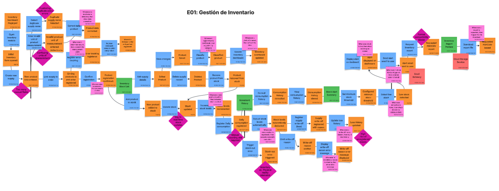
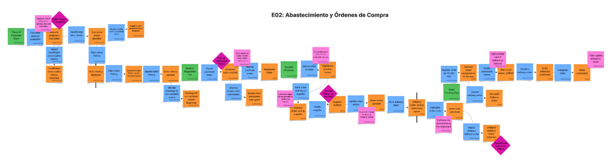
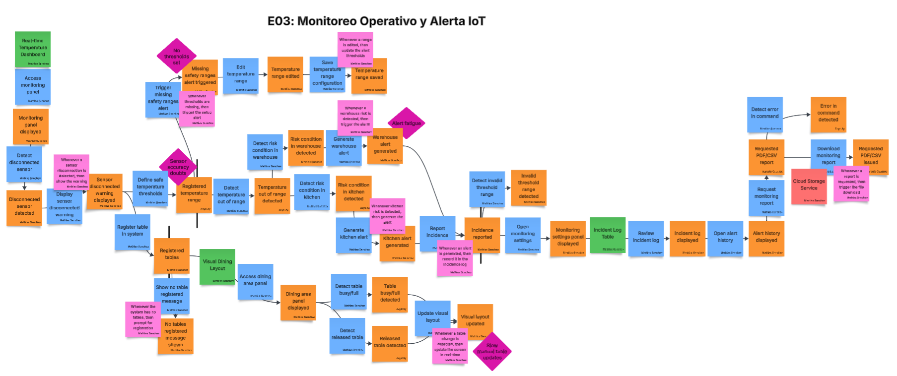
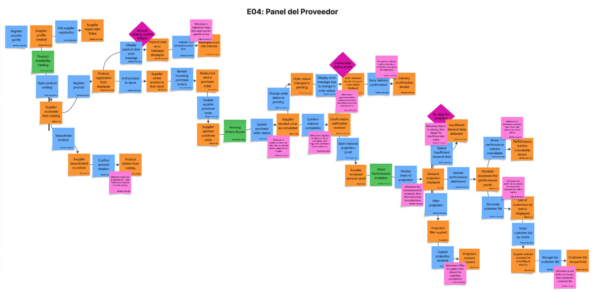
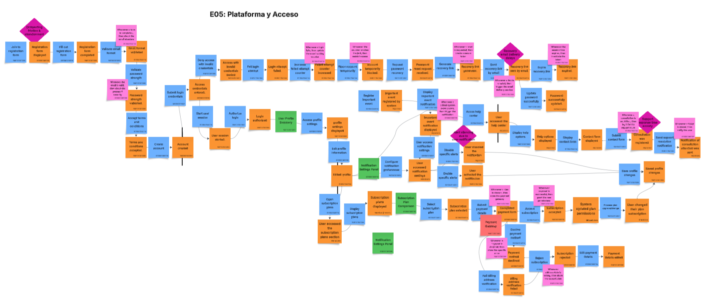
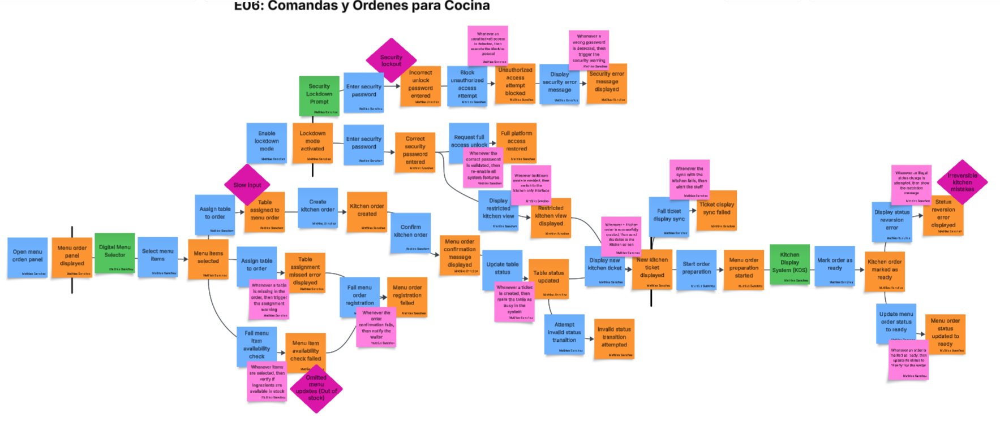

# Capítulo IV: Product Design.
## 4.1. Style Guidelines

### 4.1.1. General Style Guidelines

SupplyWok adopta un sistema de diseño coherente, funcional y alineado con el contexto operativo de restaurantes tipo chifa y sus proveedores. En esta sección se detallan los lineamientos de estilo que hemos definido para mantener la coherencia visual de la plataforma, la cual incluye la landing page, la web application y las versiones mobile. Se detallan el branding, la paleta de colores y las tipografías a utilizar en el proyecto.

**1. Logo:**

El logo de nuestra plataforma está compuesto por los caracteres **S** y **W**, provenientes del nombre *SupplyWok*, representados de forma creativa para mantener una relación con nuestro público objetivo. La **S** se encuentra en forma de humo que sale de un recipiente con forma de **W**. Esta composición transmite una conexión con el entorno de un restaurante chifa y genera familiaridad con nuestros usuarios.

  

**2. Branding:**

SupplyWok busca transmitir una identidad visual **moderna, confiable, cercana y ordenada**, alineada con las necesidades de restaurantes tipo chifa y sus proveedores. La marca debe reflejar rapidez operativa, control sobre el abastecimiento y facilidad de uso en entornos donde la gestión diaria requiere eficiencia.

El branding de SupplyWok se fundamenta en los siguientes conceptos:

- **Confianza:** la interfaz debe proyectar seguridad al manejar información sensible como stock, pedidos, alertas y proveedores.
- **Agilidad:** la experiencia debe facilitar acciones rápidas y reducir fricción en tareas frecuentes.
- **Cercanía:** la comunicación visual y textual debe ser comprensible y accesible para usuarios con distintos niveles de experiencia digital.
- **Orden:** la presentación de la información debe ser clara, estructurada y fácil de escanear.
- **Identidad gastronómica:** el logotipo y la paleta de colores deben mantener una relación visual con el contexto del chifa, sin perder limpieza ni profesionalismo.

Para reforzar esta identidad, se utilizarán elementos visuales con un estilo consistente en toda la plataforma. El objetivo es que SupplyWok sea percibido como una solución especializada, profesional y fácil de adoptar.

**3. Typography:**

La tipografía que se ha decidido usar en nuestra plataforma son dos: **Poppins** y **Montserrat**. Estas elecciones fueron hechas pensando en la comodidad de lectura de nuestros usuarios y en el diseño moderno que se quiere lograr.

- **Títulos:** Para los títulos se usará **Poppins** en pesos **Bold** o **SemiBold**, dependiendo del nivel jerárquico del texto. Esto permite darles la fuerza y relevancia necesarias.

  

- **Párrafos o cuerpo del texto:** Se usará **Montserrat** en pesos variados como **Bold**, **Regular** o **Light**, dependiendo de la intención del texto. Esto asegura la legibilidad necesaria para los usuarios al momento de leer.

  

**4. Colors:**

La identidad visual de SupplyWok busca mantener una relación con el entorno de un restaurante chifa clásico, por lo que predominan los tonos rojos y amarillos, combinados con blanco y negro para lograr un contraste óptimo.

- **Rojo (#C21204):** Este color se usará en botones principales, alertas y elementos que requieran atención. Se eligió por su fuerza visual y por su asociación con energía, dinamismo y relevancia.
- **Amarillo (#E9B824):** Este color se usará como contraste del rojo y para resaltar textos o elementos puntuales.
- **Mostaza o amarillo oscuro (#A07832):** Variante más oscura del amarillo, utilizada en detalles para ayudar a armonizar la vista de los usuarios.
- **Blanco (#FFFFFF):** Color neutro para mantener balance y aportar limpieza visual.
- **Negro (#000000):** Color neutro para reforzar contraste y legibilidad.

  

**5. Spacing:**

El sistema de espaciado de SupplyWok se ha definido para mantener orden visual, legibilidad y consistencia entre la landing page, la web application y las vistas móviles. Se adopta una escala base de **8 px**. En el caso de separar secciones, se pueden usar espacios de hasta **24 px**, lo que permite construir interfaces limpias y fácilmente adaptables a distintos tamaños de pantalla.

**6. Tone:**

El tono de comunicación de SupplyWok será **profesional, claro y confiable**, pero sin caer en tecnicismos innecesarios. Debido a que la plataforma está orientada a restaurantes tipo chifa y proveedores que trabajan en contextos operativos de alta demanda, la comunicación debe transmitir orden, rapidez y seguridad en la gestión del abastecimiento.

SupplyWok busca proyectar:

- **Confianza**, al tratar información crítica como stock, pedidos y alertas.
- **Agilidad**, al guiar al usuario hacia acciones rápidas y concretas.
- **Cercanía**, utilizando mensajes comprensibles para usuarios con distintos niveles de familiaridad tecnológica.
- **Control**, al presentar la información de manera estructurada y orientada a la toma de decisiones.

Por ello, la experiencia visual y verbal evita un tono alarmista o excesivamente informal. En su lugar, se prioriza una comunicación sobria, directa y enfocada en la eficiencia operativa.

**7. Language:**

El lenguaje de SupplyWok será **directo, breve y orientado a la acción**. Se utilizarán etiquetas y mensajes simples que permitan al usuario identificar rápidamente qué está ocurriendo y qué acción puede realizar a continuación.

Se evitarán expresiones ambiguas o excesivamente técnicas. Por ejemplo, se priorizarán frases como:

- `Crear pedido` en lugar de `Registrar nueva orden de abastecimiento`.
- `Stock bajo` en lugar de `Nivel de inventario inferior al umbral configurado`.
- `Ver proveedor` en lugar de `Consultar información detallada del proveedor asociado`.
- `Actualizar estado` en lugar de `Modificar el flujo transaccional del pedido`.

Este enfoque reduce la fricción cognitiva y mejora la usabilidad, especialmente en escenarios donde el usuario necesita actuar rápido, como reposición de insumos, revisión de alertas o seguimiento de entregas.

### 4.1.2. Web Style Guidelines

Las Web Style Guidelines de SupplyWok establecen los criterios visuales y de interacción que guían el diseño de la landing page y la web application. Estas pautas aseguran consistencia entre dispositivos, favorecen la legibilidad y permiten que tanto restaurantes como proveedores naveguen de forma intuitiva por la plataforma.

#### Estructura general

SupplyWok adopta un enfoque **responsive web design**, de modo que la interfaz se adapte correctamente a desktop, laptop, tablet y mobile web sin perder claridad ni coherencia visual.

- **Desktop:** La navegación principal se presenta mediante sidebar lateral y header superior. Los módulos con mayor densidad informativa, como inventario y reportes, aprovechan mejor el ancho disponible mediante tablas, tarjetas comparativas y filtros visibles.
- **Tablet:** La estructura se reorganiza a 6 u 8 columnas, reduciendo el número de elementos visibles por fila. Los paneles laterales pueden colapsarse y ciertas tablas pasan a formatos más compactos para facilitar la interacción táctil.
- **Mobile Web:** La estructura se simplifica a una sola columna. Los elementos se apilan verticalmente, se priorizan botones de acción principal y la navegación se compacta mediante menú hamburguesa o navegación inferior, según el flujo.

#### Breakpoints

Se proponen los siguientes breakpoints para asegurar una adaptación consistente:

- **Mobile:** hasta 767 px.
- **Tablet:** desde 768 px hasta 1023 px.
- **Desktop:** 1024 px en adelante.

#### Componentes básicos de UI

- **Botones primarios:** fondo rojo `#C21204` o marrón `#2D241E`, texto blanco, bordes redondeados de 10 px a 12 px. Se utilizan para acciones clave como `Crear pedido`, `Export PDF`, `Confirmar` o `Iniciar sesión`.
- **Botones secundarios:** fondo blanco o amarillo claro, borde en rojo o mostaza, con texto oscuro. Se emplean para acciones complementarias como `Cancelar`, `Ver detalle` o `Volver`.
- **Inputs y formularios:** bordes suaves, fondo claro y suficiente padding interno para facilitar lectura e interacción. El estado enfocado resalta mediante borde rojo o mostaza. El estado de error utiliza borde rojo más oscuro y un mensaje de validación visible.
- **Cards:** contenedores rectangulares con esquinas redondeadas, padding interno de 16 px a 24 px y jerarquía clara entre título, contenido y acciones. Se usan en dashboard, alertas, métricas y secciones de resumen.
- **Tablas:** encabezados destacados, filas con separación visual suficiente y acciones agrupadas al extremo derecho. En resoluciones pequeñas, las tablas pueden transformarse en listas o tarjetas para mejorar la lectura.
- **Sidebar:** navegación vertical persistente en desktop, con acceso a Dashboard, Inventario, Pedidos, Proveedores, Alertas, Reportes y Configuración. En tablet y mobile se colapsa.
- **Header:** barra superior con nombre del usuario, rol, notificaciones y acceso rápido a configuración y cierre de sesión.

#### Tipografía en web

La propuesta tipográfica de SupplyWok mantiene como base las fuentes **Poppins** y **Montserrat**, según la identidad visual previamente definida.

- **Títulos principales (H1):** Poppins Bold, 24 px a 28 px.
- **Subtítulos (H2):** Poppins SemiBold, 20 px a 22 px.
- **Encabezados de sección (H3):** Poppins Medium, 18 px.
- **Texto de párrafo y descripciones:** Montserrat Regular, 14 px a 16 px.
- **Texto en botones:** Poppins SemiBold, 14 px a 16 px.
- **Etiquetas de formularios y tablas:** Montserrat Medium, 13 px a 14 px.

#### Interacción

- **Hover:** Los botones incrementan ligeramente el contraste o brillo del color base. Los links se subrayan o cambian a una variante más intensa del color principal.
- **Focus:** Todo componente interactivo debe mostrar un estado visible de foco, especialmente inputs, botones y enlaces, para favorecer accesibilidad y navegación por teclado.
- **Active / Click:** Los botones aplican una ligera reducción de escala o sombra interna para confirmar la interacción.
- **Feedback visual:** Estados como éxito, error, advertencia o información se distinguen mediante color, iconografía y texto breve.
- **Scroll y navegación persistente:** En desktop, el header y ciertos filtros pueden permanecer visibles para facilitar navegación rápida en vistas largas.
- **Responsive behavior:** El contenido prioritario siempre debe conservar visibilidad antes que elementos decorativos o secundarios.

### 4.1.3. Mobile Style Guidelines

Las Mobile Style Guidelines de SupplyWok tienen como objetivo adaptar la experiencia de uso a pantallas reducidas sin perder funcionalidad, claridad visual ni consistencia con la propuesta general del producto. Estas pautas priorizan rapidez de interacción, facilidad de lectura y acceso inmediato a acciones frecuentes.

#### Estructura general

La experiencia móvil de SupplyWok está diseñada para que restaurantes y proveedores puedan consultar información crítica y ejecutar acciones esenciales desde cualquier lugar.

- **Pantallas en una sola columna**, con contenido apilado verticalmente.
- **Header compacto**, con logo, nombre de la vista y acceso a notificaciones o menú.
- **Navegación simplificada**, priorizando las secciones más importantes según el rol del usuario.
- **Botones de acción visibles**, especialmente en flujos como crear pedido, registrar stock o confirmar entregas.
- **Tarjetas resumidas**, en lugar de tablas complejas, para mostrar inventario, pedidos y alertas de forma clara.

#### Componentes básicos en mobile

- **Botones primarios:** rojo `#C21204` o marrón `#2D241E`, texto blanco, esquinas redondeadas de 12 px y tamaño suficiente para interacción táctil.
- **Botones secundarios:** fondo blanco o amarillo claro con borde visible y alto contraste.
- **Inputs:** ancho completo, padding amplio y separación mínima de 16 px entre campos.
- **Cards de resumen:** usadas para pedidos, insumos, alertas y métricas, con distribución vertical y jerarquía clara.
- **Listas:** los registros se organizan en bloques táctiles con título, estado, fecha y acción principal.
- **Indicadores de estado:** cada pedido o alerta utiliza color y texto para distinguir rápidamente condiciones como pendiente, entregado, stock bajo o fuera de rango.

#### Tipografía en mobile

- **Título principal (H1):** Poppins Bold, 20 px a 22 px.
- **Subtítulos (H2):** Poppins SemiBold, 16 px a 18 px.
- **Texto general:** Montserrat Regular, 14 px.
- **Botones:** Poppins SemiBold, 14 px.
- **Etiquetas pequeñas o estados:** Montserrat Medium, 12 px a 13 px.

#### Interacción en mobile

- Se prioriza el uso de **acciones rápidas** y **flujos cortos**.
- Los botones deben tener un tamaño mínimo adecuado para interacción táctil.
- Los formularios se dividen en bloques cortos para evitar fatiga visual.
- Las acciones críticas se colocan al alcance natural del pulgar.
- Los cambios de estado deben mostrarse inmediatamente mediante mensajes visibles o indicadores contextuales.

## 4.2. Information Architecture

La arquitectura de información de SupplyWok está diseñada para dos contextos distintos: la **Landing Page**, orientada a captar y convertir visitantes en usuarios registrados, y la **Web Application**, donde los usuarios operan la plataforma según su rol. Ambos contextos tienen estructuras de navegación y organización de contenido diferenciadas, pero comparten un lenguaje visual y terminológico consistente.

### Landing Page

La Landing Page es el primer punto de contacto entre SupplyWok y sus potenciales usuarios. Su arquitectura de información está pensada para que el visitante comprenda el valor del producto, identifique su segmento (restaurante o proveedor) y tome acción hacia el registro, todo en un recorrido vertical y sin fricciones.

En la sección **Hero**, el visitante encuentra el mensaje principal de la plataforma acompañado de dos llamadas a la acción: una para iniciar el registro y otra para explorar más la propuesta de valor. Esta sección establece el tono visual y comunica la propuesta en una sola mirada.

En la sección **Cómo funciona**, se presenta el proceso de incorporación a la plataforma en tres pasos secuenciales: registro, configuración del inventario y gestión operativa. Esta sección reduce la percepción de complejidad para usuarios no técnicos.

En la sección **Funcionalidades principales**, se detallan las capacidades clave del producto: control de inventario, pedidos a proveedores, monitoreo IoT y proyección de demanda. Cada funcionalidad se presenta con un ícono representativo y una descripción breve.

En la sección **¿Para quién es SupplyWok?**, se presentan dos bloques diferenciados por segmento: uno para restaurantes y otro para proveedores, cada uno con sus beneficios específicos y un botón de registro con rol preseleccionado. Esto permite que el visitante se identifique con su perfil y acceda al flujo de registro correspondiente.

En la sección **Planes y precios**, se muestran los planes disponibles (Wok Premium y Wok Enterprise) con sus características y precios, incluyendo un botón de acción que redirige al formulario de registro con el plan preseleccionado.

En la sección **Preguntas frecuentes (FAQ)**, se resuelven dudas comunes sobre la plataforma, costos, integración de hardware IoT y diferencias respecto a otros sistemas.

En la sección **Footer**, el visitante puede acceder a enlaces legales (política de privacidad, términos de servicio), redes sociales, y datos de contacto del equipo Aurora.

### Web Application

La Web Application de SupplyWok organiza su contenido en dos espacios de trabajo distintos según el rol del usuario autenticado: la **Vista Restaurante** y la **Vista Proveedor**. Cada rol accede únicamente a las funcionalidades relevantes para su operación.

En la sección **Dashboard**, el usuario accede a un resumen del estado operativo del día. Desde esta pantalla puede visualizar las alertas de stock mínimo activas, los pedidos pendientes de confirmación, el nivel de ocupación de mesas y cualquier anomalía de temperatura registrada por los sensores IoT. Es el punto de entrada principal tras iniciar sesión y está pensada para que el administrador tome decisiones rápidas sin necesidad de navegar a otras secciones.

En la sección **Inventario**, el restaurante gestiona el registro completo de sus insumos. Cada producto incluye nombre, categoría, unidad de medida, cantidad actual en stock, stock mínimo configurado y proveedor asociado. Desde aquí se pueden registrar entradas de mercadería, descontar unidades consumidas y actualizar la información de cualquier insumo.

En la sección **Pedidos**, el restaurante crea, gestiona y hace seguimiento de sus órdenes de abastecimiento. Cada pedido tiene un estado visible (Pendiente, En camino, Entregado, Cancelado) que se actualiza en tiempo real. El historial de pedidos permite revisar órdenes anteriores.

En la sección **Kitchen Tickets / Comandas**, el personal gestiona las comandas activas del salón. Cada comanda está vinculada a una mesa y muestra los platos solicitados con su estado de preparación (En cola, En preparación, Listo). La cocina ve esta vista en tiempo real.

En la sección **Proveedores**, el restaurante accede al directorio de proveedores vinculados, con datos de contacto, categorías de insumos y historial de transacciones.

En la sección **Tables and Occupancy / Mesas y Ocupación**, el administrador visualiza el estado en tiempo real de cada mesa del salón (libre, ocupada, en espera), útil para coordinar el flujo del servicio.

En la sección **Alertas**, se concentran todas las notificaciones generadas por el sistema: stock mínimo alcanzado, temperatura fuera de rango configurado y eventos operativos críticos.

En la sección **Reportes**, el restaurante analiza métricas de consumo, evolución del inventario y proyección de demanda a través de gráficos y tablas exportables.

En la sección **Configuración**, se gestionan los datos del perfil del negocio, los umbrales de sensores IoT, los rangos seguros de temperatura y humedad, y las preferencias de notificación.

En la sección **Suscripción**, el usuario revisa su plan activo, consulta las funcionalidades disponibles y puede cambiar de plan según las necesidades del negocio.

El equipo de Aurora confía en que esta arquitectura permitirá a ambos tipos de usuario operar de manera más eficiente, reduciendo el tiempo dedicado a tareas manuales y mejorando la coordinación entre restaurantes y proveedores.

---

### 4.2.1. Organization Systems

El contenido de SupplyWok se organiza aplicando distintos esquemas según la naturaleza de cada sección y el flujo esperado del usuario. Se detalla también qué esquemas no se utilizan y la razón de esa decisión.

#### Esquemas utilizados

| Tipo de organización | Aplicación en SupplyWok | Justificación |
|---|---|---|
| Jerárquica | Landing Page, Dashboard principal de cada rol | Permite destacar la información más crítica (alertas de stock, estado de pedidos) y guiar al usuario hacia las acciones prioritarias sin sobrecargar la pantalla. |
| Secuencial | Registro de usuario, configuración inicial del inventario, creación de un pedido, flujo de comanda | Acompaña al usuario paso a paso en flujos que requieren completar etapas en orden. Reduce errores y abandono en procesos críticos. |
| Matricial | Gestión de inventario, historial de pedidos, panel de Kitchen Tickets | Permite visualizar múltiples variables simultáneamente (producto, cantidad, fecha, proveedor, estado) para facilitar comparaciones y toma de decisiones rápida. |

#### Esquemas no utilizados

| Tipo de organización | Razón de exclusión |
|---|---|
| Alfabético | Los insumos, proveedores y pedidos no tienen un orden natural por nombre. Los usuarios buscan por categoría, estado o fecha, no por orden de letra. Usar orden alfabético aumentaría el tiempo de búsqueda en lugar de reducirlo. |
| Por popularidad | La plataforma no es un marketplace ni tiene contenido editorial. No existe un concepto de "más visto" o "más popular" relevante para la operación de un restaurante. |
| Geográfico | Aunque los proveedores tienen zonas de cobertura, la plataforma no organiza su contenido por ubicación geográfica. La coordinación es por relación cliente-proveedor, no por mapa. |

#### Organización por contexto

**Landing Page**

| Sección | Tipo de organización |
|---|---|
| Hero + CTA | Jerárquica — el mensaje principal domina visualmente, los CTAs secundarios están subordinados |
| Cómo funciona | Secuencial — 3 pasos numerados con progresión clara |
| Funcionalidades | Matricial — grid de features comparables entre sí |
| ¿Para quién? | Por audiencia — dos bloques diferenciados por segmento (restaurante / proveedor) |
| Planes y precios | Matricial — tabla comparativa de planes con características en filas |
| FAQ | Por tópicos — agrupadas por tipo de duda (producto, precio, hardware, soporte) |

**Web Application — Vista Restaurante**

| Sección | Tipo de organización |
|---|---|
| Dashboard | Jerárquica — alertas críticas primero, métricas secundarias después |
| Inventario | Matricial — tabla con columnas de producto, stock actual, stock mínimo, estado |
| Pedidos | Cronológico + Matricial — ordenados por fecha, filtrable por estado |
| Kitchen Tickets | Secuencial — flujo de estado: Cola → En preparación → Listo → Entregado |
| Alertas | Cronológico — ordenadas por hora de generación, más recientes primero |
| Reportes | Matricial — métricas comparables por periodo y por insumo |

**Web Application — Vista Proveedor**

| Sección | Tipo de organización |
|---|---|
| Dashboard | Jerárquica — pedidos urgentes primero, demanda proyectada como contexto |
| Pedidos recibidos | Cronológico + por estado — ordenados por fecha de entrega esperada |
| Mis clientes | Matricial — comparativa de frecuencia, monto y demanda por cliente |
| Catálogo | Matricial — productos con precio, unidad y disponibilidad en columnas |

---

### 4.2.2. Labeling Systems

El sistema de etiquetado de SupplyWok usa términos directos en español (con excepciones técnicas como "Dashboard" o "IoT" que son de uso común en el sector), asegurando que cada etiqueta esté anclada a un elemento concreto de la interfaz.

#### Navbar — Landing Page

| Etiqueta | Elemento | Destino |
|---|---|---|
| SupplyWok (logo) | Enlace en navbar | Ancla a sección Hero (#hero) |
| ¿Cómo funciona? | Enlace de navegación | Ancla a sección #como-funciona |
| Segmentos | Enlace de navegación | Ancla a sección #para-quien |
| Precios | Enlace de navegación | Ancla a sección #precios |
| Iniciar sesión | Botón secundario (outline) | Redirige a /login |
| Registrarse | Botón primario (filled) | Redirige a /register |

#### Hero — Landing Page

| Etiqueta | Elemento | Acción |
|---|---|---|
| Comenzar gratis | Botón CTA primario | Redirige a /register |
| Ver cómo funciona | Botón CTA secundario | Ancla a sección #como-funciona |

#### Sección Segmentos — Landing Page

| Etiqueta | Elemento | Acción |
|---|---|---|
| Empezar como restaurante | Botón en card de restaurante | Redirige a /register?rol=restaurante |
| Empezar como proveedor | Botón en card de proveedor | Redirige a /register?rol=proveedor |

#### Formulario de Registro (/register)

| Etiqueta | Elemento | Tipo |
|---|---|---|
| Tipo de cuenta | Selector de rol | Radio button: Restaurante / Proveedor |
| Nombre del negocio | Input de texto | Campo obligatorio |
| Correo electrónico | Input de email | Campo obligatorio |
| Contraseña | Input de contraseña | Campo obligatorio |
| Crear cuenta | Botón de submit | Primario |
| ¿Ya tienes cuenta? Inicia sesión | Enlace | Redirige a /login |

#### Formulario de Login (/login)

| Etiqueta | Elemento | Tipo |
|---|---|---|
| Correo electrónico | Input de email | Campo obligatorio |
| Contraseña | Input de contraseña | Campo obligatorio |
| Iniciar sesión | Botón de submit | Primario |
| ¿Olvidaste tu contraseña? | Enlace | Redirige a /forgot-password |
| ¿No tienes cuenta? Regístrate | Enlace | Redirige a /register |

#### Sidebar — Web Application

| Etiqueta | Ícono | Ruta |
|---|---|---|
| Dashboard | Cuadrícula | /dashboard |
| Inventory / Inventario | Caja | /inventory |
| Orders / Pedidos | Documento | /orders |
| Kitchen Tickets | Ticket | /kitchen |
| Suppliers / Proveedores | Camión | /suppliers |
| Tables and Occupancy | Mesa | /tables |
| Alerts / Alertas | Campana | /alerts |
| Reports / Reportes | Gráfico | /reports |
| Configuration / Configuración | Engranaje | /settings |
| Subscription / Suscripción | Escudo | /subscription |

#### Header — Web Application

| Etiqueta | Elemento | Acción |
|---|---|---|
| Nombre del restaurante / proveedor | Texto en header | Identificación del negocio activo |
| Plan actual (ej: Premium) | Badge | Redirige a /subscription |
| Ícono de notificaciones | Campana con contador | Abre panel lateral de alertas |
| Avatar del usuario | Foto o iniciales | Abre menú: Perfil / Configuración / Cerrar sesión |

#### Botones de acción contextual — Web Application

| Sección | Etiqueta del botón principal | Acción |
|---|---|---|
| Inventario | + Agregar insumo | Abre formulario de nuevo insumo |
| Pedidos | + Crear pedido | Abre formulario de nueva orden de compra |
| Kitchen Tickets | + Nueva comanda | Abre formulario de nueva comanda |
| Proveedores | + Agregar proveedor | Abre formulario de nuevo proveedor |
| Alertas | Marcar como revisada | Cambia estado de la alerta |
| Reportes | Exportar PDF / CSV | Descarga el reporte en el formato seleccionado |

#### Breadcrumbs — Web Application

| Vista | Breadcrumb mostrado |
|---|---|
| Detalle de pedido | Pedidos › Pedido #PO-8821 |
| Detalle de insumo | Inventario › Arroz jazmín |
| Detalle de comanda | Kitchen Tickets › Mesa 12 |
| Detalle de proveedor | Proveedores › Global Foods Ltd. |

#### Estados y badges

| Etiqueta | Color | Contexto |
|---|---|---|
| Urgent / Urgente | Rojo | Stock crítico en Dashboard |
| Alert | Naranja | Temperatura fuera de rango |
| Low stock | Rojo | Estado de insumo en Inventario |
| Preventive alert | Naranja | Insumo próximo al mínimo |
| Pending / Pendiente | Gris | Estado de pedido |
| In transit / En camino | Azul | Estado de pedido |
| Delayed / Retrasado | Rojo | Estado de pedido |
| In Prep | Naranja | Estado de comanda en cocina |
| Ready / Listo | Verde | Estado de comanda en cocina |
| Queue / En cola | Gris | Estado de comanda en cocina |

---

### 4.2.3. SEO Tags and Meta Tags

Se definen las etiquetas SEO y Meta Tags para las páginas principales de SupplyWok, tanto de la Landing Page como de las vistas clave de la Web Application.

**Home — Landing Page (/)**

- **Title:** SupplyWok | Gestión inteligente de abastecimiento para restaurantes
- **Meta Description:** Controla tu inventario, anticipa la demanda y coordina pedidos con tus proveedores desde una sola plataforma. Diseñada para restaurantes chifa y negocios gastronómicos.
- **Meta Keywords:** gestión de inventario restaurantes, abastecimiento chifa, control de stock, proveedores restaurantes, software gastronómico Perú
- **Meta Author:** Aurora

**Planes y Precios — Landing Page (/#precios)**

- **Title:** Planes y Precios | SupplyWok
- **Meta Description:** Conoce los planes Wok Premium y Wok Enterprise. Elige el que mejor se adapta al tamaño y necesidades de tu restaurante o negocio proveedor.
- **Meta Keywords:** precio software restaurante, plan gestión inventario, suscripción SupplyWok, plan premium chifa
- **Meta Author:** Aurora

**Login — Web Application (/login)**

- **Title:** Iniciar sesión | SupplyWok
- **Meta Description:** Accede a tu cuenta de SupplyWok para gestionar tu inventario, pedidos y operación en tiempo real.
- **Meta Keywords:** login SupplyWok, iniciar sesión restaurante, acceso plataforma
- **Meta Author:** Aurora

**Registro — Web Application (/register)**

- **Title:** Crear cuenta | SupplyWok
- **Meta Description:** Regístrate en SupplyWok como restaurante o proveedor. Empieza a gestionar tu inventario y abastecimiento de forma inteligente.
- **Meta Keywords:** registro SupplyWok, crear cuenta restaurante, registrar proveedor insumos
- **Meta Author:** Aurora

**Dashboard — Web Application (/dashboard)**

- **Title:** Dashboard | SupplyWok
- **Meta Description:** Accede a tu panel de control para monitorear stock, pedidos, alertas IoT y ocupación de mesas en tiempo real.
- **Meta Keywords:** panel restaurante, control operativo, alertas stock, monitoreo IoT
- **Meta Author:** Aurora

**Inventario — Web Application (/inventory)**

- **Title:** Inventario | SupplyWok
- **Meta Description:** Gestiona el inventario de tu restaurante. Registra entradas, controla el stock y recibe alertas de reabastecimiento automáticas.
- **Meta Keywords:** inventario restaurante, control de insumos, stock chifa, alertas stock mínimo
- **Meta Author:** Aurora

**Pedidos — Web Application (/orders)**

- **Title:** Pedidos | SupplyWok
- **Meta Description:** Crea y haz seguimiento de tus órdenes de compra a proveedores. Visualiza el estado de cada pedido en tiempo real.
- **Meta Keywords:** órdenes de compra restaurante, pedidos proveedores, seguimiento abastecimiento
- **Meta Author:** Aurora

---

### 4.2.4. Searching Systems

SupplyWok implementa sistemas de búsqueda y filtrado en las secciones donde el volumen de datos lo requiere. Para cada sistema se describe tanto la entrada de búsqueda como la presentación de los resultados.

| Sección | Filtros y búsquedas disponibles | Cómo se ven los resultados |
|---|---|---|
| Inventario | Búsqueda por nombre de insumo; filtro por categoría (carnes, verduras, condimentos, bebidas) | La tabla se filtra en tiempo real mostrando solo las filas coincidentes. Columnas visibles: Producto, Stock actual, Stock mínimo, Estado, Proveedor. Los insumos críticos aparecen con badge rojo "Low stock" al inicio de la lista. El filtro de categoría activo se muestra como chip sobre la tabla con opción de eliminarlo. |
| Pedidos | Búsqueda por número de orden o nombre de proveedor; filtro por estado (Pendiente, En camino, Entregado, Cancelado); filtro por rango de fechas | La tabla muestra solo las órdenes que coinciden. Cada fila muestra: ID de orden, Proveedor, Estado (badge de color), Fecha de entrega. El contador de resultados se actualiza ("3 pedidos encontrados"). Para el filtro de fechas se muestra un date picker con inicio y fin; los resultados se ordenan cronológicamente dentro del rango. |
| Proveedores | Búsqueda por nombre de proveedor o tipo de insumo que suministra | Lista de tarjetas filtrada en tiempo real. Cada tarjeta muestra nombre del proveedor, categoría de insumos y estado de vínculo (activo / inactivo). |
| Alertas | Filtro por tipo de alerta (stock, temperatura, operativa); filtro por período (rango de fechas) | La lista muestra solo las alertas del tipo o período seleccionado, ordenadas cronológicamente. Cada alerta muestra: tipo, descripción, fecha/hora y estado (Revisada / Pendiente). El total de resultados se actualiza en el encabezado de la sección. |
| Kitchen Tickets | Filtro por estado de comanda (En cola, En preparación, Listo) | Solo se muestran las comandas con el estado seleccionado. Cada comanda muestra mesa, platos solicitados y tiempo transcurrido desde la creación. |
| Catálogo (Proveedor) | Búsqueda por nombre de producto | Lista del catálogo filtrada en tiempo real. Cada resultado muestra: nombre, precio unitario, unidad de medida y disponibilidad (activo / desactivado). |
| Mis clientes (Proveedor) | Búsqueda por nombre de restaurante cliente | Se muestra la tarjeta del restaurante encontrado con su historial de pedidos recientes, frecuencia de compra y demanda proyectada. |
 

---

### 4.2.5. Navigation Systems

SupplyWok tiene dos contextos de navegación diferenciados: la **Landing Page**, cuya navegación guía al visitante hacia el registro, y la **Web Application**, cuya navegación permite al usuario operar la plataforma desde cualquier sección.

#### Navegación — Landing Page

| Elemento | Descripción |
|---|---|
| Navbar fija | Barra superior visible en todo momento durante el scroll. Contiene logo, enlaces a secciones (anclas) y botones de Iniciar sesión / Registrarse. En mobile se colapsa en menú hamburguesa. |
| Anclas de sección | Los enlaces del navbar desplazan suavemente (smooth scroll) a cada sección de la página: #hero, #como-funciona, #funcionalidades, #para-quien, #precios, #faq. |
| CTA primario en Hero | Botón "Comenzar gratis" redirige a /register. Es el punto de conversión principal de la landing. |
| CTA secundario en Hero | Botón "Ver cómo funciona" hace scroll a la sección #como-funciona, manteniendo al usuario en la landing para informarse antes de registrarse. |
| CTAs por segmento | En la sección "¿Para quién es SupplyWok?", cada card (restaurante / proveedor) tiene un botón que redirige a /register con el parámetro de rol preseleccionado (?rol=restaurante o ?rol=proveedor). |
| CTA en sección Precios | Cada plan tiene un botón que redirige a /register con el plan preseleccionado, reduciendo pasos en el onboarding. |
| CTA final (bottom of page) | Sección de cierre con un último llamado a la acción antes del footer, dirigido a usuarios que llegaron al final sin convertir. |
| Footer | Contiene enlaces a páginas legales (política de privacidad, términos), redes sociales y el enlace de inicio de sesión para usuarios ya registrados. |

#### Navegación — Web Application

| Elemento | Descripción |
|---|---|
| Sidebar  | Menú principal fijo a la izquierda, visible en todo momento. Contiene accesos directos a todas las secciones del rol activo con ícono y etiqueta. En mobile se colapsa en hamburguesa. |
| Header | Barra superior con nombre del negocio, badge del plan activo, ícono de notificaciones con contador y avatar del usuario con menú desplegable (Perfil / Configuración / Cerrar sesión). |
| Dashboard como home | Tras iniciar sesión, el usuario es redirigido automáticamente al Dashboard de su rol. El Dashboard funciona como hub de acceso rápido: las tarjetas de métricas (low stock, pending orders, alerts) son clicables y llevan a la sección correspondiente. |
| Breadcrumbs | Visibles en vistas de detalle para indicar la ruta actual y permitir la navegación hacia atrás. Ejemplo: Pedidos › #PO-8821. |
| Botones de acción contextual | Cada sección tiene un botón primario ("+ Agregar insumo", "+ Crear pedido") ubicado en la esquina superior derecha del contenido, accesible sin scroll. |
| Panel de notificaciones | Al hacer clic en el ícono de campana del header, se despliega un panel lateral con las alertas recientes ordenadas cronológicamente. Cada alerta tiene un acceso directo a la sección donde ocurrió el evento. |
| Modo restringido | El dueño puede activar un modo de acceso limitado desde Configuración. En este modo solo son visibles Kitchen Tickets y Tables and Occupancy, ocultando las secciones administrativas. Útil para personal de cocina y servicio. |
| Cambio de rol | Si un usuario tiene ambos roles (restaurante y proveedor), puede cambiar de vista desde un selector en el header sin cerrar sesión. |
---
## 4.3. Landing Page UI Design.
Durnate la elaboración de la landing page se utilizaropn los principios de diseño, utlizando diferentes secciones que muestran la información.
### 4.3.1. Landing Page Wireframe.
#### Desktop

  

#### Mobile

  

### 4.3.2. Landing Page Mock-up.
#### Desktop

  

#### Mobile

  

## 4.4. Web Applications UX/UI Design.

### 4.4.1. Web Applications Wireframes.

  

### 4.4.2. Web Applications Wireflow Diagrams.

### 4.4.2. Web Applications Mock-ups.

Se muestran los mock ups del diseño de la aplicacion web para escritorio

**dashboard principal**

  

**Inventario del restaurante**

  

**Ordenes de insumos**

  

**Pedidos de los clientes**

  

**Lista de proveedores**

  

**Mesas ocupadas**

  

**Menu de notificaciones de alertas**

  

**Reportes estadisticos**

  

**Configuracion del restaurante**

  

**Planes de suscribción**

  

Se muestran los respectivos mock ups del diseño de la aplicacion para mobile 

### 4.4.3. Web Applications User Flow Diagrams.

## 4.5. Web Applications Prototyping.

#### Escritorio

[video del prototipo de escritorio](https://upcedupe-my.sharepoint.com/:v:/g/personal/u202318609_upc_edu_pe/IQBzkLBme7KrQ7W3hSiUgvLXAadwJ4sFVek0clbOC9pBKhA?e=Vuhi1W&nav=eyJyZWZlcnJhbEluZm8iOnsicmVmZXJyYWxBcHAiOiJTdHJlYW1XZWJBcHAiLCJyZWZlcnJhbFZpZXciOiJTaGFyZURpYWxvZy1MaW5rIiwicmVmZXJyYWxBcHBQbGF0Zm9ybSI6IldlYiIsInJlZmVycmFsTW9kZSI6InZpZXcifX0%3D) 

[prototipo de escritorio](https://www.figma.com/proto/JUBnvZfJvlrpxIpW8ICRvS/SupplyWok?node-id=428-4042&p=f&t=kGhZbpCdqH2BntGS-0&scaling=scale-down&content-scaling=fixed&page-id=428%3A2335)

#### Mobile

[video de prototipo de mobile](https://upcedupe-my.sharepoint.com/:v:/g/personal/u202318609_upc_edu_pe/IQClHjcgmteDRZIiQWrFX27vAWCILR7o7T66T98C5OGOTNQ?nav=eyJyZWZlcnJhbEluZm8iOnsicmVmZXJyYWxBcHAiOiJTdHJlYW1XZWJBcHAiLCJyZWZlcnJhbFZpZXciOiJTaGFyZURpYWxvZy1MaW5rIiwicmVmZXJyYWxBcHBQbGF0Zm9ybSI6IldlYiIsInJlZmVycmFsTW9kZSI6InZpZXcifX0%3D&e=TcaZn0)

[prototipo mobile](https://www.figma.com/proto/JUBnvZfJvlrpxIpW8ICRvS/SupplyWok?node-id=428-2336&p=f&t=kGhZbpCdqH2BntGS-0&scaling=scale-down&content-scaling=fixed&page-id=428%3A2336)

## 4.6. Domain-Driven Software Architecture.

### 4.6.1. Design-Level EventStorming.

En esta sección se detalla el proceso de Design-Level EventStorming realizado por el equipo para perfeccionar el modelo del dominio de Aurora. Partiendo del Big Picture, profundizamos en el comportamiento interno del sistema para alcanzar el mayor nivel de detalle arquitectónico posible.

Primero, refinamos la línea de tiempo original, eliminando eventos redundantes o procesos manuales que quedaban fuera del alcance tecnológico de la plataforma. Sobre este flujo depurado, incorporamos los elementos tácticos del Domain-Driven Design: Actores y Comandos para representar las intenciones, Políticas para las reglas automáticas, y Agregados (Aggregates) como responsables de procesar las operaciones y emitir los eventos de dominio. Este nivel de granularidad nos permitió consolidar y justificar las fronteras definitivas de nuestros Bounded Contexts.

Este contexto delimitado constituye el núcleo operativo para los restaurantes tipo chifa dentro de la plataforma Aurora. Su propósito principal es centralizar y automatizar el control de los insumos, transformando la gestión manual tradicional en un proceso preciso y basado en datos.

  

Este contexto delimitado actúa como el puente transaccional entre los restaurantes tipo chifa y sus proveedores dentro del ecosistema Aurora. Su objetivo fundamental es digitalizar y estructurar la coordinación de pedidos de insumos, reemplazando las vías de comunicación informales por un flujo de trabajo centralizado y rastreable en la plataforma.

  

Este contexto delimitado tiene como propósito supervisar las condiciones físicas críticas en las instalaciones del restaurante, específicamente en áreas vulnerables como la cocina y el almacén. Mediante la integración simulada de sensores IoT, el sistema monitorea variables ambientales clave de forma continua, tales como la temperatura y la humedad.

  

Este contexto delimitado está diseñado para centralizar la gestión de los proveedores, brindándoles las herramientas necesarias para optimizar su logística y planificación comercial. A través de este módulo, los proveedores obtienen visibilidad sobre la demanda futura de sus clientes, lo que les permite gestionar sus catálogos de insumos y realizar un seguimiento detallado del estado de los pedidos recibidos.

  

Este contexto delimitado representa la capa transversal de seguridad y administración comercial de la plataforma Aurora. Su propósito principal es proporcionar un entorno centralizado y seguro donde todos los usuarios puedan autenticarse, gestionar sus cuentas y recibir soporte técnico de manera eficiente.

  

Este contexto delimitado representa el núcleo operativo del restaurante chifa dentro de la plataforma Aurora. Su propósito principal es orquestar la comunicación crítica entre el salón y la cocina, asegurando que los pedidos se procesen con precisión, se monitoreen en tiempo real y se mantenga la integridad operativa.

  

### 4.6.2. Software Architecture Context Diagram.

  

### 4.6.3. Software Architecture Container Diagrams.

  

### 4.6.4. Software Architecture Components Diagrams.

  

## 4.7. Software Object-Oriented Design.
### 4.7.1. Class Diagrams.

En esta seccion se presentara y se explicara el diagrama de clases por cada Boundes Context

  

El **Inventory Management Bounded Context** es el encargado de gestionar los recursos de inventario de cada restaurante, incluyendo el control de stock, niveles mínimos y movimientos de entrada y salida.

El **InventoryService** actúa como capa de aplicación, coordinando las operaciones del sistema. Este servicio utiliza el **InventoryRepository** para la persistencia de datos y el **InventoryItem** como entidad principal del dominio, encargada de representar cada insumo almacenado en el Inventario del restaurante.El **StockMovement** representa las modificaciones realizadas al stock de cada ítem, permitiendo llevar un registro detallado de entradas, salidas y ajustes.

  

El **Supply and Purchasing Bounded Context** es el encargado de gestionar las órdenes de compra realizadas por cada restaurante, incluyendo el registro, cancelación y seguimiento de los pedidos.

El **PurchaseOrderService** actúa como capa de aplicación, coordinando las operaciones del sistema. Este servicio utiliza el **PurchaseOrderRepository** para la persistencia de datos y el **PurchaseOrder** como entidad principal del dominio, encargada de representar toda la información de una orden de compra de insumos del restaurante. Además, el **OrderItem** encapsula las especificaciones de cada producto dentro de la orden, como la cantidad solicitada y el precio unitario, permitiendo un control detallado de cada pedido.

  

El **Operational Monitoring and IoT Alerts Bounded Context** es el encargado de gestionar la información recopilada por los sensores del restaurante, así como la configuración y generación de alertas ante condiciones fuera de los rangos establecidos.

El **SensorService** actúa como capa de aplicación, coordinando las operaciones del sistema. Este servicio utiliza los repositorios **IAlertRepository** y **ISensorRepository** para la persistencia de datos.

Además, emplea la entidad **Sensor**, junto con **SensorReading**, para representar la información capturada por los sensores. Por otro lado, la entidad **Alert** modela las alertas generadas cuando una medición supera los límites configurados.

  

El **Restaurant Management Bounded Context** es el encargado de gestionar todo lo relacionado con la operación del establecimiento, incluyendo la administración de mesas y la gestión de comandas en cada restaurante.

Los servicios **ComandaService**, **RestaurantService** y **TableService** actúan como capa de aplicación, coordinando las distintas operaciones del sistema. Estos servicios utilizan los repositorios **ComandaRepository**, **IRestaurantRepository** y **TableRepository** respectivamente para la persistencia de datos.

Además, se emplean las entidades **Table**, que representa una mesa dentro del restaurante; **Comanda** y **ComandaItem**, que modelan las órdenes de consumo; y **Restaurant**, que encapsula la información principal de cada restaurante.

  

El **Supplier Management & Operations Bounded Context** es el encargado de gestionar la información de los proveedores, sus catálogos de productos y las operaciones relacionadas con el cumplimiento de pedidos.

Los servicios **SupplierService**, **SupplierCatalogService**, **DemandForecastService** y **OrderFulfillmentService** actúan como capa de aplicación, coordinando las distintas operaciones del sistema dentro de este contexto.

El **SupplierService** gestiona la información de los proveedores utilizando el repositorio **SupplierRepository**. Por su parte, el **SupplierCatalogService** administra los productos ofrecidos por cada proveedor mediante **SupplierCatalog** y **CatalogItem**, utilizando **SupplierCatalogRepository** para la persistencia.

Además, el **DemandForecastService** se encarga de generar proyecciones de demanda a través de la entidad **DemandForecast**, la cual contiene múltiples **ProductDemand** que representan estimaciones de consumo.

Finalmente, el **OrderFulfillmentService** gestiona el proceso de entrega de pedidos mediante la entidad **OrderFulfillment**, permitiendo hacer seguimiento al estado de los envíos desde su despacho hasta su entrega final.

  

El **Identity & Access Bounded Context** es el encargado de gestionar todo lo relacionado con la autenticación y administración de cuentas de usuario en el sistema.

Los servicios **AuthService** y **TokenService** actúan como capa de aplicación, coordinando las operaciones de autenticación. El **AuthService** utiliza el repositorio UserRepository para la persistencia de datos, mientras que **TokenService** se encarga de la generación y validación de tokens de acceso.

La entidad **User** encapsula toda la información relevante de un usuario en la plataforma, como su correo electrónico, contraseña (almacenada de forma segura) y su **Role**, el cual define sus permisos dentro del sistema.

  

El **Shared Bounded Context** contiene Value Objects comunes que son reutilizados por múltiples bounded contexts del sistema, evitando duplicación y promoviendo consistencia en el modelo.

El **ContactInfo** encapsula la información de contacto relevante, como teléfono, correo electrónico y sitio web. Este value object es utilizado por entidades como **Supplier** y **Restaurant**. Por otro lado, **Address** encapsula la información de dirección necesaria, siendo utilizado también por entidades como **Supplier** y **Restaurant** para representar ubicaciones físicas de manera estructurada.

## 4.8. Database Design.

El siguiente Diagrama Entidad-Relación detalla la estructura de datos fundamental que soporta la lógica de la plataforma. A este modelo, compuesto por 25 entidades, se le aplicaron las tres fases de normalización para garantizar un diseño robusto y eficiente. Esto asegura la escalabilidad, la separación de responsabilidades y el mantenimiento de la aplicación, organizada en los siguientes seis módulos:

- #### Gestión de Inventario

Controla las entradas, salidas y niveles de stock para evitar desabastecimientos o excesos.

- #### Abastecimiento y Órdenes de Compra

Gestiona los pedidos de insumos entre el restaurante y el proveedor, reduciendo los tiempos de respuesta entre ambos.

- #### Panel del Proveedor

Centraliza la funcionalidad del proveedor, permitiendo una mejor gestión de catálogos y pedidos.

- #### Plataforma y Acceso

Administra el acceso seguro de los usuarios, sus cuentas y planes de suscripción.

- #### Monitoreo Operativo y Alertas IoT

Representa el núcleo operativo del sistema; controla sensores y notificaciones para garantizar la seguridad en el entorno de trabajo.

- #### Comandas y Órdenes para Cocina

Facilita la comunicación eficiente entre la cocina y las mesas para garantizar un servicio rápido y sin errores.

### 4.8.1. Database Diagrams.

  

[^1]: Clec. (s.f.). El color rojo en China: orígenes y tradiciones. Recuperado el 23 de abril de 2026, de https://fundacionclec.org/el-color-rojo-en-china-origenes-y-tradiciones/