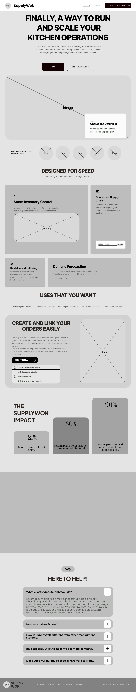
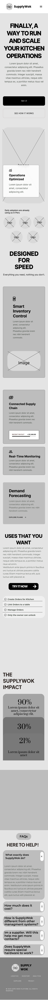
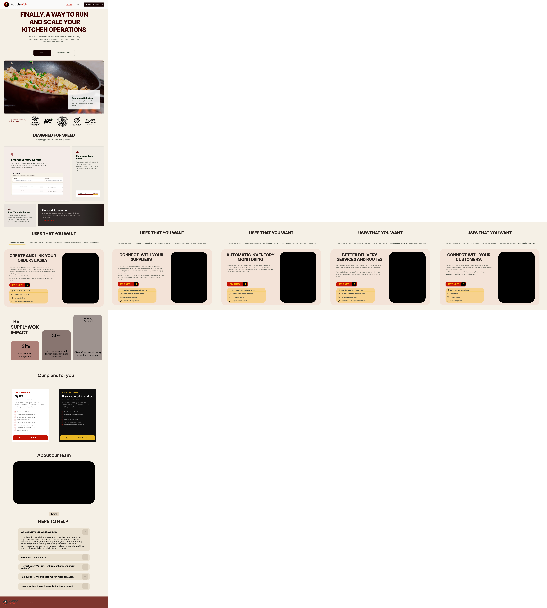
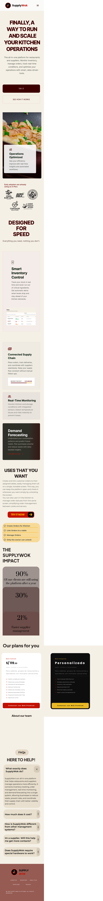

# Capítulo IV: Product Design.
## 4.1. Style Guidelines
### 4.1.1. General Style Guidelines.

SupplyWok adopta un sistema de diseño coherente, funcional y alineado con el contexto operativo de restaurantes tipo chifa y sus proveedores. En esta sección se detallan los lineamientos de estilo que hemos decidido seguir para mantener la coherencia visual de la plataforma, la cual incluye la landing page, web y versiones mobile. Se detallaran el branding, paleta de colores y tipografias a utilizar en el proyecto.

#### 4.1.1.1. Branding.

El logo de nuestra plataforma está compuesto por los caracteres 'S' y 'W' provenientes del nombre SupplyWok, puestos de forma creativa para mantener una relacion con nuestro público objetivo. La 'S' encontrandose en forma de humo que sale de un recipiente que tiene la forma de 'W'. Transmitiendo una conexion con el entorno de un restaurante chifa generando familiaridad con nuestros usuarios.

  

#### 4.1.1.2. Paleta de Colores.

La identidad visual de SupplyWok busca mantener una relacion con el entorno de un restaurante chifa clásico por lo que nuestro colores predominan rojos y amarillos, combinado con blancos y negros para un contraste optimo.

- **Rojo (#C21204):** Este color en la cultura china esta realacionado con la suerte y la prosperidad en los negocios[^1] que buscamos transmitir mediante el uso de nuestra paltaforma, además de ser un color que genera impacto visual. por lo que se usará en botones principales, alertas y elementos que requieran atención.
- **Amarillo (#E9B824):** Este color lo usamos como contraste al rojo y para resaltar textos en caso se requiera.
- **Mostaza o Amarillo oscuro (#AO7832):** Siendo una variante mas oscura del amarillo que tenemos se usaran en detalles para ayudar a armonizar la vista de nuestro usuarios.
- **Blanco (#FFFFFF):** Color neutro para mantener un balance en la paleta de colores.
- **Negro (#000000):** Color neutro para mantener un balance en la paleta de colores.

  

#### 4.1.1.3. Tipografía.

La tipografia que se ha decidido usar en nuestra plataforma son dos, Poppins y Monserrat. Estas elecciones fueron hechas pensando en la comodidad de lectura de nuestros usuarios, junto a un diseño moderno que se quiere lograr.

- **Títulos:** Para los titulos se usaran Poppins en pesos de Bold o semibold dependiendo del titulo, esto para dar una fuerza y relevancia necesarias en titulos.

  

- **Párrafos o cuerpo del texto:** Se usara Monserrat en pesos variados como bold, regular o light dependiendo de la intencion del parrafo. Pensado en la legibilidad necesaria para los usuarios al momento de leer.

  

### 4.1.2. Web Style Guidelines.

## 4.2. Information Architecture

La arquitectura de información de SupplyWok está diseñada para dos contextos distintos: la **Landing Page**, orientada a captar y convertir visitantes en usuarios registrados, y la **Web Application**, donde los usuarios operan la plataforma según su rol. Ambos contextos tienen estructuras de navegación y organización de contenido diferenciadas, pero comparten un lenguaje visual y terminológico consistente.

### Landing Page

La Landing Page es el primer punto de contacto entre SupplyWok y sus potenciales usuarios. Su arquitectura de información está pensada para que el visitante comprenda el valor del producto, identifique su segmento (restaurante o proveedor) y tome acción hacia el registro, todo en un recorrido vertical y sin fricciones.

En la sección **Hero**, el visitante encuentra el mensaje principal de la plataforma acompañado de dos llamadas a la acción: una para iniciar el registro y otra para explorar más la propuesta de valor. Esta sección establece el tono visual y comunica la propuesta en una sola mirada.

En la sección **Cómo funciona**, se presenta el proceso de incorporación a la plataforma en tres pasos secuenciales: registro, configuración del inventario y gestión operativa. Esta sección reduce la percepción de complejidad para usuarios no técnicos.

En la sección **Funcionalidades principales**, se detallan las capacidades clave del producto: control de inventario, pedidos a proveedores, monitoreo IoT y proyección de demanda. Cada funcionalidad se presenta con un ícono representativo y una descripción breve.

En la sección **¿Para quién es SupplyWok?**, se presentan dos bloques diferenciados por segmento: uno para restaurantes y otro para proveedores, cada uno con sus beneficios específicos y un botón de registro con rol preseleccionado. Esto permite que el visitante se identifique con su perfil y acceda al flujo de registro correspondiente.

En la sección **Planes y precios**, se muestran los planes disponibles (Wok Premium y Wok Enterprise) con sus características y precios, incluyendo un botón de acción que redirige al formulario de registro con el plan preseleccionado.

En la sección **Preguntas frecuentes (FAQ)**, se resuelven dudas comunes sobre la plataforma, costos, integración de hardware IoT y diferencias respecto a otros sistemas.

En la sección **Footer**, el visitante puede acceder a enlaces legales (política de privacidad, términos de servicio), redes sociales, y datos de contacto del equipo Aurora.

### Web Application

La Web Application de SupplyWok organiza su contenido en dos espacios de trabajo distintos según el rol del usuario autenticado: la **Vista Restaurante** y la **Vista Proveedor**. Cada rol accede únicamente a las funcionalidades relevantes para su operación.

En la sección **Dashboard**, el usuario accede a un resumen del estado operativo del día. Desde esta pantalla puede visualizar las alertas de stock mínimo activas, los pedidos pendientes de confirmación, el nivel de ocupación de mesas y cualquier anomalía de temperatura registrada por los sensores IoT. Es el punto de entrada principal tras iniciar sesión y está pensada para que el administrador tome decisiones rápidas sin necesidad de navegar a otras secciones.

En la sección **Inventario**, el restaurante gestiona el registro completo de sus insumos. Cada producto incluye nombre, categoría, unidad de medida, cantidad actual en stock, stock mínimo configurado y proveedor asociado. Desde aquí se pueden registrar entradas de mercadería, descontar unidades consumidas y actualizar la información de cualquier insumo.

En la sección **Pedidos**, el restaurante crea, gestiona y hace seguimiento de sus órdenes de abastecimiento. Cada pedido tiene un estado visible (Pendiente, En camino, Entregado, Cancelado) que se actualiza en tiempo real. El historial de pedidos permite revisar órdenes anteriores.

En la sección **Kitchen Tickets / Comandas**, el personal gestiona las comandas activas del salón. Cada comanda está vinculada a una mesa y muestra los platos solicitados con su estado de preparación (En cola, En preparación, Listo). La cocina ve esta vista en tiempo real.

En la sección **Proveedores**, el restaurante accede al directorio de proveedores vinculados, con datos de contacto, categorías de insumos y historial de transacciones.

En la sección **Tables and Occupancy / Mesas y Ocupación**, el administrador visualiza el estado en tiempo real de cada mesa del salón (libre, ocupada, en espera), útil para coordinar el flujo del servicio.

En la sección **Alertas**, se concentran todas las notificaciones generadas por el sistema: stock mínimo alcanzado, temperatura fuera de rango configurado y eventos operativos críticos.

En la sección **Reportes**, el restaurante analiza métricas de consumo, evolución del inventario y proyección de demanda a través de gráficos y tablas exportables.

En la sección **Configuración**, se gestionan los datos del perfil del negocio, los umbrales de sensores IoT, los rangos seguros de temperatura y humedad, y las preferencias de notificación.

En la sección **Suscripción**, el usuario revisa su plan activo, consulta las funcionalidades disponibles y puede cambiar de plan según las necesidades del negocio.

El equipo de Aurora confía en que esta arquitectura permitirá a ambos tipos de usuario operar de manera más eficiente, reduciendo el tiempo dedicado a tareas manuales y mejorando la coordinación entre restaurantes y proveedores.

---

### 4.2.1. Organization Systems

El contenido de SupplyWok se organiza aplicando distintos esquemas según la naturaleza de cada sección y el flujo esperado del usuario. Se detalla también qué esquemas no se utilizan y la razón de esa decisión.

#### Esquemas utilizados

| Tipo de organización | Aplicación en SupplyWok | Justificación |
|---|---|---|
| Jerárquica | Landing Page, Dashboard principal de cada rol | Permite destacar la información más crítica (alertas de stock, estado de pedidos) y guiar al usuario hacia las acciones prioritarias sin sobrecargar la pantalla. |
| Secuencial | Registro de usuario, configuración inicial del inventario, creación de un pedido, flujo de comanda | Acompaña al usuario paso a paso en flujos que requieren completar etapas en orden. Reduce errores y abandono en procesos críticos. |
| Matricial | Gestión de inventario, historial de pedidos, panel de Kitchen Tickets | Permite visualizar múltiples variables simultáneamente (producto, cantidad, fecha, proveedor, estado) para facilitar comparaciones y toma de decisiones rápida. |

#### Esquemas no utilizados

| Tipo de organización | Razón de exclusión |
|---|---|
| Alfabético | Los insumos, proveedores y pedidos no tienen un orden natural por nombre. Los usuarios buscan por categoría, estado o fecha, no por orden de letra. Usar orden alfabético aumentaría el tiempo de búsqueda en lugar de reducirlo. |
| Por popularidad | La plataforma no es un marketplace ni tiene contenido editorial. No existe un concepto de "más visto" o "más popular" relevante para la operación de un restaurante. |
| Geográfico | Aunque los proveedores tienen zonas de cobertura, la plataforma no organiza su contenido por ubicación geográfica. La coordinación es por relación cliente-proveedor, no por mapa. |

#### Organización por contexto

**Landing Page**

| Sección | Tipo de organización |
|---|---|
| Hero + CTA | Jerárquica — el mensaje principal domina visualmente, los CTAs secundarios están subordinados |
| Cómo funciona | Secuencial — 3 pasos numerados con progresión clara |
| Funcionalidades | Matricial — grid de features comparables entre sí |
| ¿Para quién? | Por audiencia — dos bloques diferenciados por segmento (restaurante / proveedor) |
| Planes y precios | Matricial — tabla comparativa de planes con características en filas |
| FAQ | Por tópicos — agrupadas por tipo de duda (producto, precio, hardware, soporte) |

**Web Application — Vista Restaurante**

| Sección | Tipo de organización |
|---|---|
| Dashboard | Jerárquica — alertas críticas primero, métricas secundarias después |
| Inventario | Matricial — tabla con columnas de producto, stock actual, stock mínimo, estado |
| Pedidos | Cronológico + Matricial — ordenados por fecha, filtrable por estado |
| Kitchen Tickets | Secuencial — flujo de estado: Cola → En preparación → Listo → Entregado |
| Alertas | Cronológico — ordenadas por hora de generación, más recientes primero |
| Reportes | Matricial — métricas comparables por periodo y por insumo |

**Web Application — Vista Proveedor**

| Sección | Tipo de organización |
|---|---|
| Dashboard | Jerárquica — pedidos urgentes primero, demanda proyectada como contexto |
| Pedidos recibidos | Cronológico + por estado — ordenados por fecha de entrega esperada |
| Mis clientes | Matricial — comparativa de frecuencia, monto y demanda por cliente |
| Catálogo | Matricial — productos con precio, unidad y disponibilidad en columnas |

---

### 4.2.2. Labeling Systems

El sistema de etiquetado de SupplyWok usa términos directos en español (con excepciones técnicas como "Dashboard" o "IoT" que son de uso común en el sector), asegurando que cada etiqueta esté anclada a un elemento concreto de la interfaz.

#### Navbar — Landing Page

| Etiqueta | Elemento | Destino |
|---|---|---|
| SupplyWok (logo) | Enlace en navbar | Ancla a sección Hero (#hero) |
| ¿Cómo funciona? | Enlace de navegación | Ancla a sección #como-funciona |
| Segmentos | Enlace de navegación | Ancla a sección #para-quien |
| Precios | Enlace de navegación | Ancla a sección #precios |
| Iniciar sesión | Botón secundario (outline) | Redirige a /login |
| Registrarse | Botón primario (filled) | Redirige a /register |

#### Hero — Landing Page

| Etiqueta | Elemento | Acción |
|---|---|---|
| Comenzar gratis | Botón CTA primario | Redirige a /register |
| Ver cómo funciona | Botón CTA secundario | Ancla a sección #como-funciona |

#### Sección Segmentos — Landing Page

| Etiqueta | Elemento | Acción |
|---|---|---|
| Empezar como restaurante | Botón en card de restaurante | Redirige a /register?rol=restaurante |
| Empezar como proveedor | Botón en card de proveedor | Redirige a /register?rol=proveedor |

#### Formulario de Registro (/register)

| Etiqueta | Elemento | Tipo |
|---|---|---|
| Tipo de cuenta | Selector de rol | Radio button: Restaurante / Proveedor |
| Nombre del negocio | Input de texto | Campo obligatorio |
| Correo electrónico | Input de email | Campo obligatorio |
| Contraseña | Input de contraseña | Campo obligatorio |
| Crear cuenta | Botón de submit | Primario |
| ¿Ya tienes cuenta? Inicia sesión | Enlace | Redirige a /login |

#### Formulario de Login (/login)

| Etiqueta | Elemento | Tipo |
|---|---|---|
| Correo electrónico | Input de email | Campo obligatorio |
| Contraseña | Input de contraseña | Campo obligatorio |
| Iniciar sesión | Botón de submit | Primario |
| ¿Olvidaste tu contraseña? | Enlace | Redirige a /forgot-password |
| ¿No tienes cuenta? Regístrate | Enlace | Redirige a /register |

#### Sidebar — Web Application

| Etiqueta | Ícono | Ruta |
|---|---|---|
| Dashboard | Cuadrícula | /dashboard |
| Inventory / Inventario | Caja | /inventory |
| Orders / Pedidos | Documento | /orders |
| Kitchen Tickets | Ticket | /kitchen |
| Suppliers / Proveedores | Camión | /suppliers |
| Tables and Occupancy | Mesa | /tables |
| Alerts / Alertas | Campana | /alerts |
| Reports / Reportes | Gráfico | /reports |
| Configuration / Configuración | Engranaje | /settings |
| Subscription / Suscripción | Escudo | /subscription |

#### Header — Web Application

| Etiqueta | Elemento | Acción |
|---|---|---|
| Nombre del restaurante / proveedor | Texto en header | Identificación del negocio activo |
| Plan actual (ej: Premium) | Badge | Redirige a /subscription |
| Ícono de notificaciones | Campana con contador | Abre panel lateral de alertas |
| Avatar del usuario | Foto o iniciales | Abre menú: Perfil / Configuración / Cerrar sesión |

#### Botones de acción contextual — Web Application

| Sección | Etiqueta del botón principal | Acción |
|---|---|---|
| Inventario | + Agregar insumo | Abre formulario de nuevo insumo |
| Pedidos | + Crear pedido | Abre formulario de nueva orden de compra |
| Kitchen Tickets | + Nueva comanda | Abre formulario de nueva comanda |
| Proveedores | + Agregar proveedor | Abre formulario de nuevo proveedor |
| Alertas | Marcar como revisada | Cambia estado de la alerta |
| Reportes | Exportar PDF / CSV | Descarga el reporte en el formato seleccionado |

#### Breadcrumbs — Web Application

| Vista | Breadcrumb mostrado |
|---|---|
| Detalle de pedido | Pedidos › Pedido #PO-8821 |
| Detalle de insumo | Inventario › Arroz jazmín |
| Detalle de comanda | Kitchen Tickets › Mesa 12 |
| Detalle de proveedor | Proveedores › Global Foods Ltd. |

#### Estados y badges

| Etiqueta | Color | Contexto |
|---|---|---|
| Urgent / Urgente | Rojo | Stock crítico en Dashboard |
| Alert | Naranja | Temperatura fuera de rango |
| Low stock | Rojo | Estado de insumo en Inventario |
| Preventive alert | Naranja | Insumo próximo al mínimo |
| Pending / Pendiente | Gris | Estado de pedido |
| In transit / En camino | Azul | Estado de pedido |
| Delayed / Retrasado | Rojo | Estado de pedido |
| In Prep | Naranja | Estado de comanda en cocina |
| Ready / Listo | Verde | Estado de comanda en cocina |
| Queue / En cola | Gris | Estado de comanda en cocina |

---

### 4.2.3. SEO Tags and Meta Tags

Se definen las etiquetas SEO y Meta Tags para las páginas principales de SupplyWok, tanto de la Landing Page como de las vistas clave de la Web Application.

**Home — Landing Page (/)**

- **Title:** SupplyWok | Gestión inteligente de abastecimiento para restaurantes
- **Meta Description:** Controla tu inventario, anticipa la demanda y coordina pedidos con tus proveedores desde una sola plataforma. Diseñada para restaurantes chifa y negocios gastronómicos.
- **Meta Keywords:** gestión de inventario restaurantes, abastecimiento chifa, control de stock, proveedores restaurantes, software gastronómico Perú
- **Meta Author:** Aurora

**Planes y Precios — Landing Page (/#precios)**

- **Title:** Planes y Precios | SupplyWok
- **Meta Description:** Conoce los planes Wok Premium y Wok Enterprise. Elige el que mejor se adapta al tamaño y necesidades de tu restaurante o negocio proveedor.
- **Meta Keywords:** precio software restaurante, plan gestión inventario, suscripción SupplyWok, plan premium chifa
- **Meta Author:** Aurora

**Login — Web Application (/login)**

- **Title:** Iniciar sesión | SupplyWok
- **Meta Description:** Accede a tu cuenta de SupplyWok para gestionar tu inventario, pedidos y operación en tiempo real.
- **Meta Keywords:** login SupplyWok, iniciar sesión restaurante, acceso plataforma
- **Meta Author:** Aurora

**Registro — Web Application (/register)**

- **Title:** Crear cuenta | SupplyWok
- **Meta Description:** Regístrate en SupplyWok como restaurante o proveedor. Empieza a gestionar tu inventario y abastecimiento de forma inteligente.
- **Meta Keywords:** registro SupplyWok, crear cuenta restaurante, registrar proveedor insumos
- **Meta Author:** Aurora

**Dashboard — Web Application (/dashboard)**

- **Title:** Dashboard | SupplyWok
- **Meta Description:** Accede a tu panel de control para monitorear stock, pedidos, alertas IoT y ocupación de mesas en tiempo real.
- **Meta Keywords:** panel restaurante, control operativo, alertas stock, monitoreo IoT
- **Meta Author:** Aurora

**Inventario — Web Application (/inventory)**

- **Title:** Inventario | SupplyWok
- **Meta Description:** Gestiona el inventario de tu restaurante. Registra entradas, controla el stock y recibe alertas de reabastecimiento automáticas.
- **Meta Keywords:** inventario restaurante, control de insumos, stock chifa, alertas stock mínimo
- **Meta Author:** Aurora

**Pedidos — Web Application (/orders)**

- **Title:** Pedidos | SupplyWok
- **Meta Description:** Crea y haz seguimiento de tus órdenes de compra a proveedores. Visualiza el estado de cada pedido en tiempo real.
- **Meta Keywords:** órdenes de compra restaurante, pedidos proveedores, seguimiento abastecimiento
- **Meta Author:** Aurora

---

### 4.2.4. Searching Systems

SupplyWok implementa sistemas de búsqueda y filtrado en las secciones donde el volumen de datos lo requiere. Para cada sistema se describe tanto la entrada de búsqueda como la presentación de los resultados.

| Sección | Filtros y búsquedas disponibles | Cómo se ven los resultados |
|---|---|---|
| Inventario | Búsqueda por nombre de insumo; filtro por categoría (carnes, verduras, condimentos, bebidas) | La tabla se filtra en tiempo real mostrando solo las filas coincidentes. Columnas visibles: Producto, Stock actual, Stock mínimo, Estado, Proveedor. Los insumos críticos aparecen con badge rojo "Low stock" al inicio de la lista. El filtro de categoría activo se muestra como chip sobre la tabla con opción de eliminarlo. |
| Pedidos | Búsqueda por número de orden o nombre de proveedor; filtro por estado (Pendiente, En camino, Entregado, Cancelado); filtro por rango de fechas | La tabla muestra solo las órdenes que coinciden. Cada fila muestra: ID de orden, Proveedor, Estado (badge de color), Fecha de entrega. El contador de resultados se actualiza ("3 pedidos encontrados"). Para el filtro de fechas se muestra un date picker con inicio y fin; los resultados se ordenan cronológicamente dentro del rango. |
| Proveedores | Búsqueda por nombre de proveedor o tipo de insumo que suministra | Lista de tarjetas filtrada en tiempo real. Cada tarjeta muestra nombre del proveedor, categoría de insumos y estado de vínculo (activo / inactivo). |
| Alertas | Filtro por tipo de alerta (stock, temperatura, operativa); filtro por período (rango de fechas) | La lista muestra solo las alertas del tipo o período seleccionado, ordenadas cronológicamente. Cada alerta muestra: tipo, descripción, fecha/hora y estado (Revisada / Pendiente). El total de resultados se actualiza en el encabezado de la sección. |
| Kitchen Tickets | Filtro por estado de comanda (En cola, En preparación, Listo) | Solo se muestran las comandas con el estado seleccionado. Cada comanda muestra mesa, platos solicitados y tiempo transcurrido desde la creación. |
| Catálogo (Proveedor) | Búsqueda por nombre de producto | Lista del catálogo filtrada en tiempo real. Cada resultado muestra: nombre, precio unitario, unidad de medida y disponibilidad (activo / desactivado). |
| Mis clientes (Proveedor) | Búsqueda por nombre de restaurante cliente | Se muestra la tarjeta del restaurante encontrado con su historial de pedidos recientes, frecuencia de compra y demanda proyectada. |
 

---

### 4.2.5. Navigation Systems

SupplyWok tiene dos contextos de navegación diferenciados: la **Landing Page**, cuya navegación guía al visitante hacia el registro, y la **Web Application**, cuya navegación permite al usuario operar la plataforma desde cualquier sección.

#### Navegación — Landing Page

| Elemento | Descripción |
|---|---|
| Navbar fija | Barra superior visible en todo momento durante el scroll. Contiene logo, enlaces a secciones (anclas) y botones de Iniciar sesión / Registrarse. En mobile se colapsa en menú hamburguesa. |
| Anclas de sección | Los enlaces del navbar desplazan suavemente (smooth scroll) a cada sección de la página: #hero, #como-funciona, #funcionalidades, #para-quien, #precios, #faq. |
| CTA primario en Hero | Botón "Comenzar gratis" redirige a /register. Es el punto de conversión principal de la landing. |
| CTA secundario en Hero | Botón "Ver cómo funciona" hace scroll a la sección #como-funciona, manteniendo al usuario en la landing para informarse antes de registrarse. |
| CTAs por segmento | En la sección "¿Para quién es SupplyWok?", cada card (restaurante / proveedor) tiene un botón que redirige a /register con el parámetro de rol preseleccionado (?rol=restaurante o ?rol=proveedor). |
| CTA en sección Precios | Cada plan tiene un botón que redirige a /register con el plan preseleccionado, reduciendo pasos en el onboarding. |
| CTA final (bottom of page) | Sección de cierre con un último llamado a la acción antes del footer, dirigido a usuarios que llegaron al final sin convertir. |
| Footer | Contiene enlaces a páginas legales (política de privacidad, términos), redes sociales y el enlace de inicio de sesión para usuarios ya registrados. |

#### Navegación — Web Application

| Elemento | Descripción |
|---|---|
| Sidebar  | Menú principal fijo a la izquierda, visible en todo momento. Contiene accesos directos a todas las secciones del rol activo con ícono y etiqueta. En mobile se colapsa en hamburguesa. |
| Header | Barra superior con nombre del negocio, badge del plan activo, ícono de notificaciones con contador y avatar del usuario con menú desplegable (Perfil / Configuración / Cerrar sesión). |
| Dashboard como home | Tras iniciar sesión, el usuario es redirigido automáticamente al Dashboard de su rol. El Dashboard funciona como hub de acceso rápido: las tarjetas de métricas (low stock, pending orders, alerts) son clicables y llevan a la sección correspondiente. |
| Breadcrumbs | Visibles en vistas de detalle para indicar la ruta actual y permitir la navegación hacia atrás. Ejemplo: Pedidos › #PO-8821. |
| Botones de acción contextual | Cada sección tiene un botón primario ("+ Agregar insumo", "+ Crear pedido") ubicado en la esquina superior derecha del contenido, accesible sin scroll. |
| Panel de notificaciones | Al hacer clic en el ícono de campana del header, se despliega un panel lateral con las alertas recientes ordenadas cronológicamente. Cada alerta tiene un acceso directo a la sección donde ocurrió el evento. |
| Modo restringido | El dueño puede activar un modo de acceso limitado desde Configuración. En este modo solo son visibles Kitchen Tickets y Tables and Occupancy, ocultando las secciones administrativas. Útil para personal de cocina y servicio. |
| Cambio de rol | Si un usuario tiene ambos roles (restaurante y proveedor), puede cambiar de vista desde un selector en el header sin cerrar sesión. |
---
## 4.3. Landing Page UI Design.
Durnate la elaboración de la landing page se utilizaropn los principios de diseño, utlizando diferentes secciones que muestran la información.
### 4.3.1. Landing Page Wireframe.
#### Desktop

  

#### Mobile

  

### 4.3.2. Landing Page Mock-up.
#### Desktop

  

#### Mobile

  

## 4.4. Web Applications UX/UI Design.
### 4.4.1. Web Applications Wireframes.
### 4.4.2. Web Applications Wireflow Diagrams.
### 4.4.2. Web Applications Mock-ups.
### 4.4.3. Web Applications User Flow Diagrams.
## 4.5. Web Applications Prototyping.
## 4.6. Domain-Driven Software Architecture.
### 4.6.1. Design-Level EventStorming.

En esta sección se detalla el proceso de Design-Level EventStorming realizado por el equipo para perfeccionar el modelo del dominio de Aurora. Partiendo del Big Picture, profundizamos en el comportamiento interno del sistema para alcanzar el mayor nivel de detalle arquitectónico posible.

Primero, refinamos la línea de tiempo original, eliminando eventos redundantes o procesos manuales que quedaban fuera del alcance tecnológico de la plataforma. Sobre este flujo depurado, incorporamos los elementos tácticos del Domain-Driven Design: Actores y Comandos para representar las intenciones, Políticas para las reglas automáticas, y Agregados (Aggregates) como responsables de procesar las operaciones y emitir los eventos de dominio. Este nivel de granularidad nos permitió consolidar y justificar las fronteras definitivas de nuestros Bounded Contexts.

Este contexto delimitado constituye el núcleo operativo para los restaurantes tipo chifa dentro de la plataforma Aurora. Su propósito principal es centralizar y automatizar el control de los insumos, transformando la gestión manual tradicional en un proceso preciso y basado en datos.

  

Este contexto delimitado actúa como el puente transaccional entre los restaurantes tipo chifa y sus proveedores dentro del ecosistema Aurora. Su objetivo fundamental es digitalizar y estructurar la coordinación de pedidos de insumos, reemplazando las vías de comunicación informales por un flujo de trabajo centralizado y rastreable en la plataforma.

  

Este contexto delimitado tiene como propósito supervisar las condiciones físicas críticas en las instalaciones del restaurante, específicamente en áreas vulnerables como la cocina y el almacén. Mediante la integración simulada de sensores IoT, el sistema monitorea variables ambientales clave de forma continua, tales como la temperatura y la humedad.

  

Este contexto delimitado está diseñado para centralizar la gestión de los proveedores, brindándoles las herramientas necesarias para optimizar su logística y planificación comercial. A través de este módulo, los proveedores obtienen visibilidad sobre la demanda futura de sus clientes, lo que les permite gestionar sus catálogos de insumos y realizar un seguimiento detallado del estado de los pedidos recibidos.

  

Este contexto delimitado representa la capa transversal de seguridad y administración comercial de la plataforma Aurora. Su propósito principal es proporcionar un entorno centralizado y seguro donde todos los usuarios puedan autenticarse, gestionar sus cuentas y recibir soporte técnico de manera eficiente.

  

### 4.6.2. Software Architecture Context Diagram.

  

### 4.6.3. Software Architecture Container Diagrams.

  

### 4.6.4. Software Architecture Components Diagrams.

  

## 4.7. Software Object-Oriented Design.
### 4.7.1. Class Diagrams.

Para nuestro primer bounded context tenemos el siguiente diagrama de clases.

  

Para este contexto, la entidad principal es la Orden de Compra (Purchase Order), la cual reemplaza los mensajes informales y centraliza la comunicación entre el restaurante y el proveedor.

  

Este contexto se encarga de supervisar las condiciones físicas críticas (temperatura y humedad) en la cocina y el almacén, procesando las lecturas de los sensores y disparando alertas cuando se rompen los umbrales de seguridad.

  

Este cuarto contexto resuelve tres necesidades clave para Marco Valdivia y los demás proveedores: gestionar su catálogo, tener visibilidad de la demanda (proyección) y hacer seguimiento de la distribución de pedidos.

  

El quinto y último módulo es transversal: se encarga de la seguridad, la gestión de cuentas, los planes de suscripción y el soporte técnico, garantizando que tanto dueños de chifas como proveedores tengan una experiencia fluida.

  

## 4.8. Database Design.

El siguiente Diagrama Entidad-Relación detalla la estructura de datos fundamental que soporta la lógica de la plataforma. A este modelo, compuesto por 25 entidades, se le aplicaron las tres fases de normalización para garantizar un diseño robusto y eficiente. Esto asegura la escalabilidad, la separación de responsabilidades y el mantenimiento de la aplicación, organizada en los siguientes seis módulos:

- #### Gestión de Inventario

Controla las entradas, salidas y niveles de stock para evitar desabastecimientos o excesos.

- #### Abastecimiento y Órdenes de Compra

Gestiona los pedidos de insumos entre el restaurante y el proveedor, reduciendo los tiempos de respuesta entre ambos.

- #### Panel del Proveedor

Centraliza la funcionalidad del proveedor, permitiendo una mejor gestión de catálogos y pedidos.

- #### Plataforma y Acceso

Administra el acceso seguro de los usuarios, sus cuentas y planes de suscripción.

- #### Monitoreo Operativo y Alertas IoT

Representa el núcleo operativo del sistema; controla sensores y notificaciones para garantizar la seguridad en el entorno de trabajo.

- #### Comandas y Órdenes para Cocina

Facilita la comunicación eficiente entre la cocina y las mesas para garantizar un servicio rápido y sin errores.

### 4.8.1. Database Diagrams.

  

[^1]: Clec. (s.f.). El color rojo en China: orígenes y tradiciones. Recuperado el 23 de abril de 2026, de https://fundacionclec.org/el-color-rojo-en-china-origenes-y-tradiciones/