# Capítulo IV: Product Design.
## 4.1. Style Guidelines
### 4.1.1. General Style Guidelines.

SupplyWok adopta un sistema de diseño coherente, funcional y alineado con el contexto operativo de restaurantes tipo chifa y sus proveedores. En esta sección se detallan los lineamientos de estilo que hemos decidido seguir para mantener la coherencia visual de la plataforma, la cual incluye la landing page, web y versiones mobile. Se detallaran el branding, paleta de colores y tipografias a utilizar en el proyecto.

#### 4.1.1.1. Branding.

El logo de nuestra plataforma está compuesto por los caracteres 'S' y 'W' provenientes del nombre SupplyWok, puestos de forma creativa para mantener una relacion con nuestro público objetivo. La 'S' encontrandose en forma de humo que sale de un recipiente que tiene la forma de 'W'. Transmitiendo una conexion con el entorno de un restaurante chifa generando familiaridad con nuestros usuarios.

  

#### 4.1.1.2. Paleta de Colores.

La identidad visual de SupplyWok busca mantener una relacion con el entorno de un restaurante chifa clásico por lo que nuestro colores predominan rojos y amarillos, combinado con blancos y negros para un contraste optimo.

- **Rojo (#C21204):** Este color en la cultura china esta realacionado con la suerte y la prosperidad en los negocios[^1] que buscamos transmitir mediante el uso de nuestra paltaforma, además de ser un color que genera impacto visual. por lo que se usará en botones principales, alertas y elementos que requieran atención.
- **Amarillo (#E9B824):** Este color lo usamos como contraste al rojo y para resaltar textos en caso se requiera.
- **Mostaza o Amarillo oscuro (#AO7832):** Siendo una variante mas oscura del amarillo que tenemos se usaran en detalles para ayudar a armonizar la vista de nuestro usuarios.
- **Blanco (#FFFFFF):** Color neutro para mantener un balance en la paleta de colores.
- **Negro (#000000):** Color neutro para mantener un balance en la paleta de colores.

  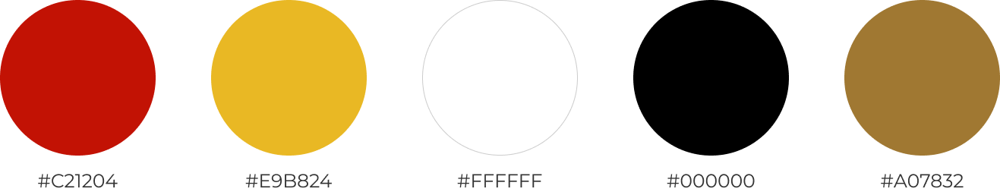

#### 4.1.1.3. Tipografía.

La tipografia que se ha decidido usar en nuestra plataforma son dos, Poppins y Monserrat. Estas elecciones fueron hechas pensando en la comodidad de lectura de nuestros usuarios, junto a un diseño moderno que se quiere lograr.

- **Títulos:** Para los titulos se usaran Poppins en pesos de Bold o semibold dependiendo del titulo, esto para dar una fuerza y relevancia necesarias en titulos.

  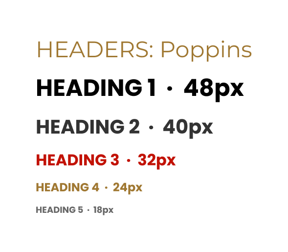

- **Párrafos o cuerpo del texto:** Se usara Monserrat en pesos variados como bold, regular o light dependiendo de la intencion del parrafo. Pensado en la legibilidad necesaria para los usuarios al momento de leer.

  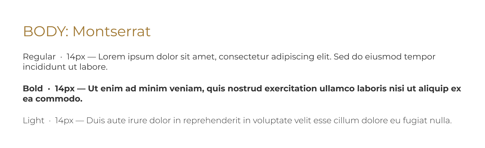

### 4.1.2. Web Style Guidelines.
### 4.2. Information Architecture.
La arquitectura de información de SupplyWok ha sido diseñada para atender de manera clara y diferenciada a sus dos segmentos principales: los dueños y administradores de restaurantes tipo chifa, y los proveedores de insumos. La plataforma organiza su contenido en dos espacios de trabajo distintos según el rol del usuario, garantizando que cada persona acceda únicamente a las funcionalidades relevantes para su operación. A continuación, se describen las secciones que conforman cada vista.
 
**Vista Restaurante**
 
En la sección **Dashboard**, el usuario accede a un resumen del estado operativo del día. Desde esta pantalla puede visualizar las alertas de stock mínimo activas, los pedidos pendientes de confirmación, el nivel de ocupación de mesas y cualquier anomalía de temperatura registrada. Es el punto de entrada principal tras iniciar sesión y está pensada para que el administrador tome decisiones rápidas sin necesidad de navegar a otras secciones.
 
En la sección **Inventario**, el restaurante gestiona el registro completo de sus insumos. Cada producto incluye nombre, categoría, unidad de medida, cantidad actual en stock, stock mínimo configurado y proveedor asociado. Desde aquí se pueden registrar entradas de mercadería, descontar unidades consumidas y actualizar la información de cualquier insumo. El sistema genera alertas automáticas cuando la cantidad disponible alcanza o cae por debajo del umbral mínimo establecido.
 
En la sección **Pedidos**, el restaurante crea, gestiona y hace seguimiento de sus órdenes de abastecimiento. Al generar un pedido, el usuario selecciona el proveedor, los insumos requeridos y las cantidades. Cada pedido tiene un estado visible (Pendiente, En camino, Entregado, Cancelado) que se actualiza en tiempo real. El historial de pedidos permite revisar órdenes anteriores y reutilizar configuraciones frecuentes.
 
En la sección **Proveedores**, el restaurante accede al directorio de proveedores con los que trabaja. Cada proveedor registrado muestra sus datos de contacto, las categorías de insumos que suministra y el historial de transacciones realizadas. Desde aquí también es posible vincular nuevos proveedores a la cuenta del restaurante.
 
En la sección **Alertas**, el usuario encuentra el centro de notificaciones de la plataforma. Las alertas se generan automáticamente ante situaciones como stock mínimo alcanzado, productos próximos a vencer o lecturas de temperatura fuera del rango configurado. Cada alerta incluye el detalle del insumo o condición afectada, la fecha y hora del evento, y un acceso directo a la sección correspondiente para tomar acción.
 
En la sección **Reportes**, el restaurante puede analizar su operación a través de gráficos y tablas. Las métricas disponibles incluyen el consumo de insumos por periodo, la evolución del inventario, la frecuencia de pedidos por proveedor y una proyección básica de demanda basada en el historial registrado. Esta información ayuda al administrador a tomar decisiones más informadas sobre compras y planificación.
 
En la sección **Configuración**, el restaurante gestiona los parámetros generales de su cuenta. Esto incluye los datos del perfil del negocio, los umbrales de stock mínimo globales, los horarios de operación, las preferencias de notificación y la gestión de usuarios con acceso a la plataforma.
 
**Vista Proveedor**
 
En la sección **Dashboard**, el proveedor visualiza un resumen de su actividad reciente: pedidos recibidos que requieren atención, entregas programadas para el día y una vista rápida de la demanda proyectada de sus clientes. Esta pantalla está diseñada para que el proveedor priorice sus tareas de distribución sin necesidad de revisar cada sección por separado.
 
En la sección **Pedidos recibidos**, el proveedor revisa todas las órdenes enviadas por sus clientes restaurante. Cada pedido muestra el detalle de los insumos solicitados, las cantidades, la fecha de entrega esperada y el estado actual. Desde aquí el proveedor puede confirmar la recepción del pedido, actualizar su estado e indicar la fecha estimada de entrega.
 
En la sección **Mis clientes**, el proveedor accede al directorio de restaurantes vinculados a su cuenta. Por cada cliente puede ver el historial de pedidos realizados, la frecuencia de compra y la demanda proyectada, lo que facilita la planificación de rutas y la anticipación de necesidades.
 
En la sección **Demanda proyectada**, el proveedor consulta una estimación del consumo futuro de cada cliente basada en el historial de pedidos registrado en la plataforma. Esta vista está pensada para que el proveedor pueda organizar su producción o abastecimiento con anticipación, reduciendo retrasos y pedidos de emergencia.
 
En la sección **Catálogo de productos**, el proveedor registra y mantiene actualizado el listado de insumos que ofrece, con información de precios, unidades disponibles y condiciones de entrega. Los restaurantes vinculados pueden consultar este catálogo al momento de crear un pedido.
 
En la sección **Configuración**, el proveedor gestiona los datos de su perfil, las zonas de cobertura donde realiza entregas y sus preferencias de contacto y notificación.
 
El equipo de Aurora confía en que esta arquitectura permitirá a ambos tipos de usuario operar de manera más eficiente, reduciendo el tiempo dedicado a tareas manuales y mejorando la coordinación entre restaurantes y proveedores. El objetivo es ofrecer una plataforma intuitiva y directa que se adapte al ritmo de trabajo real de un negocio gastronómico, donde las decisiones deben tomarse rápido y con información confiable.
 
---
### 4.2.1. Organization Systems.
El contenido de SupplyWok se organiza aplicando distintos esquemas según la naturaleza de cada sección y el flujo esperado del usuario.
#### Organización Visual del Contenido
 
| Tipo de organización | Aplicación en SupplyWok | Justificación |
|---|---|---|
| Jerárquica | Landing Page, Dashboard principal de cada rol | Permite destacar la información más crítica (alertas de stock, estado de pedidos) y guiar al usuario hacia las acciones prioritarias. |
| Secuencial | Registro de usuario, configuración inicial del inventario, creación de un pedido | Acompaña al usuario paso a paso en flujos que requieren completar etapas en orden, reduciendo errores. |
| Matricial | Gestión de inventario, historial de pedidos | Permite visualizar múltiples variables simultáneamente (producto, cantidad, fecha, proveedor) para facilitar comparaciones y análisis. |
 
#### Esquemas de Categorización
 
| Tipo de esquema | Aplicación en SupplyWok | Justificación |
|---|---|---|
| Por tópicos | Secciones del menú principal: Inventario, Pedidos, Proveedores, Reportes, Configuración | Agrupa el contenido por funcionalidad para un acceso rápido y predecible. |
| Cronológico | Historial de pedidos, registro de movimientos de inventario, log de alertas | Facilita el seguimiento de eventos en el tiempo y la auditoría de operaciones pasadas. |
| Por audiencia | Vistas diferenciadas según rol: Restaurante vs. Proveedor | Cada usuario ve únicamente el contenido y las acciones relevantes para su rol, evitando confusión y sobrecarga de información. |
 
#### Secciones Principales de SupplyWok
 
La aplicación se divide en dos grandes espacios según el rol del usuario.
 
**Vista Restaurante**
 
| Sección | Descripción |
|--|--|
| Dashboard | Resumen del estado operativo del día: alertas de stock bajo, pedidos pendientes, temperatura fuera de rango y nivel de ocupación de mesas. |
| Inventario | Listado completo de insumos registrados con cantidad actual, unidad de medida, stock mínimo configurado y proveedor asociado. Permite registrar entradas y salidas. |
| Pedidos | Creación, seguimiento y historial de órdenes de abastecimiento enviadas a proveedores. Incluye estado del pedido (pendiente, en camino, recibido). |
| Proveedores | Directorio de proveedores vinculados al restaurante, con datos de contacto, categorías de insumos que suministran e historial de transacciones. |
| Alertas | Centro de notificaciones con alertas de stock mínimo alcanzado, vencimientos próximos y anomalías de temperatura detectadas. |
| Reportes | Gráficos y tablas con análisis de consumo por periodo, proyección de demanda y métricas de eficiencia operativa. |
| Configuración | Gestión del perfil del restaurante, umbrales de stock mínimo, horarios de operación y preferencias de notificación. |
 
**Vista Proveedor**
 
| Sección | Descripción |
|---|---|
| Dashboard | Resumen de pedidos recibidos, entregas pendientes y demanda proyectada de sus clientes. |
| Pedidos recibidos | Listado de órdenes enviadas por los restaurantes, con detalle de productos solicitados, cantidades y fecha de entrega esperada. |
| Mis clientes | Directorio de restaurantes vinculados, con historial de pedidos por cliente y visualización de su demanda estimada. |
| Demanda proyectada | Vista de consumo histórico y proyección de pedidos futuros por cliente, útil para planificar producción y distribución. |
| Catálogo de productos | Insumos que el proveedor ofrece, con precios, unidades disponibles y condiciones de entrega. |
| Configuración | Gestión del perfil del proveedor, zonas de cobertura y preferencias de contacto. |
 
---
### 4.2.2. Labeling Systems.
El sistema de etiquetado de SupplyWok prioriza términos directos, en español, y familiares para el contexto gastronómico peruano. Se evitan tecnicismos innecesarios para facilitar la adopción por parte de usuarios con experiencia tecnológica variada.
 
| Etiqueta | Descripción |
|---|---|
| Iniciar sesión / Registrarse | Acceso a la plataforma con cuenta existente o creación de una nueva, con selección de rol (Restaurante o Proveedor). |
| Dashboard | Pantalla de inicio post-login que presenta el resumen operativo más relevante para el rol del usuario. |
| Inventario | Sección donde el restaurante registra, consulta y actualiza sus insumos y niveles de stock. |
| Agregar insumo | Acción para registrar un nuevo producto en el inventario, indicando nombre, categoría, unidad y stock mínimo. |
| Stock mínimo | Cantidad umbral a partir de la cual el sistema genera una alerta de reabastecimiento. |
| Crear pedido | Acción para generar una nueva orden de compra dirigida a un proveedor. |
| Estado del pedido | Indicador visual del avance de una orden: Pendiente, En camino, Entregado, Cancelado. |
| Alerta de stock | Notificación automática que se activa cuando un insumo llega o cae por debajo del stock mínimo configurado. |
| Demanda proyectada | Estimación de consumo futuro basada en el historial de pedidos y el nivel de actividad registrado. |
| Proveedor vinculado | Proveedor que tiene una relación activa con el restaurante dentro de la plataforma. |
| Historial | Registro cronológico de pedidos, movimientos de inventario o alertas pasadas. |
| Reportes | Sección con gráficos y métricas de consumo, eficiencia y tendencias operativas. |
| Configuración | Área para gestionar datos del perfil, preferencias de notificación y parámetros del sistema. |
| Cerrar sesión | Acción para salir de la cuenta de forma segura. |
 
---
### 4.2.3. SEO Tags and Meta Tags.
Se definen las etiquetas SEO y Meta Tags para la Landing Page y la Web Application con el fin de mejorar la visibilidad en motores de búsqueda y optimizar la presentación en redes sociales y navegadores.
 
**Landing Page**
 
- **Title:** SupplyWok | Gestión inteligente de abastecimiento para restaurantes
- **Meta Description:** Controla tu inventario, anticipa la demanda y coordina pedidos con tus proveedores desde una sola plataforma. Diseñada para restaurantes chifa y negocios gastronómicos.
- **Meta Keywords:** gestión de inventario restaurantes, abastecimiento chifa, control de stock, proveedores restaurantes, software gastronómico Perú
- **Meta Author:** Aurora

**Web Application**
 
- **Title:** SupplyWok - Panel de control
- **Meta Description:** Accede a tu panel para gestionar inventario, revisar pedidos, monitorear alertas y analizar la demanda de tu negocio gastronómico.
- **Meta Keywords:** panel restaurante, control de insumos, pedidos a proveedores, alertas de stock, gestión operativa
- **Meta Author:** Aurora
---
 
### 4.2.4. Searching Systems.
Para evitar que los usuarios pierdan tiempo buscando información dentro de la plataforma, SupplyWok implementa los siguientes sistemas de búsqueda y filtrado:
 
| Sistema de búsqueda | Descripción |
|---|---|
| Búsqueda de insumos | Barra de búsqueda en la sección de Inventario que permite encontrar productos por nombre o categoría (carnes, verduras, condimentos, bebidas, etc.). |
| Búsqueda de proveedores | Permite localizar a un proveedor por nombre o por el tipo de insumo que suministra. |
| Búsqueda de pedidos | Filtra órdenes por estado (pendiente, en camino, entregado), por proveedor o por rango de fechas. |
| Filtro por categoría de insumo | Permite acotar la vista del inventario o del catálogo por tipo de producto, facilitando la revisión de un grupo específico de insumos. |
| Filtro por fecha | Disponible en el historial de pedidos y en reportes, para analizar periodos específicos de operación. |
| Alertas activas | Vista filtrada que muestra únicamente los insumos que actualmente están por debajo del stock mínimo o tienen vencimiento próximo. |
| Búsqueda de clientes (Proveedor) | Permite al proveedor localizar a un restaurante cliente por nombre para revisar su historial o demanda proyectada. |

---

### 4.2.5. Navigation Systems.

El sistema de navegación de SupplyWok está diseñado para ser predecible, consistente en ambos roles y accesible desde cualquier punto de la aplicación.

| Elemento de navegación | Descripción |
|----|----|
| Barra lateral (Sidebar) | Menú principal fijo en el lado izquierdo de la pantalla, visible en todo momento. Contiene los accesos directos a todas las secciones del rol activo. En dispositivos móviles se colapsa en un menú tipo hamburguesa. |
| Header | Barra superior con el nombre del usuario, su rol, notificaciones activas y acceso rápido a Configuración y Cerrar sesión. |
| Dashboard como punto de entrada | Cada sesión iniciada redirige automáticamente al Dashboard del rol correspondiente, que funciona como centro de comando con accesos directos a las tareas más frecuentes. |
| Breadcrumbs | Indicador de ruta visible en secciones de detalle (por ejemplo: Pedidos > Detalle del pedido #045), que permite al usuario saber dónde está y volver fácilmente. |
| Botones de acción contextual | Cada sección incluye botones primarios para la acción más común (Crear pedido, Agregar insumo, Ver detalle), reduciendo el número de pasos necesarios. |
| Notificaciones | Ícono en el header que agrupa alertas activas. Al hacer clic despliega un panel con el listado de alertas recientes ordenadas cronológicamente. |
| Navegación entre roles | Si un usuario administra tanto un restaurante como actúa como proveedor, puede cambiar de vista desde el header sin necesidad de cerrar sesión. |

---
## 4.3. Landing Page UI Design.
### 4.3.1. Landing Page Wireframe.
### 4.3.2. Landing Page Mock-up.
## 4.4. Web Applications UX/UI Design.
### 4.4.1. Web Applications Wireframes.
### 4.4.2. Web Applications Wireflow Diagrams.
### 4.4.2. Web Applications Mock-ups.
### 4.4.3. Web Applications User Flow Diagrams.
## 4.5. Web Applications Prototyping.
## 4.6. Domain-Driven Software Architecture.
### 4.6.1. Design-Level EventStorming.

En esta sección se detalla el proceso de Design-Level EventStorming realizado por el equipo para perfeccionar el modelo del dominio de Aurora. Partiendo del Big Picture, profundizamos en el comportamiento interno del sistema para alcanzar el mayor nivel de detalle arquitectónico posible.

Primero, refinamos la línea de tiempo original, eliminando eventos redundantes o procesos manuales que quedaban fuera del alcance tecnológico de la plataforma. Sobre este flujo depurado, incorporamos los elementos tácticos del Domain-Driven Design: Actores y Comandos para representar las intenciones, Políticas para las reglas automáticas, y Agregados (Aggregates) como responsables de procesar las operaciones y emitir los eventos de dominio. Este nivel de granularidad nos permitió consolidar y justificar las fronteras definitivas de nuestros Bounded Contexts.

Este contexto delimitado constituye el núcleo operativo para los restaurantes tipo chifa dentro de la plataforma Aurora. Su propósito principal es centralizar y automatizar el control de los insumos, transformando la gestión manual tradicional en un proceso preciso y basado en datos.

  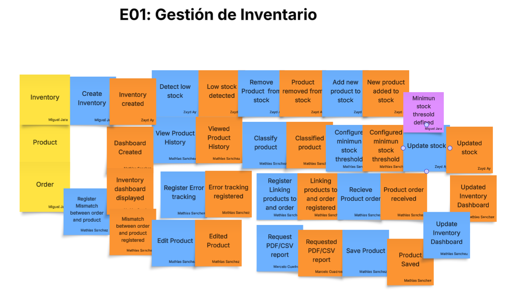

Este contexto delimitado actúa como el puente transaccional entre los restaurantes tipo chifa y sus proveedores dentro del ecosistema Aurora. Su objetivo fundamental es digitalizar y estructurar la coordinación de pedidos de insumos, reemplazando las vías de comunicación informales por un flujo de trabajo centralizado y rastreable en la plataforma.

  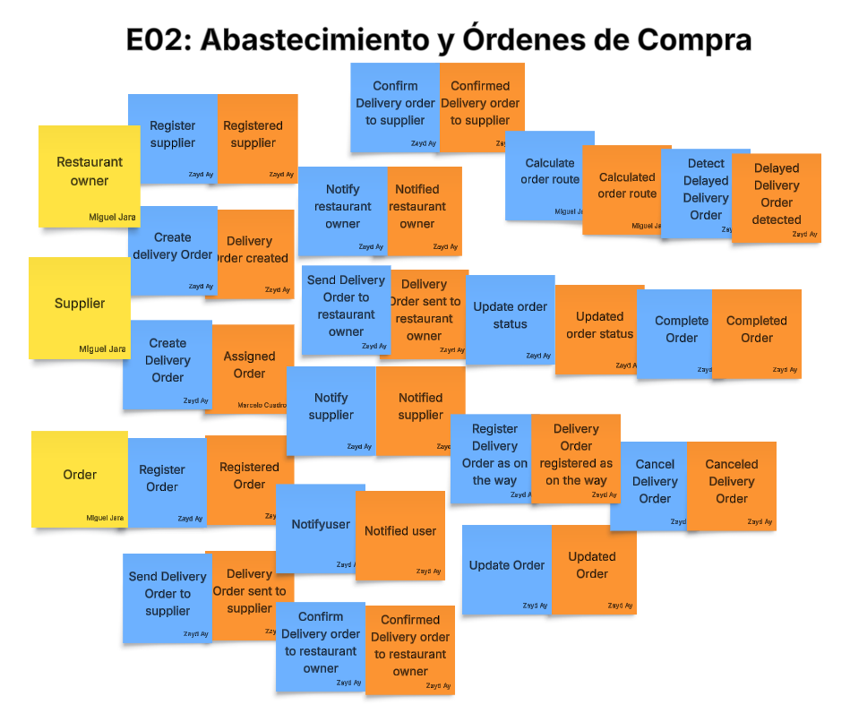

Este contexto delimitado tiene como propósito supervisar las condiciones físicas críticas en las instalaciones del restaurante, específicamente en áreas vulnerables como la cocina y el almacén. Mediante la integración simulada de sensores IoT, el sistema monitorea variables ambientales clave de forma continua, tales como la temperatura y la humedad.

  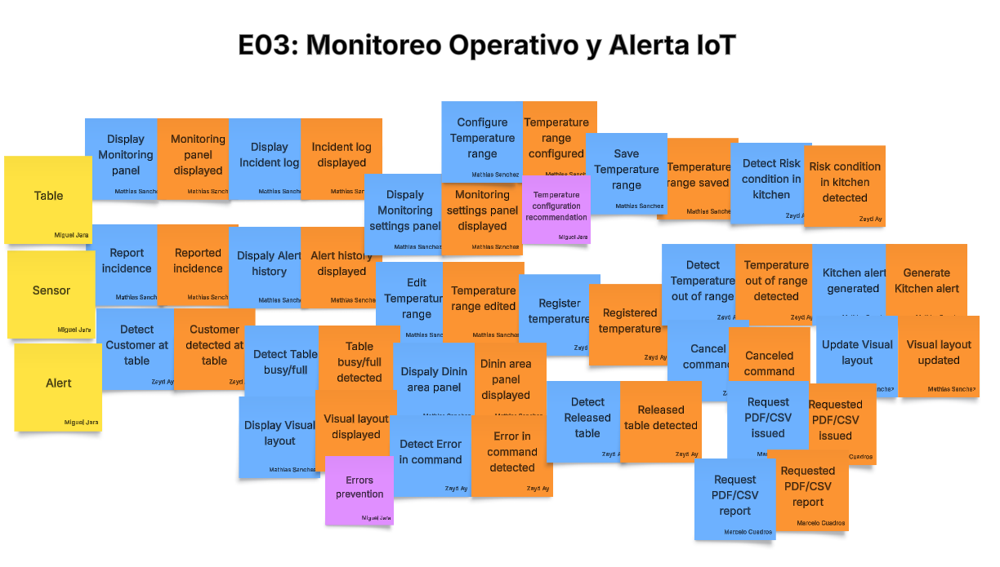

Este contexto delimitado está diseñado para centralizar la gestión de los proveedores, brindándoles las herramientas necesarias para optimizar su logística y planificación comercial. A través de este módulo, los proveedores obtienen visibilidad sobre la demanda futura de sus clientes, lo que les permite gestionar sus catálogos de insumos y realizar un seguimiento detallado del estado de los pedidos recibidos.

  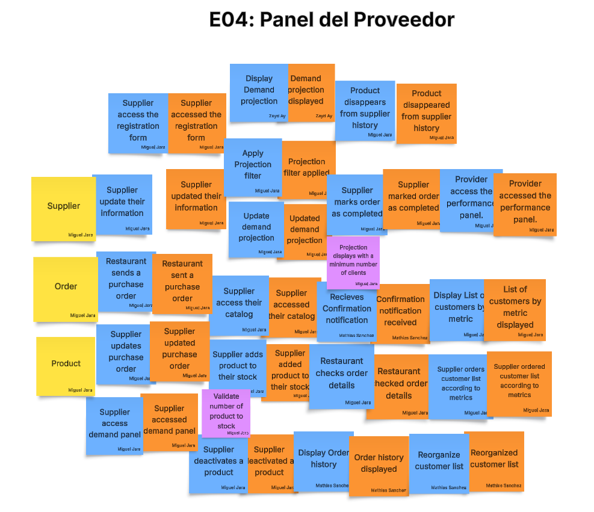

Este contexto delimitado representa la capa transversal de seguridad y administración comercial de la plataforma Aurora. Su propósito principal es proporcionar un entorno centralizado y seguro donde todos los usuarios puedan autenticarse, gestionar sus cuentas y recibir soporte técnico de manera eficiente.

  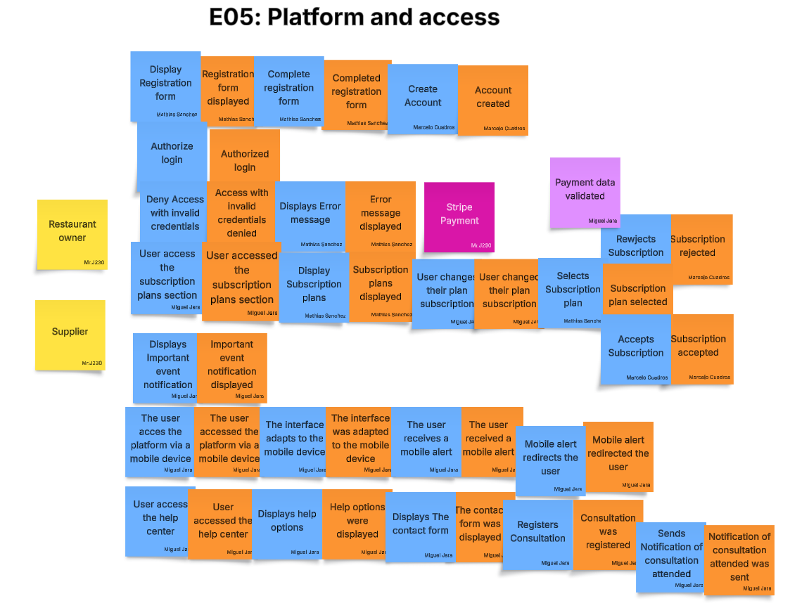

### 4.6.2. Software Architecture Context Diagram.

  

### 4.6.3. Software Architecture Container Diagrams.

  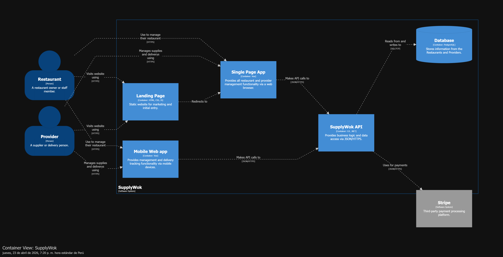

### 4.6.4. Software Architecture Components Diagrams.

  

## 4.7. Software Object-Oriented Design.
### 4.7.1. Class Diagrams.

Para nuestro primer bounded context tenemos el siguiente diagrama de clases.

  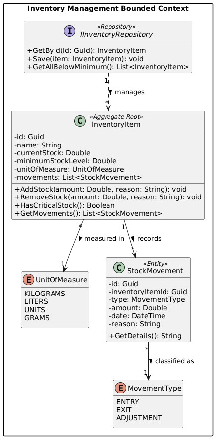

Para este contexto, la entidad principal es la Orden de Compra (Purchase Order), la cual reemplaza los mensajes informales y centraliza la comunicación entre el restaurante y el proveedor.

  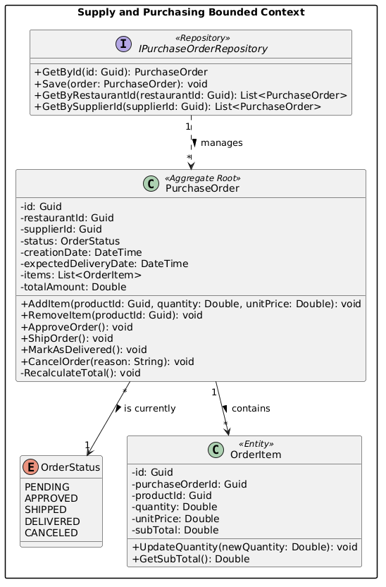

Este contexto se encarga de supervisar las condiciones físicas críticas (temperatura y humedad) en la cocina y el almacén, procesando las lecturas de los sensores y disparando alertas cuando se rompen los umbrales de seguridad.

  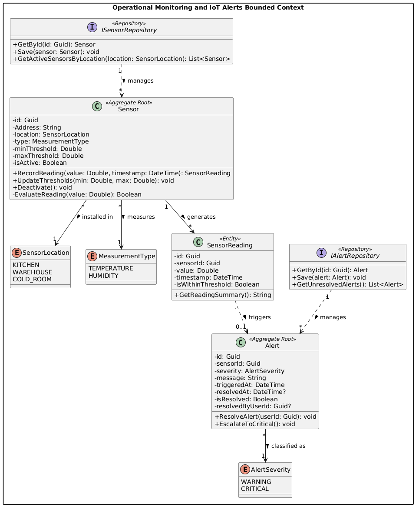

Este cuarto contexto resuelve tres necesidades clave para Marco Valdivia y los demás proveedores: gestionar su catálogo, tener visibilidad de la demanda (proyección) y hacer seguimiento de la distribución de pedidos.

  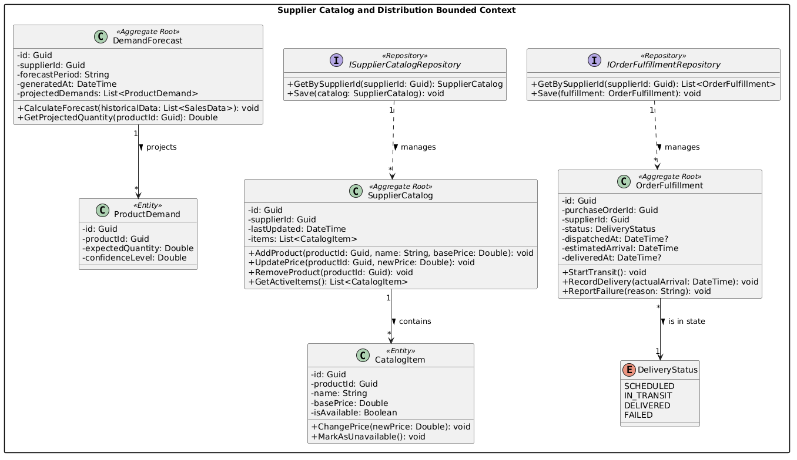

El quinto y último módulo es transversal: se encarga de la seguridad, la gestión de cuentas, los planes de suscripción y el soporte técnico, garantizando que tanto dueños de chifas como proveedores tengan una experiencia fluida.

  

## 4.8. Database Design.

El siguiente Diagrama Entidad-Relación detalla la estructura de datos fundamental que soporta la lógica de la plataforma. A este modelo, compuesto por 25 entidades, se le aplicaron las tres fases de normalización para garantizar un diseño robusto y eficiente. Esto asegura la escalabilidad, la separación de responsabilidades y el mantenimiento de la aplicación, organizada en los siguientes seis módulos:

- #### Gestión de Inventario

Controla las entradas, salidas y niveles de stock para evitar desabastecimientos o excesos.

- #### Abastecimiento y Órdenes de Compra

Gestiona los pedidos de insumos entre el restaurante y el proveedor, reduciendo los tiempos de respuesta entre ambos.

- #### Panel del Proveedor

Centraliza la funcionalidad del proveedor, permitiendo una mejor gestión de catálogos y pedidos.

- #### Plataforma y Acceso

Administra el acceso seguro de los usuarios, sus cuentas y planes de suscripción.

- #### Monitoreo Operativo y Alertas IoT

Representa el núcleo operativo del sistema; controla sensores y notificaciones para garantizar la seguridad en el entorno de trabajo.

- #### Comandas y Órdenes para Cocina

Facilita la comunicación eficiente entre la cocina y las mesas para garantizar un servicio rápido y sin errores.

### 4.8.1. Database Diagrams.

  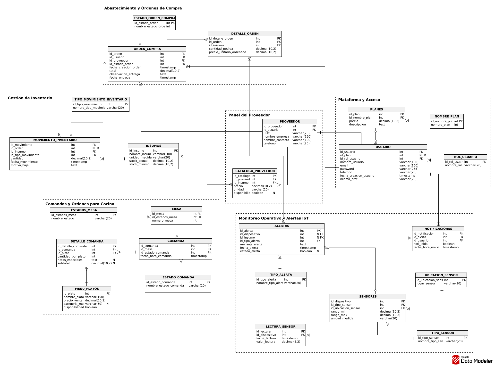

[^1]: Clec. (s.f.). El color rojo en China: orígenes y tradiciones. Recuperado el 23 de abril de 2026, de https://fundacionclec.org/el-color-rojo-en-china-origenes-y-tradiciones/