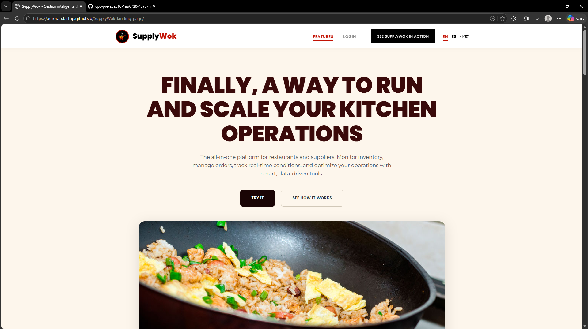
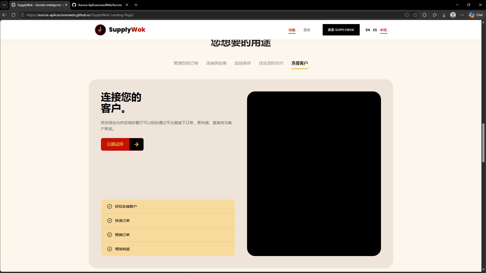
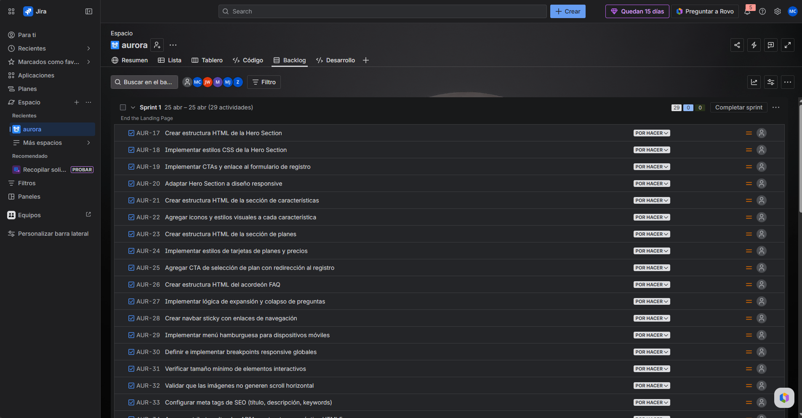
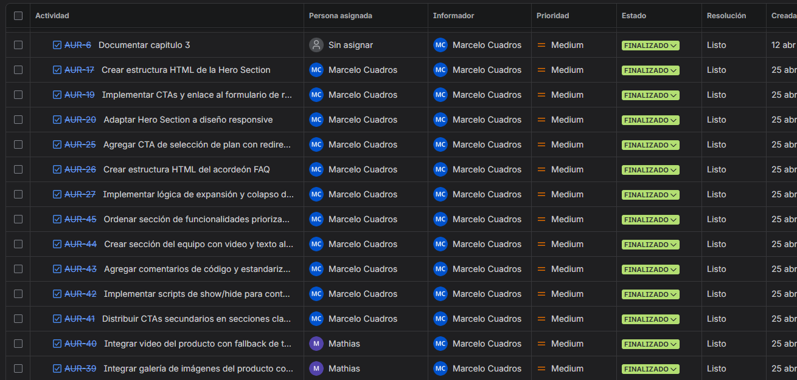
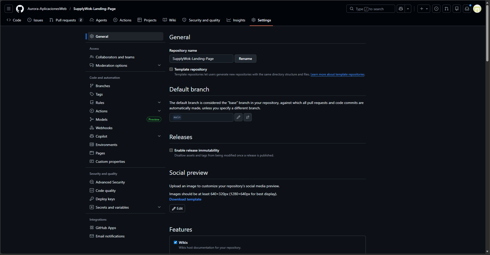
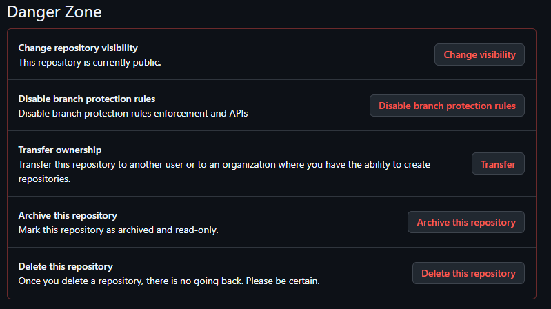
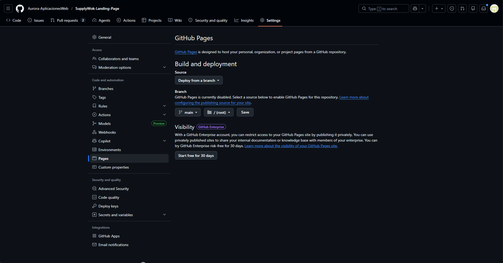
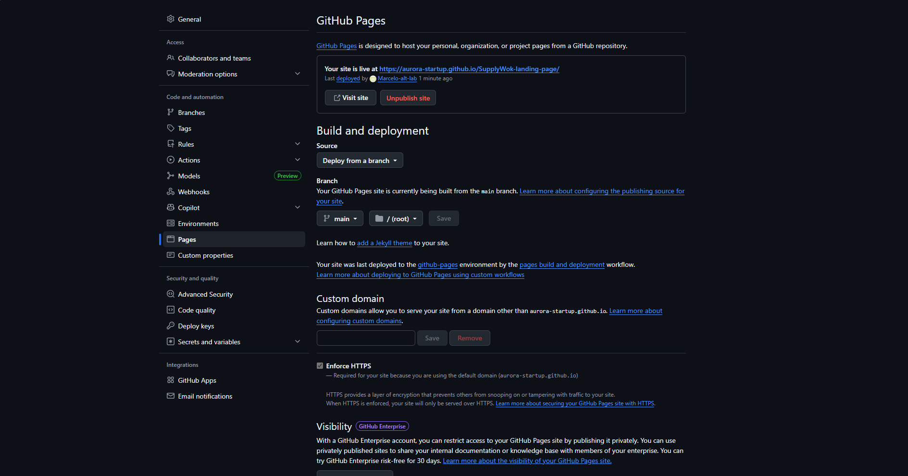
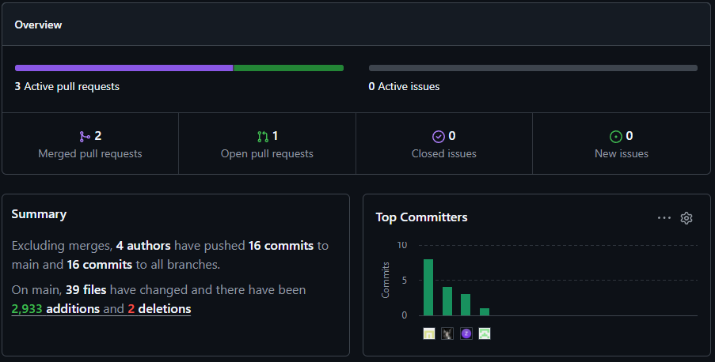

# Capítulo V: Product Implementation, Validation & Deployment.

## 5.1. Software Configuration Management. 
Para tener consistencia y seguimiento del desarrollo de la plataforma, se ha definido una serie de herramientas y estrategias de desarrollo. El metodo cubre la configuracion del entorno de desarrollo, la gestion del codigo y el despliegue, alineado a las buenas practicas de ingenieria de software y metodologias agiles.

### 5.1.1. Software Development Environment Configuration. 
Para facilitar la colaboración del equipo en todas las actividades del ciclo de vida de desarrollo de Urban Safe, se ha definido un entorno de desarrollo común. Este entorno está compuesto por herramientas especializadas para la gestión del proyecto, diseño UX/UI, modelado, desarrollo, pruebas, documentación y despliegue. La selección de estas herramientas se basa en criterios de eficiencia, compatibilidad con tecnologías open-source (Java + web), y alineación con prácticas recomendadas de la industria.
|  Categoría   | Herramienta   | Propósito | Tipo de acceso/enlace |
|:---:|:---:|:---:|:---:|
|    Project Management   |         Trello        |Gestión del backlog, tareas y sprints del equipo usando metodología ágil (Scrum).|   [https://trello.com](https://trello.com) |
| Requirements Management |       UXPressia       |Creación de User Personas, Journey Maps y artefactos de needfinding.|[https://uxpressia.com](https://uxpressia.com)|
|   Product UX/UI Design  |         Figma         |Diseño de wireframes, mockups y prototipos de la aplicación web y móvil.|[https://figma.com](https://figma.com)|
|   Modelado de Software  |    LucidChart / Miro / Structurizr|Modelado de arquitectura (UML, C4, Event Storming, Bounded Contexts).|[https://www.lucidchart.com/](https://www.lucidchart.com/)/[https://miro.com/](https://miro.com/) / [https://structurizr.com/](https://structurizr.com/)|
|   Frontend Development  |   Visual Studio Code  |Desarrollo del Landing Page y Web Application (HTML, CSS, JavaScript).|[https://code.visualstudio.com](https://code.visualstudio.com)|
|   Backend Development   |IntelliJ IDEA|     Desarrollo del RESTful API en Java (Spring Boot) siguiendo arquitectura orientada a servicios.    |[https://www.jetbrains.com/idea/](https://www.jetbrains.com/idea/)               |
|       API Testing       |Postman|Pruebas y validación de endpoints del API RESTful.|[https://www.postman.com](https://www.postman.com)|
|     Version Control     |         GitHub        | Control de versiones del código fuente y documentación colaborativa (GitFlow + Conventional Commits). |[https://github.com](https://github.com)|
|  Software Documentation |        Markdown       |Redacción del informe del proyecto bajo enfoque Docs-as-Code.                     |Compatible con GitHub / editores de texto|


### 5.1.2. Source Code Management. 
Los repositorios utilizados para el desarrollo de código fuente son los siguientes:

<div align="center">

| Producto Digital | URL del Repositorio | 
|:----------------:|:-------------------:|
| Landing Page | https://github.com/Aurora-startup/SupplyWok-landing-page | 
| Web Services (Backend API) |https://github.com/Aurora-startup/SupplyWok-backend  |
| Frontend Web Application | https://github.com/Aurora-startup/SupplyWok-frontend|

</div>

---

**Modelos de Ramificación**

Se implementará GitFlow, un modelo de ramificación estructurado, el cual permite separar de manera clara las etapas de desarrollo, pruebas, liberación y mantenimiento.

**La estructura de ramas en GitFlow será:**

- _Main_: Contiene el código en estado estable y listo para producción.
- _Develop_: Rama de integración para desarrollo activo.
- _Feature branches_: Para nuevas funcionalidades.
    - Convención: `feature/nombre-descriptivo`  
    - Ejemplo: `feature/US007-business-profiles`
- _Release branches_: Para preparar versiones antes de pasar a producción.
    - Convención: `release/X.Y.Z`  
    - Ejemplo: `release/1.0.0`
- _Hotfix branches_: Para correcciones urgentes.
    - Convención: `hotfix/X.Y.Z`  
    - Ejemplo: `hotfix/1.0.1`        

**Versionado Semántico (Semantic Versioning)**

- Se utiliza Semantic Versioning 2.0.0, con el esquema MAJOR.MINOR.PATCH:

    - **MAJOR:** Cambios incompatibles.
    - **MINOR:** Funcionalidades nuevas retrocompatibles.
    - **PATCH:** Correcciones retrocompatibles.

    **Ejemplos de versiones:**  
    `v1.0.0`, `v1.1.0`, `v1.1.1`.

**Convenciones para Commits**

El equipo sigue el estándar de Conventional Commits para los mensajes de commits, lo que permite claridad en el historial y facilita la generación automática de changelogs:

`<type>[optional scope]: <description>`

Tipos comunes:

- `feat`: Nueva funcionalidad.
- `fix`: Corrección de errores.
- `docs`: Cambios en documentación.
- `style`: Cambios de formato sin impacto funcional.
- `refactor`: Reestructuración del código.
- `test`: Relacionados con pruebas.
- `chore`: Tareas de mantenimiento.

Ejemplo:
```
  feat(auth): implement login via OAuth
  fix(api): handle null user tokens
```
### 5.1.3. Source Code Style Guide & Conventions. 

Esta sección define los lineamientos y estándares que se seguirán durante el desarrollo del software, con el fin de garantizar un código uniforme, comprensible y fácil de mantener, alineado con buenas prácticas de la industria.

Se adoptarán convenciones ampliamente aceptadas para los lenguajes utilizados en el proyecto: HTML, CSS, JavaScript, TypeScript y Java. Asimismo, todos los nombres de variables, funciones, clases y demás identificadores estarán escritos en inglés.

---

#### Referencias utilizadas

Las siguientes guías servirán como base para la implementación de estándares de código:

- [Angular Style Guide (oficial)](https://angular.io/guide/styleguide)
- [Google TypeScript Style Guide](https://google.github.io/styleguide/tsguide.html)
- [Google Java Style Guide](https://google.github.io/styleguide/javaguide.html)
- [Google HTML/CSS Style Guide](https://google.github.io/styleguide/htmlcssguide.html)
- [HTML Style Guide and Coding Conventions - W3Schools](https://www.w3schools.com/html/html5_syntax.asp)
- [Spring Boot Features](https://docs.spring.io/spring-boot/docs/current/reference/htmlsingle/)

---

#### Estructura del código

El proyecto se organizará en módulos según sus responsabilidades, separando claramente componentes como servicios, modelos, vistas, rutas y configuraciones.  
Este enfoque permite mejorar la escalabilidad del sistema y fomenta la reutilización de código, aplicando el principio de *Separation of Concerns*.

---

#### Convenciones de nomenclatura

| Elemento                    | Convención                         | Ejemplo                    |
|---------------------------|------------------------------------|----------------------------|
| Componentes Angular       | PascalCase + `Component`           | `UserProfileComponent`     |
| Servicios Angular         | PascalCase + `Service`             | `AuthService`              |
| Interfaces TypeScript     | PascalCase                         | `User`, `CourseDetails`    |
| Archivos                  | kebab-case                         | `user-profile.component.ts`|
| Variables / funciones     | camelCase                          | `getUserData()`            |
| Constantes                | UPPER_SNAKE_CASE                   | `MAX_LOGIN_ATTEMPTS`       |
| Clases Java              | PascalCase                         | `UserController`           |
| Métodos Java             | camelCase                          | `getUserById()`            |
| Paquetes Java            | minúsculas con puntos              | `com.example.module`       |

---

#### Lineamientos por lenguaje

##### TypeScript
- Uso de tipado fuerte y explícito.
- Se emplean `let` y `const`, evitando `var`.
- La lógica compleja se delega a servicios, no a componentes.
- Orden de imports: Angular → librerías externas → módulos internos.
- No se utiliza el prefijo `I` en interfaces.

##### JavaScript
- Configuración basada en ESLint y Prettier.
- Preferencia por funciones puras y código modular.
- Uso de camelCase en nombres.
- Prioridad a `const` y `let`.

##### HTML
- Etiquetas y atributos en minúsculas.
- Indentación de 2 espacios.
- Uso de comillas dobles en atributos.
- Se prioriza semántica y accesibilidad según HTML5.

##### CSS / SCSS
- Uso de metodología BEM (Block Element Modifier) para definir las clases:

```css
.button {}
.button--primary {}
.button__icon {}
```
- Estructura modular de estilos, agrupados por componente.

- Uso de variables SCSS para colores, fuentes y tamaños.

- Están prohibidos los estilos en línea y el uso indiscriminado de !important.

###### JAVA
- Organización por capas: controller, service, repository, model, etc.

- Uso de anotaciones estándar como `@RestController`, `@Service`, `@Repository`.

- Documentación con Javadoc en clases y métodos públicos.

- Acceso a atributos mediante métodos getter y setter.

- Se sigue el https://google.github.io/styleguide/javaguide.html

##### Internacionalización

Se utiliza el paquete `@ngx-translate/core` para la internacionalización de la interfaz.

Toda cadena visible al usuario se encuentra externalizada en archivos JSON, organizados por idioma.

Las claves de traducción están en mayúsculas y separadas por puntos para reflejar su estructura jerárquica.

```css
<h1>{{ 'LOGIN.TITLE' | translate }}</h1>
```

### 5.1.4. Software Deployment Configuration.  
La configuración de despliegue define los procesos y herramientas necesarias para publicar los distintos componentes del sistema: **Landing Page**, **API REST (Backend)** y **Web Application (Frontend)**.  
Este enfoque permite asegurar consistencia, trazabilidad y facilidad de mantenimiento durante el ciclo de vida del producto.

---

#### Despliegue del Landing Page

- **Tecnologías utilizadas:**  
  HTML5, CSS3, JavaScript, enfoque responsive.

- **Repositorio:**  
  [https://github.com/Aurora-startup/SupplyWok-landing-page](https://github.com/Aurora-startup/SupplyWok-landing-page)

- **Plataforma de hosting:**  
  GitHub Pages

- **Proceso de despliegue:**  
  - La rama `main` contiene la versión pública del sitio.  
  - El contenido estático se ubica en el directorio raíz del proyecto.  
  - Los cambios se integran desde la rama `develop` mediante pull requests validados.  
  - GitHub Pages realiza la publicación automáticamente al detectar actualizaciones en la rama principal.

---

#### Despliegue del Backend (RESTful API)

- **Tecnologías utilizadas:**  
  Java + Spring Boot

- **Repositorio:**  
  [https://github.com/Aurora-startup/SupplyWok-backend](https://github.com/Aurora-startup/SupplyWok-backend)

- **Plataforma de despliegue:**  
  Servicios Cloud (ej. Render, Railway, AWS o Azure)

- **Proceso de despliegue:**  
  - La aplicación se empaqueta utilizando Maven/Gradle (`.jar` ejecutable).  
  - Se configura el despliegue automático conectado al repositorio GitHub.  
  - Las variables sensibles (credenciales, conexión a base de datos, tokens) se gestionan mediante variables de entorno.  
  - El servicio se expone a través de endpoints REST accesibles mediante HTTP/HTTPS.  
  - Se asegura la correcta comunicación con servicios externos requeridos por el sistema.

---

#### Despliegue del Frontend Web Application

- **Tecnologías utilizadas:**  
  Framework SPA (Angular / Vue / React), HTML, CSS, TypeScript/JavaScript.

- **Repositorio:**  
  [https://github.com/Aurora-startup/SupplyWok-frontend](https://github.com/Aurora-startup/SupplyWok-frontend)

- **Plataforma de despliegue:**  
  Vercel / Netlify / GitHub Pages

- **Proceso de despliegue:**  
  - La aplicación se compila en modo producción (`npm run build`).  
  - La rama `main` se utiliza como fuente de despliegue.  
  - La plataforma seleccionada detecta cambios automáticamente y publica nuevas versiones.  
  - Se configura la URL del backend mediante variables de entorno para garantizar la integración con la API REST.

---

#### Consideraciones adicionales

- Se documentarán los pasos de despliegue en el repositorio principal del proyecto.  
- Se mantendrá una separación clara entre entornos (desarrollo, testing y producción).  
- Se realizarán pruebas posteriores al despliegue para validar la disponibilidad y funcionamiento del sistema.  
- Se contempla la integración de herramientas de automatización como **GitHub Actions** para implementar flujos de integración y despliegue continuo (CI/CD).
  
## 5.2. Landing Page, Services & Applications Implementation.
### 5.2.1. Sprint 1 
#### 5.2.1.1. Sprint Planning 1

En el sprint 1 como equipo nos centramos en la creación de la Landing Page de SupplyWok, que será la cara visible de nuestra plataforma ante los usuarios. Definiendo las secciones claves de la página para informar y convencer a los visitantes que se interesen.

**Sprint Planning 1**

| Atributo | Valor |
|---|---|
| **Sprint #** | 1 |
| **Date** | 20-04-2026 |
| **Time** | 15:00 |
| **Location** | Virtual, Discord |
| **Prepared by** | Zayd Ayasta, Juan Wang |
| **Attendees** | Marcelo Cuadros, Alexandra Meza, Joan Payano |
| **Sprint n-1 Retrospective Summary** | *Siendo el primer sprint, este campo no es aplicable.* |
| **Sprint 1 Goal** | Nuestro enfoque en este sprint es la Landing Page que informará de nuestra plataforma, por lo que la desarrollaremos e implementaremos para que sea accesible y responsiva. Con la información que brindamos sobre nuestro producto esperamos ganarnos la confianza de los que visiten la página y que empiecen a usar nuestro sistema. Se confirmará cuando esté en producción y se pueda usar el enlace de la página. |
| **Sprint n Velocity** | Límite de **35 SP** |
| **Sum of Story Points** | **30 SP** |

#### 5.2.1.2. Aspect Leaders and Collaborators.

| Team Member {Last Name, First Name} | GitHub username | Estructure HTML | Design UI & responsive | Scripts and UX | SEO and Accessibility | Content and Assets |
|---|---|---|---|---|---|---|
| Cuadros, Marcelo | Marcelo-alt-lab | L | C | L | C | C |
| Sanchez, Mathias | Nounz27 | C | L | C | - | - |
| Jara, Miguel | MiguelJara2 | C | C | C| - | - |
| Ayasta, Zayd | ZaydAyasta | C | C | C | - | C |
| Wang, Juan | jwd3t | C | C | C | L | C |

#### 5.2.1.3. Sprint Backlog 1.

**Sprint 1 Backlog**

| US Id | US Title | Task Id | Task Title | Description | Estimation (Hours) | Assigned To | Status |
|---|---|---|---|---|---|---|---|
| US44 | Página de inicio con hero section | T01 | Crear estructura HTML de la Hero Section | Maquetar la sección principal (Hero) usando etiquetas semánticas de HTML5. | 2 | Marcelo Cuadros | Done |
| US44 | Página de inicio con hero section | T02 | Implementar estilos CSS de la Hero Section | Aplicar la hoja de estilos base para definir colores, tipografía y disposición. | 2 | Mathias Sanchez | Done |
| US44 | Página de inicio con hero section | T03 | Implementar CTAs y enlace al formulario de registro | Añadir botones llamativos que redirijan al usuario al proceso de registro. | 1 | Marcelo Cuadros | Done |
| US44 | Página de inicio con hero section | T04 | Adaptar Hero Section a diseño responsive | Asegurar que la sección principal se visualice correctamente en dispositivos móviles. | 2 | Marcelo Cuadros | Done |
| US45 | Sección de características principales | T05 | Crear estructura HTML de la sección de características | Construir la grilla o layout para mostrar los beneficios principales de la plataforma. | 1 | Juan Wang | Done |
| US45 | Sección de características principales | T06 | Agregar iconos y estilos visuales a cada característica | Incorporar elementos gráficos y CSS para hacer cada característica visualmente atractiva. | 2 | Mathias Sanchez | Done |
| US46 | Sección de planes y precios | T07 | Crear estructura HTML de la sección de planes | Maquetar el área donde se mostrarán las opciones de precios y suscripciones. | 1 | Zayd Ayasta | Done |
| US46 | Sección de planes y precios | T08 | Implementar estilos de tarjetas de planes y precios | Diseñar visualmente las tarjetas de precios para facilitar la comparación de planes. | 2 | Zayd Ayasta | Done |
| US46 | Sección de planes y precios | T09 | Agregar CTA de selección de plan con redirección al registro | Vincular cada tarjeta de precio con el flujo de creación de cuenta. | 1 | Marcelo Cuadros | Done |
| US47 | Sección de preguntas frecuentes | T10 | Crear estructura HTML del acordeón FAQ | Maquetar el contenedor base para las preguntas frecuentes de los usuarios. | 1 | Marcelo Cuadros | Done |
| US47 | Sección de preguntas frecuentes | T11 | Implementar lógica de expansión y colapso de preguntas | Programar la interactividad para mostrar u ocultar respuestas al hacer clic. | 2 | Marcelo Cuadros | Done |
| US48 | Navegación y menú principal | T12 | Crear navbar sticky con enlaces de navegación | Implementar un menú de navegación fijo en la parte superior con scroll suave. | 2 | Zayd Ayasta | Done |
| US48 | Navegación y menú principal | T13 | Implementar menú hamburguesa para dispositivos móviles | Desarrollar un menú lateral desplegable para resoluciones de pantalla pequeñas. | 2 | Zayd Ayasta | Done |
| US49 | Responsividad total y optimización mobile | T14 | Definir e implementar breakpoints responsive globales | Establecer las reglas CSS de diseño adaptable para toda la página de aterrizaje. | 2 | Zayd Ayasta | Done |
| US49 | Responsividad total y optimización mobile | T15 | Verificar tamaño mínimo de elementos interactivos | Validar que botones y enlaces tengan al menos 44px para facilitar el toque en móviles. | 1 | Miguel Jara | Done |
| US49 | Responsividad total y optimización mobile | T16 | Validar que las imágenes no generen scroll horizontal | Asegurar que ningún recurso visual exceda el ancho máximo de la pantalla. | 1 | Miguel Jara | Done |
| US50 | SEO y accesibilidad web | T17 | Configurar meta tags de SEO (título, descripción, keywords) | Añadir metadatos clave para mejorar la indexación y visibilidad en buscadores. | 1 | Miguel Jara | Done |
| US50 | SEO y accesibilidad web | T18 | Agregar atributos alt, roles ARIA y estructura semántica HTML5 | Mejorar la accesibilidad para usuarios que dependen de lectores de pantalla. | 2 | Miguel Jara | Done |
| US50 | SEO y accesibilidad web | T19 | Verificar navegación por teclado y visibilidad del foco | Asegurar que se pueda interactuar con la página usando únicamente el teclado. | 1 | Miguel Jara | Done |
| US51 | Footer con información adicional | T20 | Crear estructura HTML del footer | Maquetar la sección final de la página para enlaces secundarios y legales. | 1 | Miguel Jara | Done |
| US51 | Footer con información adicional | T21 | Implementar enlaces a redes sociales y páginas legales | Conectar los iconos sociales y los textos de términos y condiciones. | 1 | Zayd Ayasta | Done |
| US52 | Impacto apoyado en cifras | T22 | Crear sección de métricas e impacto con estadísticas | Diseñar un bloque visual que resalte los números clave para generar confianza. | 2 | Juan Wang | Done |
| US53 | Muestra del producto | T23 | Integrar galería de imágenes del producto con texto alternativo | Mostrar capturas de la plataforma asegurando que sean accesibles para todos. | 1 | Mathias Sanchez | Done |
| US53 | Muestra del producto | T24 | Integrar video del producto con fallback de texto alternativo | Incrustar un video demostrativo con opciones de texto para quienes no puedan verlo. | 2 | Mathias Sanchez | Done |
| US54 | Calls to action | T25 | Distribuir CTAs secundarios en secciones clave de la Landing Page | Añadir llamadas a la acción adicionales a lo largo del recorrido del usuario. | 1 | Marcelo Cuadros | Done |
| US55 | Scripts para ocultar contenido | T26 | Implementar scripts de show/hide para contenido condicional | Añadir lógica JavaScript para controlar elementos que se muestran bajo ciertas acciones. | 1 | Marcelo Cuadros | Done |
| US56 | Comentarios y nombres de variables | T27 | Agregar comentarios de código y estandarizar nombres de variables | Limpiar y documentar el código fuente para facilitar futuros mantenimientos. | 1 | Marcelo Cuadros | Done |
| US57 | Sobre el equipo detrás de SupplyWok | T28 | Crear sección del equipo con video y texto alternativo | Maquetar la presentación de los creadores de SupplyWok con soporte multimedia. | 2 | Marcelo Cuadros | Done |
| US58 | Prioridad en mostrar las funcionalidades a los Restaurantes | T29 | Ordenar sección de funcionalidades priorizando beneficios para restaurantes | Estructurar visualmente el contenido para destacar el valor aportado a los restaurantes. | 1 | Marcelo Cuadros | Done |

#### 5.2.1.4. Development Evidence for Sprint Review.

Se presentaran las capturas que muestran el despliegue de la Landing Page en GitHub Pages en el navegador, en este caso en el navegador de Microsoft Edge.



Aqui se puede diferenciar el funcionamiento de los distintos idiomas en los que se encuentra disponible la Landing Page, en este caso chino.



Aqui esta el enlace a la pagina desplegada: [SupplyWok landing page](https://aurora-aplicacionesweb.github.io/SupplyWok-Landing-Page/)

#### 5.2.1.5. Execution Evidence for Sprint Review.

| Repository | Branch | Commit Id | Commit Message | Commit Message Body | Commited on (Date) |
|---|---|---|---|---|---|
| SupplyWok-Landing-Page | develop | 1eca1eb | feat: css hero section and CTA. | 25 de Abril, 2026 |
| SupplyWok-Landing-Page | develop | e7cfb4d | fix: Readme with wrong text. | 25 de Abril, 2026 |
| SupplyWok-Landing-Page | develop | 0a4749c | feat: responsive for hero sections. | 26 de Abril, 2026 |
| SupplyWok-Landing-Page | develop | 6f65577 | feat: add features section and update HTML structure; include new icons and license files. | 26 de Abril, 2026 |
| SupplyWok-Landing-Page | main | 0a1e1cc | feat(landing-page): add css and html for hero section and features section. | 26 de Abril, 2026 |
| SupplyWok-Landing-Page | main | d9651aa | feat(landing-page): add css and html for hero section and features section. | 26 de Abril, 2026 |
| SupplyWok-Landing-Page | develop | 62ce603 | feat(landing-page): add text information for plans. | 26 de Abril, 2026 |
| SupplyWok-Landing-Page | develop | 8967aeb | feat: add styles on plans. | 26 de Abril, 2026 |
| SupplyWok-Landing-Page | develop | 85fecd0 | docs(readme): fix README.md | 26 de Abril, 2026 |
| SupplyWok-Landing-Page | develop | 5bcaa5e | Merge remote-tracking branch 'origin/develop' into develop. | 26 de Abril, 2026 |
| SupplyWok-Landing-Page | develop | 5ba9214 | feat: add FAQ seccion. | 26 de Abril, 2026 |
| SupplyWok-Landing-Page | develop | 16d8090 | Merge branch 'develop' of https://github.com/Aurora-AplicacionesWeb/SupplyWok-Landing-Page into develop | 26 de Abril, 2026 |
| SupplyWok-Landing-Page | develop | ae2af7a | feat: add header. | 26 de Abril, 2026 |
| SupplyWok-Landing-Page | develop | - | feat: add uses you want, about our team and impact | 27 de Abril, 2026 |
| SupplyWok-Landing-Page | develop | 68c9d1d | feat: add footer. | 26 de Abril, 2026 |
| SupplyWok-Landing-Page | develop | 25283da | feat: add i18n al fixes to the footer. | 27 de Abril, 2026 |
| SupplyWok-Landing-Page | develop | 3452838 | Merge branch 'develop' of https://github.com/Aurora-AplicacionesWeb/SupplyWok-Landing-Page into develop | 27 de Abril, 2026 |

Destacar que el commit sin commit id es debido a que es un PR que se hace desde un fork del repositorio.
Tambien se añadira evidencia del figma como pruebas de colaboración en el sprint.

Esta seria la captura antes de empezar el sprint con las task creadas en jira y listas para asignarse a los miembros respectivos:


Esta seria la captura de como quedo el board de jira al finalizar el sprint:


#### 5.2.1.6. Services Documentation Evidence for Sprint Review.

Como la Landing Page es una página estática, no fue necesario durante el Sprint el uso de servicios externos ni conexiones a APIs, por lo cual no hay generación ni evidencia de documentación técnica relacionada.

#### 5.2.1.7. Software Deployment Evidence for Sprint Review.

La evidencia del despliegue de la Landing Page durante el Sprint se mostrara a continuación, el despliegue se realizara en GitHub Pages.



Revisamos que el repositorio este en publico:



Nos dirigimos a la seccion de deploy, y selecionamos la rama main:



Luego de unos minutos, el deploy se realizara correctamente:



#### 5.2.1.8. Team Collaboration Insights during Sprint.

Se anexa evidencia de la participación del equipo en el desarrollo de la Landing Page segun el report de commits que da el repositorio de GitHub.

