<div align="center">


Universidad Peruana de Ciencias Aplicadas

Carrera de Ingeniería de Software

**1ASI030**

**Aplicaciones Web**


NRC

**12206**


Docente

**Velásquez Núñez, Ángel Augusto**

Equipo

**AURORA**


Proyecto 
**SupplyWok**


**Integrantes**


<div align="center">
  <table align="center">
    <thead>
      <tr>
        <th align="left" >Código</th>
        <th align="left" >Nombre</th>
      </tr>
    </thead>
    <tbody>
      <tr>
        <td align="left" >U202318609</td>
        <td align="left" >Wang Chen Juan Sung Jau</td>
      </tr>
      <tr>
        <td align="left" >U202422890</td>
        <td align="left" >Cuadros Villanueva Marcelo Fabio</td>
      </tr>
      <tr>
        <td align="left" >U202512856</td>
        <td align="left" >Jara Espinoza Miguel Angel</td>
      </tr>
      <tr>
        <td align="left" >U20231C524</td>
        <td align="left" >Sanchez Espinoza Mathias Enrique</td>
      </tr>
      <tr>
        <td align="left" >U202410837</td>
        <td align="left" >Ayasta Martel Zayd Jaffar</td>
      </tr>
      <tr>
        <td align="left" >U202410837</td>
        <td align="left" >Ayasta Martel Zayd Jaffar</td>
      </tr>
    </tbody>
  </table>
</div>


Julio 2026

</div>

<div style="page-break-before: always;"></div>


# Registro de Versiones del Informe

| Versión | Fecha  | Autor | Descripción de modificación |
|---------|--------|------|-----|
| 0.1     | 12/04/2026 | Wang Chen Juan Sung Jau | Initial commit |
| 0.2     | 15/04/2026 | Ayasta Martel Zayd Jaffar | Startup Profile, Solution profile, Lean UX Process y Segmentos objetivos |
| 0.3     | 15/04/2026 | Sanchez Espinoza Mathias Enrique | Análisis Competitivo + Merge PR |
| 0.4     | 16/04/2026 | Wang Chen Juan Sung Jau | Software deployment configuration |
| 0.5     | 16/04/2026 | Ayasta Martel Zayd Jaffar | Diseño de entrevistas |
| 0.6     | 17/04/2026 | Wang Chen Juan Sung Jau | Source Code Style Guide & Conventions |
| 0.7     | 17/04/2026 | Cuadros Villanueva Marcelo Fabio | Style Guidelines |
| 0.8     | 18/04/2026 | Wang Chen Juan Sung Jau | Entrevista segmento proveedores |
| 0.9     | 18/04/2026 | Jara Espinoza Miguel Angel | User personas |
| 0.10    | 19/04/2026 | Wang Chen Juan Sung Jau | Entrevista segmento dueños de restaurante |
| 0.11    | 19/04/2026 | Ayasta Martel Zayd Jaffar | Empathy maps y user journey map |
| 0.12    | 21/04/2026 | todos | Big picture event storming |
| 0.13    | 21/04/2026 | Cuadros Villanueva Marcelo Fabio | Epics and user stories |
| 0.1.1   | 22/04/2026 | Ayasta Martel Zayd Jaffar | Merge PR 0.1.1 to main |
| 0.1.2   | 22/04/2026 | Wang Chen Juan Sung Jau | 2 Entrevistas segmento dueños de restaurante |
| 0.1.3   | 22/04/2026 | Jara Espinoza Miguel Angel | Event storming |
| 0.1.4   | 23/04/2026 | Sanchez Espinoza Mathias Enrique | Database diagrams |
| 0.1.5   | 23/04/2026 | Cuadros Villanueva Marcelo Fabio | C4 diagrams |
| 0.1.6   | 23/04/2026 | Jara Espinoza Miguel Angel | Class diagrams y level event storming |
| 0.1.7   | 24/04/2026 | Cuadros Villanueva Marcelo Fabio | Documentación de sprint1 landing page, asignacion de tareas |
| 0.1.8   | 24/04/2026 | Wang Chen Juan Sung Jau | Añadir Aqruitectura de Information |
| 0.1.9   | 24/04/2026 | todos | Añadir Wireframes y Mockups |
| 0.1.10  | 25/04/2026 | Sanchez Espinoza Mathias Enrique | Event storming y Bounded Context |
| 0.1.11  | 14/05/2026 | Jara Espinoza Miguel Angel | Correccion Problem Statement Correction |

<div style="page-break-before: always;"></div>


# Project Report Collaboration Insights
Todas las actividades asignadas para cada entrega se encuentran documentadas en el repositorio de GitHub de la organización del equipo, accesible en: [https://github.com/Aurora-AplicacionesWeb](https://github.com/Aurora-AplicacionesWeb) En cuanto al informe, cada miembro del equipo participó redactando y elaborando gráficos en formato Markdown de acuerdo con los temas asignados, registrando su progreso mediante commits en el repositorio correspondiente, encontrándose en el siguiente enlace: [https://github.com/Aurora-AplicacionesWeb/Aurora](https://github.com/Aurora-AplicacionesWeb/Aurora) 


## Insights av1

Aqui se pueden aprecion todos los commits hechos en la av1 evidenciando el trabajo colaborativo.
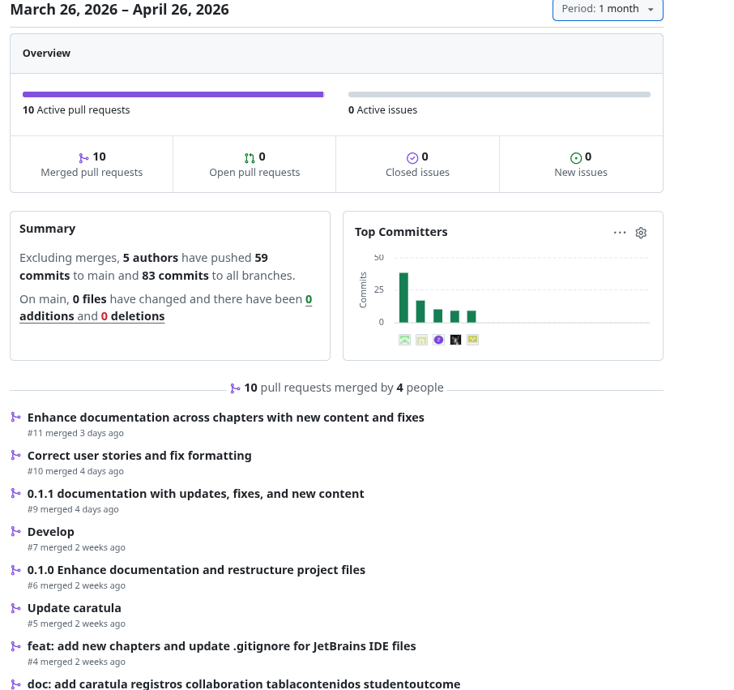
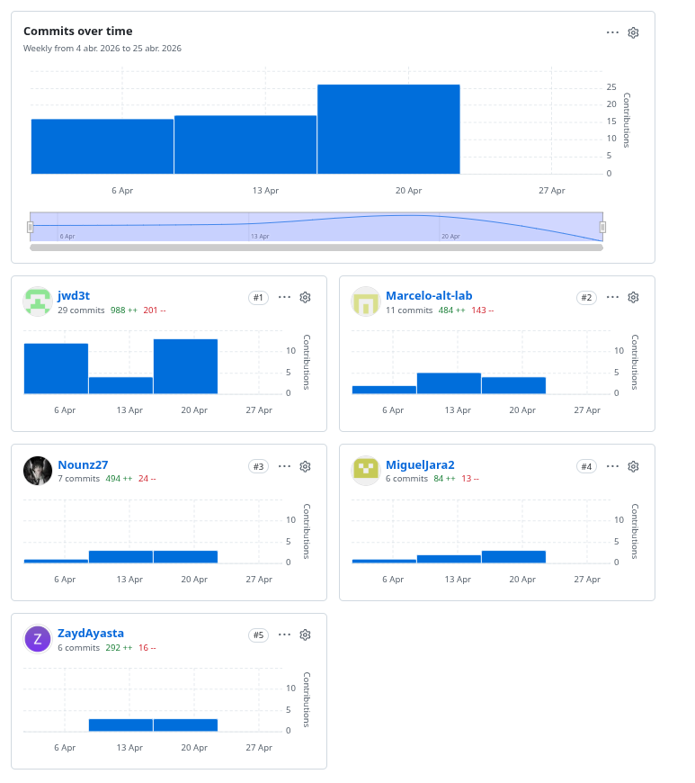

## Insights tb1

Aqui se pueden aprecion todos los commits hechos en la tb1 evidenciando el trabajo colaborativo.
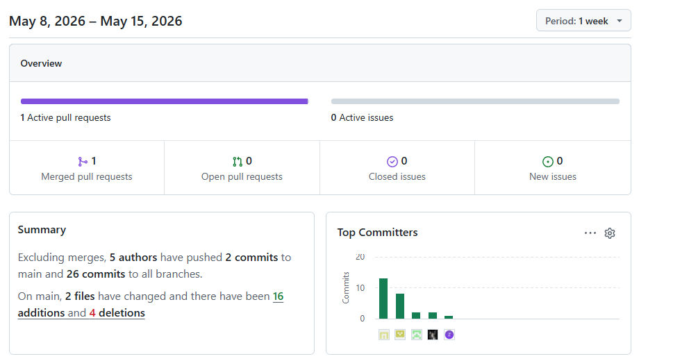
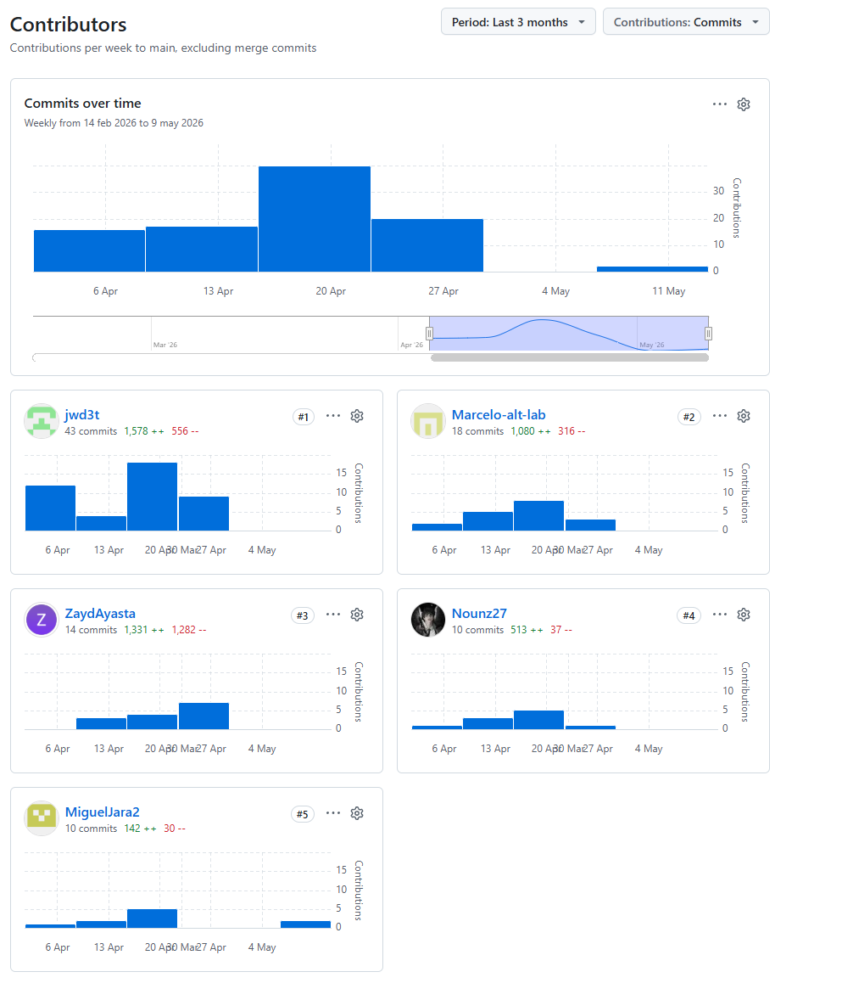

## Insights av2

Aqui se pueden aprecion todos los commits hechos en la av2 evidenciando el trabajo 

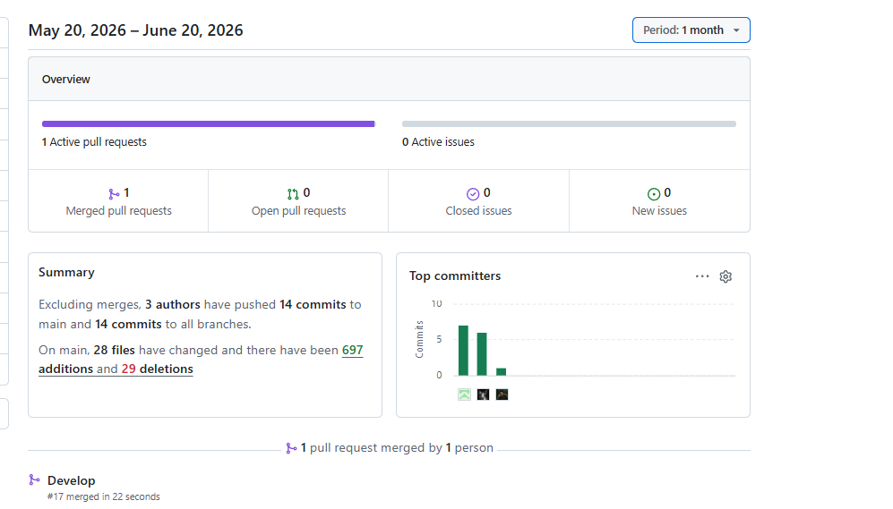

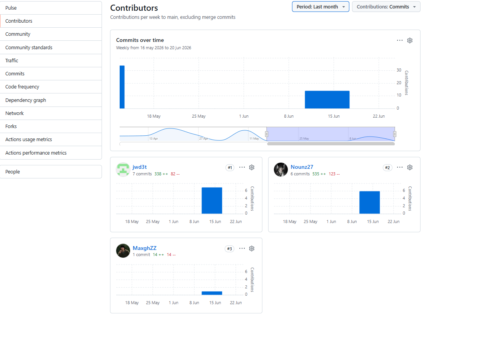

<div style="page-break-before: always;"></div>

# Tabla de Contenidos

- [Caratula](01-caratula.md)
- [Registro de Versiones del Informe](02-registros.md)
- [Project Report Collaboration Insights](03-collaboration.md)
- [Tabla de Contenidos](04-content-table.md)
- [Student Outcome](05-studentoutcome.md)

## Capítulos

- [Capítulo I: Introducción](10-chapter-1.md)
    - [1.1. Startup Profile](10-chapter-1.md#11-startup-profile)
        - [1.1.1. Descripción de la Startup](10-chapter-1.md#111-descripción-de-la-startup)
        - [1.1.2. Perfiles de integrantes del equipo](10-chapter-1.md#112-perfiles-de-integrantes-del-equipo)
    - [1.2. Solution Profile](10-chapter-1.md#12-solution-profile)
        - [1.2.1. Antecedentes y problemática](10-chapter-1.md#121--antecedentes-y-problemática)
        - [1.2.2. Lean UX Process](10-chapter-1.md#122-lean-ux-process)
            - [1.2.2.1. Lean UX Problem Statements](10-chapter-1.md#1221-lean-ux-problem-statements)
            - [1.2.2.2. Lean UX Assumptions](10-chapter-1.md#1222-lean-ux-assumptions)
            - [1.2.2.3. Lean UX Hypothesis Statements](10-chapter-1.md#1223-lean-ux-hypothesis-statements)
            - [1.2.2.4. Lean UX Canvas](10-chapter-1.md#1224-lean-ux-canvas)
    - [1.3. Segmentos Objetivos](10-chapter-1.md#13-segmentos-objetivos)

- [Capítulo II: Requirements Elicitation & Analysis](20-chapter-2.md)
    - [2.1. Competidores](20-chapter-2.md#21-competidores)
        - [2.1.1. Análisis Competitivo](20-chapter-2.md#211-análisis-competitivo)
        - [2.1.2. Estrategias y tácticas frente a competidores](20-chapter-2.md#212-estrategias-y-tácticas-frente-a-competidores)
    - [2.2. Entrevistas](20-chapter-2.md#22-entrevistas)
        - [2.2.1. Diseño de entrevistas](20-chapter-2.md#221-diseño-de-entrevistas)
        - [2.2.2. Registro de entrevistas](20-chapter-2.md#222-registro-de-entrevistas)
        - [2.2.3. Análisis de entrevistas](20-chapter-2.md#223-análisis-de-entrevistas)
    - [2.3. Needfinding](20-chapter-2.md#23-needfinding)
        - [2.3.1. User Personas](20-chapter-2.md#231-user-personas)
        - [2.3.2. User Task Matrix](20-chapter-2.md#232-user-task-matrix)
        - [2.3.3. User Journey Mapping](20-chapter-2.md#233-user-journey-mapping)
        - [2.3.4. Empathy Mapping](20-chapter-2.md#234-empathy-mapping)
    - [2.4. Big Picture EventStorming](20-chapter-2.md#24-big-picture-eventstorming)
    - [2.5. Ubiquitous Language](20-chapter-2.md#25-ubiquitous-language)

- [Capítulo III: Requirements Specification](30-chapter-3.md)
    - [3.1. User Stories](30-chapter-3.md#31-user-stories)
    - [3.2. Impact Mapping](30-chapter-3.md#32-impact-mapping)
    - [3.3. Product Backlog](30-chapter-3.md#33-product-backlog)

- [Capítulo IV: Product Design](40-chapter-4.md)
    - [4.1. Style Guidelines](40-chapter-4.md#41-style-guidelines)
        - [4.1.1. General Style Guidelines](40-chapter-4.md#411-general-style-guidelines)
        - [4.1.2. Web Style Guidelines](40-chapter-4.md#412-web-style-guidelines)
        - [4.1.3. Mobile Style Guidelines](40-chapter-4.md#413-mobile-style-guidelines)
    - [4.2. Information Architecture](40-chapter-4.md#42-information-architecture)
        - [4.2.1. Organization Systems](40-chapter-4.md#421-organization-systems)
        - [4.2.2. Labeling Systems](40-chapter-4.md#422-labeling-systems)
        - [4.2.3. SEO Tags and Meta Tags](40-chapter-4.md#423-seo-tags-and-meta-tags)
        - [4.2.4. Searching Systems](40-chapter-4.md#424-searching-systems)
        - [4.2.5. Navigation Systems](40-chapter-4.md#425-navigation-systems)
    - [4.3. Landing Page UI Design](40-chapter-4.md#43-landing-page-ui-design)
        - [4.3.1. Landing Page Wireframe](40-chapter-4.md#431-landing-page-wireframe)
        - [4.3.2. Landing Page Mock-up](40-chapter-4.md#432-landing-page-mock-up)
    - [4.4. Web Applications UX/UI Design](40-chapter-4.md#44-web-applications-uxui-design)
        - [4.4.1. Web Applications Wireframes](40-chapter-4.md#441-web-applications-wireframes)
        - [4.4.2. Web Applications Wireflow Diagrams](40-chapter-4.md#442-web-applications-wireflow-diagrams)
        - [4.4.3. Web Applications Mock-ups](40-chapter-4.md#443-web-applications-mock-ups)
        - [4.4.4. Web Applications User Flow Diagrams](40-chapter-4.md#444-web-applications-user-flow-diagrams)
    - [4.5. Web Applications Prototyping](40-chapter-4.md#45-web-applications-prototyping)
    - [4.6. Domain-Driven Software Architecture](40-chapter-4.md#46-domain-driven-software-architecture)
        - [4.6.1. Design-Level EventStorming](40-chapter-4.md#461-design-level-eventstorming)
        - [4.6.2. Software Architecture Context Diagram](40-chapter-4.md#462-software-architecture-context-diagram)
        - [4.6.3. Software Architecture Container Diagrams](40-chapter-4.md#463-software-architecture-container-diagrams)
        - [4.6.4. Software Architecture Components Diagrams](40-chapter-4.md#464-software-architecture-components-diagrams)
    - [4.7. Software Object-Oriented Design](40-chapter-4.md#47-software-object-oriented-design)
        - [4.7.1. Class Diagrams](40-chapter-4.md#471-class-diagrams)
    - [4.8. Database Design](40-chapter-4.md#48-database-design)
        - [4.8.1. Database Diagrams](40-chapter-4.md#481-database-diagrams)

- [Capítulo V: Product Implementation, Validation & Deployment](50-chapter-5.md)
    - [5.1. Software Configuration Management](50-chapter-5.md#51-software-configuration-management)
        - [5.1.1. Software Development Environment Configuration](50-chapter-5.md#511-software-development-environment-configuration)
        - [5.1.2. Source Code Management](50-chapter-5.md#512-source-code-management)
        - [5.1.3. Source Code Style Guide & Conventions](50-chapter-5.md#513-source-code-style-guide--conventions)
        - [5.1.4. Software Deployment Configuration](50-chapter-5.md#514-software-deployment-configuration)
    - [5.2. Landing Page, Services & Applications Implementation](50-chapter-5.md#52-landing-page-services--applications-implementation)
        - [5.2.1. Sprint 1](50-chapter-5.md#521-sprint-1)
            - [5.2.1.1. Sprint Planning 1](50-chapter-5.md#5211-sprint-planning-1)
            - [5.2.1.2. Aspect Leaders and Collaborators](50-chapter-5.md#5212-aspect-leaders-and-collaborators)
            - [5.2.1.3. Sprint Backlog 1](50-chapter-5.md#5213-sprint-backlog-1)
            - [5.2.1.4. Development Evidence for Sprint Review](50-chapter-5.md#5214-development-evidence-for-sprint-review)
            - [5.2.1.5. Execution Evidence for Sprint Review](50-chapter-5.md#5215-execution-evidence-for-sprint-review)
            - [5.2.1.6. Services Documentation Evidence for Sprint Review](50-chapter-5.md#5216-services-documentation-evidence-for-sprint-review)
            - [5.2.1.7. Software Deployment Evidence for Sprint Review](50-chapter-5.md#5217-software-deployment-evidence-for-sprint-review)
            - [5.2.1.8. Team Collaboration Insights during Sprint](50-chapter-5.md#5218-team-collaboration-insights-during-sprint)

- [Bibliografía](99-bibliography.md)


<div style="page-break-before: always;"></div>

# Student Outcome 5

| Criterio específico | Acciones realizadas              | Conclusiones |
| ----- | ------------------ | -------- |
| Trabaja en equipo para proporcionar liderazgo en forma conjunta | **Wang Chen Juan Sung Jau**<br>**TB1:** Asumió el liderazgo técnico en el desarrollo del **Supplier Management Bounded Context Frontend** y del **Shared Bounded Context**, además de encargarse del deployment. Su aporte permitió integrar funcionalidades transversales y asegurar que la solución pudiera ser desplegada correctamente.<br>**AV2:** Continuó participando activamente en el trabajo colaborativo del equipo durante el desarrollo del backend del proyecto, asumiendo la implementación del módulo de **Suppliers**. Su aporte permitió fortalecer la gestión de proveedores dentro de la solución y contribuir al avance coordinado del producto.<br><br>**Ayasta Martel Zayd Jaffar**<br>**TB1:** Lideró la implementación del **Supply and Purchasing Bounded Context**, colaboró en componentes compartidos y apoyó activamente en la documentación del entregable. Su trabajo ayudó a mantener alineados el desarrollo funcional y la evidencia escrita del proyecto.<br>**AV2:** Continuó trabajando de manera colaborativa con el equipo durante el desarrollo del backend del proyecto, liderando la implementación del módulo de **Purchasing**. Su participación permitió consolidar la lógica de compras de la plataforma y mantener el cumplimiento de los objetivos planteados.<br><br>**Sanchez Espinoza Mathias Enrique**<br>**TB1:** Lideró el desarrollo del **Restaurant Management Bounded Context** y asumió la responsabilidad de integrar los avances del equipo hacia la rama `develop`, además de participar en deployment. Su rol fue clave para consolidar técnicamente los aportes individuales en una sola versión funcional del producto.<br>**AV2:** Continuó contribuyendo activamente al trabajo conjunto del equipo durante el desarrollo del backend del proyecto, asumiendo la implementación de los módulos de **Operations** e **Inventory**. Su aporte fortaleció la gestión operativa y de inventario de la plataforma, permitiendo mantener la integración entre los distintos componentes del sistema.<br><br>**Cuadros Villanueva Marcelo Fabio**<br>**TB1:** Encabezó el desarrollo del módulo de **IoT Monitoring**, colaboró en funcionalidades compartidas y en el módulo de **IAM**, además de realizar correcciones de documentación. Su participación fortaleció tanto la parte técnica como la consistencia del entregable final.<br>**AV2:** Continuó participando de manera colaborativa en el equipo durante el desarrollo del backend del proyecto, implementando los módulos de **IoT** y **Analytics**. Su contribución permitió ampliar las capacidades tecnológicas de la solución mediante la integración de funcionalidades de monitoreo y análisis de información.<br><br>**Jara Espinoza Miguel Angel**<br>**TB1:** Lideró la implementación del **Inventory Management Bounded Context**, participó en la ejecución del **Sprint 2** y realizó la corrección del artefacto de **Lean UX**. Su aporte combinó desarrollo funcional con mejora de la base metodológica del proyecto.<br><br>**Cayanchi Avila Milenko Rubén**<br>**AV2:** Se incorporó al equipo y participó activamente en el trabajo colaborativo durante el desarrollo del backend del proyecto, asumiendo la implementación del módulo de **Profiles**. Su aporte permitió complementar la gestión de perfiles dentro de la plataforma y fortalecer el avance conjunto del equipo. | **TB1:** Durante el desarrollo de TB1, el equipo Aurora evidenció liderazgo distribuido y trabajo coordinado. Cada integrante asumió la responsabilidad principal de un bounded context o de un componente transversal, lo que permitió avanzar en paralelo sin perder integración. La colaboración entre frontend, shared modules, deployment y documentación hizo posible que el producto SupplyWok evolucionara como una solución consistente y funcional.<br><br>**AV2:** En AV2, el equipo continuó demostrando liderazgo compartido mediante una distribución equilibrada de responsabilidades en los distintos módulos del sistema backend. La incorporación de un nuevo integrante y la asignación clara de funciones permitieron mantener una dinámica colaborativa orientada al cumplimiento de los objetivos del proyecto. |
| Crea un entorno colaborativo e inclusivo, establece metas, planifica tareas y cumple objetivos | **Wang Chen Juan Sung Jau**<br>**TB1:** Cumplió oportunamente con las tareas asignadas en frontend de proveedores, shared y deployment, contribuyendo a que el equipo mantuviera continuidad técnica y capacidad de entrega. Su desempeño apoyó la coordinación general del trabajo durante el sprint.<br>**AV2:** Continuó aportando al entorno colaborativo del equipo mediante la planificación y desarrollo del módulo de **Suppliers** durante el desarrollo del backend del proyecto. Su trabajo se alineó con los objetivos comunes del proyecto, contribuyendo al cumplimiento de las metas establecidas para esta entrega.<br><br>**Ayasta Martel Zayd Jaffar**<br>**TB1:** Cumplió oportunamente con el desarrollo del bounded context de Supply and Purchasing, el soporte a módulos compartidos y la documentación. Esto favoreció un entorno donde el avance funcional y la evidencia del trabajo se mantuvieron sincronizados.<br>**AV2:** Continuó contribuyendo al entorno colaborativo del equipo mediante la planificación y desarrollo del módulo de **Purchasing** durante el desarrollo del backend del proyecto. Su participación permitió avanzar de manera organizada en una parte fundamental del sistema, cumpliendo con los objetivos propuestos para esta etapa.<br><br>**Sanchez Espinoza Mathias Enrique**<br>**TB1:** Cumplió oportunamente con el bounded context de Restaurant Management, la integración de cambios a `develop` y deployment. Su intervención redujo fricciones de integración y permitió que el equipo trabajara sobre una base consolidada.<br>**AV2:** Continuó fortaleciendo el trabajo colaborativo del equipo mediante la planificación e implementación de los módulos de **Operations** e **Inventory** durante el desarrollo del backend del proyecto. Su aporte permitió cumplir con los objetivos planteados para la gestión interna de procesos y recursos del sistema.<br><br>**Cuadros Villanueva Marcelo Fabio**<br>**TB1:** Cumplió oportunamente con las tareas de IoT Monitoring, shared, IAM y correcciones documentarias. Su participación reforzó la calidad del producto y ayudó a mantener claridad entre la implementación y el reporte académico.<br>**AV2:** Continuó contribuyendo al cumplimiento de los objetivos del proyecto mediante la implementación de los módulos de **IoT** y **Analytics** durante el desarrollo del backend del proyecto. Su trabajo permitió ampliar el alcance funcional de la plataforma y reforzar el enfoque tecnológico de la solución.<br><br>**Jara Espinoza Miguel Angel**<br>**TB1:** Cumplió oportunamente con el bounded context de Inventory Management, el seguimiento del Sprint 2 y la corrección del Lean UX. Su trabajo aportó orden metodológico y continuidad funcional al desarrollo del producto.<br><br>**Cayanchi Avila Milenko Rubén**<br>**AV2:** Se integró al equipo de manera colaborativa e inclusiva, participando en la planificación y desarrollo del módulo de **Profiles** durante el desarrollo del backend del proyecto. Su incorporación permitió fortalecer la organización del equipo y avanzar en el cumplimiento de los objetivos establecidos para esta entrega.| **TB1:** El equipo creó un entorno colaborativo efectivo al distribuir responsabilidades claras por bounded context y complementar ese trabajo con integración, deployment y documentación. Todos los integrantes cumplieron a tiempo con sus asignaciones y alcanzaron la máxima calificación en el reporte de desempeño. En conjunto, esto demuestra que el grupo supo establecer metas realistas, coordinar tareas de manera inclusiva y cumplir los objetivos del entregable con alto nivel de compromiso.<br><br>**AV2:** En AV2, el equipo mantuvo un entorno colaborativo e inclusivo, incorporando satisfactoriamente a un nuevo integrante y distribuyendo las tareas de acuerdo con las competencias de cada miembro. Esto permitió cumplir con los objetivos planificados para el desarrollo del backend y consolidar el avance integral del proyecto. |

<div style="page-break-before: always;"></div>

# Capítulo I: Introducción
## 1.1. Startup Profile 
### 1.1.1. Descripción de la Startup 
Somos Aurora, un grupo de estudiantes apasionados por la innovación tecnológica de la Universidad Peruana de Ciencias Aplicadas. Nuestra startup está enfocada en optimizar la gestión operativa y de abastecimiento en restaurantes tipo chifa mediante soluciones tecnológicas inteligentes. Nuestra plataforma conecta a restaurantes y proveedores a través de un sistema centralizado que permite gestionar inventarios, preveenir accidentes, anticipar la demanda y mejorar la coordinación en la cadena de suministro.

- **Misión:** Nuestra misión es mejorar la eficiencia operativa de los restaurantes mediante herramientas tecnológicas que permitan gestionar inventarios, anticipar necesidades de abastecimiento y optimizar la coordinación con proveedores, contribuyendo a una gestión más inteligente y sostenible del negocio gastronómico.

- **Visión:** Convertirnos en una plataforma líder en la digitalización de operaciones para restaurantes en Latinoamérica, facilitando la toma de decisiones basada en datos y fortaleciendo la integración entre restaurantes y proveedores.

- **Valores:**
    - **Eficiencia**: Buscamos optimizar procesos clave para reducir pérdidas y mejorar la operación diaria.
    - **Innovación**: Aplicamos tecnología y análisis de datos para resolver problemas reales del sector gastronómico.
    - **Confiabilidad**: Proporcionamos información precisa y útil para la toma de decisiones.
    - **Escalabilidad**: Diseñamos soluciones adaptables a distintos tamaños de negocio.
    - **Colaboración**: Facilitamos la interacción entre restaurantes y proveedores para mejorar resultados conjuntos.

### 1.1.2. Perfiles de integrantes del equipo 


| Datos                                                                                                           | Descripción                                                                                                                                                                                                                                                                                                                | Foto                                                                                   |
| :-------------------------------------------------------------------------------------------------------------- | :------------------------------------------------------------------------------------------------------------------------------------------------------------------------------------------------------------------------------------------------------------------------------------------------------------------------- | :------------------------------------------------------------------------------------- |
| **Nombre:** Marcelo Fabio Cuadros Villanueva<br>**Carrera:** Ingeniería de Software<br>**Código:** U202422890   | **Descripción breve de sus habilidades:** <br> Soy Marcelo Cuadros, estudiante de Ingeniería de Software en la UPC actualmente cursando mi cuarto ciclo academico. Me considero una persona proactiva, sociable y con gran capacidad de trabajo en equipo; con conocimientos en c++, python, java, html, css y javascript. |       |
| **Nombre:** Zayd Jaffar Ayasta Martel<br>**Carrera:** Ingeniería de Software<br>**Código:** U202410837          | **Descripción breve de sus habilidades:** <br>Soy Zayd Ayasta, estudiante de Ingeniería de Software con conocimientos en C++, SQL, Java y Kotlin. Me caracterizo por ser creativo y adaptable, con interés en la innovación tecnológica y el desarrollo de soluciones que aporten valor real a los usuarios.               |             |
| **Nombre:** Milenko Rubén Cayanchi Avila<br>**Carrera:** Ingeniería de Software<br>**Código:** U202312566       | **Descripción breve de sus habilidades:** <br> Soy Milenko Cayanchi, estudiante de Ingeniería de Software en la UPC actualmente cursando mi quinto ciclo academico. Me considero una persona proactiva, sociable y con gran capacidad de trabajo en equipo; con conocimientos en c++, python.                              |  |
| **Nombre:** Juan Sung Jau Wang Chen <br>**Carrera:** Ingeniería de Software<br>**Código:** U202318609           | **Descripción breve de sus habilidades:**<br> Soy Juan Wang, estudiante de Ingeniería de Software en la UPC. Me considero alguien amigable y sociable, puedo adaptarme sin problemas a cualquier entorno, tengo experiencia en organizacion de equipos y conocimientos de c++, python, html, css y javascript.<br>         |              |
| **Nombre:** Mathias Enrique Sanchez Espinoza <br>**Carrera:** Ingeniería de Software <br>**Código:** U20231C524 | **Descripción breve de sus habilidades:** <br> Soy Mathias Sanchez, estudiante de Ingeniería de Software en la UPC. Poseo conocimientos en C++, SQL y HTML.                                                                                                                                                                |     |

<sub>*Tabla 1. Perfiles de integrantes de equipo*</sub>

## 1.2. Solution Profile 
### 1.2.1.  Antecedentes y problemática
Los restaurantes tipo chifa enfrentan dificultades en la gestión eficiente de sus inventarios y en la planificación de abastecimiento debido a la falta de herramientas tecnológicas que integren información operativa en tiempo real. Esta situación genera pérdidas económicas por sobrestock o desabastecimiento, decisiones basadas en estimaciones imprecisas y una coordinación ineficiente con proveedores. Asimismo, los proveedores carecen de visibilidad sobre la demanda real de sus clientes, lo que dificulta la planificación de producción y distribución. Existe la necesidad de una solución que permita centralizar la gestión de inventarios, analizar datos operativos y facilitar la coordinación entre restaurantes y proveedores, mejorando así la eficiencia y reduciendo la incertidumbre en la toma de decisiones.

<h4>5W + 2H</h4>

- **¿Qué ocurre? (WHAT)**
    Los restaurantes tipo chifa y sus proveedores enfrentan limitaciones en la gestión integrada de sus procesos operativos y de abastecimiento. Esto se refleja en problemas como control deficiente de inventarios, poca visibilidad del estado de mesas y comandas, riesgos en cocina, pérdidas por almacenamiento inadecuado y dificultad para anticipar la demanda. Según INACAL (2023)[^1], los restaurantes deben asegurar controles de recepción, inocuidad, seguridad e infraestructura, pero muchos procesos siguen ejecutándose de forma manual o fragmentada. Además, la digitalización de la cadena de suministro alimentaria todavía presenta brechas de coordinación e intercambio de información entre actores, lo que limita la eficiencia y la reducción de desperdicios (Annosi et al., 2021)[^2].

- **¿Quiénes se ven afectados? (WHO)**
    El problema afecta principalmente a los dueños y administradores de restaurantes chifa, quienes deben controlar cocina, salón, almacén y compras con recursos limitados. También impacta a los proveedores de insumos, ya que la falta de información oportuna sobre consumo, rotación y demanda reduce la precisión del abastecimiento y dificulta la planificación conjunta (Annosi et al., 2021)[^2]. De manera complementaria, los trabajadores de cocina resultan afectados por la exposición a accidentes y enfermedades laborales en entornos de trabajo intensivos, donde la prevención muchas veces no está soportada por sistemas de monitoreo continuo (Wassif et al., 2024)[^3].

- **¿Dónde ocurre? (WHERE)**
    Este problema se presenta en restaurantes y servicios de alimentación, especialmente en negocios con alta rotación de insumos perecibles y múltiples procesos simultáneos, como los chifas. En el contexto peruano, la problemática resulta relevante por el crecimiento sostenido del rubro restaurantes, donde el INEI (2024)[^4] reporta expansión del sector e incluye explícitamente a los chifas dentro de los negocios con desempeño positivo. Además, las exigencias de calidad e inocuidad planteadas por INACAL (2023)[^1] muestran que el reto no solo está en vender más, sino en operar mejor y con mayor seguridad.

- **¿Cuándo ocurre? (WHEN)**
    El problema es permanente, pero se intensifica en horas pico, campañas comerciales, fines de semana, feriados y temporadas de alta demanda, cuando aumentan simultáneamente los pedidos, la presión sobre cocina, el consumo de insumos y la necesidad de reposición rápida. Tanizaki et al. (2020)[^5] señalan que la gestión del restaurante mejora cuando el pronóstico de demanda incorpora datos internos y externos, precisamente porque la variabilidad del consumo afecta decisiones críticas como compras, personal e inventario.

- **¿Por qué es importante resolverlo? (WHY)**
    Resolver este problema es clave porque impacta directamente en la eficiencia operativa, la seguridad del personal, la calidad del servicio y la relación con los proveedores. La adopción de soluciones digitales e IoT puede fortalecer la trazabilidad, la supervisión de variables críticas como temperatura y almacenamiento, y la respuesta oportuna ante fallas o riesgos operativos (Bouzembrak et al., 2019)[^6]. Además, una mejor coordinación digital en la cadena de suministro permite reducir desperdicios, mejorar el flujo de información y sostener relaciones más eficientes entre restaurantes y proveedores (Annosi et al., 2021)[^2].

- **¿Cómo se manifiesta? (HOW)**
    El problema se evidencia en quiebres o excesos de stock, demora en comandas, poca trazabilidad de insumos, limitada visibilidad de la ocupación de mesas,v fallas en el control del almacén y exposición constante a riesgos en cocina. También se manifiesta en pedidos mal planificados a proveedores y en decisiones reactivas basadas en experiencia más que en datos. Wassif et al. (2024)[^3] muestran que el entorno de cocina puede concentrar altas tasas de lesiones y enfermedades ocupacionales, mientras que Bouzembrak et al. (2019)[^6] destacan que sensores IoT permiten monitorear temperatura, humedad y trazabilidad en procesos alimentarios, justamente para atender estas brechas operativas.

- **¿Cuánto impacta? (HOW MUCH)**
    El impacto es operativo, económico y humano. En términos sectoriales, el INEI (2024)[^4] reportó que la actividad de restaurantes en Perú creció 2,57% en febrero de 2024, reflejando un entorno competitivo donde la eficiencia del servicio y del abastecimiento se vuelve más importante. En el plano ocupacional, Wassif et al. (2024)[^3] encontraron prevalencias de 77,3% en lesiones laborales y 81,3% en enfermedades relacionadas con el trabajo entre personal de cocina estudiado, lo que confirma la relevancia de la prevención. En el plano logístico, Tanizaki et al. (2020)[^5] sostienen que el pronóstico de demanda mejora decisiones de pedidos e inventarios, mientras que Annosi et al. (2021)[^2] destacan que la digitalización favorece la colaboración y la reducción de desperdicios a lo largo de la cadena alimentaria. En conjunto, esto demuestra que la ausencia de una plataforma integrada genera pérdidas por ineficiencia, riesgos para el personal y menor capacidad de coordinación entre restaurante y proveedor.

**Objetivos del proyecto**

- Desarrollar una plataforma web que permita a restaurantes tipo chifa centralizar el control de inventario, pedidos, alertas operativas y seguimiento básico de la demanda.
- Mejorar la coordinación entre restaurantes y proveedores mediante un entorno digital compartido que facilite la generación, visualización y seguimiento de órdenes de compra.
- Reducir decisiones reactivas, pérdidas por desabastecimiento o sobrestock y fallas operativas asociadas a registros manuales o información fragmentada.
- Proporcionar visibilidad operativa suficiente para apoyar decisiones de abastecimiento, control interno y prevención de riesgos en cocina y almacenamiento.

**Restricciones del proyecto**

- La solución debe implementarse como una aplicación web responsiva, accesible desde navegador en entornos de escritorio y móviles.
- El alcance del producto debe centrarse en la gestión operativa y de abastecimiento de restaurantes tipo chifa y su relación con proveedores, sin abarcar procesos contables o logísticos avanzados de alcance empresarial completo.
- La primera versión debe priorizar funcionalidades viables para validación académica y de negocio, como inventario, alertas, pedidos, demanda estimada y monitoreo operativo básico.
- La propuesta debe sostenerse sobre evidencia bibliográfica y validación con usuarios, por lo que los componentes más avanzados del producto quedan condicionados a iteraciones posteriores.


### 1.2.2 Lean UX Process   

#### 1.2.2.1 Lean UX Problem Statement


- Domain: La gestión operativa y de abastecimiento en restaurantes tipo chifa sigue dependiendo en gran medida de controles manuales, registros dispersos y coordinación informal entre restaurantes y proveedores. Esto limita la capacidad de mantener inventarios actualizados, anticipar la demanda y responder oportunamente a eventos críticos dentro de la operación.

- Customer Segments: Los principales segmentos involucrados son los dueños y administradores de restaurantes chifa, quienes necesitan controlar inventario, reducir pérdidas y tomar decisiones rápidas de abastecimiento, y los proveedores de insumos, quienes requieren visibilidad sobre la demanda de sus clientes para planificar mejor sus entregas y distribución.

- Pain Points: Los restaurantes enfrentan quiebres de stock, compras de emergencia, desperdicio de insumos y poca visibilidad del estado real de su operación. Los proveedores, por su parte, trabajan con información incompleta sobre pedidos futuros, lo que dificulta la planificación de abastecimiento y entregas. Además, la falta de monitoreo de condiciones operativas, como la temperatura de almacenamiento o cocina, incrementa el riesgo de pérdidas y fallas en la operación.

- Gap: Las soluciones existentes no resuelven de forma integrada el control de inventario, la generación de alertas, la proyección de demanda, la coordinación digital de pedidos y el monitoreo operativo. Como consecuencia, restaurantes y proveedores siguen tomando decisiones de manera reactiva, tardía y con información fragmentada.

- Vision / Strategy: SupplyWok busca cerrar esta brecha mediante una plataforma web que conecte a restaurantes y proveedores en un mismo entorno digital. La estrategia del producto es centralizar la gestión de inventario, alertas, pedidos, proyecciones de demanda y monitoreo operativo para facilitar decisiones preventivas, mejorar la coordinación y reducir ineficiencias en la cadena de abastecimiento.

- Initial Segment: Inicialmente, el producto se enfocará en dueños y administradores de restaurantes chifa, validando con ellos las funcionalidades esenciales relacionadas con inventario, alertas y generación de pedidos. De forma complementaria, se incorporará un grupo de proveedores clave para validar la visualización de demanda y la coordinación de entregas.


#### 1.2.2.2 Lean UX Assumptions

**Usuarios objetivo**
- Asumimos que los dueños y administradores de restaurantes chifa necesitan una forma más simple y centralizada de controlar inventario, evitar pérdidas y reaccionar a tiempo ante problemas operativos.
- Asumimos que los proveedores de insumos necesitan mayor visibilidad sobre la demanda de sus clientes para planificar pedidos, rutas y entregas con menor incertidumbre.
- Asumimos que ambos segmentos estarán dispuestos a adoptar una plataforma compartida si esta reduce trabajo manual, mejora la coordinación y ofrece beneficios claros en su operación diaria.

**Objetivos de los usuarios**
- Asumimos que los restaurantes valorarán poder registrar inventario, configurar alertas y visualizar su operación en tiempo real desde una sola plataforma.
- Asumimos que los proveedores valorarán contar con información de demanda estimada, estado de pedidos y herramientas para organizar sus entregas.
- Asumimos que ambos segmentos preferirán información clara, actualizada y fácil de interpretar antes que procesos manuales o dispersos.

**Business Outcomes**
- Asumimos que una plataforma que unifique inventario, pedidos, alertas y monitoreo operativo puede mejorar la eficiencia de los restaurantes.
- Asumimos que una mejor coordinación digital entre restaurantes y proveedores puede reducir retrasos, desabastecimientos y compras de emergencia.
- Asumimos que la reducción de desperdicio y de fallas operativas generará valor económico suficiente para que los usuarios perciban utilidad real en el producto.
- Asumimos que un modelo de suscripción con planes diferenciados puede sostener el producto en el tiempo si los usuarios perciben beneficios concretos.

**Solution Assumptions**
- Asumimos que el registro de inventario y las alertas de stock mínimo serán funcionalidades prioritarias para la adopción inicial del producto.
- Asumimos que una proyección básica de demanda será suficiente para ayudar a los restaurantes a anticipar compras en una primera etapa.
- Asumimos que el monitoreo de variables operativas como la temperatura aportará valor al permitir detectar riesgos antes de que afecten la calidad de los insumos.
- Asumimos que la integración de restaurantes y proveedores en una misma plataforma generará una mejor coordinación que el uso de canales informales.

#### 1.2.2.3 Lean UX Hypothesis Statements
- Creemos que la reducción de desabastecimientos y la mejora del control operativo se logrará si los dueños y administradores de restaurantes chifa obtienen visibilidad centralizada de sus insumos con la funcionalidad de registro de inventario.
- Creemos que la disminución de compras de emergencia y quiebres de stock se logrará si los dueños y administradores de restaurantes chifa obtienen alertas oportunas sobre niveles críticos de insumos con la funcionalidad de alertas de stock mínimo.
- Creemos que una toma de decisiones más rápida y mejor informada se logrará si los dueños y administradores de restaurantes chifa obtienen una vista clara del estado de sus insumos con la funcionalidad de dashboard de inventario.
- Creemos que una mejor planificación de compras y abastecimiento se logrará si los dueños y administradores de restaurantes chifa obtienen una estimación anticipada de consumo con la funcionalidad de proyección básica de demanda.
- Creemos que una coordinación más eficiente con proveedores se logrará si los dueños y administradores de restaurantes chifa obtienen un proceso más simple para solicitar abastecimiento con la funcionalidad de generación de órdenes de compra.
- Creemos que una mejor coordinación operativa entre restaurantes y proveedores se logrará si los dueños y administradores de restaurantes chifa obtienen visibilidad del estado de sus pedidos con la funcionalidad de seguimiento de órdenes de compra.
- Creemos que una relación de abastecimiento más ordenada y eficiente se logrará si los dueños y administradores de restaurantes chifa obtienen un directorio centralizado de sus proveedores con la funcionalidad de gestión de proveedores vinculados.
- Creemos que una mejor planificación de entregas y distribución se logrará si los proveedores de insumos obtienen mayor visibilidad de las necesidades futuras de sus clientes con la funcionalidad de visualización de demanda estimada.
- Creemos que una mejor coordinación comercial y menor fricción al generar pedidos se logrará si los proveedores de insumos obtienen una forma clara de mostrar precios, unidades y disponibilidad con la funcionalidad de gestión de catálogo de productos.
- Creemos que la reducción del riesgo operativo y de pérdidas de insumos se logrará si los dueños y administradores de restaurantes chifa obtienen alertas sobre condiciones críticas del entorno con la funcionalidad de monitoreo de temperatura.
- Creemos que una respuesta más rápida ante eventos críticos se logrará si los dueños y administradores de restaurantes chifa obtienen notificaciones visibles y accionables con la funcionalidad de alertas operativas.

#### 1.2.2.4 Lean UX Canvas

# Lean UX Canvas

| 1. Business Problem                                                                                                                                                                                                                                                                                                                                                                                                                                                                                                                                                           | 5. Solution Ideas                                                                                                                                                                                                                                                                                                                             | 2. Business Outcomes                                                                                                                                                                                                                                                                                                                     |
| ----------------------------------------------------------------------------------------------------------------------------------------------------------------------------------------------------------------------------------------------------------------------------------------------------------------------------------------------------------------------------------------------------------------------------------------------------------------------------------------------------------------------------------------------------------------------------- | --------------------------------------------------------------------------------------------------------------------------------------------------------------------------------------------------------------------------------------------------------------------------------------------------------------------------------------------- | ---------------------------------------------------------------------------------------------------------------------------------------------------------------------------------------------------------------------------------------------------------------------------------------------------------------------------------------- |
| - Los restaurantes tipo chifa gestionan inventarios y abastecimiento con procesos poco integrados.<br>- Los proveedores no tienen suficiente visibilidad sobre la demanda futura de sus clientes.<br>- La operación manual incrementa el riesgo de desperdicio, desabastecimiento y retrasos en entregas.<br>- Existe una oportunidad de digitalizar la gestión operativa con una solución escalable y basada en suscripción.                                                                                                                                                 | - Aplicación web con acceso diferenciado para restaurantes y proveedores.<br>- Registro centralizado de inventario para restaurantes.<br>- Dashboard de inventario con alertas de stock mínimo.<br>- Módulo de proyección básica de demanda para anticipar compras.<br>- Vista de demanda estimada y estado de pedidos para proveedores.<br>- Monitoreo de temperatura y alertas operativas para reducir riesgos en cocina y almacenamiento.      | - Reducir pérdidas por sobrestock y desabastecimiento.<br>- Mejorar la coordinación entre restaurantes y proveedores.<br>- Incrementar la eficiencia operativa en cocina, almacén y abastecimiento.<br>- Facilitar decisiones basadas en datos y alertas.<br>- Sostener el producto mediante planes de suscripción Premium y Enterprise. |
| **3. Users**                                                                                                                                                                                                                                                                                                                                                                                                                                                                                                                                                                  | **7. Most Important Learning**                                                                                                                                                                                                                                                                                                                | **4. User Outcomes & Benefits**                                                                                                                                                                                                                                                                                                          |
| - Dueños de restaurantes chifa.<br>- Administradores o encargados de operación.<br>- Proveedores de insumos para restaurantes.                                                                                                                                                                                                                                                                                                                                                                                                                                                | - Validar si restaurantes y proveedores realmente estarían dispuestos a usar una plataforma compartida para inventario, demanda y pedidos.<br>- Identificar qué funcionalidades entregan más valor al inicio para cada segmento.<br>- Confirmar si la proyección de demanda y las alertas operativas son entendidas como útiles y confiables. | - Controlar inventario de manera centralizada.<br>- Recibir alertas de stock bajo y temperatura fuera de rango.<br>- Visualizar una proyección básica de demanda.<br>- Crear y seguir pedidos de abastecimiento.<br>- Consultar información útil para coordinar entregas y planificación.                                                |
| **6. Hypotheses**                                                                                                                                                                                                                                                                                                                                                                                                                                                                                                                                                             |                                                                                                                                                                                                                                                                                                                                               | **8. Least Effort to Learn**                                                                                                                                                                                                                                                                                                             |
| - Creemos que la reducción de desabastecimientos se logrará si los restaurantes obtienen mejor control de sus insumos con el registro de inventario.<br>- Creemos que la disminución de compras de emergencia se logrará si los restaurantes obtienen alertas oportunas con las alertas de stock mínimo.<br>- Creemos que una mejor planificación de compras se logrará si los restaurantes obtienen una estimación anticipada de consumo con la proyección de demanda.<br>- Creemos que una mejor coordinación de abastecimiento se logrará si restaurantes y proveedores obtienen visibilidad del proceso con la generación y seguimiento de órdenes de compra.<br>- Creemos que una mejor planificación de entregas se logrará si los proveedores obtienen visibilidad de necesidades futuras con la visualización de demanda estimada.<br>- Creemos que la reducción del riesgo operativo se logrará si los restaurantes obtienen alertas de condiciones críticas con el monitoreo de temperatura. |                                                                                                                                                                                                                                                                                                                                               | - Construir un prototipo navegable de baja fidelidad con login, dashboard de inventario, alertas, pedidos y vista de demanda.<br>- Probarlo con entrevistas a dueños de chifas y proveedores para validar interés, utilidad y claridad de uso.                                                                                           |

<sub>*Tabla 2. Lean UX Canvas*</sub>


## 1.3 Segmentos Objetivo

Con la investigación y el enfoque del producto, se identificaron 2 segmentos objetivos principales:

**- Segmento 1: Dueños de restaurantes chifa y administradores**

**Descripción:** Usuarios responsables de la operación diaria del restaurante, la compra de insumos, el control de stock y la supervisión de procesos internos. En su mayoría representan pequeños negocios gastronómicos urbanos o locales con operación intensiva, donde una misma persona concentra decisiones de compras, almacenamiento y coordinación del servicio. Su motivación principal es reducir pérdidas, mejorar la planificación y tener mayor control sobre la operación.

**Características generales:**
- **Ubicación:** Restaurantes urbanos y zonas con alta concentración de oferta gastronómica.
- **Rol:** Dueños, administradores o encargados de operación.
- **Perfil del negocio:** Pequeños o medianos restaurantes con alta rotación de insumos perecibles y necesidad de control diario.
- **Necesidad principal:** Control de inventario, alertas, proyección de demanda y coordinación de pedidos.
- **Nivel tecnológico:** Uso frecuente de sistemas web o móviles para gestión básica del negocio.

**Información de sustento:**
- El sector restaurantes mantiene actividad y competencia sostenida en el contexto peruano; el INEI (2024)[^4] reportó crecimiento de 2,57% y menciona expresamente a los chifas dentro de las actividades con desempeño positivo, lo que refuerza la relevancia de digitalizar su operación.
- Tanizaki et al. (2020)[^5] muestran que el pronóstico de demanda en restaurantes mejora decisiones sobre compras, inventario y operación, por lo que este segmento sí enfrenta un problema real y recurrente de planificación.
- Bouzembrak et al. (2019)[^6] sostienen que los enfoques basados en IoT mejoran monitoreo, trazabilidad y control de variables críticas en entornos alimentarios, algo directamente alineado con las necesidades operativas de este segmento.

**- Segmento 2: Proveedores de insumos para restaurantes**

**Descripción:** Usuarios que abastecen a uno o varios restaurantes y necesitan anticipar pedidos, organizar entregas y mantener una relación más eficiente con sus clientes. Corresponden a proveedores o distribuidores que operan relaciones B2B recurrentes y dependen de una mejor visibilidad de la demanda para planificar reposición, rutas y tiempos de entrega. Su motivación principal es planificar mejor su distribución y contar con información útil para sus rutas y abastecimiento.

**Características generales:**
- **Ubicación:** Empresas o negocios de distribución de insumos alimentarios.
- **Rol:** Proveedores, distribuidores o encargados comerciales.
- **Perfil de operación:** Atención recurrente a varios clientes gastronómicos con necesidad de coordinar pedidos y entregas con baja incertidumbre.
- **Necesidad principal:** Visibilidad de demanda, seguimiento de pedidos y planificación de entregas.
- **Nivel tecnológico:** Uso de plataformas digitales para pedidos, coordinación y seguimiento.

**Información de sustento:**
- Annosi et al. (2021)[^1] identifican que la digitalización en cadenas de suministro alimentarias mejora la colaboración, el intercambio de información y la reducción de desperdicios, lo cual justifica incluir a los proveedores como segmento clave y no solo como actor secundario.
- La misma evidencia muestra que las barreras de coordinación e intercambio de información entre actores de la cadena alimentaria siguen siendo relevantes, por lo que un proveedor con visibilidad parcial de la demanda sí constituye un usuario directamente afectado por el problema.
- Tanizaki et al. (2020)[^5] respaldan que una mejor anticipación de la demanda mejora decisiones de abastecimiento; trasladado al proveedor, esto se traduce en mejor planificación de oferta, rutas y tiempos de respuesta.


[^1]: Annosi, M. C., Brunetta, F., Bimbo, F., & Kostoula, M. (2021). Digitalization within food supply chains to prevent food waste: Drivers, barriers and collaboration practices. *Industrial Marketing Management, 93*, 208–220. https://doi.org/10.1016/j.indmarman.2021.01.005

[^2]: Bouzembrak, Y., Klüche, M., Gavai, A., & Marvin, H. J. P. (2019). Internet of things in food safety: Literature review and a bibliometric analysis. *Trends in Food Science & Technology, 94*, 54–64. https://doi.org/10.1016/j.tifs.2019.11.002

[^3]: Instituto Nacional de Calidad (INACAL). (2023). *Turismo: Inacal promueve la calidad en servicios de restaurantes*. https://www.gob.pe/institucion/inacal/noticias/809133-turismo-inacal-promueve-la-calidad-en-servicios-de-restaurantes

[^4]: Instituto Nacional de Estadística e Informática (INEI). (2024). *Actividad de restaurantes aumentó en 2,57% en febrero de 2024*. https://m.inei.gob.pe/prensa/noticias/actividad-de-restaurantes-aumento-en-257-en-febrero-de-2024-15121/

[^5]: Tanizaki, T., Hoshino, T., Shimmura, T., & Takenaka, T. (2020). Restaurant store management based on demand forecasting. *Procedia CIRP, 88*, 580–583. https://doi.org/10.1016/j.procir.2020.05.101

[^6]: Wassif, G. O., Abdelsalam, A., Eldin, W. S., Abdel-Hamid, M. A., & Damaty, S. I. (2024). Work-related injuries and illnesses among kitchen workers at two major students’ hostels. *Journal of the Egyptian Public Health Association, 99*, Article 16. https://doi.org/10.1186/s42506-024-00163-x

# Capítulo II: Requirements Elicitation & Analysis.

## 2.1. Competidores

En esta sección se realizará un análisis competitivo sobre distintas plataformas de gestión de restaurantes y proveedores que se encuentran en el mercado, que cumplan funciones similares a nosotros. De esta manera podremos conocer nuestra posición frente a posibles competidores.

Las siguientes plataformas son de las más relevantes en el mercado de gestión de restaurantes y proveedores, cada una con enfoques y características distintas que las hacen destacar en diferentes aspectos del sector:

**1. Apicbase**

- Es un sistema operativo para la gestión de alimentos y bebidas diseñado específicamente para operaciones multi-unidad, como cadenas de restaurantes y hoteles. Unifica recetas, menús y compras en todos los locales, asegurando consistencia en la calidad y los costos e incluye módulos avanzados para trazabilidad de ingredientes, gestión de alérgenos y cumplimiento de normas HACCP (Apicbase, s.f.)[^1].

**2. MarketMan**

- Plataforma "todo en uno" para el control de inventarios y suministros, ideal para optimizar los flujos de trabajo administrativos (back-of-house). Utiliza análisis predictivos para automatizar pedidos a proveedores y detectar fluctuaciones de precios en tiempo real y calcula el costo exacto de cada plato integrando las facturas de compra con las ventas del punto de venta (TPV) (MarketMan, s.f.)[^2].

**3. WISK.ai**

- App móvil que se destaca por su precisión técnica, ofreciendo una de las soluciones de inventario más rápidas y precisas del mercado gracias al uso intensivo de inteligencia artificial. Su app móvil puede identificar botellas y productos mediante la cámara, agilizando el conteo de existencias, ofrece herramientas muy detalladas para bares y hoteles, permitiendo un seguimiento exacto de mermas en licores y bebidas mezcladas y su IA puede predecir la demanda basándose no solo en ventas pasadas, sino también en factores externos como el clima o eventos locales (WISK.ai, s.f.)[^3].

**4. Restaurant365**

- Plataforma de gestión empresarial integral basada en la nube, diseñada específicamente para el sector de la hospitalidad. Incluye una red contable específica para restaurantes que automatiza facturas, cuentas por pagar y conciliaciones bancarias, permite rastrear ingredientes en tiempo real, gestionar pedidos automáticos a proveedores y analizar el costo teórico frente al real para reducir mermas, utiliza IA para predecir la demanda futura, optimizar los horarios de trabajo y generar informes de pérdidas y ganancias (P&L) en tiempo real y se integra con cientos de sistemas de punto de venta (TPV/POS), bancos y proveedores de alimentos para que los datos fluyan automáticamente sin necesidad de hojas de cálculo manuales (Restaurant365, s.f.)[^4].

### 2.1.1. Análisis Competitivo

**Competitive Analysis Landscape**

*¿Porqué llevar a cabo este análisis?*
El objetivo de este análisis es identificar las fortalezas, debilidades, oportunidades y amenazas del entorno competitivo en el sector de gestión de restaurantes y proveedores, con el fin de definir la ventaja competitiva de SupplyWok frente a las alternativas existentes y orientar las estrategias de diferenciación e innovación.

| Categoría | Subcategoría | SupplyWok <br> | Apicbase <br> | MarketMan <br> | WISK.ai <br> | Restaurant365 <br> |
|---|---|---|---|---|---|---|
| **Perfil** | Overview | Plataforma web que optimiza y agiliza la gestión operativa y de abastecimiento en restaurantes tipo chifa mediante soluciones tecnológicas inteligentes. | Plataforma basada en la nube diseñada para centralizar la gestión de alimentos y bebidas en cadenas de restaurantes y hoteles. | Plataforma basada en la nube especializada en automatizar el inventario y las compras para restaurantes, conectando el almacén directamente con los proveedores. | Plataforma basada en IA que se especializa en la gestión ultraprecisa de inventarios, usando reconocimiento de imágen para agilizar el conteo de existencias mediante el móvil. | Plataforma de gestión empresarial que unifica en un solo sistema la contabilidad, el control de inventarios, las compras y la gestión del personal. |
| **Perfil** | Ventaja competitiva ¿Qué valor ofrece a los clientes? | Plataforma centralizada y escalable que optimiza la cadena de suministro mediante analítica predictiva, garantizando eficiencia operativa, prevención de accidentes y una colaboración inteligente entre restaurantes y proveedores para una gestión sostenible. | Gestión centralizada de recetas y menús para múltiples locales, con enfoque en trazabilidad alimentaria, control de alérgenos y estandarización de la producción a gran escala. | Automatización integral del inventario y compras que utiliza análisis predictivos para sugerir pedidos, detectar variaciones de precios y maximizar la rentabilidad operativa. | Control de inventario ultrapreciso mediante inteligencia artificial y reconocimiento visual, especializado en la reducción de mermas y optimización de costos en bebidas y licores. | Sistema ERP unificado que integra contabilidad financiera, inventarios y gestión de personal, conectando el flujo de caja con la operación diaria en una sola plataforma. |
| **Perfil de Marketing** | Mercado objetivo | Restaurantes de gastronomía peruano-china (chifas), aquellos con una operación moderada a alta complejidad que enfrentan retos críticos en la frescura de insumos y seguridad laboral. | Grupos de hospitalidad, hoteles y empresas de catering. Negocios con múltiples unidades y cocinas centrales que necesitan estandarizar recetas y producción a gran escala. | Restaurantes individuales y pequeñas cadenas enfocados principalmente en gestión de alimentos. | Establecimientos con un alto volumen de bebidas, como bares, clubes nocturnos y restaurantes de alta gama. | Operadores de nivel empresarial y franquicias que requieren una solución contable robusta. |
| **Perfil de Marketing** | Estrategias de marketing | Promocionar el uso de sensores IoT, contenido especializado en seguridad y prevención de riegos en cocina, y co-marketing con proveedores de insumos orientales. | Contenido educativo profundo, usando una biblioteca técnica para profesionales F&B, marketing basado en casos de éxito y enfoque emocional para chefs. | Estrategia de Co-Marketing, colaborando con socios tecnológicos, SEO y guías prácticas y prueba social masiva. | Marketing de comparación con otros competidores, calculadoras de ROI y lead magnets gratuitos. | Webinars de nivel eje ejecutivo, eventos de grandes franquicias y networking y marketing de datos unificados. |
| **Perfil de Producto** | Productos & Servicios | Gestión de inventario, comandas y abastecimiento, monitoreo de seguridad en cocina mediante sensores, analítica predictiva para demanda y alertas de bajo stock. | Gestión de recetas y menús, planificación de producción, módulo de inventario, trazabilidad de alérgenos, ventas y analítica. | Gestión de compras, escaneo de facturas, control de inventario, alertas de precios y libro de cocina digital. | Inventario de bebidas (Bar), base de datos global para licores y vinos, inteligencia de pedidos y análisis de costos. | Contabilidad, gestión de mano de obra, inventario y recetas, reporting empresarial y servicios de nómina. |
| **Perfil de Producto** | Precios & costos | Modelo de Suscripción; Wok: S/ 119.99 al mes por ubicación. Wok Enterprise: Precio personalizado según necesidades y tamaño del cliente. | Modelo de Suscripción; Basic: $265 aprox. al mes por establecimiento | Modelo de Suscripción; Starter: Desde $199 al mes. Crecimiento: Desde $299 al mes. | Modelo de Suscripción; Essentials: Desde $189 al mes. Professional: Desde $249 al mes. Premium: Desde $499 al mes. | Modelo de Suscripción; Essential: Desde $399 o $435 al mes por ubicación. Professional: Aproximadamente $635 al mes. |
| **Perfil de Producto** | Canales y distribución (Web y/o móvil) | Web (Escritorio) y móvil. | Web (Escritorio) y móvil. | Web (Escritorio) y móvil (iOS y Android). | Web (Escritorio) y móvil (iOS y Android). | Web (Escritorio) y móvil (iOS y Android). |
| **Análisis SWOT** | Fortalezas | Diferenciador de seguridad, visión colaborativa y enfoque de sostenibilidad y escalabilidad. | Gestión visual de recetas de altísima calidad y control estricto de alérgenos/HACCP. | Enorme red de proveedores ya integrados y facilidad para escanear facturas. | Tecnología de escaneo de botellas y uso de IA para predecir demanda externa. | Unificación total de contabilidad, nómina y operación en un solo sistema financiero. |
| **Análisis SWOT** | Debilidades | Barrera tecnológica inicial, dependencia de la data del proveedor y recursos de desarrollo. | Curva de aprendizaje elevada y precio alto para restaurantes individuales | Interfaz móvil no tan intuitiva respecto a la competencia | Enfoque limitado a bebidas, la gestión de alimentos no es tan robusta como la de Apicbase. | Implementación extremedamente costosa y lenta, con un enfoque más contable que operativo. |
| **Análisis SWOT** | Oportunidades | Nicho Especializado (Chifas), crecimiento del sector en Latinoamérica y datos para el sector objetivo. | Expansión en el sector hotelero de lujo y grandes canteras de catering. | Integración con sistemas de pago para el proceso directo de compras. | Convertirse en el estándar para auditorías de inventario en bares de alta gama y casinos. | Adquisición de plataformas más pequeñas para dominar el mercado de franquicias. |
| **Análisis SWOT** | Amenazas | Competencia consolidada de grandes empresas, inestabilidad económica en Latinoamérica y resistencia al cambio cultural | Nuevos competidores con interfaces más ágiles y menos burocráticas como SupplyWok. | Pérdida de mercado frente a soluciones especializadas en nichos (como SupplyWok). | Que los sistemas de Punto de Venta (TPV) desarrollen sus propios escáneres nativos. | Software de contabilidad general, como QuickBook, que mejoren sus módulos de restaurante. |

<sub>*Tabla 3. Análisis Competitivo*</sub>

### 2.1.2. Estrategias y tácticas frente a competidores

| **Estrategia / Táctica**                 | **Descripción**                                                                                                                                                     |  
|:-----------------------------------------|:--------------------------------------------------------------------------------------------------------------------------------------------------------------------|
| **Módulo de Seguridad Activa**           | Implementar "Checklists de Seguridad" en cocina obligatorios al abrir/cerrar turnos.                                                                                | 
| **Marketing Segmentado**                 | Diseñar campañas digitales en redes sociales, enfocadas en restaurantes peruano-chino (chifa), destacando el impacto innovador en sus negocios y el costo moderado. | 
| **Coordinación con Proveedores Locales** | Crear un portal simple (no gratuito) para los proveedores locales, facilitando el envío de pedidos mediante canales digitales.                                      | 
| **Pago por Local Escalable**             | Modelo de suscripción "Pay as you grow", ofreciendo precios accesibles para chifas de barrio, pero que escala con funciones avanzadas para cadenas grandes.         |
| **Rotación de Mesas**                    | Uso de sensores para calcular el promedio de ocupación. Si una mesa está libre, el sistema alerta al anfitrión o actualiza la app.                                  |

<sub>*Tabla 4. Estrategias y tácticas frente a competidores*</sub>


## 2.2. Entrevistas

### 2.2.1. Diseño de entrevistas

Para comprender mejor a nuestros usuarios y construir arquetipos representativos, diseñamos preguntas para las entrevistas de los dos segmentos objetivos identificados.

**Segmento 1: Dueños de restaurantes chifa y administradores**

**Objetivo de la entrevista:** Identificar cómo gestionan actualmente su inventario, abastecimiento, control operativo y monitoreo de procesos internos; además de reconocer sus principales frustraciones, necesidades y disposición para adoptar una plataforma digital con servicios IoT que les ayude a mejorar la toma de decisiones.

**Preguntas:**
- ¿Cuál es su nombre, edad y distrito donde se ubica su restaurante?
- ¿Cuál es su cargo o rol dentro del negocio?
- ¿Hace cuánto tiempo administra o trabaja en el restaurante?
- ¿Qué tipo de insumos manejan con mayor frecuencia en su operación?
- ¿Cómo realizan actualmente el control de inventario y el registro de stock?
- ¿Qué dificultades enfrenta al momento de prever la demanda de insumos o platos?
- ¿Con qué frecuencia tiene problemas de sobrestock o desabastecimiento?
- ¿Cómo coordinan actualmente los pedidos con sus proveedores?
- ¿Qué información considera más útil para tomar decisiones sobre abastecimiento?
- ¿Qué tan importante sería para usted recibir alertas automáticas sobre bajo stock?
- ¿Le sería útil visualizar proyecciones de demanda antes de hacer pedidos?
- ¿Qué tan dispuesto estaría a usar una plataforma web para controlar inventario, pedidos y monitoreo operativo?
- ¿Cuál de las siguientes funcionalidades considera más importante en una herramienta de este tipo? (Control de inventario alertas de stock bajo, registro de pedidos a proveedores, proyección de demanda, monitoreo de temperatura)
- ¿Qué le fastidia de la manera actual de gestionar la operación del restaurante?
- ¿Qué tan seguido cree que usaría una plataforma como esta: diario, semanal o solo cuando tenga problemas?

**Preguntas complementarias:**
- ¿Qué herramientas digitales usa actualmente para el negocio?
- ¿Qué redes sociales usa con mayor frecuencia?
- ¿Ha usado sensores o sistemas de monitoreo en su restaurante?
- ¿Qué tan cómodo se siente usando smartphones o aplicaciones móviles?

**Segmento 2: Proveedores de insumos para restaurantes**

**Objetivo de la entrevista:** Comprender cómo gestionan sus entregas, cómo se coordinan con sus clientes y qué información les sería útil para planificar mejor su abastecimiento, rutas y atención comercial a través de una plataforma digital.

**Preguntas:**
- ¿Cuál es su nombre, edad y tipo de negocio?
- ¿Qué productos o insumos distribuye a restaurantes?
- ¿Cuánto tiempo lleva trabajando como proveedor?
- ¿Cómo coordina actualmente los pedidos con sus clientes?
- ¿Qué canales usa para recibir pedidos o solicitudes de abastecimiento?
- ¿Qué dificultades enfrenta al planificar entregas o rutas?
- ¿Qué tan frecuente es que reciba pedidos imprevistos o urgentes?
- ¿Qué información le sería útil para anticipar la demanda de sus clientes?
- ¿Le ayudaría visualizar pedidos pendientes o proyecciones de compra?
- ¿Qué tan importante sería para usted conocer el consumo o stock aproximado de sus clientes?
- ¿Qué funcionalidades considera más valiosas en una plataforma para proveedores?
- ¿Qué le frustra de la forma actual de coordinar entregas y abastecimiento?
- ¿Qué tan dispuesto estaría a usar una plataforma digital para gestionar clientes y pedidos?
- ¿Con qué frecuencia cree que usaría una herramienta como esta?

**Preguntas complementarias:**
- ¿Qué herramientas usa hoy para organizar sus rutas o pedidos?
- ¿Usa algún sistema para seguimiento de entregas?
- ¿Qué datos le gustaría consultar antes de salir a repartir?
- ¿Cómo se podría usar una herramienta digital para mejorar la coordinación con restaurantes?

**Preguntas transversales para ambos segmentos**
- ¿Qué problemas considera más urgentes dentro de la operación actual?
- ¿Qué beneficios esperaría obtener de una plataforma como SupplyWok?
- ¿Qué tan importante sería para usted que la información esté centralizada en un solo lugar?
- ¿Qué tipo de reportes o indicadores le ayudarían más en su trabajo diario?
- ¿Qué tan útil le parecería una solución que combine gestión de inventario, pedidos, alertas y monitoreo operativo?
- ¿Qué preocupaciones tendría al usar una nueva plataforma digital para su negocio?

### 2.2.2. Registro de entrevistas.


#### Segmento #1: Dueños de restaurantes chifa y administradores
- **Entrevista #1**


**Resumen de entrevista:**

Ana Chen, dueña de un chifa en La Perla (Callao) con 22 años de experiencia, gestiona su restaurante basándose principalmente en su experiencia y cálculo mental, especialmente para el manejo de inventario y abastecimiento de insumos como pollo, verduras y otros productos. No utiliza herramientas digitales ni considera necesarias funciones como alertas de stock o predicción de demanda, ya que confía en su conocimiento práctico y en la compra diaria según precios y necesidades. Actualmente realiza pedidos de forma directa (llamadas) y percibe que una plataforma podría complicar su proceso. Sin embargo, muestra cierto interés en herramientas orientadas a atraer más clientes, como una mejor presentación del menú, y solo usaría una solución digital en casos puntuales cuando lo considere necesario.

<br>
<div align="center">

| Detalle                  | Información                                                                                                                                                                                                                                                                                                                                                                                     |
|--------------------------|-------------------------------------------------------------------------------------------------------------------------------------------------------------------------------------------------------------------------------------------------------------------------------------------------------------------------------------------------------------------------------------------------|
| **Entrevistador**        | Juan Sung Jau Wang Chen                                                                                                                                                                                                                                                                                                                                                                         |
| **Entrevistado**         | Ana Chen                                                                                                                                                                                                                                                                                                                                                                                        |
| **Edad**                 | 50 años                                                                                                                                                                                                                                                                                                                                                                                         |
| **Ubicacion**            | La Perla, Callao                                                                                                                                                                                                                                                                                                                                                                                |
| **Duración / Empieza en** | 7:38 minutos / 0:00                                                                                                                                                                                                                                                                                                                                                                             |
| **Enlace**               | [https://tinyurl.com/3vrfn8nn](https://tinyurl.com/3vrfn8nn) |

</div>

<sub>*Tabla 5. Entrevista 1*</sub>

- **Entrevista #2**


**Resumen de entrevista:**

El entrevistado Weiquan Wang, un cocinero y dueño de un chifa en La Perla (Callao) con aproximadamente 20 años de experiencia, gestiona su restaurante de forma muy tradicional, basándose principalmente en la compra directa y la comunicación por teléfono con proveedores. No lleva un control formal de inventario y suele darse cuenta de la falta de insumos cada pocos días, lo que genera problemas recurrentes de abastecimiento. Muestra interés en herramientas digitales, reconoce que sería útil contar con alertas de stock y sistemas que indiquen cuánto comprar, especialmente para evitar faltantes. También considera importante mejorar la rapidez en la entrega de pedidos y estaría dispuesto a usar una plataforma diariamente si esta le ayudara a resolver estos problemas de manera automática y sencilla.

<br>
<div align="center">

| Detalle          | Información                                                                                                                                                                                                                                                                                                                                                                                               |
|------------------|-----------------------------------------------------------------------------------------------------------------------------------------------------------------------------------------------------------------------------------------------------------------------------------------------------------------------------------------------------------------------------------------------------------|
| **Entrevistador** | Juan Sung Jau Wang Chen                                                                                                                                                                                                                                                                                                                                                                                   |
| **Entrevistado**  | Weiquan Wang                                                                                                                                                                                                                                                                                                                                                                                              |
| **Edad**          | 55 años                                                                                                                                                                                                                                                                                                                                                                                                   |
| **Ubicacion**     | La Perla, Callao                                                                                                                                                                                                                                                                                                                                                                                          |
| **Duración / Empieza en**      | 8:46 minutos / 7:39                                                                                                                                                                                                                                                                                                                                                                                       |
| **Enlace**        | [https://tinyurl.com/3vrfn8nn](https://upcedupe-my.sharepoint.com/:v:/g/personal/u202318609_upc_edu_pe/IQCiHWZg6xqsSI1Y7mMb1NweAfJGxL80w4g55N_7TItUyIA?e=uHil6j&nav=eyJyZWZlcnJhbEluZm8iOnsicmVmZXJyYWxBcHAiOiJTdHJlYW1XZWJBcHAiLCJyZWZlcnJhbFZpZXciOiJTaGFyZURpYWxvZy1MaW5rIiwicmVmZXJyYWxBcHBQbGF0Zm9ybSI6IldlYiIsInJlZmVycmFsTW9kZSI6InZpZXcifSwicGxheWJhY2tPcHRpb25zIjp7InN0YXJ0VGltZUluU2Vjb25kcyI6NDU5LjI5fX0%3D) |

</div>

<sub>*Tabla 6. Entrevista 2*</sub>

- **Entrevista #3**


**Resumen de entrevista:**

La entrevistada, Lili (54 años), dueña y encargada de cocina de un chifa con 10 años de experiencia, gestiona su restaurante de manera empírica, sin un control formal de inventario, revisando manualmente y comprando cuando nota que faltan insumos como carne, pollo, verduras y bebidas. Coordina los pedidos principalmente por llamadas y, en ocasiones, debe ir personalmente a adquirir los productos. No percibe grandes dificultades en su operación diaria, aunque reconoce que todo el proceso puede resultar molesto. A diferencia de otros casos, muestra apertura hacia una solución digital: considera importante recibir alertas de stock bajo y ve útil contar con proyecciones de demanda para planificar compras. Estaría dispuesta a usar una plataforma que automatice estas funciones y acepte diversas herramientas (inventario, pedidos, predicción), utilizándola de forma frecuente si le facilita la gestión del negocio.

<br>
<div align="center">

| Detalle          | Información                                                                                                                                                                                                                                                                                                                                                                                                                                                                                                        |
|------------------|--------------------------------------------------------------------------------------------------------------------------------------------------------------------------------------------------------------------------------------------------------------------------------------------------------------------------------------------------------------------------------------------------------------------------------------------------------------------------------------------------------------------|
| **Entrevistador** | Juan Sung Jau Wang Chen                                                                                                                                                                                                                                                                                                                                                                                                                                                                                            |
| **Entrevistado**  | Lily 蔡                                                                                                                                                                                                                                                                                                                                                                                                                                                                                                             |
| **Edad**          | 54 años                                                                                                                                                                                                                                                                                                                                                                                                                                                                                                            |
| **Ubicacion**     | La Perla, Callao                                                                                                                                                                                                                                                                                                                                                                                                                                                                                                   |
| **Duración / Empieza en**      | 12:49 minutos / 16:25                                                                                                                                                                                                                                                                                                                                                                                                                                                                                              |
| **Enlace**        | [https://tinyurl.com/3vrfn8nn](https://upcedupe-my.sharepoint.com/:v:/g/personal/u202318609_upc_edu_pe/IQCiHWZg6xqsSI1Y7mMb1NweAfJGxL80w4g55N_7TItUyIA?e=S8AGC9&nav=eyJyZWZlcnJhbEluZm8iOnsicmVmZXJyYWxBcHAiOiJTdHJlYW1XZWJBcHAiLCJyZWZlcnJhbFZpZXciOiJTaGFyZURpYWxvZy1MaW5rIiwicmVmZXJyYWxBcHBQbGF0Zm9ybSI6IldlYiIsInJlZmVycmFsTW9kZSI6InZpZXcifSwicGxheWJhY2tPcHRpb25zIjp7InN0YXJ0VGltZUluU2Vjb25kcyI6OTg1LjMxfX0%3D) |

</div>

<sub>*Tabla 7. Entrevista 3*</sub>
<!-- Segmento objetivo: Proveedores-->
---
#### Segmento #2: Proveedores de insumos para restaurantes
- **Entrevista #1**


**Resumen de entrevista:**

El entrevistado, Alberto Copa Villa (37 años, La Perla – Callao), es un proveedor de carne y pollo con 7 años de experiencia que gestiona sus pedidos principalmente por WhatsApp. Su trabajo es inmediato y diario, ya que los restaurantes compran para el momento, lo que genera como principal problema que muchos clientes pidan tarde, dificultando la disponibilidad de productos y su organización. No muestra interés en herramientas de predicción de demanda ni en conocer el consumo o stock de sus clientes, ya que considera que el consumo es constante. Sin embargo, sí valora una solución digital simple que le permita visualizar pedidos pendientes y recibir recordatorios o alertas, con el fin de evitar olvidos y mejorar su gestión diaria.
<br>
<div align="center">

| Detalle          | Información                                                                                                                                                                                                                                                                                                                               |
|------------------|-------------------------------------------------------------------------------------------------------------------------------------------------------------------------------------------------------------------------------------------------------------------------------------------------------------------------------------------|
| **Entrevistador** | Juan Sung Jau Wang Chen                                                                                                                                                                                                                                                                                                                   |
| **Entrevistado**  | Alberto Copa Villa                                                                                                                                                                                                                                                                                                                        |
| **Edad**          | 37 años                                                                                                                                                                                                                                                                                                                                   |
| **Ubicacion**     | La Perla, Callao                                                                                                                                                                                                                                                                                                                          |
| **Duración / Empieza en**      | 5:26 minutos / 29:15                                                                                                                                                                                                                                                                                                                      |
| **Enlace**        | [https://tinyurl.com/3vrfn8nn](https://upcedupe-my.sharepoint.com/:v:/g/personal/u202318609_upc_edu_pe/IQCiHWZg6xqsSI1Y7mMb1NweAfJGxL80w4g55N_7TItUyIA?e=2l8g2n&nav=eyJyZWZlcnJhbEluZm8iOnsicmVmZXJyYWxBcHAiOiJTdHJlYW1XZWJBcHAiLCJyZWZlcnJhbFZpZXciOiJTaGFyZURpYWxvZy1MaW5rIiwicmVmZXJyYWxBcHBQbGF0Zm9ybSI6IldlYiIsInJlZmVycmFsTW9kZSI6InZpZXcifSwicGxheWJhY2tPcHRpb25zIjp7InN0YXJ0VGltZUluU2Vjb25kcyI6MTc1NS44fX0%3D) |

</div>

<sub>*Tabla 8. Entrevista 4*</sub>

### 2.2.3 Análisis de entrevistas.

El análisis de las entrevistas realizadas permite identificar patrones claros en los dos segmentos objetivo de SupplyWok: dueños de restaurantes chifa y proveedores. A partir de las entrevistas, se evidencian tanto comportamientos comunes como diferencias en la adopción tecnológica, sustentados en la frecuencia de respuestas observadas.

#### Segmento 1: Dueños de restaurantes chifa y administradores

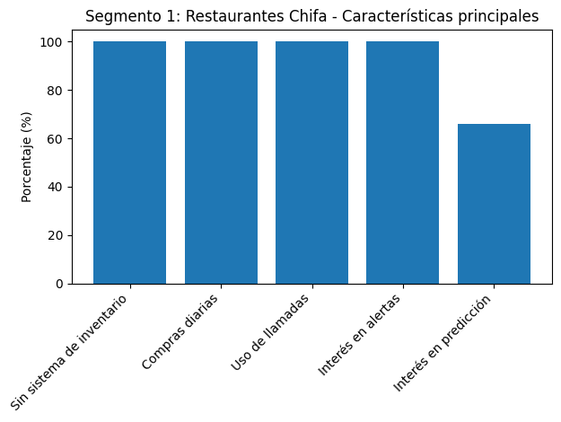

Este segmento agrupa a propietarios con amplia experiencia (entre 10 y 22 años en los casos entrevistados), quienes gestionan sus negocios de manera empírica.

### Gestión del Inventario
El 100% de los entrevistados indicó que no utiliza sistemas formales de inventario, dependiendo de la memoria o revisión visual. Esto genera situaciones donde los insumos se acaban sin planificación previa, obligando a compras reactivas.

### Abastecimiento y compras
El 100% realiza compras diarias o frecuentes, basándose en la demanda inmediata o en variaciones de precios (especialmente en productos como el pollo). No existe planificación a mediano plazo.

### Canales de comunicación
El 100% coordina pedidos mediante llamadas telefónicas, manteniendo procesos tradicionales.

### Percepción de problemas
Aproximadamente el 66% reconoce problemas operativos, como falta de insumos o retrasos en abastecimiento, aunque algunos los consideran parte normal del negocio. El 34% restante percibe su operación como estable, pese a no tener control estructurado.

### Adopción tecnológica
Se identifican dos subgrupos:

- **Resistentes (≈33%)**: consideran innecesarias las herramientas digitales y prefieren métodos tradicionales.
- **Abiertos (≈67%)**: muestran interés en soluciones si estas simplifican su trabajo.

### Funcionalidades de interés
- El 67% valora alertas de stock bajo y herramientas que automaticen el cálculo de compras.  
- Un 66% considera útil la predicción de demanda, especialmente para evitar faltantes.

#### Segmento 2: Proveedores de insumos


Este segmento incluye proveedores con experiencia (ej. 7 años), que operan en entornos de alta inmediatez.

### Gestión de pedidos
El 100% recibe pedidos mediante WhatsApp, lo que genera desorden y dependencia de mensajes informales.

### Problemas principales
El 100% identifica como principal dificultad los pedidos tardíos, lo que afecta la planificación y disponibilidad de productos.

### Planificación de demanda
El 100% indica que no puede anticipar la demanda, debido a que los restaurantes compran para el momento.

### Necesidades tecnológicas
El 100% muestra interés en herramientas simples, especialmente:

- Visualización de pedidos pendientes  
- Recordatorios o alertas  

Sin embargo, el 0% muestra interés en analítica avanzada o predicciones complejas.

#### Conclusiones para el diseño de arquetipos

### Automatización simple y práctica
Dado que el 100% de restaurantes no usa sistemas formales, la plataforma debe automatizar procesos sin requerir esfuerzo adicional del usuario.

### Diferenciación de valor por segmento
- **Restaurantes**: valoran evitar faltantes y facilitar decisiones de compra.  
- **Proveedores**: necesitan orden en los pedidos y anticipación.

### Reducción de fricción
El sistema debe reemplazar llamadas y WhatsApp (usados por el 100%) con una solución igual de rápida, pero estructurada.

### Oportunidad clave
Existe una adopción potencial en el ≈67% de restaurantes, siempre que la solución sea simple, directa y no complique su operación.

## 2.3. Needfinding.

### 2.3.1. User Personas.

- **Segmento objetivo 1: Dueños de restaurantes chifa y administradores**

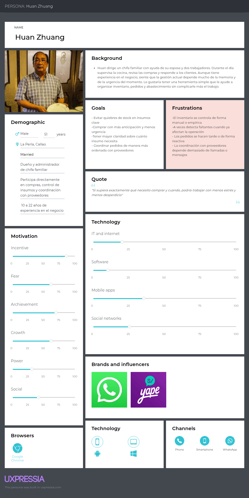

<sub>*Ilustración. User Persona dueños de restaurantes chifa y administradores*</sub>

- **Segmento objetivo 2: Proveedores de insumos para restaurantes**

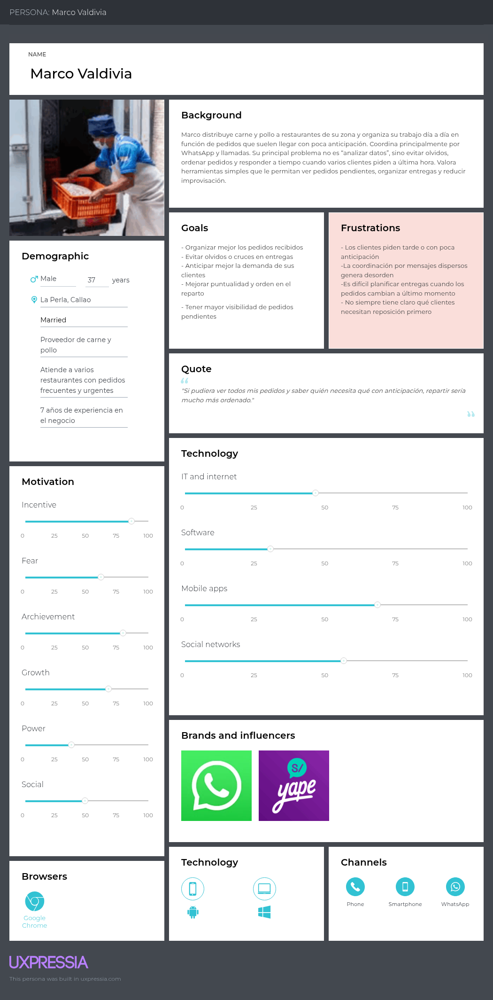

<sub>*Ilustración. User Persona proveedores de insumos para restaurantes*</sub>

### 2.3.2. User Task Matrix.

- **Segmento objetivo 1: Dueños de restaurantes chifa y administradores**

| User Task                                                                  | Frecuencia | Importancia |
|----------------------------------------------------------------------------|------------|-------------|
| Registrar y actualizar el inventario de insumos del restaurante            | Alta       | Alta        |
| Monitorear el stock de productos críticos en almacén                       | Alta       | Alta        |
| Detectar a tiempo cuándo un insumo está por agotarse para prevenir desabastecimiento              | Alta       | Alta        |
| Controlar las comandas y el estado de atención de los pedidos              | Alta       | Alta        |
| Supervisar la demanda estimada de platos e insumos                         | Media      | Alta        |
| Supervisar las condiciones de conservación de insumos  | Alta       | Alta        |
| Identificar posibles riesgos operativos o de seguridad en cocina           | Media      | Alta        |
| Coordinar pedidos de abastecimiento con proveedores                        | Media      | Alta        |
| Consultar el historial de pedidos y consumo de insumos                     | Media      | Media       |
| Revisar el flujo de clientela en mesa para apoyar la proyección de demanda | Alta       | Alta        |
| Tomar decisiones de compra y abastecimiento con base en datos              | Media      | Alta        |
| Mantenerse informado sobre eventos críticos de la operación               | Alta       | Alta        |

<sub>*Tabla 9. User Task para el segmento de dueños de restaurantes chifa*</sub>

- **Segmento objetivo 2: Proveedores de insumos para restaurantes**

| User Task                                                                           | Frecuencia | Importancia |
|-------------------------------------------------------------------------------------|------------|-------------|
| Registrar y gestionar pedidos recibidos de los restaurantes                         | Alta       | Alta        |
| Consultar el estado de los pedidos y su historial                                   | Alta       | Alta        |
| Revisar la demanda proyectada de sus clientes                                       | Media      | Alta        |
| Planificar rutas de entrega según pedidos y ubicaciones                             | Media      | Alta        |
| Coordinar entregas con mayor anticipación y precisión                               | Media      | Alta        |
| Monitorear información relacionada con el almacenamiento de sus clientes            | Media      | Alta        |
| Identificar necesidades de reposición según consumo estimado                        | Media      | Alta        |
| Consultar alertas o cambios relevantes en los pedidos                               | Alta       | Alta        |
| Revisar patrones de compra de los restaurantes atendidos                            | Media      | Media       |
| Organizar su operación logística en función de la demanda prevista                  | Media      | Alta        |
| Mejorar la puntualidad y eficiencia en las entregas                                 | Alta       | Alta        |
| Mantener comunicación más clara con los restaurantes sobre pedidos y abastecimiento | Alta       | Alta        |

<sub>*Tabla 10. User Task para el segmento de proveedores de chifas*</sub>

### 2.3.3. User Journey Mapping.

- **Segmento objetivo 1: Dueños de restaurantes chifa y administradores**

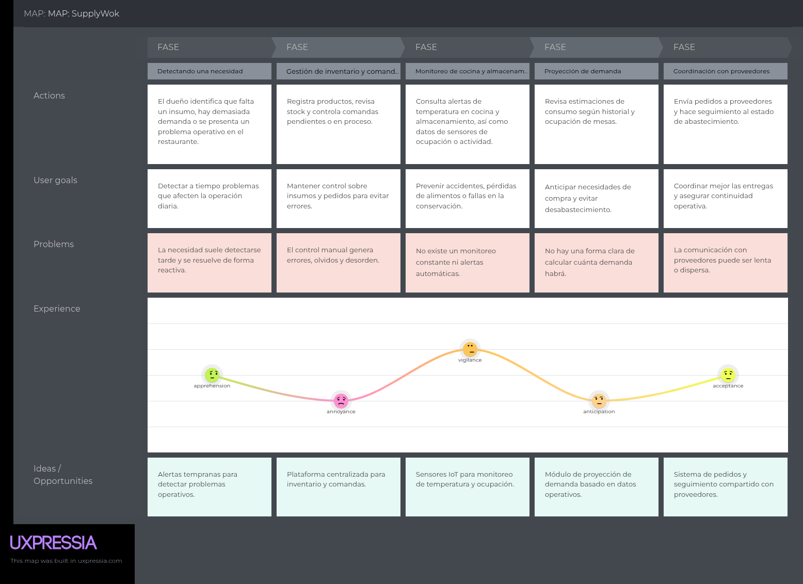

<sub>*Ilustración. User Journey Mapping - Segmento 1*</sub><br></br>

- **Segmento objetivo 2: Proveedores de insumos para restaurantes**


<sub>*Ilustración. User Journey Mapping - Segmento 2*</sub><br></br>

### 2.3.4. Empathy Mapping.

- **Segmento objetivo 1: Dueños de restaurantes chifa y administradores**


<sub>*Ilustración. Empathy Map - Segmento 1*</sub><br></br>

- **Segmento objetivo 2: Proveedores de insumos para restaurantes**


<sub>*Ilustración. Empathy Map - Segmento 2*</sub><br></br>

## 2.4. Big Picture EventStorming.

En esta sección se introduce y resume el proceso colaborativo realizado por el equipo Aurora para el descubrimiento del dominio del negocio. El objetivo primordial de esta actividad fue lograr una comprensión integral del ecosistema de gestión y abastecimiento de los restaurantes tipo chifa, plasmando los eventos significativos y sus interacciones de manera visual.

A través de esta aproximación de alto nivel, el equipo exploró el panorama del negocio, lo cual permitió identificar procesos clave, al mismo tiempo que se expusieron potenciales problemas u oportunidades de mejora operativa. El proceso se desarrolló siguiendo una línea de tiempo narrativa, facilitando la identificación de puntos críticos y la delimitación de las fronteras lógicas de la solución propuesta.


#### Step 1: Unstructured Exploration

En esta fase inicial, todos los miembros del equipo generan eventos de dominio de forma libre, sin preocuparse por el orden ni la coherencia. Cada evento representa una acción relevante en el negocio, escrita en tiempo pasado (ej. "Pedido registrado", "Stock actualizado"). El objetivo es capturar el mayor volumen posible de eventos para construir una visión completa del dominio antes de estructurarlo.

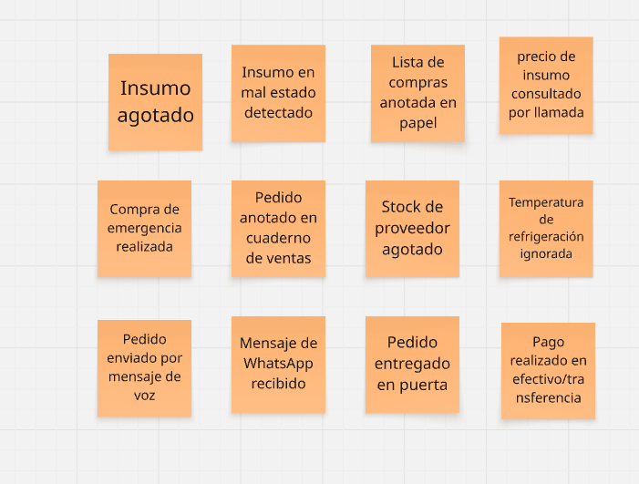

<sub>*Ilustración. Big Picture Event Storming — Step 1: Exploración no estructurada*</sub>

#### Step 2: Structured Organization

Con el conjunto de eventos identificados, el equipo los organiza cronológicamente en una línea de tiempo narrativa. Se eliminan duplicados, se agrupan eventos relacionados y se identifican las relaciones causales entre ellos. Esta vista lineal permite detectar flujos principales del negocio y los primeros límites lógicos entre procesos.

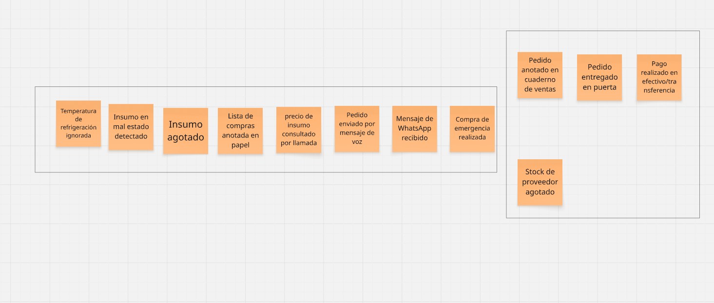

<sub>*Ilustración. Big Picture Event Storming — Step 2: Organización estructurada*</sub>

#### Step 3: Pivotal points

Se identifican los eventos pivote: aquellos que marcan transiciones críticas en el negocio (ej. "Pedido confirmado por proveedor", "Alerta de stock crítico emitida"). Alrededor de estos eventos se trazan las fronteras de los Bounded Contexts, delimitando las responsabilidades de cada subdominio y sirviendo como base para la arquitectura del sistema.


<sub>*Ilustración. Big Picture Event Storming — Step 3: Pivotal points*</sub>

#### Step 4: Pain Points and Opportunities

El equipo marca sobre la línea de tiempo los puntos de fricción, cuellos de botella y oportunidades de mejora detectados. Estos "pain points" suelen concentrarse en transiciones entre actores o en procesos manuales que podrían automatizarse. Esta fase orienta las decisiones de diseño hacia las áreas de mayor impacto operativo.


<sub>*Ilustración. Big Picture Event Storming — Step 4: Pain Points and Opportunities*</sub>

## 2.5. Ubiquitous Language.

El Ubiquitous Language es el lenguaje común compartido entre el equipo técnico, los stakeholders y los usuarios del negocio. Para SupplyWok, hemos identificado y definido los términos clave del dominio de gestión de inventario y abastecimiento en restaurantes chifa, asegurando que todos los involucrados en el proyecto utilicen la misma terminología con el mismo significado.

### Términos Transversales (Aplicables a todo el sistema)

| Término | Definición | Contexto |
|---|---|---|
| **Usuario** | Cualquier persona registrada en la plataforma (dueño de restaurante, administrador, proveedor, personal de cocina o servicio). Cada usuario tiene credenciales y un tipo de cuenta que determina sus permisos. | Sistema general |
| **Cuenta** | El perfil personal del usuario en la plataforma que incluye datos de contacto, preferencias y plan de suscripción. | Autenticación y acceso |
| **Credenciales** | Conjunto de correo electrónico y contraseña que utiliza un usuario para autenticarse en el sistema. | Seguridad |
| **Plan de Suscripción** | Nivel de servicio contratado por un usuario (ej: Premium, Enterprise) que determina el acceso a funcionalidades específicas de la plataforma. | Monetización y acceso |
| **Notificación** | Alerta enviada al usuario sobre un evento importante del sistema (cambio de estado de pedido, alerta de stock bajo, cambio de temperatura, etc.). | Comunicación en tiempo real |
| **Dashboard** | Interfaz personalizada que muestra el resumen e información clave según el tipo de usuario y sus permisos. | Visualización general |

---

### Términos del Epic 01: Gestión de Inventario

| Término | Definición | Contexto |
|---|---|---|
| **Inventario** | Registro centralizado y actualizado de todos los insumos disponibles en un restaurante, incluyendo cantidades, unidades y ubicación. | Gestión de stock |
| **Insumo / Producto** | Cualquier artículo de aprovisionamiento usado en un restaurante chifa (ingredientes, bebidas, condimentos, etc.). Cada insumo tiene un nombre, categoría, unidad de medida y precio unitario. | Catálogo de productos |
| **Stock / Cantidad en Stock** | Número actual de unidades disponibles de un insumo en el inventario. Se actualiza con cada entrada, salida o baja registrada. | Control de cantidad |
| **Stock Mínimo** | Nivel de inventario por debajo del cual se debe reordenar un insumo para evitar quiebres. Es definido por el dueño o administrador del restaurante. | Alertas y reabastecimiento |
| **Stock Crítico** | Condición cuando el stock actual es igual o inferior al stock mínimo configurado, disparando alertas de reabastecimiento. | Alertas |
| **Entrada de Mercadería** | Registro del ingreso de insumos al inventario, acompañado de cantidad, fecha, proveedor de origen y documentación (si aplica). | Movimientos de entrada |
| **Salida de Inventario / Consumo** | Registro de insumos que salen del inventario para ser utilizados en la operación diaria del restaurante. Se registra cantidad, fecha y motivo (consumo diario, merma, etc.). | Movimientos de salida |
| **Baja de Insumo** | Registro formal de insumos que se retiran permanentemente del inventario, con indicación del motivo (vencimiento, daño, obsolescencia). Afecta el stock disponible. | Control de pérdidas |
| **Historial de Movimientos** | Log detallado de todas las transacciones de inventario (entradas, salidas, bajas) con fechas, cantidades, motivos y usuario que registró. | Trazabilidad y auditoría |
| **Clasificación de Inventario** | Categorización del estado de un insumo según su stock actual: Normal (stock superior al mínimo), Crítico (stock en o bajo mínimo), Exceso (stock muy por encima del promedio de consumo). | Visualización y alertas |
| **Reporte de Inventario** | Documento exportable (PDF/CSV) que muestra el estado actual del inventario, útil para auditorías, análisis o uso externo. | Exportación y documentación |

---

### Términos del Epic 02: Abastecimiento y Órdenes de Compra

| Término | Definición | Contexto |
|---|---|---|
| **Proveedor / Supplier** | Persona jurídica o natural que suministra insumos a un restaurante. Cada proveedor tiene perfil en la plataforma con datos de contacto, categorías de productos, zonas de cobertura y condiciones de entrega. | Red de abastecimiento |
| **Orden de Compra / Pedido** | Solicitud formal y digital generada por un restaurante a un proveedor, especificando insumos, cantidades y fecha de entrega requerida. Es el documento central de la transacción de abastecimiento. | Abastecimiento |
| **Estado de Orden** | Situación actual de una orden de compra en su ciclo de vida: Pendiente (creada, sin confirmar), Confirmada (proveedor acepta), En Preparación, Despachada, Entregada, Cancelada. | Seguimiento de pedidos |
| **Demanda Proyectada / Pronóstico de Consumo** | Estimación matemática del consumo futuro de un insumo basada en el historial de consumo registrado, utilizando análisis de tendencias. Ayuda a anticipar pedidos. | Planificación |
| **Historial de Órdenes** | Registro completo de todas las órdenes de compra realizadas por un restaurante, incluyendo insumos, cantidades, proveedores, fechas y resultados. | Análisis y patrones |
| **Confirmación de Entrega** | Acto formal donde el proveedor marca una orden como "Entregada", registrando fecha, hora, observaciones y evidencia de que los insumos llegaron al restaurante. | Cierre de transacción |
| **Reabastecimiento** | Proceso de solicitar nuevamente un insumo cuya disponibilidad en el restaurante se ha agotado o está por agotarse. | Acción operativa |

---

### Términos del Epic 03: Monitoreo Operativo y Alertas IoT

| Término | Definición | Contexto |
|---|---|---|
| **Sensor IoT** | Dispositivo electrónico conectado a la plataforma que mide parámetros físicos en tiempo real (temperatura, humedad). Envía lecturas continuas al sistema. | Hardware e integración |
| **Lectura del Sensor / Medición** | Valor numérico capturado por un sensor en un momento específico (ej: 18.5°C a las 14:30). Se registra con timestamp exacto. | Data en tiempo real |
| **Rango Seguro / Rango Configurado** | Intervalo de valores mínimo y máximo aceptables para un parámetro (ej: 15°C a 20°C para temperatura de almacén). Definido por el administrador según normas de calidad y salubridad. | Configuración crítica |
| **Condición de Riesgo / Out of Range** | Situación cuando una lectura del sensor cae fuera del rango seguro configurado, generando una alerta inmediata. | Evento crítico |
| **Alerta de Riesgo** | Notificación generada automáticamente cuando se detecta una condición de riesgo, informando al administrador del tipo de condición, valor medido, ubicación y timestamp. | Respuesta inmediata |
| **Incidencia / Evento Operativo** | Cualquier evento anómalo registrado en el sistema (alerta de temperatura, falla de sensor, cambio de estado no autorizado, error de comando). Se mantiene en historial para auditoría. | Seguimiento operativo |
| **Historial de Alertas** | Registro detallado de todas las alertas y incidencias generadas, incluyendo tipo, área afectada, valor del sensor, hora, y estado de revisión (revisada / pendiente). | Auditoría y análisis |
| **Estado de Revisión** | Indicador si una alerta fue revisada por un administrador (y con qué nota de seguimiento) o aún está pendiente de atención. | Control de acciones |
| **Área / Zona Monitorizada** | Espacio físico del restaurante equipado con sensores (ej: almacén, cocina, cámara frigorífica). Cada área puede tener múltiples sensores y configuraciones independientes. | Ubicación y contexto |

---

### Términos del Epic 04: Panel del Proveedor

| Término | Definición | Contexto |
|---|---|---|
| **Catálogo de Productos** | Listado completo de insumos que un proveedor ofrece, incluyendo descripción, precio unitario, unidad de medida, disponibilidad actual y condiciones de entrega. | Oferta del proveedor |
| **Disponibilidad** | Indicador si un producto del catálogo del proveedor está disponible para venta (Activo) o no (Desactivado), sin eliminar el historial. | Estado del producto |
| **Demanda de Clientes / Demanda Estimada** | Proyección del consumo futuro de un restaurante cliente basada en su historial de órdenes, que el proveedor usa para planificar producción y distribución. | Planificación del proveedor |
| **Cliente del Proveedor** | Restaurante que ha realizado al menos una orden de compra al proveedor y está registrado en su panel. | Relación comercial |
| **Historial de Órdenes Recibidas** | Registro de todas las órdenes de compra que un proveedor ha recibido de sus clientes restaurantes, con detalles, estados y fechas. | Base de datos transaccional |
| **Confirmación de Orden** | Acto donde el proveedor acepta formalmente una orden de compra, comprometiéndose a entregarla en las condiciones pactadas. | Validación de compromiso |
| **Resumen de Actividad por Cliente** | Análisis agregado del comportamiento de un cliente (número de órdenes, productos más solicitados, monto estimado, frecuencia de pedidos) que ayuda al proveedor a priorizar su atención comercial. | Business Intelligence |

---

### Términos del Epic 05: Plataforma y Acceso

| Término | Definición | Contexto |
|---|---|---|
| **Tipo de Cuenta** | Clasificación del usuario en la plataforma: Restaurante (dueño/administrador), Proveedor, Personal de Cocina (modo restringido), Personal de Servicio (modo restringido). Determina módulos y permisos accesibles. | Control de acceso |
| **Autenticación** | Proceso de verificación de identidad del usuario usando credenciales (correo y contraseña). Genera una sesión segura en la plataforma. | Seguridad |
| **Sesión** | Período activo durante el cual un usuario autenticado puede acceder a la plataforma. Termina al cerrar sesión o por inactividad. | Gestión de acceso |
| **Permiso / Rol** | Conjunto de acciones específicas que un usuario está autorizado a realizar según su tipo de cuenta (ej: crear orden, modificar inventario, ver reportes). | Control granular |
| **Modo Restringido** | Configuración de acceso limitado activado por el dueño que muestra solo módulos de mesas y comandas, ocultando módulos administrativos. Usado para personal de cocina/servicio. | Seguridad operativa |
| **Soporte / Centro de Ayuda** | Sección de la plataforma con artículos informativos organizados por tema, formulario de contacto y canales de comunicación para resolver dudas de usuarios. | Servicio al cliente |
| **Idioma de la Interfaz** | Idioma en el que se muestra el sistema al usuario (Español o Inglés), seleccionable desde configuración de cuenta. | Localización |
| **Estado del Servicio** | Información sobre la disponibilidad actual de la plataforma, notificaciones de mantenimiento programado o incidencias no planificadas. | Transparencia operativa |
| **Disponibilidad Continua** | Compromiso de que la plataforma esté operativa 24/7, minimizando interrupciones salvo mantenimiento programado con notificación previa. | SLA de servicio |

---

### Términos del Epic 06: Comandas y Órdenes para Cocina

| Término | Definición | Contexto |
|---|---|---|
| **Comanda** | Registro digital de un pedido de clientes vinculado a una mesa, especificando los platos solicitados. Es la orden que se envía a cocina para su preparación. | Operación de servicio |
| **Mesa** | Identificador único de una mesa física en el restaurante (ej: Mesa 1, Mesa A1). Cada mesa tiene un estado (libre, ocupada, en espera). | Gestión del salón |
| **Estado de Mesa** | Situación actual de una mesa: Libre (disponible para clientes), Ocupada (clientes sentados), En Espera (clientes esperando servicio). | Control operativo |
| **Ocupación de Mesas** | Registro en tiempo real del estado de todas las mesas del restaurante, usado para coordinar el flujo de servicio y estimar demanda de insumos. | Planificación operativa |
| **Visualización de Cocina** | Vista especial de la plataforma donde el cocinero ve todas las comandas activas con los platos a preparar, organizadas por mesa. | Interfaz operativa |
| **Estado de Comanda** | Situación actual de una comanda: Activa (pendiente de preparar), En Preparación (cocinero trabajando), Lista (platos listos para servir), Entregada (cliente ya recibió). | Ciclo de vida |
| **Preparación de Platos** | Proceso en cocina de elaborar los platos especificados en una comanda. El cocinero marca el estado cuando termina. | Ejecución operativa |

---

### Términos Técnicos (Para desarrolladores)

| Término | Definición | Contexto |
|---|---|---|
| **Endpoint / API** | Punto de acceso HTTP que expone funcionalidad del backend (ej: GET /api/inventory, POST /api/orders). Sigue especificación OpenAPI/Swagger. | Integración técnica |
| **CRUD** | Operaciones básicas: Create (crear), Read (leer), Update (actualizar), Delete (eliminar). Aplicable a cualquier recurso de la plataforma. | Operaciones de datos |
| **Validación** | Proceso de verificar que los datos enviados al API cumplan con reglas definidas (campos obligatorios, rangos, formatos). Si falla, se retorna error sin guardar. | Integridad de datos |
| **Manejo Estándar de Errores** | Patrón donde el sistema captura excepciones y retorna códigos HTTP estandarizados (400 validación, 500 servidor interno, etc.) con mensajes descriptivos. | Robustez |
| **Transacción Atómica** | Operación que se ejecuta completamente o no se ejecuta en absoluto. Si hay error, se deshacen todos los cambios (no se persisten datos inconsistentes). | Consistencia de BD |
| **Base de Datos / Persistence Layer** | Sistema de almacenamiento permanente de datos de la plataforma, donde se guardan todas las entidades (usuarios, órdenes, inventario, sensores, etc.). | Infraestructura |

---

### Glosario Rápido de Referencia

```
RESTAURANTE → Usuario tipo "Restaurante" con rol de Dueño/Administrador
PROVEEDOR → Usuario tipo "Proveedor" que surte insumos
INVENTARIO → Colección de Insumos con sus cantidades en Stock
ORDEN DE COMPRA → Solicitud de Insumos a un Proveedor con cantidad y fecha
SENSOR → Dispositivo que envía Lecturas de Temperatura/Humedad
ALERTA → Notificación generada cuando una Lectura está Fuera de Rango
COMANDA → Pedido de un Cliente vinculado a una Mesa, enviado a Cocina
```

---

### Notas de Alineación del Lenguaje

- El equipo debe usar estos términos consistentemente en código, documentación, conversaciones y reportes.
- Si algún término es ambiguo en el contexto local o es usado diferente por usuarios, se debe actualizar esta sección.
- Los nombres de entidades en la base de datos y APIs deben reflejar estos términos (ej: tabla `orders`, campo `stock_minimum`).
- En la documentación de usuario (centro de ayuda), usar estos términos para evitar confusión con otros productos.


[^1]: Apicbase. (s.f.). _Plataforma líder de gestión de F&B_. https://get.apicbase.com/es/

[^2]: MarketMan. (s.f.). _Software De Gestión De Inventario Para Restaurantes Para El Control De Costes Y La Eficiencia_. https://es.marketman.com/

[^3]: WISK.ai. (s.f.). _Bar and Restaurant Inventory Management Software_. https://www.wisk.ai/

[^4]: Restaurant365. (s.f.). _Restaurant Management Software_. https://www.restaurant365.com/

# Capítulo III: Requirements Specification 
## 3.1. User Stories

| Epic / Story ID | Título | Descripción | Criterios de Aceptación | Relacionado con (Epic ID) |
|---|---|---|---|---|
| **EP01** | **Gestión de Inventario** | Los dueños y encargados de restaurantes chifa necesitan controlar sus insumos de forma centralizada, registrando entradas, salidas y niveles de stock para evitar quiebres o excesos. | | |
| **EP02** | **Abastecimiento y Órdenes de Compra** | Los restaurantes y proveedores necesitan coordinar pedidos de insumos de forma digital, reemplazando llamadas y mensajes informales por un flujo estructurado dentro de la plataforma. | | |
| **EP03** | **Monitoreo Operativo y Alertas IoT** | Los administradores de restaurantes necesitan supervisar condiciones críticas de cocina y almacén (temperatura, humedad) mediante sensores para prevenir riesgos y pérdidas. | | |
| **EP04** | **Panel del Proveedor** | Los proveedores necesitan visibilidad sobre la demanda de sus clientes, gestionar su catálogo y hacer seguimiento de pedidos para planificar mejor su distribución. | | |
| **EP05** | **Plataforma y Acceso** | Todos los usuarios necesitan acceder de forma segura a la plataforma, gestionar sus cuentas, planes de suscripción y recibir soporte, garantizando una experiencia fluida desde cualquier dispositivo. | | |
| **EP06** | **Comandas y Órdenes para Cocina** | Los restaurantes necesitan gestionar las comandas de manera eficiente, desde la toma del pedido hasta la preparación en cocina, garantizando un servicio rápido y sin errores. | | |
| **EP07** | **Landing Page** | Los potenciales clientes (dueños de restaurantes y proveedores) necesitan una página web atractiva e informativa que presente las características de SupplyWok, planes disponibles y permita el contacto directo para conocer más sobre la plataforma. | | |
| US01 | Registro de inventario inicial | **Como** dueño de un restaurante chifa, **quiero** registrar todos mis insumos actuales con cantidades y unidades, **para** tener una base de datos centralizada que reemplace el control manual. | **Escenario 1:** **Dado que** el dueño accede al módulo de inventario. **Cuando** completa el formulario con nombre, categoría, cantidad y unidad de un insumo. **Entonces** el insumo queda guardado y visible en el listado de inventario. <br> <br> **Escenario 2:** **Dado que** el dueño desea corregir un registro. **Cuando** edita o elimina un insumo existente. **Entonces** los cambios se reflejan de inmediato en el inventario. | EP01 |
| US02 | Actualización de stock por consumo diario | **Como** encargado de almacén, **quiero** registrar el consumo diario de insumos, **para** mantener el inventario actualizado sin depender de conteos manuales al cierre del día. | **Escenario 1:** **Dado que** el encargado accede al módulo de movimientos. **Cuando** registra una salida con insumo, cantidad y fecha. **Entonces** el stock disponible se descuenta automáticamente. <br> <br> **Escenario 2:** **Dado que** el encargado desea revisar movimientos anteriores. **Cuando** consulta el historial de un insumo. **Entonces** se muestran todas las salidas registradas con fecha y cantidad. | EP01 |
| US03 | Configuración de alertas de stock mínimo | **Como** administrador de un restaurante chifa, **quiero** definir un nivel mínimo de stock por insumo, **para** recibir una alerta cuando el inventario esté próximo a agotarse. | **Escenario 1:** **Dado que** el administrador configura el umbral de un insumo. **Cuando** el stock cae por debajo del valor definido. **Entonces** se muestra una alerta visible en el dashboard. <br> <br> **Escenario 2:** **Dado que** el administrador desea ser notificado fuera del sistema. **Cuando** activa la opción de alertas por correo. **Entonces** recibe un correo al momento en que se activa la alerta. | EP01 |
| US04 | Visualización del dashboard de inventario | **Como** dueño de un restaurante chifa, **quiero** ver un panel visual con el estado de todos mis insumos, **para** identificar rápidamente cuáles están en nivel crítico, normal o con exceso. | **Escenario 1:** **Dado que** el dueño accede al dashboard. **Cuando** se carga el panel principal. **Entonces** los insumos se muestran clasificados por estado (crítico, normal, exceso) con indicadores de color. <br> <br> **Escenario 2:** **Dado que** se registra un movimiento de stock. **Cuando** el cambio afecta el nivel de un insumo. **Entonces** el dashboard se actualiza en tiempo real sin recargar la página. | EP01 |
| US05 | Registro de entrada de mercadería | **Como** encargado de almacén, **quiero** registrar la llegada de insumos con sus cantidades y proveedor de origen, **para** actualizar el stock disponible y mantener el historial de entradas. | **Escenario 1:** **Dado que** el encargado accede al módulo de entradas. **Cuando** registra una entrada con insumo, cantidad, proveedor y fecha. **Entonces** el stock del insumo se incrementa con la cantidad recibida y el registro queda guardado en el historial de entradas. <br> <br> **Escenario 2:** **Dado que** el encargado desea revisar entradas anteriores. **Cuando** consulta el historial de entradas de un insumo. **Entonces** se muestran todos los registros con fecha, proveedor y cantidad recibida. <br> <br> **Escenario 3:** **Dado que** el encargado intenta guardar una entrada. **Cuando** deja campos obligatorios como insumo o cantidad vacíos. **Entonces** el sistema muestra un mensaje de error indicando los campos requeridos y no guarda el registro. | EP01 |
| US06 | Exportar reportes en PDF/CSV | **Como** dueño del restaurante, **quiero** poder exportar archivos en formato PDF o CSV, **para** poder usarlos en el manejo del negocio. | **Escenario 1: Dado que** el encargado se encuentra en el módulo de reportes de inventario con datos disponibles. **Cuando** selecciona el tipo de reporte, elige la opción "PDF" desde el botón de exportación y confirma la acción. **Entonces** el sistema genera el archivo correspondiente con la información visible en el reporte y lo descarga en el dispositivo del usuario. <br><br> **Escenario 2: Dado que** el encargado se encuentra en el módulo de reportes de inventario con datos disponibles. **Cuando** selecciona el tipo de reporte, elige la opción "CSV" desde el botón de exportación y confirma la acción. **Entonces** el sistema genera el archivo en formato CSV con la información del reporte organizada en filas y columnas y lo descarga en el dispositivo del usuario. | EP01 |
| US07 | Registro de baja de insumos | **Como** encargado de almacén, **quiero** registrar insumos dados de baja indicando el motivo, **para** descontarlos del inventario y mantener un historial de pérdidas. | **Escenario 1:** **Dado que** el encargado accede al módulo de bajas. **Cuando** registra una baja con insumo, cantidad y motivo (vencimiento, daño u otro). **Entonces** el stock del insumo se descuenta y el registro queda en el historial de bajas con fecha y motivo. <br> <br> **Escenario 2:** **Dado que** el encargado desea revisar bajas anteriores de un insumo. **Cuando** consulta su historial. **Entonces** se muestran las bajas registradas con fecha, motivo y cantidad. <br> <br> **Escenario 3:** **Dado que** el encargado intenta registrar una baja. **Cuando** la cantidad ingresada supera el stock disponible del insumo. **Entonces** el sistema muestra un mensaje de error indicando que no hay suficiente stock para dar de baja y no realiza el descuento. | EP01 |
| US08 | Visualización de insumos que requieren reabastecimiento | **Como** dueño de un restaurante chifa, **quiero** ver una lista de insumos que han alcanzado o caído por debajo de su stock mínimo configurado, **para** identificar rápidamente qué productos necesito pedir. | **Escenario 1:** **Dado que** el dueño accede a la sección de abastecimiento. **Cuando** al menos un insumo tiene stock igual o menor al mínimo configurado. **Entonces** el sistema muestra una lista con esos insumos, su stock actual y su stock mínimo. <br> <br> **Escenario 2:** **Dado que** el dueño revisa la lista de insumos por reabastecer. **Cuando** selecciona un insumo de la lista. **Entonces** puede iniciar la creación de una orden de compra con ese insumo precompletado. <br> <br> **Escenario 3:** **Dado que** el dueño accede a la sección de abastecimiento. **Cuando** ningún insumo ha alcanzado su stock mínimo. **Entonces** el sistema muestra un mensaje indicando que todos los insumos están dentro de los niveles aceptables. | EP02 |
| US09 | Creación de orden de compra | **Como** administrador de un restaurante chifa, **quiero** generar una orden de compra seleccionando insumos, cantidades y proveedor, **para** centralizar y registrar mis solicitudes de abastecimiento en la plataforma. | **Escenario 1:** **Dado que** el administrador accede al módulo de pedidos. **Cuando** completa el formulario con al menos un insumo, su cantidad y el proveedor destino. **Entonces** la orden queda registrada con estado "Pendiente" y aparece en el historial de pedidos. <br> <br> **Escenario 2:** **Dado que** el administrador visualiza una orden con estado "Pendiente". **Cuando** decide modificarla antes de que el proveedor la confirme. **Entonces** puede editar los insumos, cantidades o cancelar la orden. <br> <br> **Escenario 3:** **Dado que** el administrador intenta crear una orden. **Cuando** no selecciona ningún insumo o no elige un proveedor destino. **Entonces** el sistema muestra un mensaje de error indicando los campos obligatorios y no registra la orden. | EP02 | 
| US10 | Historial de órdenes de compra | **Como** dueño de un restaurante chifa, **quiero** acceder al historial completo de mis órdenes de compra anteriores, **para** analizar patrones de abastecimiento y detectar ineficiencias. | **Escenario 1:** **Dado que** el dueño accede al módulo de historial. **Cuando** se carga el listado. **Entonces** se muestran todas las órdenes con fecha, proveedor, insumos, cantidades y estado. <br> <br> **Escenario 2:** **Dado que** el dueño desea filtrar resultados. **Cuando** aplica filtros por proveedor, fecha o estado. **Entonces** el listado se actualiza mostrando solo las órdenes que coinciden. <br> <br> **Escenario 3:** **Dado que** el dueño accede al módulo de historial. **Cuando** no existe ninguna orden de compra registrada. **Entonces** el sistema muestra un mensaje informativo indicando que aún no hay órdenes registradas. | EP02 | 
| US11 | Proyección de demanda basada en historial | **Como** administrador de un restaurante chifa, **quiero** visualizar una proyección de consumo de insumos para los próximos 7 días, **para** anticipar compras antes de que se agoten los productos. | **Escenario 1:** **Dado que** el administrador accede al módulo de proyección. **Cuando** se carga el panel. **Entonces** el sistema muestra el consumo proyectado por insumo para los próximos 7 días basado en el historial. <br> <br> **Escenario 2:** **Dado que** el administrador desea ver la proyección en formato visual. **Cuando** accede al gráfico de proyección. **Entonces** se presenta una línea de tendencia por insumo seleccionado. <br> <br> **Escenario 3:** **Dado que** el administrador accede al módulo de proyección. **Cuando** el historial de consumo disponible es insuficiente para calcular una tendencia. **Entonces** el sistema muestra un aviso indicando que se necesita más historial registrado para proyectar la demanda. | EP02 | 
| US12 | Gestión de proveedores vinculados | **Como** dueño de un restaurante chifa, **quiero** registrar y gestionar la lista de proveedores con los que trabajo, **para** tener un directorio centralizado y asociar cada insumo a su proveedor. | **Escenario 1:** **Dado que** el dueño accede al módulo de proveedores. **Cuando** registra un nuevo proveedor con nombre, contacto y categoría de insumos. **Entonces** el proveedor queda disponible para ser asociado a órdenes e insumos. <br> <br> **Escenario 2:** **Dado que** el dueño selecciona un insumo del inventario. **Cuando** revisa su detalle. **Entonces** puede ver qué proveedor lo surte y acceder a su perfil directamente. <br> <br> **Escenario 3:** **Dado que** el dueño intenta registrar un nuevo proveedor. **Cuando** deja campos obligatorios vacíos como nombre o contacto. **Entonces** el sistema muestra un mensaje de error señalando los campos requeridos y no guarda el registro. | EP02 | 
| US13 | Seguimiento de estado de órdenes activas | **Como** administrador de un restaurante chifa, **quiero** hacer seguimiento en tiempo real del estado de mis órdenes de compra activas, **para** saber si un pedido está pendiente, en preparación o ya fue despachado. | **Escenario 1:** **Dado que** el administrador accede al panel de órdenes activas. **Cuando** se carga la vista. **Entonces** se muestran todas las órdenes en curso con su estado actualizado. <br> <br> **Escenario 2:** **Dado que** el proveedor actualiza el estado de una orden. **Cuando** el cambio se registra en el sistema. **Entonces** el restaurante recibe una notificación y el estado en su panel se actualiza automáticamente. <br> <br> **Escenario 3:** **Dado que** el administrador accede al panel de órdenes activas. **Cuando** no existen órdenes en curso. **Entonces** el sistema muestra un mensaje informativo indicando que no hay pedidos activos en este momento. | EP02 | 
| US14 | Monitoreo de temperatura en almacén | **Como** dueño de un restaurante chifa, **quiero** visualizar la temperatura actual de mi almacén mediante sensores IoT, **para** detectar condiciones que puedan afectar la calidad de los insumos. | **Escenario 1:** **Dado que** el sensor IoT está activo y conectado. **Cuando** el dueño accede al panel de monitoreo. **Entonces** se muestra la temperatura actual y un historial de las últimas horas. <br> <br> **Escenario 2:** **Dado que** la temperatura supera el rango configurado. **Cuando** el sensor detecta la condición. **Entonces** el sistema genera una alerta inmediata visible en el dashboard y registrada con fecha y hora. <br> <br> **Escenario 3:** **Dado que** el dueño accede al panel de monitoreo. **Cuando** el sensor IoT no está conectado o no envía datos. **Entonces** el sistema muestra un aviso indicando que el sensor está desconectado y no puede mostrar datos en tiempo real. | EP03 |
| US15 | Alertas de riesgo en cocina | **Como** administrador de un restaurante chifa, **quiero** recibir alertas cuando se detecten condiciones de riesgo en cocina (temperatura, humedad u otros parámetros), **para** actuar de forma preventiva y proteger al personal. | **Escenario 1:** **Dado que** los sensores IoT de cocina están activos. **Cuando** un parámetro supera el rango seguro configurado. **Entonces** se genera una alerta visible en el dashboard y se registra en el log de incidencias. <br> <br> **Escenario 2:** **Dado que** el administrador revisa el log. **Cuando** accede al historial de alertas. **Entonces** puede ver fecha, hora, tipo de alerta y parámetro que la generó. <br> <br> **Escenario 3:** **Dado que** el sistema intenta generar una alerta. **Cuando** no hay rangos seguros configurados para la variable que superó el umbral. **Entonces** el sistema no genera la alerta y muestra un aviso indicando que se deben configurar los rangos primero. | EP03 | 
| US16 | Configuración de rangos seguros por variable | **Como** administrador de un restaurante chifa, **quiero** configurar los rangos aceptables de temperatura y humedad para cocina y almacén, **para** que las alertas se activen según los parámetros de mi operación. | **Escenario 1:** **Dado que** el administrador accede a la configuración de monitoreo. **Cuando** define los valores mínimo y máximo para una variable (temperatura, humedad). **Entonces** el sistema usa esos valores como umbral para generar alertas. <br> <br> **Escenario 2:** **Dado que** el administrador desea ajustar un rango existente. **Cuando** edita los valores y guarda los cambios. **Entonces** las alertas futuras se generan con los nuevos parámetros configurados. <br> <br> **Escenario 3:** **Dado que** el administrador intenta guardar un rango. **Cuando** el valor mínimo ingresado es mayor o igual al valor máximo. **Entonces** el sistema muestra un mensaje de error indicando que el rango es inválido y no guarda los cambios. | EP03 | 
| US17 | Control de ocupación de mesas | **Como** administrador de un restaurante chifa, **quiero** visualizar el estado de ocupación de las mesas en tiempo real, **para** coordinar el flujo del servicio y anticipar la demanda de insumos en horas pico. | **Escenario 1:** **Dado que** el administrador accede al módulo de salón. **Cuando** se carga el panel. **Entonces** se muestra un mapa visual de las mesas con su estado actual (libre, ocupada, en espera). <br> <br> **Escenario 2:** **Dado que** el personal actualiza el estado de una mesa. **Cuando** el cambio se registra. **Entonces** el mapa se actualiza en tiempo real sin necesidad de recargar la página. <br> <br> **Escenario 3:** **Dado que** el administrador accede al módulo de salón. **Cuando** no hay mesas registradas en el sistema. **Entonces** el sistema muestra un mensaje indicando que se deben registrar mesas antes de visualizar el panel de ocupación. | EP03 | 
| US18 | Historial de alertas e incidencias operativas | **Como** dueño de un restaurante chifa, **quiero** consultar el historial completo de alertas registradas por los sensores y el sistema, **para** identificar patrones de riesgo, tomar medidas correctivas y contar con evidencia de los eventos operativos. | **Escenario 1:** **Dado que** el dueño accede al módulo de incidencias. **Cuando** se carga el historial. **Entonces** se listan todas las alertas con fecha, hora, tipo de alerta, área afectada y estado de revisión (revisada / pendiente). <br> <br> **Escenario 2:** **Dado que** el dueño desea analizar un período o tipo específico. **Cuando** aplica filtros por fecha, tipo de alerta o área. **Entonces** el historial muestra solo los registros que coinciden con el criterio seleccionado. <br> <br> **Escenario 3:** **Dado que** el dueño selecciona una alerta del historial. **Cuando** accede a su detalle. **Entonces** puede ver el valor registrado por el sensor, la nota de seguimiento (si fue marcada como revisada) y la hora exacta del evento. <br> <br> **Escenario 4:** **Dado que** el dueño accede al historial. **Cuando** no existen incidencias en el período seleccionado. **Entonces** el sistema muestra un mensaje informativo indicando que no se encontraron registros para ese criterio. | EP03 |
| US19 | Exportar reporte de monitoreo y alertas | **Como** administrador de un restaurante chifa, **quiero** exportar los datos de monitoreo de temperatura y alertas en formato PDF o CSV, **para** compartirlos con el equipo o usarlos en auditorías internas. | **Escenario 1:** **Dado que** el administrador quiere obtener reportes de monitoreo para compartir. **Cuando** accede a la opción de exportar y selecciona el formato PDF o CSV. **Entonces** se genera el reporte con los datos de temperatura y alertas para su uso. <br> <br> **Escenario 2:** **Dado que** el administrador necesita auditoría de los datos. **Cuando** exporta el reporte en los formatos permitidos. **Entonces** se guarda el reporte en el dispositivo del usuario. | EP03 |
| US20 | Registro y perfil del proveedor | **Como** proveedor de insumos, **quiero** crear un perfil en la plataforma con mis datos, catálogo y condiciones de entrega, **para** que los restaurantes puedan encontrarme y enviarme pedidos directamente. | **Escenario 1:** **Dado que** el proveedor accede al formulario de registro. **Cuando** completa nombre, RUC, categorías de productos y zonas de cobertura. **Entonces** su perfil queda creado y visible para los restaurantes vinculados. <br> <br> **Escenario 2:** **Dado que** el proveedor desea actualizar su información. **Cuando** edita su perfil y guarda los cambios. **Entonces** la información actualizada es visible de inmediato para sus clientes vinculados. <br> <br> **Escenario 3:** **Dado que** el proveedor intenta registrarse. **Cuando** deja campos obligatorios vacíos como el RUC o nombre de empresa. **Entonces** el sistema muestra un mensaje de error indicando los campos requeridos y no crea el perfil. | EP04 |
| US21 | Recepción y gestión de órdenes de compra | **Como** proveedor, **quiero** recibir las órdenes de compra de los restaurantes directamente en mi panel, **para** gestionar cada pedido sin depender de canales informales. | **Escenario 1:** **Dado que** un restaurante envía una orden de compra. **Cuando** el proveedor accede a su panel. **Entonces** la orden aparece listada con fecha, restaurante, insumos y cantidades. <br> **Escenario 2:** **Dado que** el proveedor procesa una orden. **Cuando** actualiza su estado (recibida, en preparación, despachada). **Entonces** el restaurante recibe una notificación automática del cambio. <br> <br> **Escenario 3:** **Dado que** el proveedor intenta actualizar el estado de una orden. **Cuando** intenta retroceder el estado a uno anterior (ej. de "despachada" a "pendiente"). **Entonces** el sistema muestra un mensaje de error indicando que el cambio de estado no es permitido. | EP04 |
| US22 | Vista de demanda proyectada de clientes | **Como** proveedor, **quiero** visualizar la demanda estimada de mis clientes restaurantes para los próximos días, **para** planificar mi producción y distribución con anticipación. | **Escenario 1:** **Dado que** el proveedor accede al panel de demanda. **Cuando** se carga la vista. **Entonces** se muestra una proyección agregada por insumo y por cliente para los próximos días. <br> **Escenario 2:** **Dado que** el proveedor desea analizar un cliente específico. **Cuando** aplica el filtro por restaurante o producto. **Entonces** la proyección se actualiza mostrando solo los datos del criterio seleccionado. <br> <br> **Escenario 3:** **Dado que** el proveedor accede al panel de demanda. **Cuando** ninguno de sus clientes vinculados tiene historial de consumo registrado. **Entonces** el sistema muestra un aviso indicando que no hay datos suficientes para mostrar una proyección. | EP04 |
| US23 | Gestión de catálogo de productos | **Como** proveedor, **quiero** administrar mi catálogo con precios, unidades y disponibilidad, **para** que los restaurantes siempre vean información actualizada al generar sus pedidos. | **Escenario 1:** **Dado que** el proveedor accede a su catálogo. **Cuando** agrega un nuevo producto con nombre, precio, unidad y stock disponible. **Entonces** el producto queda visible para los restaurantes vinculados de inmediato. <br> **Escenario 2:** **Dado que** el proveedor desactiva un producto. **Cuando** realiza el cambio. **Entonces** el producto deja de aparecer disponible para los restaurantes sin eliminar su historial. <br> <br> **Escenario 3:** **Dado que** el proveedor intenta agregar un producto a su catálogo. **Cuando** deja campos obligatorios vacíos como nombre o precio. **Entonces** el sistema muestra un mensaje de error indicando los datos faltantes y no guarda el producto. | EP04 |
| US24 | Confirmación y seguimiento de entregas | **Como** proveedor, **quiero** registrar la confirmación de entrega de cada pedido con fecha, hora y observaciones, **para** tener trazabilidad de mis despachos y resolver disputas con evidencia. | **Escenario 1:** **Dado que** el proveedor completa una entrega. **Cuando** marca la orden como "entregada" e ingresa fecha, hora y observaciones. **Entonces** el restaurante recibe una notificación de confirmación. <br> <br> **Escenario 2:** **Dado que** el restaurante desea verificar una entrega. **Cuando** accede al historial de la orden. **Entonces** puede ver los detalles registrados por el proveedor en el momento de la entrega. <br> <br> **Escenario 3:** **Dado que** el proveedor intenta confirmar una entrega. **Cuando** no ingresa la fecha y hora de entrega. **Entonces** el sistema muestra un mensaje de error indicando que esos campos son obligatorios para registrar la confirmación. | EP04 |
| US25 | Panel de rendimiento por cliente | **Como** proveedor, **quiero** ver un resumen del comportamiento de pedidos de cada restaurante cliente, **para** identificar clientes frecuentes y priorizar mi atención comercial. | **Escenario 1:** **Dado que** el proveedor accede al panel de rendimiento. **Cuando** se carga la vista. **Entonces** se muestra por cliente la frecuencia de pedidos, productos habituales y monto estimado. <br> <br> **Escenario 2:** **Dado que** el proveedor desea comparar clientes. **Cuando** ordena la lista por una métrica (frecuencia, monto, etc.). **Entonces** el listado se reorganiza según el criterio seleccionado. <br> <br> **Escenario 3:** **Dado que** el proveedor accede al panel de rendimiento. **Cuando** no tiene clientes vinculados con pedidos registrados. **Entonces** el sistema muestra un mensaje informativo indicando que aún no hay datos de rendimiento disponibles. | EP04 |
| US26 | Registro e inicio de sesión para usuarios de la plataforma | **Como** dueño de restaurante o proveedor, **quiero** registrarme en la plataforma seleccionando mi tipo de cuenta y acceder con mis credenciales, **para** gestionar las operaciones de mi negocio de forma segura. | **Escenario 1:** **Dado que** un dueño de restaurante accede al formulario de registro. **Cuando** completa nombre, correo, contraseña y selecciona el tipo de cuenta "Restaurante". **Entonces** su cuenta queda creada y al iniciar sesión accede al dashboard de restaurante. <br> <br> **Escenario 2:** **Dado que** un proveedor accede al formulario de registro. **Cuando** completa nombre, correo, contraseña y selecciona el tipo de cuenta "Proveedor". **Entonces** su cuenta queda creada y al iniciar sesión accede al dashboard de proveedor. <br> <br> **Escenario 3:** **Dado que** un usuario registrado intenta iniciar sesión. **Cuando** ingresa su correo y contraseña correctos. **Entonces** el sistema lo autentica y lo redirige al dashboard correspondiente a su tipo de cuenta. <br> <br> **Escenario 4:** **Dado que** un usuario intenta iniciar sesión. **Cuando** ingresa credenciales incorrectas. **Entonces** el sistema rechaza el acceso y muestra un mensaje de error sin revelar cuál campo es incorrecto. | EP05 |
| US27 | Selección y gestión del plan de suscripción | **Como** usuario de la plataforma, **quiero** visualizar los planes disponibles (Premium, Enterprise) y suscribirme al que se ajuste a mis necesidades, **para** acceder a las funcionalidades según mi presupuesto. | **Escenario 1:** **Dado que** el usuario accede a la sección de planes. **Cuando** se carga la vista. **Entonces** se muestran los planes con funcionalidades y precios detallados de forma comparativa. <br> <br> **Escenario 2:** **Dado que** el usuario cambia de plan. **Cuando** confirma el cambio. **Entonces** los accesos y funcionalidades se actualizan de forma inmediata sin interrumpir la sesión. <br> <br> **Escenario 3:** **Dado que** el usuario intenta cambiar su plan de suscripción. **Cuando** cancela la confirmación o el proceso de pago falla. **Entonces** el sistema mantiene el plan anterior activo y muestra un mensaje informando que el cambio no se realizó. | EP05 |
| US28 | Notificaciones en tiempo real | **Como** usuario de la plataforma, **quiero** recibir notificaciones en tiempo real sobre eventos importantes (alertas de stock, cambios de estado de pedidos, alertas de temperatura), **para** reaccionar sin revisar el sistema manualmente. | **Escenario 1:** **Dado que** ocurre un evento relevante (alerta de stock, cambio de orden, alerta IoT). **Cuando** el sistema lo detecta. **Entonces** se muestra una notificación en el panel del usuario afectado en tiempo real. <br> <br> **Escenario 2:** **Dado que** el usuario desea gestionar sus preferencias. **Cuando** accede a la configuración de notificaciones. **Entonces** puede activar o desactivar cada tipo de notificación de forma independiente. <br> <br> **Escenario 3:** **Dado que** el sistema intenta enviar una notificación. **Cuando** el usuario tiene todas las notificaciones desactivadas. **Entonces** el sistema no envía la alerta y la registra internamente sin interrumpir al usuario. | EP05 |
| US29 | Visualización en dispositivos móviles | **Como** usuario de la plataforma, **quiero** acceder a las funciones principales desde mi smartphone, **para** consultar inventario, pedidos y alertas sin necesidad de estar frente a una computadora. | **Escenario 1:** **Dado que** el usuario accede a la plataforma desde un dispositivo móvil. **Cuando** se carga cualquier módulo. **Entonces** la interfaz se adapta correctamente a la pantalla sin pérdida de funcionalidad crítica. <br> <br> **Escenario 2:** **Dado que** el usuario recibe una alerta en mobile. **Cuando** toca la notificación. **Entonces** es redirigido directamente al módulo correspondiente dentro de la plataforma. <br> <br> **Escenario 3:** **Dado que** el usuario intenta acceder a la plataforma desde un dispositivo móvil. **Cuando** no tiene conexión a internet. **Entonces** el sistema muestra un mensaje indicando que se requiere conexión para usar la plataforma. | EP05 |
| US30 | Soporte y centro de ayuda | **Como** usuario de la plataforma, **quiero** acceder a una sección de ayuda con guías y un canal de soporte, **para** resolver dudas sin necesidad de contactar directamente al equipo de SupplyWok. | **Escenario 1:** **Dado que** el usuario accede al centro de ayuda. **Cuando** se carga la sección. **Entonces** se muestran artículos organizados por tema disponibles tanto para restaurantes como para proveedores. <br> <br> **Escenario 2:** **Dado que** el usuario no encuentra solución en los artículos. **Cuando** usa el formulario de contacto. **Entonces** su consulta queda registrada y recibe una confirmación de que será atendida. <br> <br> **Escenario 3:** **Dado que** el usuario intenta enviar una consulta por el formulario de contacto. **Cuando** deja el campo de mensaje vacío. **Entonces** el sistema muestra un mensaje de error indicando que el campo es obligatorio y no envía el formulario. | EP05 |
| US31 | Elección de Idiomas | **Como** usuario de la plataforma, **quiero** poder cambiar el idioma de la interfaz a inglés, español o chino, **para** usar el sistema en mi idioma preferido. | **Escenario 1:** **Dado que** el usuario accede a la configuración de idioma. **Cuando** selecciona "English". **Entonces** la interfaz se recarga mostrando todos los textos en inglés. <br> <br> **Escenario 2:** **Dado que** el usuario cambia al idioma chino, **cuando** selecciona el idioma "中文". **Entonces** la interfaz se recarga mostrando todos los textos en chino. <br> <br> **Escenario 3:** **Dado que** el usuario intenta cambiar el idioma de la interfaz. **Cuando** ocurre un error al cargar el paquete de idioma seleccionado. **Entonces** el sistema mantiene el idioma actual y muestra un aviso indicando que el cambio no pudo realizarse. | EP05 |
| US32 | Estado del servicio | **Como** usuario de la plataforma, **quiero** conocer la disponibilidad del servicio y el estado de los servidores, **para** tener información en caso de problemas técnicos. | **Escenario 1:** **Dado que** el usuario accede al dashboard. **Cuando** el servicio está operativo. **Entonces** se indica claramente que el sistema está disponible. <br> <br> **Escenario 2:** **Dado que** la plataforma entra en mantenimiento programado. **Cuando** se aproxima la ventana de mantenimiento. **Entonces** el sistema notifica al usuario con anticipación sobre el tiempo de interrupción estimado. <br> <br> **Escenario 3:** **Dado que** el usuario accede al panel de estado. **Cuando** el sistema de monitoreo no responde. **Entonces** se muestra un mensaje indicando que la información de estado no está disponible temporalmente. | EP05 |
| US33 | Disponibilidad continua de la plataforma | **Como** usuario del sistema, **quiero** que la plataforma esté disponible las 24 horas del día los 7 días de la semana, **para** poder usarla en cualquier momento que lo necesite. | **Escenario 1:** **Dado que** un usuario intenta acceder a la plataforma en cualquier horario. **Cuando** los servidores están operativos. **Entonces** el sistema responde con todas las funcionalidades disponibles. <br> <br> **Escenario 2:** **Dado que** el servicio está experimentando problemas no planificados. **Cuando** el usuario accede al sistema. **Entonces** se muestra un mensaje con información sobre el estado y el tiempo estimado de resolución. <br> <br> **Escenario 3:** **Dado que** el servidor está en mantenimiento no programado. **Cuando** el usuario intenta acceder. **Entonces** se muestra una página de error amigable con el tiempo estimado de restablecimiento y datos de contacto de soporte. | EP05 | 
| US34 | Obtener los datos del inventario via API | **Como** desarrollador de la plataforma, **quiero** obtener los datos del inventario de un restaurante especifico mediante una solicitud GET, **para** poder mostrarlo en las secciones respectivas. | **Escenario 1:** **Dado que** el desarrollador o el usuario hace una peticion con las credenciales correctas, **cuando** se consulta la API **entonces** recibe los datos del inventario en formato JSON. <br> <br> **Escenario 2:** **Dado que** el desarrollador o el usuario hace una peticion con las credenciales incorrectar, **cuando** se consulte a la API **entonces** el sistema respondera con un error y no entregara niguna información.| EP01 |
| US35 | Bloquear Acceso a la Plataforma | **Como** dueño de un restaurante, **quiero** bloquear el acceso a ciertas funciones de la plataforma y que se vizualice solo el contenido respectivo a las mesas y comandas, **para** manejar el entorno de cocina y servicio desde la plataforma y dandole acceso al personal sin vulnerar el manejo de la plataforma | **Escenario 1:** **Dado que** el usuario quiere restringir el acceso a ciertas funciones de la plataforma y que lo usen los empleados. **Cuando** el usuario activa el bloqueo e introduce la contraseña, **entonces** el sistema muestra solo el contenido respectivo a las mesas y comandas. <br> <br> **Escenario 2:** **Dado que** el usuario quiere desbloquear el acceso a ciertas funciones de la plataforma. **Cuando** el usuario activa el desbloqueo e introduce la contraseña, **entonces** el sistema muestra todas las funcionalidades de la plataforma. <br> <br> **Escenario 3:** **Dado que** el usuario quiere desbloquear el acceso a ciertas funciones de la plataforma. **Cuando** el usuario activa el desbloqueo e introduce una contraseña erronea, **entonces** el sistema muestra un mensaje de error. | EP06 | 
| US36 | Manejo estándar de errores | **Como** desarrollador de la plataforma, **quiero** configurar un interceptor que atrape errores y retorne el codigo HTTP relacionado **para** que pueda ser manejado por el frontend y tener un manejo estandarizado de errores. | **Escenario 1:** **Dado que** el usuario realiza una acción en la plataforma. **Cuando** se produce un error. **Entonces** el sistema captura el error, retorna el código HTTP correspondiente y muestra un mensaje claro y conciso. <br> <br> **Escenario 2:** **Dado que** el frontend recibe un código de error del backend. **Cuando** el error es de tipo cliente (4xx). **Entonces** el interceptor maneja la respuesta y permite que el frontend muestre un mensaje apropiado. <br> <br> **Escenario 3:** **Dado que** el frontend recibe un código de error del backend. **Cuando** el error es de tipo servidor (5xx). **Entonces** el interceptor registra el error y muestra un mensaje genérico de error al usuario. | EP05 | 
| US37 | Crear una orden de insumos via API | **Como** desarrollador de la plataforma, **quiero** enviar los datos de una orden de insumos mediante una solicitud POST, **para** permitir que los usuarios gestionen las órdenes de compra | **Escenario 1:** **Dado que** el usuario o el desarrollador quiere crear un pedido de insumos con los valores rellenados correctamente, **cuando** se envie la solicitud **entonces** el sistema creara un pedido para el proveedor que se halla seleccionado en el metodo. <br> <br> **Escenario 2** **Dado que** el usuario o el desarrollador quiere crear una orden con valores incorrectos, **cuando** se haga la solicitud **entonces** el sistema devolvera un error 400 y no creara el pedido. | EP02 | 
| US38 | Obtener los datos relevantes de los proveedores via API | **Como** desarrollador de la plataforma, **quiero** obtener los datos relevantes de los proveedores mediante una solicitud GET, **para** poder mostrarlo en las secciones debidas. | **Escenario 1:** **Dado que** el proveedor quiere visualizar sus informacion relevante o el desarrollador quiere ver la informacion de un proveedor especifico, **cuando** se realice la peticion GET **entonces** el sistema le entragara los datos y la información respectiva <br> <br> **Escenario 2:** **Dado que** el proveedor o el desarrollador quieren hacer una peticion via GET con datos erroneos, **cuando** se realice la solicitud **entonces** el sistema devolvera un error 400 o 404 dependiendo de la peticion especifica y no devolvera informacion alguna. | EP04 |
| US39 | Evitar almacenamientos en errores | **Como** desarrollador de la plataforma, **quiero** que el sistema al detectar un error en alguno de los registros no los guarde en la Base de Datos **para** evitar datos erroneos que afecten al sistema y la experiencia del usuario. | **Escenario 1:** **Dado que** el usuario accede a la plataforma. **Cuando** se detecta un error en el registro. **Entonces** el sistema no guarda el registro en la Base de Datos. | EP05 | 
| US40 | Gestión de comandas | **Como** dueño de un restaurante chifa, **quiero** poder crear comandas y tenerlas en el sistema **para** poder gestionar el servicio de mesa y cocina de manera eficiente. | **Escenario 1:** **Dado que** el usuario quiere crear una comanda. **Cuando** el usuario crea una comanda y selecciona los platos del menu y agrega la mesa. **Entonces** el sistema guarda la comanda y muestra un mensaje de confirmación. <br> <br> **Escenario 2:** **Dado que** el usuario quiere crear una comanda. **Cuando** el usuario crea una comanda y selecciona los platos del menu pero no agrega la mesa. **Entonces** el sistema muestra un mensaje de error. | EP06 |
| US41 | Comandas en cocina | **Como** dueño de un restaurante chifa, **quiero** visualizar las comandas en cocina **para** que el personal de cocina pueda preparar los platos de manera eficiente. | **Escenario 1:** **Dado que** el usuario quiere visualizar las comandas en cocina. **Cuando** el usuario crea una comanda y selecciona los platos del menu y agrega la mesa. **Entonces** el sistema muestra la comanda en la cocina. <br> <br> **Escenario 2:** **Dado que** el cocinero quiere marcar como listo una comanda. **Cuando** seleccione la comanda en el sistema y lo marca como lista. **Entonces** el sistema actualiza el estado de la comanda a listo. <br> <br> **Escenario 3:** **Dado que** el usuario quiere cambiar el estado de la comanda de listo a un estado previo, **cuando** el usuario realiza la accion en el sistema **entonces** el sistema mostrara un mensaje de error. | EP06 |
| US42 | Endpoint para recibir la informacion de los componentes IoT | **Como** desarrollador de la plataforma, **quiero** implementar un endpoint para recibir la informacion de los componentes IoT, **para** que los sensores puedan enviar datos al sistema y generar eventos que manejara el sistema. | **Escenario 1:** **Dado que** un componente IoT envía datos al sistema. **Cuando** el endpoint recibe la informacion. **Entonces** el sistema procesa la información y reacciona con las funciones programadas. <br> <br> **Escenario 2:** **Dado que** el componente IoT envía datos al sistema que difieren de los valores esperados, **cuando** el sistema detecte la información con valores no utiles en el entorno configurado. **Entonces** el sistema no lo procesa y envia un mensaje de error para revisar el componente IoT. | EP03 |
| US43 | Metodos HTTP para las comandas | **Como** desarrollador de la plataforma, **quiero** que el sistema tenga metodos GET y POST **para** que las comandas en el sistema se pueda almacenar y gestionar desde la Base de Datos. | **Escenario 1:** **Dado que** el usuario quiere crear una comanda, **cuando** el usuario crea una comanda y selecciona los platos del menu y agrega la mesa para el pedido POST **entonces** el sistema guarda la comanda y se muestra un mensaje de confirmación. <br> <br> **Escenario 2:** **Dado que** el usuario quiere crear una comanda sin relacionar platos o mesas disponibles, **cuando** el usuario crea la comanda y se hace la solicitud **entonces** el sistema muestra un mensaje de error 400. <br> <br> **Escenario 3:** **Dado que** el usuario quiere ver la comanda creada desde otro dispositivo con la peticion GET, **cuando** se haga la peticion **entonces** el sistema mostrara las comandas registradas previamente. | EP06 |
| US44 | Página de inicio con hero section | **Como** visitante de la plataforma, **quiero** acceder a una página de inicio atractiva que presente claramente el valor de SupplyWok, **para** comprender rápidamente qué ofrece la plataforma. | **Escenario 1:** **Dado que** el usuario accede a la landing page. **Cuando** se carga la página. **Entonces** se muestra una hero section con título, descripción breve y llamadas a la acción (CTA) para registrarse o conocer más. <br> <br> **Escenario 2:** **Dado que** el usuario accede a la página. **Cuando** hace clic en el CTA "Comenzar". **Entonces** es redirigido al formulario de registro. <br> <br> **Escenario 3:** **Dado que** el usuario accede a la landing page desde un dispositivo móvil. **Cuando** se carga la página. **Entonces** la hero section se adapta correctamente al tamaño de la pantalla sin perder la legibilidad. | EP07 |
| US45 | Sección de características principales | **Como** potencial cliente, **quiero** ver las características clave de SupplyWok de forma visual y resumida, **para** entender los beneficios principales en poco tiempo. | **Escenario 1:** **Dado que** el usuario desplaza la página hacia abajo. **Cuando** accede a la sección de características. **Entonces** se muestran al menos 4-6 características principales con iconos, títulos y descripciones breves. <br> <br> **Escenario 2:** **Dado que** el usuario revisa las características. **Cuando** lee la sección completa. **Entonces** cada característica tiene un icono representativo y texto claro que describe el beneficio. <br> <br> **Escenario 3:** **Dado que** el usuario está interesado en una característica. **Cuando** hace clic en una característica. **Entonces** puede expandir la descripción o ser redirigido a más información. | EP07 |
| US46 | Sección de planes y precios | **Como** potencial cliente, **quiero** visualizar los planes disponibles con sus características y precios, **para** determinar cuál se ajusta mejor a mis necesidades. | **Escenario 1:** **Dado que** el usuario accede a la sección de planes. **Cuando** se carga la vista. **Entonces** se muestran al menos dos planes (Premium, Enterprise) con comparación clara de características incluidas en cada uno. <br> <br> **Escenario 2:** **Dado que** el usuario revisa los planes. **Cuando** visualiza cada plan. **Entonces** puede ver el precio, características incluidas, y un botón CTA para seleccionar el plan. <br> <br> **Escenario 3:** **Dado que** el usuario está en la sección de planes. **Cuando** hace clic en "Seleccionar plan". **Entonces** es redirigido al formulario de registro con el plan preseleccionado. | EP07 |
| US47 | Sección de preguntas frecuentes | **Como** visitante interesado con dudas sobre la plataforma, **quiero** leer las preguntas que suelen surgir sobre la plataforma y su solución **para** resolver dudas antes de registrarme. | **Escenario 1:** **Dado que** el vistante tiene dudas que quiere resolver revisando la Landing Page de la Plataforma, **cuando** navegue hasta la parte del final visualizara 5 preguntas comunes sobre el sistema **entonces** podra resolver dudas generales que tenga sobre el sistema. <br> <br> **Escenario 2:** **Dado que** el usuario ve una pregunta especifica que le interesa, **cuando** interactue con ella **entonces** se deplegara la respuesta a la pregunta seleccionada. | EP07 |
| US48 | Navegación y menú principal | **Como** visitante de la landing page, **quiero** navegar fácilmente entre las diferentes secciones de la página, **para** acceder rápidamente a la información que busco. | **Escenario 1:** **Dado que** el usuario accede a la landing page. **Cuando** se carga la página. **Entonces** hay un menú de navegación fijo o sticky con enlaces a Inicio, Características, Planes y Contacto. <br> <br> **Escenario 2:** **Dado que** el usuario hace clic en un enlace del menú. **Cuando** selecciona una sección. **Entonces** la página desplaza suavemente a esa sección correspondiente. <br> <br> **Escenario 3:** **Dado que** el usuario accede desde un dispositivo móvil. **Cuando** se carga la página. **Entonces** el menú se adapta a un formato de hamburguesa o menú colapsable sin ocupar toda la pantalla. | EP07 |
| US49 | Responsividad total y optimización mobile | **Como** usuario en dispositivo móvil, **quiero** que la landing page se vea correctamente en cualquier tamaño de pantalla, **para** tener una experiencia consistente en mobile, tablet y desktop. | **Escenario 1:** **Dado que** el usuario accede a la landing page desde un smartphone. **Cuando** se carga la página. **Entonces** todos los elementos se adaptan correctamente sin perder funcionalidad ni diseño. <br> <br> **Escenario 2:** **Dado que** el usuario está en mobile. **Cuando** intenta hacer clic en botones o enlaces. **Entonces** los elementos son lo suficientemente grandes para ser accionables (mínimo 44px). <br> <br> **Escenario 3:** **Dado que** el usuario visualiza imágenes en mobile. **Cuando** las imágenes se cargan. **Entonces** se adaptan al ancho de la pantalla sin causar scroll horizontal. | EP07 |
| US50 | SEO y accesibilidad web | **Como** equipo de marketing/desarrolladores, **quiero** que la landing page tenga buena optimización SEO y sea accesible para todos, **para** mejorar el posicionamiento en buscadores y llegar a más usuarios. | **Escenario 1:** **Dado que** la landing page está en producción. **Cuando** se indexa en buscadores. **Entonces** tiene meta tags correctamente configurados (título, descripción, palabras clave). <br> <br> **Escenario 2:** **Dado que** el usuario accede con un lector de pantalla. **Cuando** navega la página. **Entonces** todos los elementos tienen etiquetas alt, títulos descriptivos y estructura semántica correcta. <br> <br> **Escenario 3:** **Dado que** el usuario utiliza solo teclado para navegar. **Cuando** desplaza entre enlaces y botones. **Entonces** el foco visual es claro y puede acceder a todos los elementos interactivos. | EP07 |
| US51 | Footer con información adicional | **Como** visitante de la landing page, **quiero** encontrar información adicional en el footer como redes sociales, política de privacidad y términos de servicio, **para** acceder rápidamente a contenido legal e información de contacto. | **Escenario 1:** **Dado que** el usuario desplaza la página hasta el final. **Cuando** llega al footer. **Entonces** se muestran enlaces a políticas, términos, redes sociales y datos de contacto. <br> <br> **Escenario 2:** **Dado que** el usuario hace clic en una red social. **Cuando** selecciona Facebook, LinkedIn o Instagram. **Entonces** es redirigido a la página correspondiente de SupplyWok en una nueva ventana. <br> <br> **Escenario 3:** **Dado que** el usuario está interesado en legalidad. **Cuando** hace clic en "Política de Privacidad" o "Términos y Condiciones". **Entonces** puede acceder al documento completo o es redirigido a una página dedicada. | EP07 |
| US52 | Visualizar métricas de impacto | **Como** visitante interesado en la plataforma, quiero visualizar métricas claras y cuantificables sobre el impacto de SupplyWok, **para** evaluar los beneficios y decidir si suscribirme. | **Escenario 1: Dado que** el usuario navega hasta la sección "The supplyWok impact" en la landing page, cuando visualiza la información presentada. **Entonces** el sistema muestra métricas específicas como número de restaurantes afiliados, pedidos gestionados, tiempo promedio de entrega y porcentaje de satisfacción, presentadas de forma clara y destacada. <br><br> **Escenario 2: Dado que** el usuario visualiza las métricas, **cuando** revisa la sección completa, **entonces** puede identificar fácilmente al menos 3 indicadores clave que evidencien los beneficios de la plataforma. | EP07 |
| US53 | Muestra del producto | **Como** visitante interesado en la plataforma **quiero** poder ver muestras del producto ya sea en video o imagenes **para** poder afianzar mi decisión de usar el sistema | **Escenario 1:** **Dado que** el usuario navega interesado **cuando** pase por alguna secciones **entonces** podra visualizar imagenes y un video sobre la plataforma. <br> <br> **Escenario 2:** **Dado que** el usuario tiene problemas de conexion o una conexion lenta a internet **cuando** intente visualizar el video o imagenes **entonces** se veran texto alternativo indicando los videos e imagenes que se verian normalmente, para que vuelva a visitar la pagina cuando tenga una mejor conexion. | EP07 |
| US54 | calls to action | **Como** visitante emocional de la landing page, **quiero** encontrar calls to action en puntos importantes **para** que pueda empezar a usar la plataforma cuando me convenza de usarla | **Escenario 1:** **Dado que** el usuario navega por la Landing Page **cuando** llega a un punto de interés o con mensajes llamativos, **entonces** podrá ver calls to action en distintos puntos para que pueda empezar a usar la plataforma. <br> <br> **Escenario 2:** **Dado que** el usuario visita la pagina repetivas veces **cuando** quiera usar el sistema **entonces** podra ver distintos calls to action en diversos lugares para que no este navegando hasta encontrar uno. | EP07 |
| US55 | Scripts para ocultar contenido | **Como** desarrollador de la landing page **quiero** tener scripts para ocultar cierto contenido y mostrarlo cuando se seleccione apartados especificos **para** majorar la experiencia de usuario y el diseño este optimizado | **Escenario 1:** **Dado que** el usuario navega por la Landing Page **cuando** llega a un apartado especifico, **entonces** podrá ver el contenido correspondiente. | EP07 |
| US56 | Comentarios y nombres de variables | **Como** desarrollador parte del equipo de desarrollo de la landing page **quiero** tener comentarios claros y precisos en el código **para** facilitar el mantenimiento y la colaboración con otros desarrolladores | **Escenario 1:** **Dado que** se debe mantener el código de la landing page **cuando** se debe añadir o modificar alguna funcionalidad, **entonces** podrá ver comentarios claros y precisos en el código que faciliten el mantenimiento y la colaboración con otros desarrolladores. <br> <br> **Escenario 2:** **Dado que** el equipo de desarrollo va a revisar el código de la landing page **cuando** se va a añadir o modificar alguna funcionalidad, **entonces** podrá ver comentarios claros y precisos en el código que faciliten el mantenimiento y la colaboración con otros desarrolladores. | EP07 |
| US57 | Sobre el equipo detras de SupplyWok | **Como** visitante de la landing page, **quiero** ver información sobre el equipo detras de SupplyWok en forma de video **para** conocer a los desarrolladores de la plataforma. | **Escenario 1:** **Dado que** el usuario visita la landing page **cuando** llega a la sección de equipo, **entonces** podrá ver un video sobre el equipo de desarrollo de SupplyWok. <br> <br> **Escenario 2:** **Dado que** el usuario visita la landing page con errores de conexión o una conexión lenta a internet **cuando** llega a la sección de equipo, **entonces** podrá ver el texto alternativo con los nombres de los desarrolladores. | EP07 |
| US58 | Prioridad en mostrar las funcionalidades a los Restaurantes | **Como** desarrollador de la plataforma SupplyWok la cual esta principalmente centrada en la gestion de restaurantes **quiero** que las secciones de funcionalidades que muestren beneficios a restaurantes tengan una prioridad en orden de lectura y aparición **para** llamar la atención de ese segmento objetivo con mayor enfasis. | **Escenario 1:** **Dado que** el visitante en el rol de dueño de restaurante, interesado navega por la Landing Page **cuando** llege a la sección de funcionalidades, **entonces** podrá ver primero las funcionalidades que muestran beneficios a restaurantes sin tener que interactuar primero con algun elemento. <br> <br> **Escenario 2:** **Dado que** el usuario en rol de proveedor está interesado en la gestión de proveedores **cuando** navega por la Landing Page, **entonces** podrá ver las funcionalidades que muestran beneficios a proveedores en tras interacctuar con algun elemento de la pagina. | EP07 |

## 3.2. Impact Mapping

El Impact Mapping de SupplyWok refleja la relación entre los objetivos de negocio, los actores clave, los impactos esperados en su comportamiento y las funcionalidades que los sustentan.

**Objetivo de negocio #1 [Segmento de dueños o administradores de restaurante chifa]:** <br>Optimizar la gestión operativa y de abastecimiento en restaurantes tipo chifa, reduciendo en un 20% las pérdidas económicas por desperdicio y falta de stock mediante una plataforma integrada.

**Objetivo de negocio #2 [Segmento de proveedores de insumos de restaurante]:** <br>Mejorar la planificación de distribución y coordinación con restaurantes clientes, incrementando en un 30% la precisión de entregas y reduciendo en un 25% los pedidos urgentes no planificados mediante visibilidad digital de la demanda.<br>

| Actor | Impacto esperado | Entregables / Funcionalidades |
|----|----|----|
| **Dueño o administrador de restaurante chifa** | Controlar el inventario y abastecimiento de insumos de forma centralizada, reduciendo pérdidas por quiebres de stock y pedidos mal planificados | Módulo de inventario, alertas de stock mínimo, emisión de órdenes de compra digitales y proyección de demanda |
| **Proveedor de insumos para restaurantes** | Anticipar la demanda de sus clientes y gestionar pedidos digital y organizadamente, mejorando la precisión de entregas y reduciendo coordinaciones informales | Perfil y catálogo digital, panel de órdenes entrantes, vista de demanda proyectada y confirmación de entregas |

**Primer Segmento Objetivo (Dueño o administrador de restaurante chifa):**

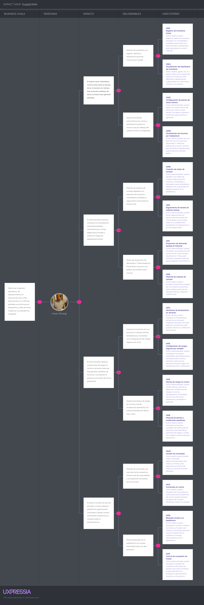

<sub>Ilustración. Impact Mapping dueños de restaurantes chifa y administradores</sub>

----
**Segundo Segmento Objetivo (Proveedores de insumos para restaurantes):**

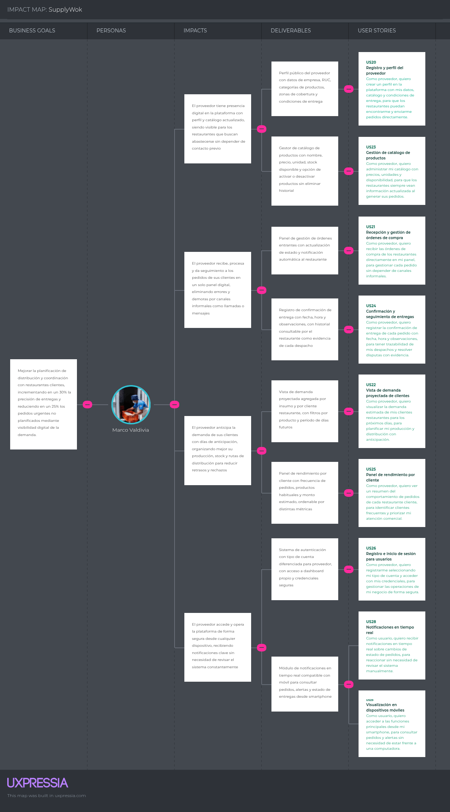

<sub> Ilustración. Impact Mapping proveedores de insumos para restaurantes</sub>

---

### 3.3. Product Backlog

| # Orden | User Story ID | Título | Descripción | Story Points |
|:---:|:---:|---|---|:---:|
| 1 | US44 | Página de inicio con hero section | Como visitante de la plataforma, quiero acceder a una página de inicio atractiva que presente claramente el valor de SupplyWok, para comprender rápidamente qué ofrece la plataforma. | 2 |
| 2 | US45 | Sección de características principales | Como potencial cliente, quiero ver las características clave de SupplyWok de forma visual y resumida, para entender los beneficios principales en poco tiempo. | 2 |
| 3 | US46 | Sección de planes y precios | Como potencial cliente, quiero visualizar los planes disponibles con sus características y precios, para determinar cuál se ajusta mejor a mis necesidades. | 1 |
| 4 | US47 | Sección de preguntas frecuentes | Como visitante interesado con dudas sobre la plataforma, quiero leer las preguntas que suelen surgir sobre la plataforma y su solución para resolver dudas antes de registrarme. | 3 |
| 5 | US48 | Navegación y menú principal | Como visitante de la landing page, quiero navegar fácilmente entre las diferentes secciones de la página, para acceder rápidamente a la información que busco. | 3 |
| 6 | US49 | Responsividad total y optimización mobile | Como usuario en dispositivo móvil, quiero que la landing page se vea correctamente en cualquier tamaño de pantalla, para tener una experiencia consistente en mobile, tablet y desktop. | 3 |
| 7 | US50 | SEO y accesibilidad web | Como equipo de marketing/desarrolladores, quiero que la landing page tenga buena optimización SEO y sea accesible para todos, para mejorar el posicionamiento en buscadores y llegar a más usuarios. | 3 |
| 8 | US51 | Footer con información adicional | Como visitante de la landing page, quiero encontrar información adicional en el footer como redes sociales, política de privacidad y términos de servicio, para acceder rápidamente a contenido legal e información de contacto. | 3 |
| 9 | US52 | Impacto apoyado en cifras | Como visitante racional interesado en la plataforma, quiero poder ver en una sección una estadística o cifras que muestren los beneficios de usar la plataforma, para tomar una decisión informada sobre registrarme en la plataforma. | 2 |
| 10 | US53 | Muestra del producto | Como visitante interesado en la plataforma, quiero poder ver muestras del producto ya sea en video o imágenes, para poder afianzar mi decisión de usar el sistema. | 2 |
| 11 | US54 | Calls to action | Como visitante emocional de la landing page, quiero encontrar calls to action en puntos importantes para que pueda empezar a usar la plataforma cuando me convenza de usarla. | 2 |
| 12 | US55 | Scripts para ocultar contenido | Como desarrollador de la landing page, quiero tener scripts para ocultar cierto contenido y mostrarlo cuando se seleccionen apartados específicos, para mejorar la experiencia de usuario y optimizar el diseño. | 1 |
| 13 | US56 | Comentarios y nombres de variables | Como desarrollador parte del equipo de desarrollo de la landing page, quiero tener comentarios claros y precisos en el código para facilitar el mantenimiento y la colaboración con otros desarrolladores. | 1 |
| 14 | US57 | Sobre el equipo detrás de SupplyWok | Como visitante de la landing page, quiero ver información sobre el equipo detrás de SupplyWok en forma de video, para conocer a los desarrolladores de la plataforma. | 1 |
| 15 | US58 | Prioridad en mostrar funcionalidades a restaurantes | Como desarrollador de la plataforma SupplyWok, quiero que las funcionalidades enfocadas en restaurantes tengan prioridad visual y de lectura para captar mejor la atención del segmento objetivo. | 1 |
| 16 | US01 | Registro de inventario inicial | Como dueño de un restaurante chifa, quiero registrar todos mis insumos actuales con cantidades y unidades, para tener una base de datos centralizada que reemplace el control manual. | 2 |
| 17 | US04 | Visualización del dashboard de inventario | Como dueño de un restaurante chifa, quiero ver un panel visual con el estado de todos mis insumos, para identificar rápidamente cuáles están en nivel crítico, normal o con exceso. | 2 |
| 18 | US03 | Configuración de alertas de stock mínimo | Como administrador de un restaurante chifa, quiero definir un nivel mínimo de stock por insumo, para recibir una alerta cuando el inventario esté próximo a agotarse. | 3 |
| 19 | US02 | Actualización de stock por consumo diario | Como encargado de almacén, quiero registrar el consumo diario de insumos, para mantener el inventario actualizado sin depender de conteos manuales al cierre del día. | 3 |
| 20 | US05 | Registro de entrada de mercadería | Como encargado de almacén, quiero registrar la llegada de insumos con sus cantidades y proveedor de origen, para actualizar el stock disponible y mantener el historial de entradas. | 2 |
| 21 | US07 | Registro de baja de insumos | Como encargado de almacén, quiero registrar insumos dados de baja indicando el motivo, para descontarlos del inventario y mantener un historial de pérdidas. | 3 |
| 22 | US06 | Exportar reportes en PDF/CSV | Como dueño del restaurante, quiero poder exportar archivos en formato PDF o CSV, para poder usarlos en el manejo del negocio. | 2 |
| 23 | US08 | Visualización de insumos que requieren reabastecimiento | Como dueño de un restaurante chifa, quiero ver una lista de insumos que han alcanzado o caído por debajo de su stock mínimo configurado, para identificar rápidamente qué productos necesito pedir. | 1 |
| 24 | US12 | Gestión de proveedores vinculados | Como dueño de un restaurante chifa, quiero registrar y gestionar la lista de proveedores con los que trabajo, para tener un directorio centralizado y asociar cada insumo a su proveedor. | 2 |
| 25 | US09 | Creación de orden de compra | Como administrador de un restaurante chifa, quiero generar una orden de compra seleccionando insumos, cantidades y proveedor, para centralizar y registrar mis solicitudes de abastecimiento en la plataforma. | 1 |
| 26 | US13 | Seguimiento de estado de órdenes activas | Como administrador de un restaurante chifa, quiero hacer seguimiento en tiempo real del estado de mis órdenes de compra activas, para saber si un pedido está pendiente, en preparación o ya fue despachado. | 2 |
| 27 | US10 | Historial de órdenes de compra | Como dueño de un restaurante chifa, quiero acceder al historial completo de mis órdenes de compra anteriores, para analizar patrones de abastecimiento y detectar ineficiencias. | 1 |
| 28 | US11 | Proyección de demanda basada en historial | Como administrador de un restaurante chifa, quiero visualizar una proyección de consumo de insumos para los próximos 7 días, para anticipar compras antes de que se agoten los productos. | 5 |
| 29 | US14 | Monitoreo de temperatura en almacén | Como dueño de un restaurante chifa, quiero visualizar la temperatura actual de mi almacén mediante sensores IoT, para detectar condiciones que puedan afectar la calidad de los insumos. | 3 |
| 30 | US16 | Configuración de rangos seguros por variable | Como administrador de un restaurante chifa, quiero configurar los rangos aceptables de temperatura y humedad para cocina y almacén, para que las alertas se activen según los parámetros de mi operación. | 2 |
| 31 | US15 | Alertas de riesgo en cocina | Como administrador de un restaurante chifa, quiero recibir alertas cuando se detecten condiciones de riesgo en cocina (temperatura, humedad u otros parámetros), para actuar de forma preventiva y proteger al personal. | 2 |
| 32 | US17 | Control de ocupación de mesas | Como administrador de un restaurante chifa, quiero visualizar el estado de ocupación de las mesas en tiempo real, para coordinar el flujo del servicio y anticipar la demanda de insumos en horas pico. | 2 |
| 33 | US18 | Historial de alertas e incidencias operativas | Como dueño de un restaurante chifa, quiero consultar el historial completo de alertas registradas por los sensores y el sistema, para identificar patrones de riesgo, tomar medidas correctivas y contar con evidencia de los eventos operativos. | 3 |
| 34 | US19 | Exportar reporte de monitoreo y alertas | Como administrador de un restaurante chifa, quiero exportar los datos de monitoreo de temperatura y alertas en formato PDF o CSV, para compartirlos con el equipo o usarlos en auditorías internas. | 3 |
| 35 | US20 | Registro y perfil del proveedor | Como proveedor de insumos, quiero crear un perfil en la plataforma con mis datos, catálogo y condiciones de entrega, para que los restaurantes puedan encontrarme y enviarme pedidos directamente. | 2 |
| 36 | US21 | Recepción y gestión de órdenes de compra | Como proveedor, quiero recibir las órdenes de compra de los restaurantes directamente en mi panel, para gestionar cada pedido sin depender de canales informales. | 3 |
| 37 | US23 | Gestión de catálogo de productos | Como proveedor, quiero administrar mi catálogo con precios, unidades y disponibilidad, para que los restaurantes siempre vean información actualizada al generar sus pedidos. | 2 |
| 38 | US24 | Confirmación y seguimiento de entregas | Como proveedor, quiero registrar la confirmación de entrega de cada pedido con fecha, hora y observaciones, para tener trazabilidad de mis despachos y resolver disputas con evidencia. | 3 |
| 39 | US22 | Vista de demanda proyectada de clientes | Como proveedor, quiero visualizar la demanda estimada de mis clientes restaurantes para los próximos días, para planificar mi producción y distribución con anticipación. | 3 |
| 40 | US25 | Panel de rendimiento por cliente | Como proveedor, quiero ver un resumen del comportamiento de pedidos de cada restaurante cliente, para identificar clientes frecuentes y priorizar mi atención comercial. | 3 |
| 41 | US27 | Selección y gestión del plan de suscripción | Como usuario de la plataforma, quiero visualizar los planes disponibles (Premium, Enterprise) y suscribirme al que se ajuste a mis necesidades, para acceder a las funcionalidades según mi presupuesto. | 1 |
| 42 | US28 | Notificaciones en tiempo real | Como usuario de la plataforma, quiero recibir notificaciones en tiempo real sobre eventos importantes (alertas de stock, cambios de estado de pedidos, alertas de temperatura), para reaccionar sin revisar el sistema manualmente. | 3 |
| 43 | US29 | Visualización en dispositivos móviles | Como usuario de la plataforma, quiero acceder a las funciones principales desde mi smartphone, para consultar inventario, pedidos y alertas sin necesidad de estar frente a una computadora. | 5 |
| 44 | US31 | Elección de idiomas | Como usuario de la plataforma, quiero poder cambiar el idioma de la interfaz a inglés, español o chino, para usar el sistema en mi idioma preferido. | 3 |
| 45 | US35 | Bloquear acceso a la plataforma | Como dueño de un restaurante, quiero bloquear el acceso a ciertas funciones de la plataforma y que se visualice solo el contenido respectivo a las mesas y comandas, para manejar el entorno de cocina y servicio desde la plataforma y darle acceso al personal sin vulnerar el manejo de la plataforma. | 5 |
| 46 | US40 | Gestión de comandas | Como dueño de un restaurante chifa, quiero poder crear comandas y tenerlas en el sistema para poder gestionar el servicio de mesa y cocina de manera eficiente. | 3 |
| 47 | US41 | Comandas en cocina | Como dueño de un restaurante chifa, quiero visualizar las comandas en cocina para que el personal de cocina pueda preparar los platos de manera eficiente. | 3 |
| 48 | US30 | Soporte y centro de ayuda | Como usuario de la plataforma, quiero acceder a una sección de ayuda con guías y un canal de soporte, para resolver dudas sin necesidad de contactar directamente al equipo de SupplyWok. | 1 |
| 49 | US32 | Estado del servicio | Como usuario de la plataforma, quiero conocer la disponibilidad del servicio y el estado de los servidores, para tener información en caso de problemas técnicos. | 3 |
| 50 | US33 | Disponibilidad continua de la plataforma | Como usuario del sistema, quiero que la plataforma esté disponible las 24 horas del día los 7 días de la semana, para poder usarla en cualquier momento que lo necesite. | 3 |
| 51 | US34 | Obtener los datos del inventario vía API | Como desarrollador de la plataforma, quiero obtener los datos del inventario de un restaurante específico mediante una solicitud GET, para poder mostrarlo en las secciones respectivas. | 3 |
| 52 | US37 | Crear una orden de insumos vía API | Como desarrollador de la plataforma, quiero enviar los datos de una orden de insumos mediante una solicitud POST, para permitir que los usuarios gestionen las órdenes de compra. | 3 |
| 53 | US38 | Obtener datos relevantes de proveedores vía API | Como desarrollador de la plataforma, quiero obtener los datos relevantes de los proveedores mediante una solicitud GET, para poder mostrarlos en las secciones correspondientes. | 3 |
| 54 | US42 | Endpoint para recibir información de componentes IoT | Como desarrollador de la plataforma, quiero implementar un endpoint para recibir la información de los componentes IoT, para que los sensores puedan enviar datos al sistema y generar eventos manejados por la plataforma. | 5 |
| 55 | US43 | Métodos HTTP para las comandas | Como desarrollador de la plataforma, quiero que el sistema tenga métodos GET y POST para que las comandas puedan almacenarse y gestionarse desde la base de datos. | 5 |
| 56 | US36 | Manejo estándar de errores | Como desarrollador de la plataforma, quiero configurar un interceptor que capture errores y retorne el código HTTP relacionado, para que pueda ser manejado por el frontend y mantener un manejo estandarizado de errores. | 3 |
| 57 | US39 | Evitar almacenamientos en errores | Como desarrollador de la plataforma, quiero que el sistema evite guardar registros erróneos en la base de datos al detectar un error, para prevenir inconsistencias y problemas en la experiencia del usuario. | 1 |
| 58 | US26 | Registro e inicio de sesión para usuarios de la plataforma | Como dueño de restaurante o proveedor, quiero registrarme en la plataforma seleccionando mi tipo de cuenta y acceder con mis credenciales, para gestionar las operaciones de mi negocio de forma segura. | 1 |

# Capítulo IV: Product Design.
## 4.1. Style Guidelines

### 4.1.1. General Style Guidelines

SupplyWok adopta un sistema de diseño coherente, funcional y alineado con el contexto operativo de restaurantes tipo chifa y sus proveedores. En esta sección se detallan los lineamientos de estilo que hemos definido para mantener la coherencia visual de la plataforma, la cual incluye la landing page, la web application y las versiones mobile. Se detallan el branding, la paleta de colores y las tipografías a utilizar en el proyecto.

**1. Logo:**

El logo de nuestra plataforma está compuesto por los caracteres **S** y **W**, provenientes del nombre *SupplyWok*, representados de forma creativa para mantener una relación con nuestro público objetivo. La **S** se encuentra en forma de humo que sale de un recipiente con forma de **W**. Esta composición transmite una conexión con el entorno de un restaurante chifa y genera familiaridad con nuestros usuarios.


**2. Branding:**

SupplyWok busca transmitir una identidad visual **moderna, confiable, cercana y ordenada**, alineada con las necesidades de restaurantes tipo chifa y sus proveedores. La marca debe reflejar rapidez operativa, control sobre el abastecimiento y facilidad de uso en entornos donde la gestión diaria requiere eficiencia.

El branding de SupplyWok se fundamenta en los siguientes conceptos:

- **Confianza:** la interfaz debe proyectar seguridad al manejar información sensible como stock, pedidos, alertas y proveedores.
- **Agilidad:** la experiencia debe facilitar acciones rápidas y reducir fricción en tareas frecuentes.
- **Cercanía:** la comunicación visual y textual debe ser comprensible y accesible para usuarios con distintos niveles de experiencia digital.
- **Orden:** la presentación de la información debe ser clara, estructurada y fácil de escanear.
- **Identidad gastronómica:** el logotipo y la paleta de colores deben mantener una relación visual con el contexto del chifa, sin perder limpieza ni profesionalismo.

Para reforzar esta identidad, se utilizarán elementos visuales con un estilo consistente en toda la plataforma. El objetivo es que SupplyWok sea percibido como una solución especializada, profesional y fácil de adoptar.

**3. Typography:**

La tipografía que se ha decidido usar en nuestra plataforma son dos: **Poppins** y **Montserrat**. Estas elecciones fueron hechas pensando en la comodidad de lectura de nuestros usuarios y en el diseño moderno que se quiere lograr.

- **Títulos:** Para los títulos se usará **Poppins** en pesos **Bold** o **SemiBold**, dependiendo del nivel jerárquico del texto. Esto permite darles la fuerza y relevancia necesarias.

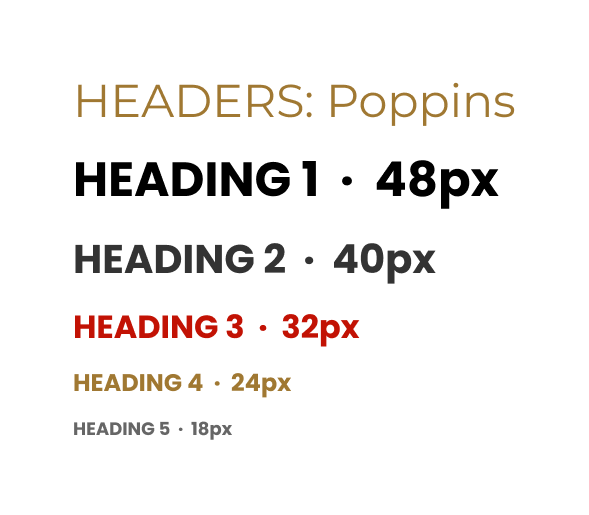

- **Párrafos o cuerpo del texto:** Se usará **Montserrat** en pesos variados como **Bold**, **Regular** o **Light**, dependiendo de la intención del texto. Esto asegura la legibilidad necesaria para los usuarios al momento de leer.


**4. Colors:**

La identidad visual de SupplyWok busca mantener una relación con el entorno de un restaurante chifa clásico, por lo que predominan los tonos rojos y amarillos, combinados con blanco y negro para lograr un contraste óptimo.

- **Rojo (#C21204):** Este color se usará en botones principales, alertas y elementos que requieran atención. Se eligió por su fuerza visual y por su asociación con energía, dinamismo y relevancia.
- **Amarillo (#E9B824):** Este color se usará como contraste del rojo y para resaltar textos o elementos puntuales.
- **Mostaza o amarillo oscuro (#A07832):** Variante más oscura del amarillo, utilizada en detalles para ayudar a armonizar la vista de los usuarios.
- **Blanco (#FFFFFF):** Color neutro para mantener balance y aportar limpieza visual.
- **Negro (#000000):** Color neutro para reforzar contraste y legibilidad.


**5. Spacing:**

El sistema de espaciado de SupplyWok se ha definido para mantener orden visual, legibilidad y consistencia entre la landing page, la web application y las vistas móviles. Se adopta una escala base de **8 px**. En el caso de separar secciones, se pueden usar espacios de hasta **24 px**, lo que permite construir interfaces limpias y fácilmente adaptables a distintos tamaños de pantalla.

**6. Tone:**

El tono de comunicación de SupplyWok será **profesional, claro y confiable**, pero sin caer en tecnicismos innecesarios. Debido a que la plataforma está orientada a restaurantes tipo chifa y proveedores que trabajan en contextos operativos de alta demanda, la comunicación debe transmitir orden, rapidez y seguridad en la gestión del abastecimiento.

SupplyWok busca proyectar:

- **Confianza**, al tratar información crítica como stock, pedidos y alertas.
- **Agilidad**, al guiar al usuario hacia acciones rápidas y concretas.
- **Cercanía**, utilizando mensajes comprensibles para usuarios con distintos niveles de familiaridad tecnológica.
- **Control**, al presentar la información de manera estructurada y orientada a la toma de decisiones.

Por ello, la experiencia visual y verbal evita un tono alarmista o excesivamente informal. En su lugar, se prioriza una comunicación sobria, directa y enfocada en la eficiencia operativa.

**7. Language:**

El lenguaje de SupplyWok será **directo, breve y orientado a la acción**. Se utilizarán etiquetas y mensajes simples que permitan al usuario identificar rápidamente qué está ocurriendo y qué acción puede realizar a continuación.

Se evitarán expresiones ambiguas o excesivamente técnicas. Por ejemplo, se priorizarán frases como:

- `Crear pedido` en lugar de `Registrar nueva orden de abastecimiento`.
- `Stock bajo` en lugar de `Nivel de inventario inferior al umbral configurado`.
- `Ver proveedor` en lugar de `Consultar información detallada del proveedor asociado`.
- `Actualizar estado` en lugar de `Modificar el flujo transaccional del pedido`.

Este enfoque reduce la fricción cognitiva y mejora la usabilidad, especialmente en escenarios donde el usuario necesita actuar rápido, como reposición de insumos, revisión de alertas o seguimiento de entregas.

### 4.1.2. Web Style Guidelines

Las Web Style Guidelines de SupplyWok establecen los criterios visuales y de interacción que guían el diseño de la landing page y la web application. Estas pautas aseguran consistencia entre dispositivos, favorecen la legibilidad y permiten que tanto restaurantes como proveedores naveguen de forma intuitiva por la plataforma.

#### Estructura general

SupplyWok adopta un enfoque **responsive web design**, de modo que la interfaz se adapte correctamente a desktop, laptop, tablet y mobile web sin perder claridad ni coherencia visual.

- **Desktop:** La navegación principal se presenta mediante sidebar lateral y header superior. Los módulos con mayor densidad informativa, como inventario y reportes, aprovechan mejor el ancho disponible mediante tablas, tarjetas comparativas y filtros visibles.
- **Tablet:** La estructura se reorganiza a 6 u 8 columnas, reduciendo el número de elementos visibles por fila. Los paneles laterales pueden colapsarse y ciertas tablas pasan a formatos más compactos para facilitar la interacción táctil.
- **Mobile Web:** La estructura se simplifica a una sola columna. Los elementos se apilan verticalmente, se priorizan botones de acción principal y la navegación se compacta mediante menú hamburguesa o navegación inferior, según el flujo.

#### Breakpoints

Se proponen los siguientes breakpoints para asegurar una adaptación consistente:

- **Mobile:** hasta 767 px.
- **Tablet:** desde 768 px hasta 1023 px.
- **Desktop:** 1024 px en adelante.

#### Componentes básicos de UI

- **Botones primarios:** fondo rojo `#C21204` o marrón `#2D241E`, texto blanco, bordes redondeados de 10 px a 12 px. Se utilizan para acciones clave como `Crear pedido`, `Export PDF`, `Confirmar` o `Iniciar sesión`.
- **Botones secundarios:** fondo blanco o amarillo claro, borde en rojo o mostaza, con texto oscuro. Se emplean para acciones complementarias como `Cancelar`, `Ver detalle` o `Volver`.
- **Inputs y formularios:** bordes suaves, fondo claro y suficiente padding interno para facilitar lectura e interacción. El estado enfocado resalta mediante borde rojo o mostaza. El estado de error utiliza borde rojo más oscuro y un mensaje de validación visible.
- **Cards:** contenedores rectangulares con esquinas redondeadas, padding interno de 16 px a 24 px y jerarquía clara entre título, contenido y acciones. Se usan en dashboard, alertas, métricas y secciones de resumen.
- **Tablas:** encabezados destacados, filas con separación visual suficiente y acciones agrupadas al extremo derecho. En resoluciones pequeñas, las tablas pueden transformarse en listas o tarjetas para mejorar la lectura.
- **Sidebar:** navegación vertical persistente en desktop, con acceso a Dashboard, Inventario, Pedidos, Proveedores, Alertas, Reportes y Configuración. En tablet y mobile se colapsa.
- **Header:** barra superior con nombre del usuario, rol, notificaciones y acceso rápido a configuración y cierre de sesión.

#### Tipografía en web

La propuesta tipográfica de SupplyWok mantiene como base las fuentes **Poppins** y **Montserrat**, según la identidad visual previamente definida.

- **Títulos principales (H1):** Poppins Bold, 24 px a 28 px.
- **Subtítulos (H2):** Poppins SemiBold, 20 px a 22 px.
- **Encabezados de sección (H3):** Poppins Medium, 18 px.
- **Texto de párrafo y descripciones:** Montserrat Regular, 14 px a 16 px.
- **Texto en botones:** Poppins SemiBold, 14 px a 16 px.
- **Etiquetas de formularios y tablas:** Montserrat Medium, 13 px a 14 px.

#### Interacción

- **Hover:** Los botones incrementan ligeramente el contraste o brillo del color base. Los links se subrayan o cambian a una variante más intensa del color principal.
- **Focus:** Todo componente interactivo debe mostrar un estado visible de foco, especialmente inputs, botones y enlaces, para favorecer accesibilidad y navegación por teclado.
- **Active / Click:** Los botones aplican una ligera reducción de escala o sombra interna para confirmar la interacción.
- **Feedback visual:** Estados como éxito, error, advertencia o información se distinguen mediante color, iconografía y texto breve.
- **Scroll y navegación persistente:** En desktop, el header y ciertos filtros pueden permanecer visibles para facilitar navegación rápida en vistas largas.
- **Responsive behavior:** El contenido prioritario siempre debe conservar visibilidad antes que elementos decorativos o secundarios.

### 4.1.3. Mobile Style Guidelines

Las Mobile Style Guidelines de SupplyWok tienen como objetivo adaptar la experiencia de uso a pantallas reducidas sin perder funcionalidad, claridad visual ni consistencia con la propuesta general del producto. Estas pautas priorizan rapidez de interacción, facilidad de lectura y acceso inmediato a acciones frecuentes.

#### Estructura general

La experiencia móvil de SupplyWok está diseñada para que restaurantes y proveedores puedan consultar información crítica y ejecutar acciones esenciales desde cualquier lugar.

- **Pantallas en una sola columna**, con contenido apilado verticalmente.
- **Header compacto**, con logo, nombre de la vista y acceso a notificaciones o menú.
- **Navegación simplificada**, priorizando las secciones más importantes según el rol del usuario.
- **Botones de acción visibles**, especialmente en flujos como crear pedido, registrar stock o confirmar entregas.
- **Tarjetas resumidas**, en lugar de tablas complejas, para mostrar inventario, pedidos y alertas de forma clara.

#### Componentes básicos en mobile

- **Botones primarios:** rojo `#C21204` o marrón `#2D241E`, texto blanco, esquinas redondeadas de 12 px y tamaño suficiente para interacción táctil.
- **Botones secundarios:** fondo blanco o amarillo claro con borde visible y alto contraste.
- **Inputs:** ancho completo, padding amplio y separación mínima de 16 px entre campos.
- **Cards de resumen:** usadas para pedidos, insumos, alertas y métricas, con distribución vertical y jerarquía clara.
- **Listas:** los registros se organizan en bloques táctiles con título, estado, fecha y acción principal.
- **Indicadores de estado:** cada pedido o alerta utiliza color y texto para distinguir rápidamente condiciones como pendiente, entregado, stock bajo o fuera de rango.

#### Tipografía en mobile

- **Título principal (H1):** Poppins Bold, 20 px a 22 px.
- **Subtítulos (H2):** Poppins SemiBold, 16 px a 18 px.
- **Texto general:** Montserrat Regular, 14 px.
- **Botones:** Poppins SemiBold, 14 px.
- **Etiquetas pequeñas o estados:** Montserrat Medium, 12 px a 13 px.

#### Interacción en mobile

- Se prioriza el uso de **acciones rápidas** y **flujos cortos**.
- Los botones deben tener un tamaño mínimo adecuado para interacción táctil.
- Los formularios se dividen en bloques cortos para evitar fatiga visual.
- Las acciones críticas se colocan al alcance natural del pulgar.
- Los cambios de estado deben mostrarse inmediatamente mediante mensajes visibles o indicadores contextuales.

### 4.2. Information Architecture.

La arquitectura de información de SupplyWok ha sido diseñada para que los dos segmentos principales del producto, restaurantes tipo chifa y proveedores de insumos, puedan localizar información, ejecutar tareas y comprender el estado de sus operaciones de forma rápida y consistente. Esta propuesta abarca tanto la Landing Page como la Web Application, de modo que exista continuidad entre la experiencia de descubrimiento del producto y la experiencia de uso dentro de la plataforma.

En el caso de la Landing Page, la arquitectura de información busca guiar al visitante desde una comprensión inicial del problema hacia una acción concreta, ya sea registrarse, iniciar sesión o explorar las funcionalidades clave según su rol. Para ello, el contenido se organiza en bloques progresivos como propuesta de valor, beneficios, funcionalidades, impacto, testimonios, preguntas frecuentes y llamadas a la acción. Esta secuencia permite que el usuario comprenda qué resuelve SupplyWok, a quién está dirigido y cómo puede empezar a utilizarlo.

En la Web Application, la arquitectura de información responde a una lógica operativa. En lugar de priorizar persuasión o descubrimiento, la aplicación prioriza velocidad de acceso, visibilidad del estado actual y ejecución eficiente de tareas. Por ello, el contenido se distribuye en módulos funcionales diferenciados por rol, donde cada usuario accede únicamente a las secciones que necesita para gestionar inventario, pedidos, proveedores, alertas, reportes o catálogos.

De esta manera, la arquitectura de información de SupplyWok se apoya en cuatro sistemas complementarios: Organization Systems, Labeling Systems, Searching Systems y Navigation Systems. En conjunto, estos sistemas permiten estructurar la información de forma entendible, reducir la sobrecarga cognitiva y mantener una experiencia coherente entre web pública y aplicación transaccional.

### 4.2.1. Organization Systems.

La organización del contenido en SupplyWok responde a la naturaleza de cada producto digital y al tipo de tarea que el usuario necesita realizar. La Landing Page organiza información para presentar, explicar y convencer; mientras que la Web Application organiza información para operar, monitorear y tomar decisiones. Por ello, se aplican distintos esquemas de organización visual y categorización según el contexto.

#### Organization Systems in the Landing Page

En la Landing Page, la información se organiza principalmente de forma **jerárquica** y **secuencial**. La jerarquía visual permite destacar de inmediato la propuesta de valor, los beneficios principales y los llamados a la acción más importantes. La secuencia guía al visitante por un recorrido progresivo: primero entiende el problema, luego conoce la solución, después explora sus funcionalidades y finalmente recibe estímulos para registrarse o iniciar sesión.

La estructura general de la Landing Page sigue el siguiente flujo:

- **Hero section:** Presenta la propuesta de valor principal y los CTAs principales.
- **Sección de beneficios:** Resume de forma rápida los problemas que resuelve la plataforma.
- **Sección de funcionalidades:** Explica las capacidades clave para restaurantes y proveedores.
- **Sección de impacto o métricas:** Refuerza credibilidad mediante cifras, indicadores o resultados esperados.
- **Sección de muestra del producto:** Permite visualizar pantallas, imágenes o video del sistema.
- **Sección de preguntas frecuentes:** Resuelve dudas antes de la conversión.
- **Footer:** Reúne enlaces secundarios, contacto, páginas legales y accesos finales.

Esta estructura no es aleatoria: busca reducir fricción en el recorrido del visitante y facilitar que identifique en pocos segundos si el producto es relevante para su necesidad.

#### Organization Systems in the Web Application

En la Web Application, la organización del contenido es principalmente **por tópicos**, **por audiencia** y **cronológica**, según el tipo de información mostrada.

- **Por tópicos:** Se emplea en el menú principal, donde las funcionalidades se agrupan en módulos como Inventario, Pedidos, Proveedores, Alertas, Reportes y Configuración.
- **Por audiencia:** Se aplica al separar claramente la experiencia del restaurante y la del proveedor. Cada rol visualiza solamente los módulos, flujos y datos relevantes para sus operaciones.
- **Cronológica:** Se utiliza en historiales, pedidos, movimientos de inventario, alertas y registros, donde el tiempo es una variable importante para trazabilidad y seguimiento.
- **Matricial:** Se emplea en vistas donde el usuario necesita comparar múltiples variables simultáneamente, como tablas de inventario, catálogos o reportes.

#### Organización visual del contenido

| Tipo de organización | Aplicación en SupplyWok | Justificación |
|---|---|---|
| Jerárquica | Hero section, dashboards, cards de alertas y KPIs | Permite destacar información crítica y dirigir la atención hacia las acciones prioritarias. |
| Secuencial | Registro, onboarding, creación de pedidos, configuración inicial | Ayuda al usuario a completar procesos paso a paso, reduciendo errores. |
| Matricial | Inventario, historial de pedidos, catálogos, reportes | Facilita comparar atributos como cantidad, proveedor, fecha, precio y estado. |

#### Esquemas de categorización

| Tipo de esquema | Aplicación en SupplyWok | Justificación |
|---|---|---|
| Por tópicos | Inventario, Pedidos, Proveedores, Alertas, Reportes, Configuración | Agrupa el contenido según la tarea que el usuario busca realizar. |
| Cronológico | Historial de pedidos, movimientos de stock, alertas registradas | Facilita seguimiento y auditoría de eventos pasados. |
| Por audiencia | Vista Restaurante y Vista Proveedor | Reduce ruido informativo y adapta la experiencia al rol del usuario. |

#### Esquemas no priorizados

SupplyWok no prioriza un esquema **alfabético** como estructura principal, ya que la mayoría de sus tareas no dependen de exploración lexical, sino de acciones operativas y contextuales. Aunque ciertos listados pueden ordenarse alfabéticamente de manera secundaria, la plataforma privilegia estructuras orientadas a flujo de trabajo, prioridad operativa y estado de la información.

Tampoco se utiliza una organización puramente temática en la Landing Page sin jerarquía de conversión, porque el objetivo de esa interfaz no es solo informar, sino llevar al usuario hacia una acción clara en el menor número posible de pasos.

#### Secciones principales de SupplyWok

La aplicación se divide en dos grandes espacios según el rol del usuario.

**Vista Restaurante**

| Sección | Descripción |
|---|---|
| Dashboard | Resumen del estado operativo del día: alertas de stock, pedidos pendientes, lecturas críticas y métricas principales. |
| Inventario | Registro y seguimiento de insumos, stock actual, stock mínimo, unidad de medida y movimientos. |
| Pedidos | Creación, seguimiento e historial de órdenes de abastecimiento dirigidas a proveedores. |
| Proveedores | Directorio y detalle de proveedores vinculados al restaurante. |
| Alertas | Centro de notificaciones operativas y eventos críticos. |
| Reportes | Visualización de métricas, consumo, evolución del inventario y comportamiento de pedidos. |
| Configuración | Gestión de perfil, usuarios, preferencias y parámetros generales. |

**Vista Proveedor**

| Sección | Descripción |
|---|---|
| Dashboard | Resumen de pedidos recibidos, entregas en curso y demanda proyectada. |
| Pedidos recibidos | Gestión y seguimiento de las órdenes enviadas por restaurantes. |
| Mis clientes | Directorio de restaurantes vinculados y su historial de demanda. |
| Demanda proyectada | Estimación de necesidades futuras por cliente o producto. |
| Catálogo de productos | Gestión de los insumos ofrecidos, precios y disponibilidad. |
| Configuración | Gestión del perfil, cobertura, contacto y preferencias. |

### 4.2.2. Labeling Systems.

El sistema de etiquetado de SupplyWok ha sido diseñado para que cada elemento de la interfaz comunique su propósito de forma inmediata. Las etiquetas se redactan con términos breves, directos y familiares para el contexto gastronómico y logístico, evitando tecnicismos innecesarios. Esto permite que el usuario comprenda con rapidez qué sección está visitando, qué acción puede ejecutar y qué resultado debe esperar.

A diferencia de un simple glosario, el sistema de etiquetado de SupplyWok se aplica de manera concreta en zonas específicas de la interfaz, como la navbar de la Landing Page, el sidebar de la aplicación, los botones principales, los formularios, los breadcrumbs y los mensajes de estado.

#### Labeling in the Landing Page

En la Landing Page, las etiquetas priorizan claridad comercial y orientación a la conversión. Se emplean principalmente en:

- **Navbar superior:** `Inicio`, `Funcionalidades`, `Planes`, `FAQ`, `Iniciar sesión`.
- **Botones principales del hero:** `Crear cuenta`, `Ver demo`, `Soy restaurante`, `Soy proveedor`.
- **Secciones informativas:** `Beneficios`, `Cómo funciona`, `Impacto`, `Preguntas frecuentes`.
- **Footer:** `Contacto`, `Política de privacidad`, `Términos y condiciones`.

Estas etiquetas permiten que el visitante identifique rápidamente la estructura del contenido y pueda desplazarse hacia las secciones que más le interesan antes de tomar una decisión.

#### Labeling in the Web Application

En la Web Application, las etiquetas se enfocan en apoyar la operación diaria del usuario. Se distribuyen en los siguientes puntos:

- **Sidebar o menú lateral:** `Dashboard`, `Inventario`, `Pedidos`, `Proveedores`, `Alertas`, `Reportes`, `Configuración`.
- **Header:** `Notificaciones`, `Mi perfil`, `Cambiar de vista`, `Cerrar sesión`.
- **Botones de acción:** `Agregar insumo`, `Crear pedido`, `Actualizar estado`, `Ver detalle`, `Guardar cambios`, `Cancelar`.
- **Breadcrumbs:** `Pedidos > Detalle del pedido`, `Inventario > Agregar insumo`, `Proveedores > Perfil del proveedor`.
- **Formularios:** `Nombre del insumo`, `Unidad de medida`, `Stock mínimo`, `Proveedor asociado`, `Fecha de entrega`, `Precio unitario`.
- **Mensajes de estado:** `Pendiente`, `En camino`, `Entregado`, `Cancelado`, `Stock bajo`, `Fuera de rango`.

#### Criterios del sistema de etiquetado

El sistema de etiquetado de SupplyWok sigue los siguientes criterios:

- **Brevedad:** Las etiquetas deben usar el menor número de palabras posible sin perder claridad.
- **Consistencia:** Un mismo concepto debe nombrarse siempre de la misma manera en toda la plataforma.
- **Familiaridad:** Se priorizan términos cercanos al usuario real del dominio.
- **Orientación a la acción:** Los botones y acciones usan verbos claros que indican lo que ocurrirá.
- **Escaneabilidad:** Las etiquetas deben poder comprenderse rápidamente incluso en interfaces densas como tablas y dashboards.

#### Etiquetas principales del sistema

| Etiqueta | Lugar de uso | Descripción |
|---|---|---|
| Iniciar sesión | Navbar, formularios de acceso | Permite ingresar con una cuenta existente. |
| Crear cuenta | Hero section, formularios de registro | Permite registrarse como nuevo usuario. |
| Dashboard | Sidebar, header, breadcrumbs | Pantalla inicial con el resumen principal del rol. |
| Inventario | Sidebar, títulos de vista | Módulo de control de insumos y stock. |
| Agregar insumo | Botón principal, formularios | Acción para registrar un nuevo producto en inventario. |
| Stock mínimo | Formularios, tablas, alertas | Umbral que activa reposición o advertencia. |
| Crear pedido | Botón principal, módulo de pedidos | Acción para generar una nueva orden. |
| Estado del pedido | Tablas, cards, detalle de pedido | Indicador del avance operativo del pedido. |
| Alerta de stock | Dashboard, alertas, notificaciones | Notificación sobre nivel crítico de inventario. |
| Proveedor vinculado | Formularios, tablas, fichas | Relación activa entre restaurante y proveedor. |
| Historial | Tablas, reportes, filtros | Registro cronológico de eventos o transacciones. |
| Reportes | Sidebar, títulos, cards | Módulo de análisis y visualización de métricas. |
| Configuración | Sidebar, header | Área de gestión del perfil y parámetros del sistema. |
| Cerrar sesión | Header, menú de usuario | Acción para salir de la cuenta actual. |

### 4.2.3. SEO Tags and Meta Tags.

Las etiquetas SEO y Meta Tags de SupplyWok se definen para mejorar la visibilidad del producto en buscadores, reforzar la claridad del contenido presentado y optimizar la manera en que las páginas se muestran en navegadores y redes sociales. Debido a que la solución cuenta con una Landing Page pública y una Web Application privada, las decisiones de etiquetado SEO se concentran principalmente en las páginas públicas y en las pantallas principales que pueden funcionar como punto de acceso o referencia de producto.

A continuación, se detallan los principales títulos y metadatos propuestos para las páginas más relevantes de la experiencia digital.

#### Home / Landing Page

- **Title:** SupplyWok | Gestión inteligente de abastecimiento para restaurantes
- **Meta Description:** Optimiza inventario, pedidos y coordinación con proveedores desde una sola plataforma diseñada para restaurantes tipo chifa y negocios gastronómicos.
- **Meta Keywords:** gestión de inventario restaurantes, abastecimiento gastronómico, control de stock, pedidos a proveedores, software para chifas, supply chain restaurante
- **Meta Author:** Aurora

#### Funcionalidades / Features

- **Title:** Funcionalidades de SupplyWok | Inventario, pedidos y alertas en una sola plataforma
- **Meta Description:** Conoce cómo SupplyWok ayuda a restaurantes y proveedores a gestionar inventario, coordinar pedidos, monitorear alertas y tomar mejores decisiones operativas.
- **Meta Keywords:** funcionalidades software restaurante, inventario digital, pedidos a proveedores, alertas de stock, dashboard gastronómico
- **Meta Author:** Aurora

#### Planes / Pricing

- **Title:** Planes de SupplyWok | Soluciones para restaurantes y proveedores
- **Meta Description:** Explora los planes de SupplyWok y descubre la opción adecuada para digitalizar el control de inventario, pedidos y abastecimiento de tu negocio.
- **Meta Keywords:** precios software restaurante, planes gestión de inventario, suscripción software gastronómico, plataforma para proveedores
- **Meta Author:** Aurora

#### Login / Iniciar sesión

- **Title:** Iniciar sesión | SupplyWok
- **Meta Description:** Accede a tu cuenta de SupplyWok para gestionar inventario, pedidos, alertas y reportes desde una plataforma centralizada.
- **Meta Keywords:** login supplywok, acceso plataforma inventario, panel restaurante, panel proveedor
- **Meta Author:** Aurora

#### Register / Crear cuenta

- **Title:** Crear cuenta | SupplyWok
- **Meta Description:** Regístrate en SupplyWok como restaurante o proveedor y empieza a organizar tu abastecimiento de forma más eficiente.
- **Meta Keywords:** registro supplywok, crear cuenta restaurante, crear cuenta proveedor, software abastecimiento
- **Meta Author:** Aurora

#### Dashboard

- **Title:** Dashboard | SupplyWok
- **Meta Description:** Revisa el estado actual de tu operación, alertas activas, pedidos pendientes y métricas clave desde el panel principal de SupplyWok.
- **Meta Keywords:** dashboard restaurante, dashboard proveedor, panel operativo, alertas de stock, pedidos pendientes
- **Meta Author:** Aurora

#### Inventario

- **Title:** Inventario | SupplyWok
- **Meta Description:** Gestiona tus insumos, controla niveles de stock y detecta productos críticos desde el módulo de inventario de SupplyWok.
- **Meta Keywords:** inventario restaurante, control de insumos, stock mínimo, abastecimiento digital
- **Meta Author:** Aurora

#### Pedidos

- **Title:** Pedidos | SupplyWok
- **Meta Description:** Crea, consulta y supervisa órdenes de abastecimiento entre restaurantes y proveedores con trazabilidad centralizada.
- **Meta Keywords:** pedidos restaurante, órdenes de compra, seguimiento de pedidos, abastecimiento proveedor
- **Meta Author:** Aurora

Estas etiquetas permiten diferenciar el propósito de cada página dentro del ecosistema digital, mantener coherencia entre la propuesta comercial y la experiencia operativa, y reforzar el posicionamiento del producto en búsquedas relacionadas con inventario, abastecimiento y gestión gastronómica.

### 4.2.4. Searching Systems.

SupplyWok incorpora sistemas de búsqueda y filtrado para reducir el tiempo que el usuario dedica a localizar información dentro de la plataforma. Dado que gran parte de la experiencia está orientada a tareas operativas, las búsquedas no solo deben encontrar datos, sino también presentarlos en un formato comprensible y accionable.

#### Searching in the Web Application

Los mecanismos de búsqueda se aplican en módulos donde el volumen de información puede crecer rápidamente, como inventario, pedidos, proveedores, clientes, alertas e historiales. Cada búsqueda se acompaña de filtros específicos según el contexto del módulo.

| Sistema de búsqueda | Ubicación | Descripción |
|---|---|---|
| Búsqueda de insumos | Inventario | Permite localizar productos por nombre, categoría o unidad de medida. |
| Búsqueda de proveedores | Proveedores | Permite encontrar proveedores por nombre o tipo de insumo ofrecido. |
| Búsqueda de pedidos | Pedidos | Permite filtrar pedidos por estado, proveedor, cliente o rango de fechas. |
| Búsqueda de clientes | Vista Proveedor | Permite encontrar restaurantes vinculados por nombre o historial de actividad. |
| Filtro por categoría | Inventario y catálogos | Reduce el listado a un tipo específico de producto. |
| Filtro por fecha | Historial, reportes y pedidos | Permite analizar periodos específicos de operación. |
| Filtro por estado | Pedidos y alertas | Muestra solamente registros con una condición determinada. |

#### Visualización de resultados

Los resultados de búsqueda en SupplyWok se presentan de forma distinta según la naturaleza del contenido:

- **Inventario:** Los resultados se muestran en una tabla o lista con columnas como nombre del insumo, stock actual, stock mínimo, unidad de medida y proveedor asociado.
- **Pedidos:** Los resultados se presentan en tabla o cards con número de pedido, proveedor o cliente, fecha, estado y acceso a detalle.
- **Proveedores y clientes:** Los resultados se muestran como fichas resumidas con nombre, contacto, rubro o historial asociado.
- **Alertas:** Los resultados se muestran como lista priorizada con nivel de criticidad, fecha y acceso a la sección relacionada.
- **Reportes o historiales:** Los resultados se representan mediante tablas filtradas o gráficos ajustados al rango seleccionado.

#### Comportamiento esperado de los resultados

Los resultados de búsqueda deben seguir estos criterios:

- Responder en tiempo razonable y con feedback visual claro.
- Mostrar solo la información necesaria para que el usuario tome una decisión rápida.
- Permitir ordenar o refinar el resultado sin reiniciar completamente la búsqueda.
- Indicar cuando no existen coincidencias mediante mensajes como `No se encontraron resultados`.
- Mantener visibles los filtros aplicados para que el usuario entienda por qué ve cierto subconjunto de datos.

#### Searching in the Landing Page

La Landing Page no depende de un buscador interno complejo, pero sí incorpora mecanismos de exploración rápida mediante navegación por secciones y anchors. En este caso, el “searching” se resuelve a través de una estructura visible y predecible que permite al visitante llegar rápidamente a contenido como funcionalidades, planes, preguntas frecuentes o acceso al registro.

### 4.2.5. Navigation Systems.

El sistema de navegación de SupplyWok ha sido diseñado para que el usuario pueda recorrer la experiencia con claridad tanto en la Landing Page como en la Web Application. En ambos casos, la navegación busca reducir fricción, mantener consistencia y facilitar el acceso rápido a acciones clave.

#### Navigation in the Landing Page

En la Landing Page, la navegación se estructura como un recorrido progresivo orientado a conversión. El usuario puede desplazarse por la página de forma lineal o saltar directamente a secciones específicas mediante enlaces visibles en la barra superior.

Los principales mecanismos de navegación en la Landing Page son:

- **Navbar superior fija:** Incluye accesos a `Inicio`, `Funcionalidades`, `Planes`, `FAQ` e `Iniciar sesión`.
- **Navegación por anchors:** Cada opción del menú dirige a una sección concreta de la misma página.
- **Hero section con CTAs principales:** Botones como `Crear cuenta`, `Ver demo`, `Soy restaurante` o `Soy proveedor` redirigen al usuario al flujo correspondiente.
- **CTAs secundarios distribuidos:** Se repiten en secciones estratégicas para evitar que el usuario tenga que volver al inicio para actuar.
- **Footer con enlaces complementarios:** Contacto, políticas, términos y accesos secundarios.

Este sistema permite que un visitante nuevo entienda rápidamente el producto, navegue según su interés y llegue a la acción principal en pocos pasos.

#### Navigation in the Web Application

En la aplicación, la navegación se orienta a productividad y ejecución de tareas. Cada rol accede a una estructura estable que prioriza las funcionalidades más utilizadas.

| Elemento de navegación | Descripción |
|---|---|
| Sidebar | Menú lateral persistente con acceso directo a las secciones principales del rol activo. |
| Header | Barra superior con perfil, rol, notificaciones y accesos rápidos. |
| Dashboard como punto de entrada | Pantalla inicial tras autenticación, desde donde el usuario visualiza su estado operativo general. |
| Breadcrumbs | Indicadores de ruta para secciones de detalle, permitiendo comprender ubicación y retroceder fácilmente. |
| Botones contextuales | Acciones principales visibles dentro de cada módulo, como `Crear pedido` o `Agregar insumo`. |
| Notificaciones | Panel accesible desde el header para revisar alertas recientes y redirigirse a la sección relacionada. |
| Cambio de vista por rol | En caso de usuarios con más de un rol, se puede alternar entre contexto restaurante y proveedor. |

#### Recorridos principales de navegación

La navegación de SupplyWok considera recorridos típicos como los siguientes:

- **Visitante de Landing Page -> CTA principal -> Registro o login -> Dashboard del rol correspondiente.**
- **Restaurante -> Dashboard -> Inventario -> Agregar insumo o revisar stock crítico.**
- **Restaurante -> Dashboard -> Pedidos -> Crear pedido -> Seguimiento del estado.**
- **Proveedor -> Dashboard -> Pedidos recibidos -> Actualizar estado de entrega.**
- **Proveedor -> Dashboard -> Catálogo -> Actualizar disponibilidad o precios.**

#### Criterios de navegación

La navegación en SupplyWok sigue estos criterios:

- **Consistencia:** Los elementos principales conservan posición y lógica entre pantallas.
- **Claridad:** Cada enlace y botón comunica claramente su destino o acción.
- **Economía de pasos:** Las tareas frecuentes deben completarse con el menor número posible de interacciones.
- **Visibilidad del estado actual:** El usuario debe saber siempre en qué módulo está y qué acciones puede ejecutar.
- **Adaptabilidad responsive:** La navegación debe mantenerse usable en desktop, tablet y mobile web.

#### Navegación — Landing Page

| Elemento | Descripción |
|---|---|
| Navbar fija | Barra superior visible en todo momento durante el scroll. Contiene logo, enlaces a secciones (anclas) y botones de Iniciar sesión / Registrarse. En mobile se colapsa en menú hamburguesa. |
| Anclas de sección | Los enlaces del navbar desplazan suavemente (smooth scroll) a cada sección de la página: #hero, #como-funciona, #funcionalidades, #para-quien, #precios, #faq. |
| CTA primario en Hero | Botón "Comenzar gratis" redirige a /register. Es el punto de conversión principal de la landing. |
| CTA secundario en Hero | Botón "Ver cómo funciona" hace scroll a la sección #como-funciona, manteniendo al usuario en la landing para informarse antes de registrarse. |
| CTAs por segmento | En la sección "¿Para quién es SupplyWok?", cada card (restaurante / proveedor) tiene un botón que redirige a /register con el parámetro de rol preseleccionado (?rol=restaurante o ?rol=proveedor). |
| CTA en sección Precios | Cada plan tiene un botón que redirige a /register con el plan preseleccionado, reduciendo pasos en el onboarding. |
| CTA final (bottom of page) | Sección de cierre con un último llamado a la acción antes del footer, dirigido a usuarios que llegaron al final sin convertir. |
| Footer | Contiene enlaces a páginas legales (política de privacidad, términos), redes sociales y el enlace de inicio de sesión para usuarios ya registrados. |

#### Navegación — Web Application

| Elemento | Descripción |
|---|---|
| Sidebar  | Menú principal fijo a la izquierda, visible en todo momento. Contiene accesos directos a todas las secciones del rol activo con ícono y etiqueta. En mobile se colapsa en hamburguesa. |
| Header | Barra superior con nombre del negocio, badge del plan activo, ícono de notificaciones con contador y avatar del usuario con menú desplegable (Perfil / Configuración / Cerrar sesión). |
| Dashboard como home | Tras iniciar sesión, el usuario es redirigido automáticamente al Dashboard de su rol. El Dashboard funciona como hub de acceso rápido: las tarjetas de métricas (low stock, pending orders, alerts) son clicables y llevan a la sección correspondiente. |
| Breadcrumbs | Visibles en vistas de detalle para indicar la ruta actual y permitir la navegación hacia atrás. Ejemplo: Pedidos › #PO-8821. |
| Botones de acción contextual | Cada sección tiene un botón primario ("+ Agregar insumo", "+ Crear pedido") ubicado en la esquina superior derecha del contenido, accesible sin scroll. |
| Panel de notificaciones | Al hacer clic en el ícono de campana del header, se despliega un panel lateral con las alertas recientes ordenadas cronológicamente. Cada alerta tiene un acceso directo a la sección donde ocurrió el evento. |
| Modo restringido | El dueño puede activar un modo de acceso limitado desde Configuración. En este modo solo son visibles Kitchen Tickets y Tables and Occupancy, ocultando las secciones administrativas. Útil para personal de cocina y servicio. |
| Cambio de rol | Si un usuario tiene ambos roles (restaurante y proveedor), puede cambiar de vista desde un selector en el header sin cerrar sesión. |


## 4.3. Landing Page UI Design.

La propuesta de UI del Landing Page de SupplyWok traduce las decisiones previas de identidad visual, estilo y arquitectura de información en una experiencia clara, persuasiva y orientada a conversión. Su objetivo principal es presentar la propuesta de valor del producto, explicar de manera rápida cómo ayuda a restaurantes tipo chifa y proveedores, y conducir al visitante hacia una acción concreta, como registrarse, iniciar sesión o explorar el funcionamiento de la plataforma.

El diseño del Landing Page se estructura en bloques progresivos que responden a una lógica de descubrimiento: primero captar atención, luego explicar el problema, mostrar beneficios y funcionalidades, reforzar confianza con evidencia visual y finalmente cerrar con llamadas a la acción claras. Esta organización permite que el usuario entienda qué resuelve SupplyWok, cómo funciona y por qué debería usarlo, sin tener que navegar por una interfaz compleja ni enfrentarse a una sobrecarga de información.

A nivel visual, la interfaz aprovecha la paleta cromática definida para la marca, con predominio de rojo, amarillo, blanco y negro, para transmitir dinamismo, energía y asociación cultural con el entorno de los restaurantes tipo chifa. La jerarquía visual se apoya en titulares fuertes, CTAs visibles, tarjetas informativas y bloques diferenciados por espaciado, logrando que el recorrido sea intuitivo y consistente tanto en escritorio como en dispositivos móviles.

### 4.3.1. Landing Page Wireframe.

Los wireframes del Landing Page de SupplyWok representan la fase inicial de estructuración de la experiencia pública del producto. En ellos se define la jerarquía visual, la distribución de los bloques informativos y el orden en que el visitante descubre la propuesta de valor antes de aplicar el estilo final. Esta etapa permitió validar que la información más importante estuviera visible en los primeros segundos de navegación y que la secuencia del contenido favoreciera la conversión.

#### Desktop

En la versión desktop, el wireframe prioriza una hero section amplia con el mensaje principal de la plataforma, acompañada por botones de acción visibles y una navegación superior persistente. A partir de esta cabecera, el contenido se organiza en secciones horizontales que presentan cómo funciona la plataforma, sus funcionalidades clave, los segmentos a los que atiende, los planes disponibles y la sección de preguntas frecuentes. Esta distribución aprovecha mejor el ancho de pantalla y facilita una lectura escaneable y ordenada.

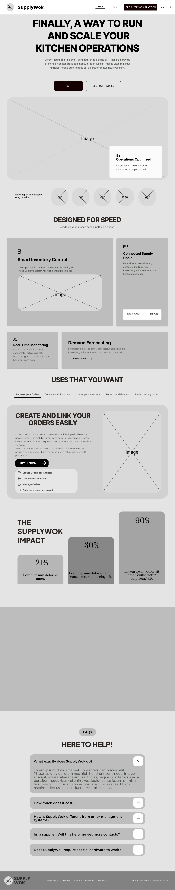

#### Mobile

En la versión mobile, la estructura se reorganiza en una sola columna, priorizando el contenido esencial y reduciendo el número de elementos visibles por bloque. La hero section conserva los mensajes y acciones principales, pero la navegación se compacta para facilitar la interacción táctil. Las secciones se apilan verticalmente y los llamados a la acción se mantienen visibles en puntos estratégicos para asegurar continuidad en el recorrido del usuario sin perder claridad.

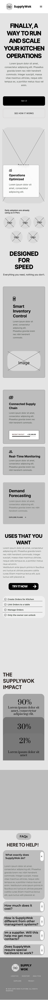

### 4.3.2. Landing Page Mock-up.

Los mock-ups finales del Landing Page de SupplyWok representan la consolidación visual del diseño planteado en los wireframes. En esta etapa se incorporan la paleta cromática institucional, la tipografía definida, el sistema de espaciado, la iconografía y los principios de diseño inclusivo para construir una interfaz visualmente coherente, clara y alineada con la identidad del producto.

#### Desktop

En el mock-up desktop se evidencia una jerarquía visual clara, reforzada mediante el uso del rojo institucional en botones y puntos de énfasis, combinado con fondos claros y bloques bien espaciados. La hero section destaca la propuesta de valor de SupplyWok y dirige la atención hacia los llamados a la acción. Las secciones posteriores organizan las funcionalidades, los beneficios por segmento y los planes con una estructura visual limpia que facilita la comprensión rápida del producto.

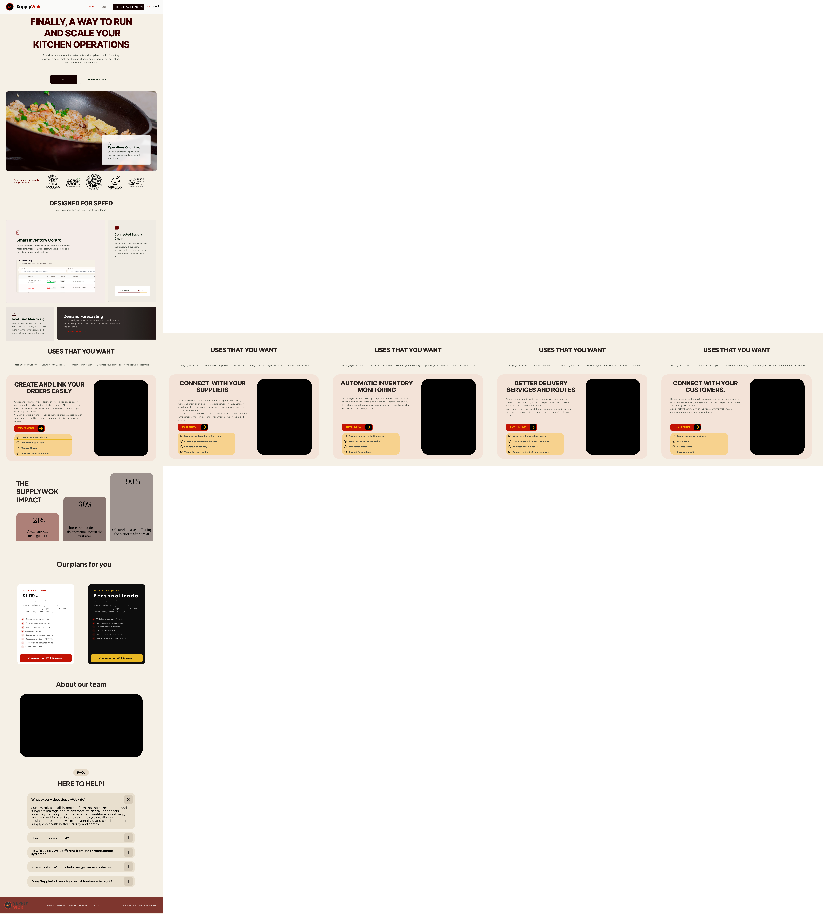

#### Mobile

En la versión mobile del mock-up, la composición se adapta a pantallas reducidas manteniendo consistencia visual en color, tipografía y jerarquía de contenidos. Los elementos se apilan en una sola columna y los botones se dimensionan para interacción táctil. Esta adaptación busca que la propuesta comercial de SupplyWok siga siendo clara, navegable y atractiva en dispositivos móviles, sin sacrificar legibilidad ni orientación del usuario.


## 4.4. Web Applications UX/UI Design.

La propuesta UX/UI de las Web Applications de SupplyWok está diseñada para responder a dos necesidades principales: permitir que los restaurantes gestionen su operación diaria con rapidez y dar a los proveedores visibilidad clara sobre pedidos, clientes y demanda proyectada. A partir de ello, la interfaz prioriza acceso directo a módulos críticos, visualización rápida del estado operativo y reducción de pasos en las tareas más frecuentes.

### 4.4.1. Web Applications Wireframes.

Los wireframes de las Web Applications definen la estructura base de las vistas más relevantes del sistema antes de aplicar el diseño visual final. En ellos se observa la distribución de dashboards, formularios, tablas, tarjetas, paneles laterales y zonas de acción principal. Esta etapa permitió validar la relación entre jerarquía visual, arquitectura de información y flujos operativos por rol.

En escritorio, los wireframes muestran una estructura con sidebar, header superior y área central de trabajo, adecuada para dashboards, tablas y reportes. En mobile, la información se reorganiza en tarjetas y listas táctiles, reduciendo la complejidad visual sin perder funcionalidad.
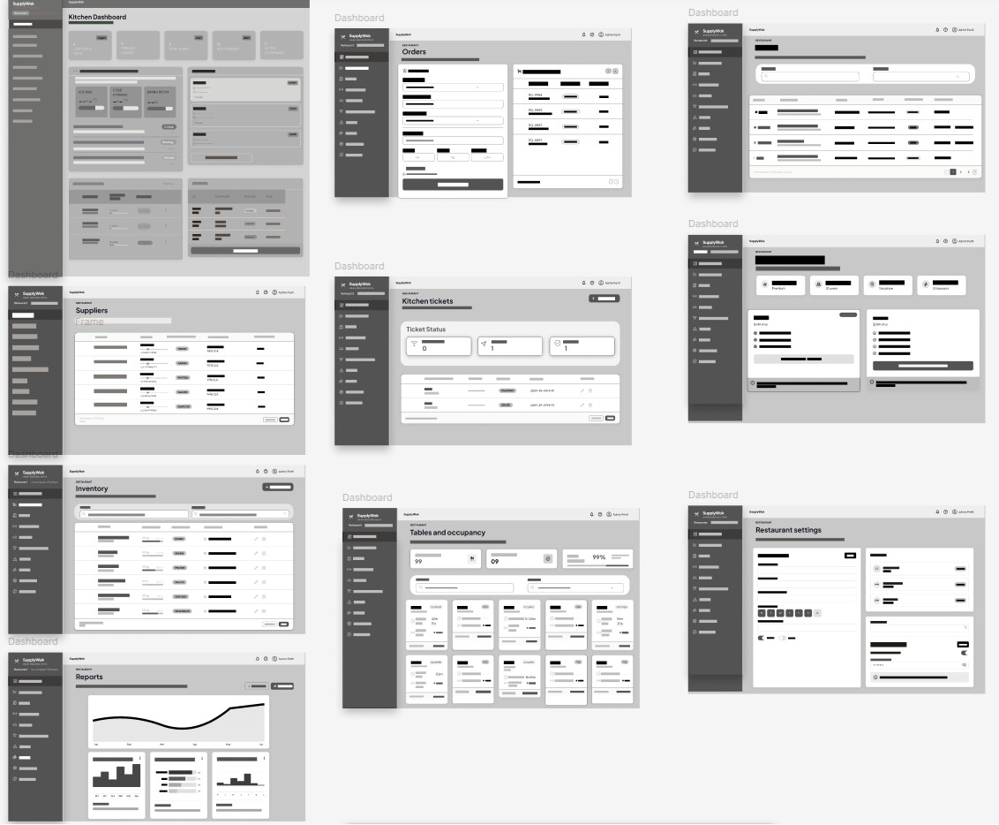
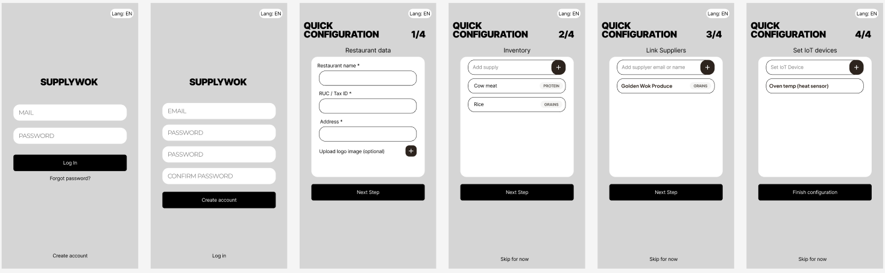
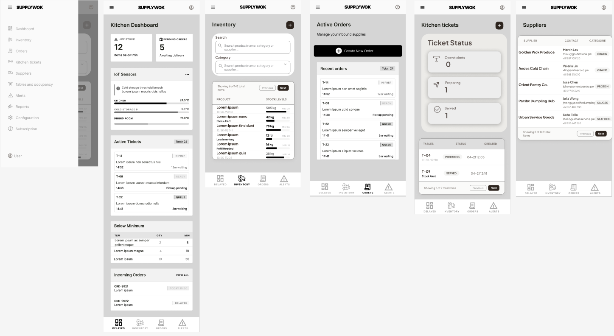
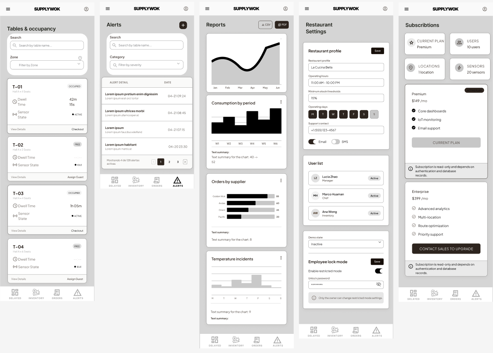

### 4.4.2. Web Applications Wireflow Diagrams.

Los wireflows de SupplyWok muestran cómo cambian las pantallas wireframe a medida que el usuario avanza en un flujo concreto. Cada wireflow se construye a partir de un user goal y representa la secuencia de pasos necesarios para alcanzarlo, incluyendo decisiones intermedias y estados relevantes de la interfaz.

**User Goal 1: Registrar y controlar insumos del restaurante.**  
El usuario accede a la aplicación y, al no estar logueado, puede optar por crear una nueva cuenta o iniciar sesión. Si selecciona “Crear cuenta”, se abre un formulario donde debe ingresar su nombre, apellidos, correo electrónico y contraseña. En caso de que falte algún campo, la aplicación mostrará un mensaje de advertencia hasta que se completen los datos correctamente. Una vez registrado, se muestra una confirmación y el usuario es redirigido al mapa principal. Si ya posee una cuenta, selecciona “Iniciar sesión” e ingresa sus credenciales. Si estas son incorrectas, el sistema mostrará un mensaje de error. Tras un inicio exitoso, el usuario accede a la pantalla principal con el mapa interactivo y las funciones disponibles.

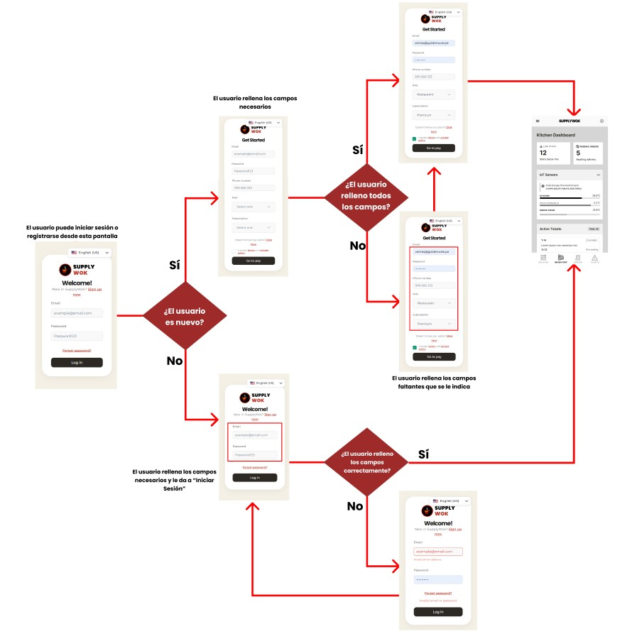 


**User Goal 2: Crear y dar seguimiento a un pedido de abastecimiento.**  
Este wireflow muestra cómo el restaurante inicia un pedido desde la sección de Pedidos, selecciona proveedor, agrega productos y revisa el estado del pedido una vez registrado. Si el usuario no rellena los campos adecuadamente, se muestra un mensaje de error. La secuencia evidencia una organización paso a paso que reduce errores y favorece la trazabilidad de la orden.

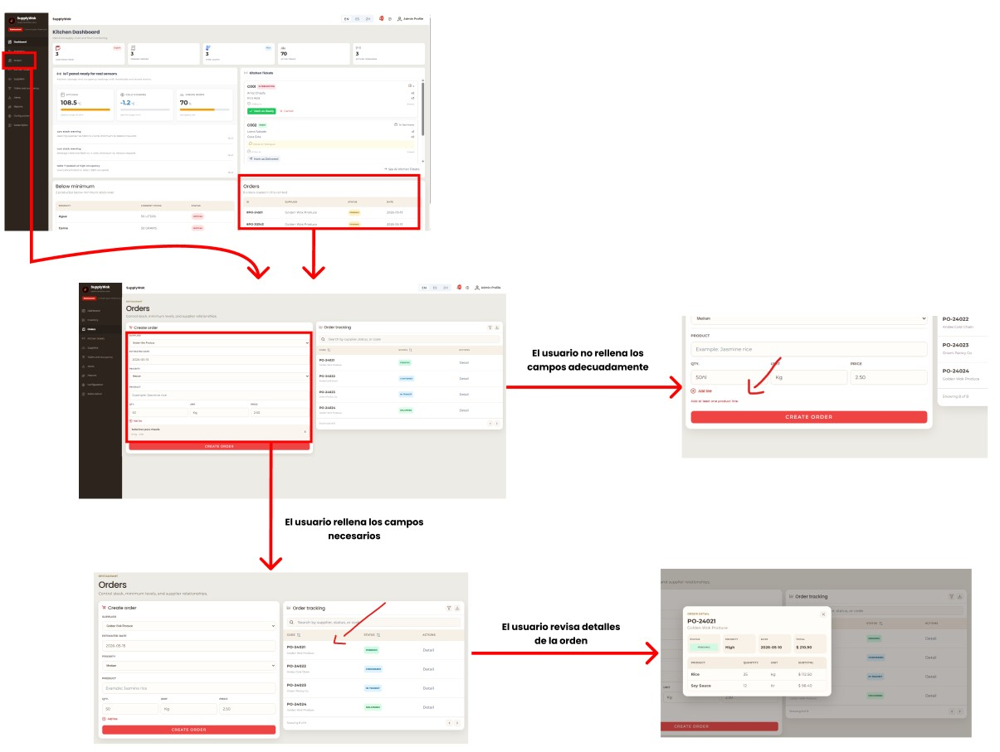

**User Goal 3: Gestionar comandas y operación interna del restaurante.**  
Este wireflow representa el flujo mediante el cual el personal del restaurante registra una comanda, la asocia a una mesa y hace seguimiento a su avance dentro de la operación interna. Empieza desde el dashboard a la pagina de comandas, luego a generar nuevo ticket y dependiendo el tipo de ticket se genera un formulario para crear la solicitud de la comanda, se rellena la solicitud y luego se envia y actualiza.

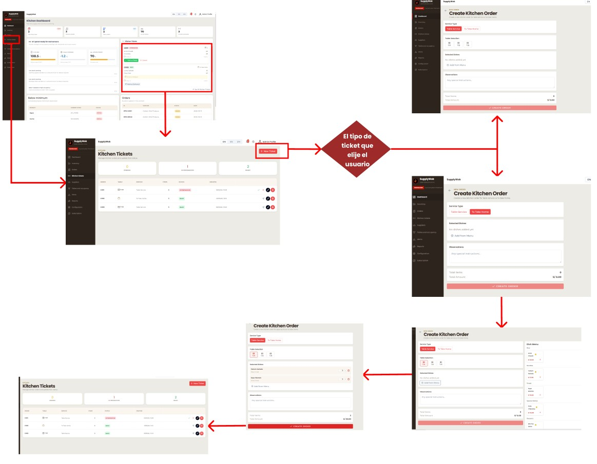
**User Goal 4: Gestionar pedidos recibidos y catálogo del proveedor.**  
Este wireflow muestra el recorrido del proveedor desde su dashboard hacia pedidos recibidos, clientes o catálogo de productos, permitiéndole revisar demanda, actualizar disponibilidad y dar seguimiento a entregas. Esto valida la coherencia de la experiencia del segundo rol principal del sistema.


### 4.4.3. Web Applications Mock-ups.

Los mock-ups de SupplyWok muestran la versión visual final de las aplicaciones web, incorporando el sistema de colores, tipografía, espaciado y componentes definidos en las Style Guidelines. En estas vistas se evidencia cómo la jerarquía visual, el diseño inclusivo y la arquitectura de información se traducen en pantallas operativas, legibles y consistentes para ambos roles.

En escritorio, los mock-ups reflejan una interfaz de trabajo con navegación lateral persistente, paneles informativos, tablas y tarjetas orientadas a la toma de decisiones. En mobile, la experiencia se reorganiza en bloques táctiles de una sola columna, priorizando la consulta rápida y la ejecución de acciones esenciales.

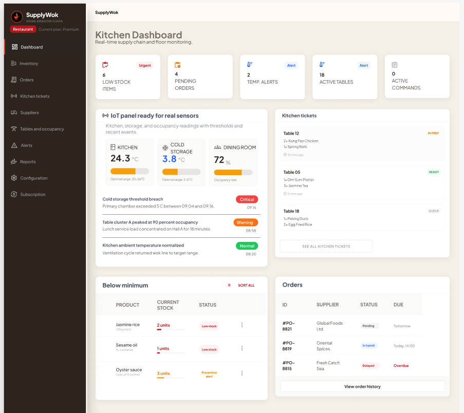
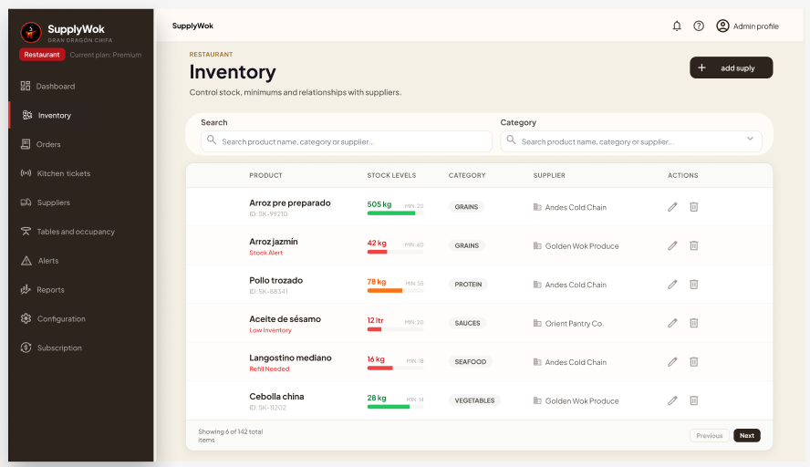
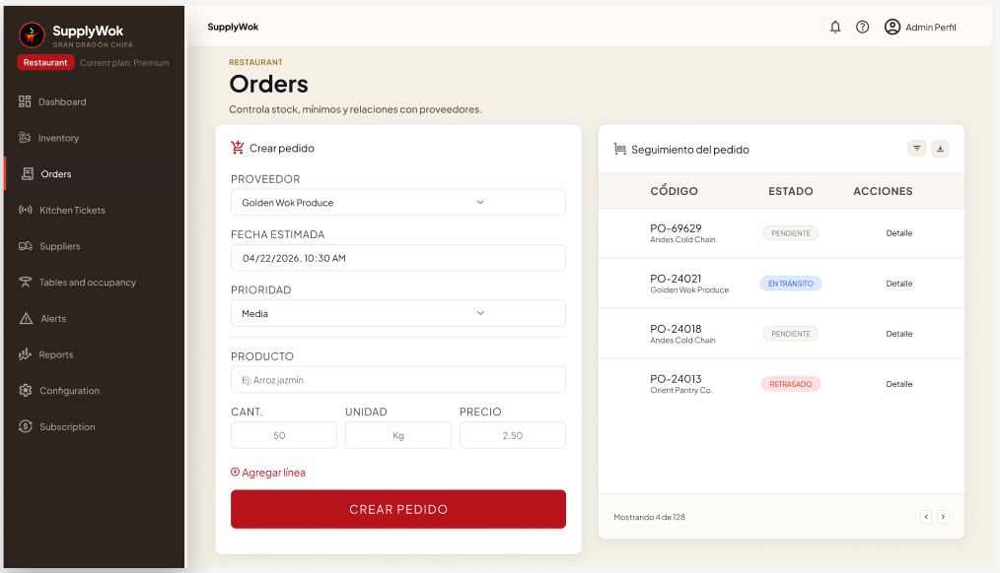


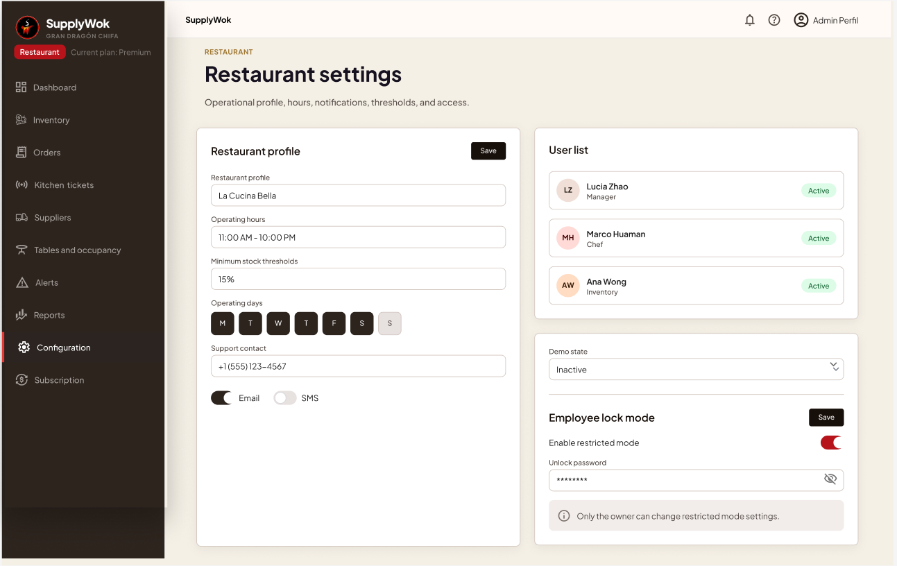
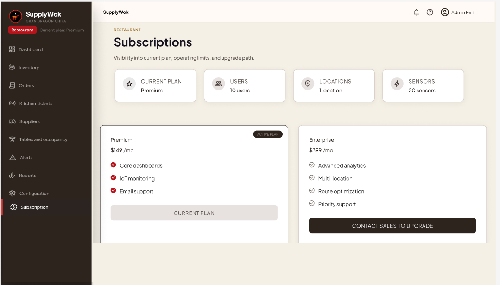
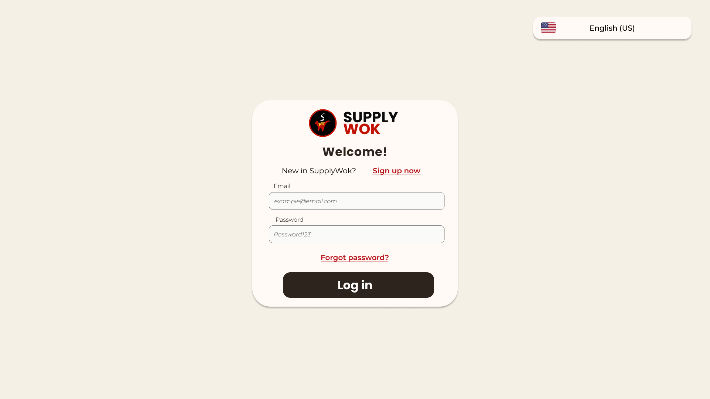
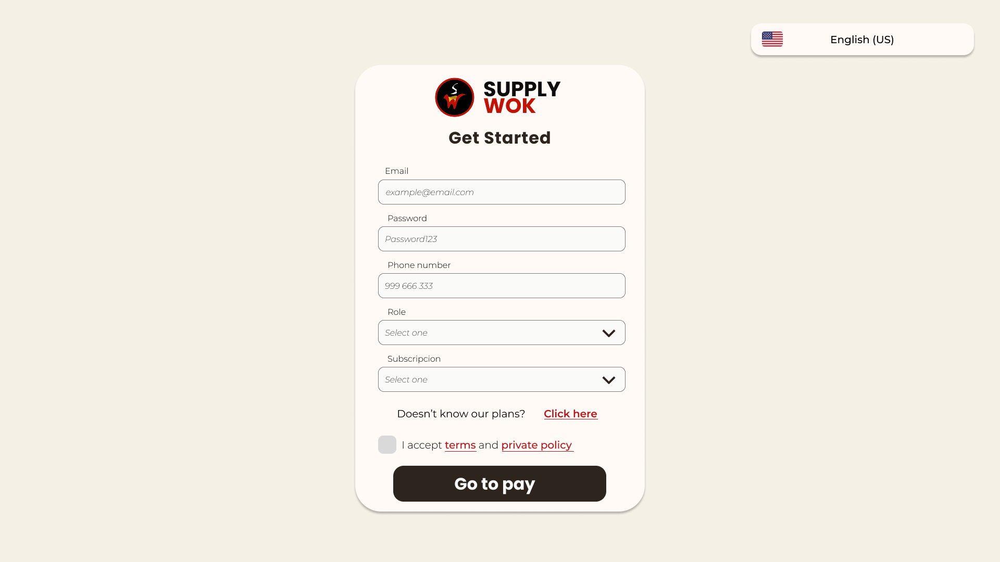

##### Login and Register Web


**1)** La seleccion de idioma del sistema, pudiendo escojer entre ingles, español y chino. <br>
**2)** Es la seccion donde el usuario podra rellenar su información, en el caso del login pedira su correo y contraseña, mientras que para registarse pedira correo, contraseña, rol y plan de suscripción. <br>
**3)** Son los campos para rellenar la información solicitada, en el caso del login son solo dos campos, mientras que para registarse son cuatro. Ambos campos en login con un ejemplo de correo y contraseña. <br>
**4)** Son los textos interacctivos, estos redirigen al usuario a otras secciones del sistema segun indique el texto. <br>
**5)** El botón principal, en el caso del login permite iniciar sesión, mientras que en el registro redirigire al pago para crear la cuenta.

##### Dashboard Main Page

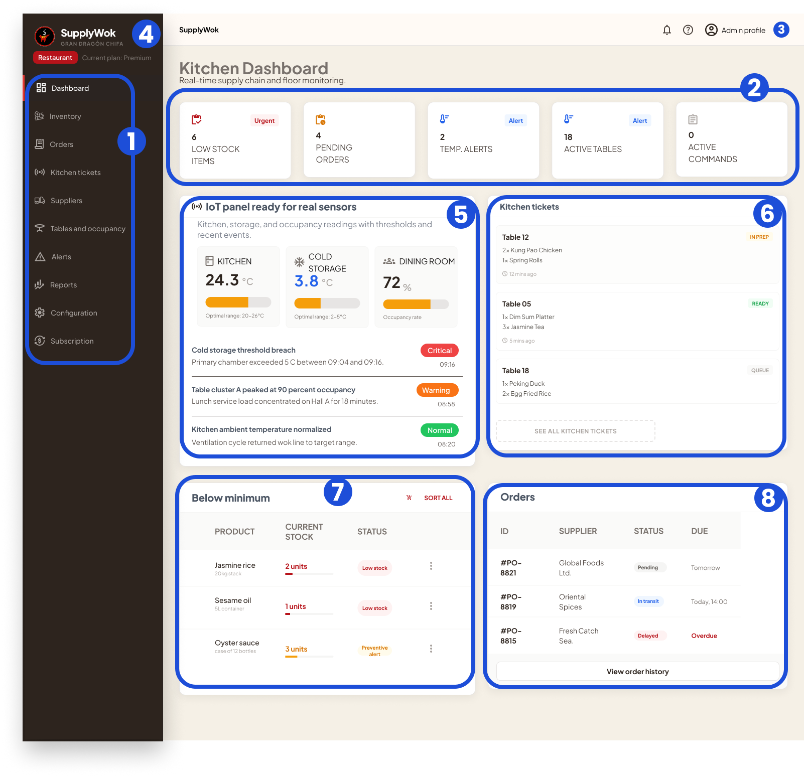

**1)** La barra de navegación lateral de la plataforma, interactuando con ella te permite navegar a las diferentes secciones del sistema, como lo son el inventario, ordenes, comandas, proveedores, etc.

**2)** En seccion superior dentro de la pagina esta la vista general con la información pertinente del rol, en este caso el inventario con bajos niveles de stock como ejemplo.

**3)** En el Header se muestran las notificaciones, preguntas o dudas y el perfil del usuario.

**4)** El aparatado visual que muestra nuestra plataforma con el rol y el nombre asociado.

**5)** Una seccion que muestra con más detalle la información de los sensores disponibles.

**6)** Una seccion que muestra con más detalle las comandas y sus estados.

**7)** Este apartado muestra informacion del inventario, priorizando los productos que estan bajos de stock.

**8)** Un apartado que muestra las ordenes que se hacen a los proveedores.

##### Inventory Page

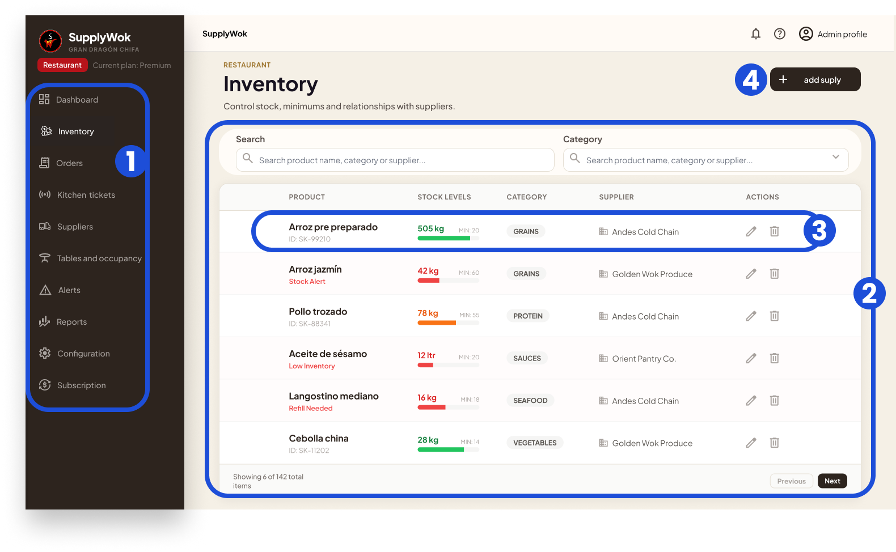

**1)** La barra de navegación lateral de la plataforma, interactuando con ella te permite navegar a las diferentes secciones del sistema.

**2)** La sección más detallada del inventario, mostrando todos los productos registrados en forma de lista, contando con buscadores por escritura del usuario y otro seleccionable por categorías.

**3)** El item de la lista del inventario muestra el nombre del producto, el nivel de stock, categoria, proveedor y acciones como editar o eliminar el producto.

**4)** El botón prncipal de esta sección, el cual permite agregar un nuevo producto al inventario.

##### Orders Page


**1)** La barra de navegación lateral de la plataforma, interactuando con ella te permite navegar a las diferentes secciones del sistema.

**2)** Sección para crear ordenes a los proveedores, permite seleccionar el proveedor, fecha  y prioridad; tambien añade los productos que se quieren pedir añadiendo lineas en forma de listas e indicando el precio. Contiene tambien el boton que enviaria la orden al proveedor.

**3)** Apartado para ver el seguimiento de las ordenes realizadas a proveedores, se muestran en forma de listas.

##### Kitchen Tickets Page


**1)** La barra de navegación lateral de la plataforma, interactuando con ella te permite navegar a las diferentes secciones del sistema.

**2)** Una vista rápida de las comandas mostrando cuantas estan abiertas, en preparacion y listas.

**3)** Vista detallada de las comandas, mostrando a que mesa pertenece, el estado de la comanda y su fecha de creación, con acciones que se pueden hacer a cada comanda como eliminarlo.

**4)** El botón principal, el cual permite crear una nueva comanda.

##### Suppliers Page

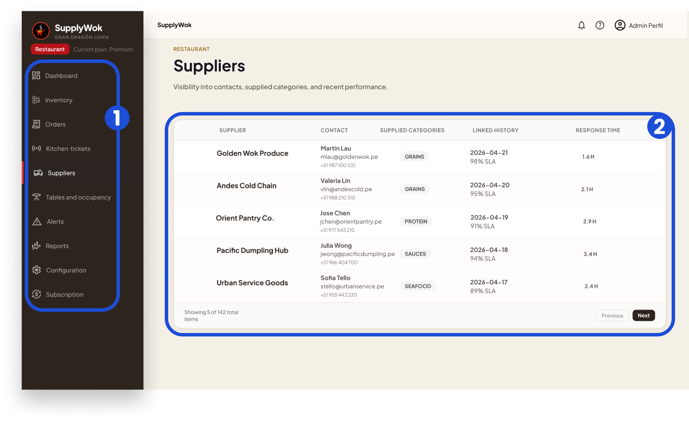

**1)** La barra de navegación lateral de la plataforma, interactuando con ella te permite navegar a las diferentes secciones del sistema.

**2)** Lista detallada de los proveedores disponibles en la plataforma, la información que muestra en en formato de listas con el nombre del proveedor, datos de contacto, categorías de suministros, etc. Tambien cuenta con un botón para pasar a la siguiente vista con más proveedores en caso hallan.

##### Tables Page


**1)** La barra de navegación lateral de la plataforma, interactuando con ella te permite navegar a las diferentes secciones del sistema.

**2)** Vista simple de las mesas, mostrando las mesas ocupadas, libres y un porcentaje de ocupación.

**3)** Sección de búsqueda, uno por input del usuario y un seleccionable por zonas.

**4)** Apartado que muestra una vista detallada de las mesas con su número de comensales, estado, etc. Para ver todos es necesario hacer scroll hacia abajo.

##### Alerts Page


**1)** La barra de navegación lateral de la plataforma, interactuando con ella te permite navegar a las diferentes secciones del sistema.

**2)** Sección de búsqueda, uno por input del usuario y un seleccionable por prioridad.

**3)** Una lista detallada de las alertas notificadas, mostrando su prioridad, detalle, fuente, fecha, estado y como accion marcarlo como leída.

##### Reports Page


**1)** La barra de navegación lateral de la plataforma, interactuando con ella te permite navegar a las diferentes secciones del sistema.

**2)** Botones para exportar los datos del reporte a formato PDF o CSV.

**3)** Sección de gráficos que permite ver los datos del reporte de forma visual. incluye la evolución del inventario, el comsumo por periodos, ordenes por proveedor e incidentes.

##### Settings Page

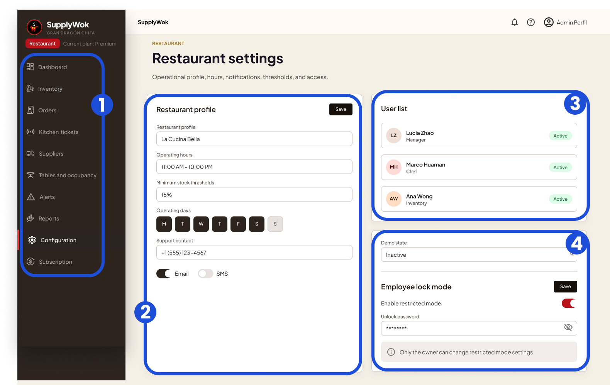

**1)** La barra de navegación lateral de la plataforma, interactuando con ella te permite navegar a las diferentes secciones del sistema.

**2)** Sección del perfil del usuario. Permite cambiar datos y horarios, ademas de habilitar notificaciones por SMS o Email.

**3)** Lista de Usuarios que tiene acceso a las comandas, tanto para crearlas como asignarlas.

**4)** Bloqueador del sistema, permite bloquear las funciones del sistema para que el personal solo pueda ver las secciones autorizadas.

##### Subscription Plans Page

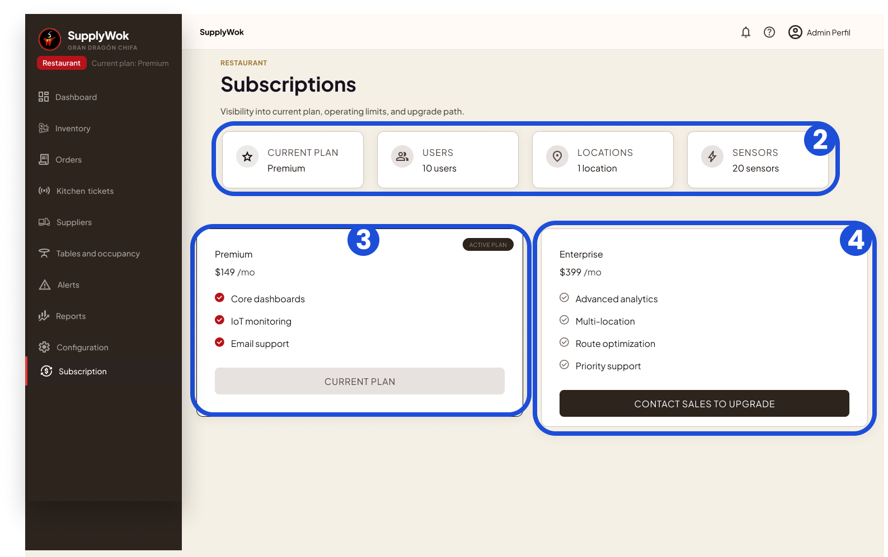

**1)** La barra de navegación lateral de la plataforma, interactuando con ella te permite navegar a las diferentes secciones del sistema.

**2)** Sección de vista rápida que muestra el plan actual, usuarios, locaciones y sensores que tiene el usuario.
**3)** Primer plan de suscripción, muestra sus beneficios, precio y un botón para adquirirlo, en caso ya lo tenga se desactiva y cambia el texto a "Plan Actual".

**4)** Segundo plan de suscripción, muestra sus beneficios, precio y un botón para adquirirlo, en caso ya lo tenga se desactiva y cambia el texto a "Plan Actual".

#### mobile
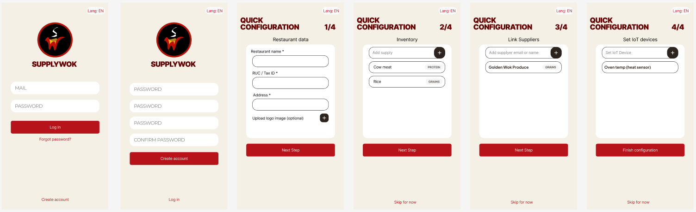

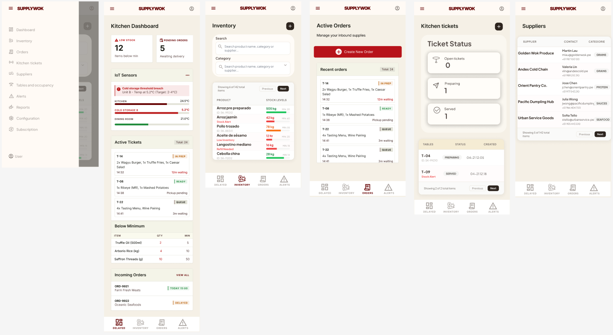
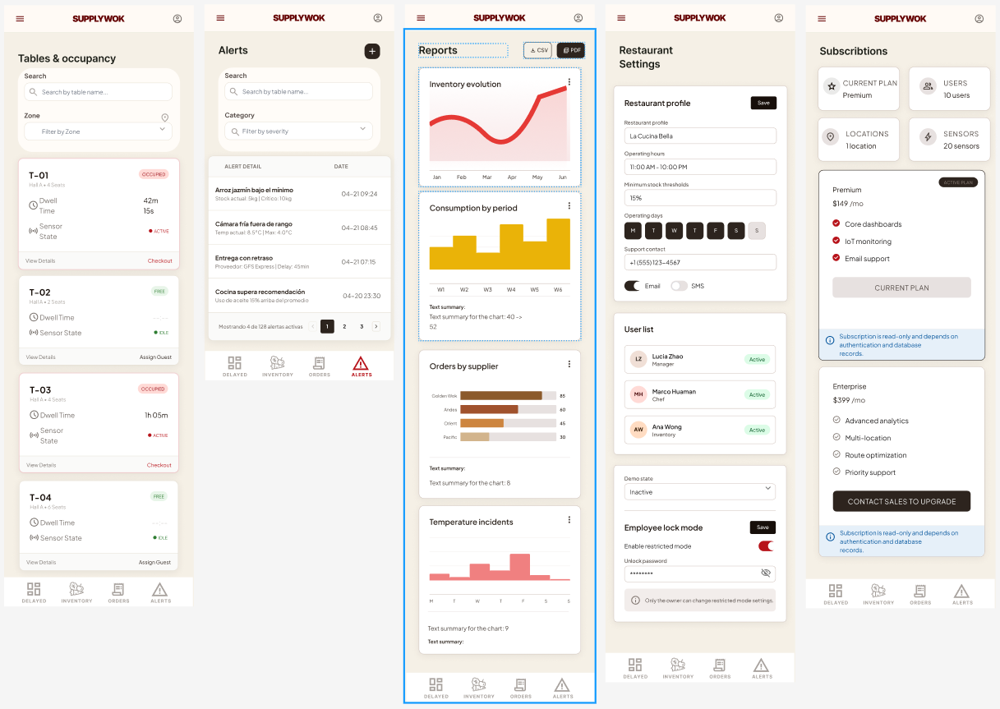

### 4.4.4. Web Applications User Flow Diagrams.

Los User Flow Diagrams de SupplyWok representan los recorridos funcionales principales de los usuarios dentro del sistema, considerando tanto la ruta esperada como posibles variantes o interrupciones. A diferencia del wireflow, aquí el foco está en la lógica de navegación, las decisiones del usuario y las condiciones que afectan la continuidad del flujo.

**User Goal 1: Mantener actualizado el inventario del restaurante.**  
Happy path: el usuario ingresa al Dashboard, accede a Inventario, selecciona la opción para agregar o editar un insumo, guarda la información y visualiza la actualización reflejada en la tabla principal.  
Unhappy path: el usuario omite campos obligatorios o ingresa valores inválidos; el sistema bloquea el guardado y muestra mensajes de validación.


**User Goal 2: Generar un pedido de abastecimiento correctamente.**  
Happy path: el restaurante accede al módulo de Pedidos, selecciona proveedor, agrega productos, confirma cantidades y registra la orden, quedando visible con estado pendiente.  
Unhappy path: no existe stock de referencia, no se selecciona proveedor o faltan productos; el sistema notifica el error y evita el registro incompleto.

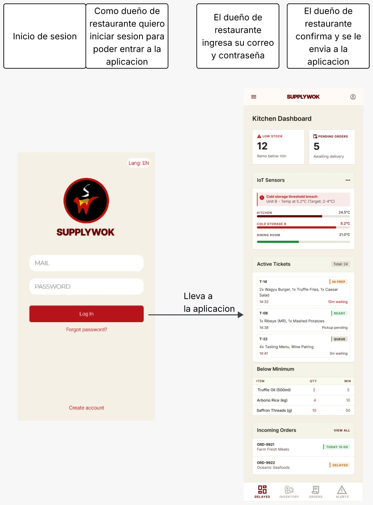

**User Goal 3: Gestionar una comanda hasta su finalización.**  
Happy path: el personal registra una comanda, la asocia a una mesa, la cocina la procesa y el sistema actualiza su estado hasta marcarla como lista o entregada.  
Unhappy path: la mesa no está disponible, la comanda queda incompleta o el estado no puede avanzar por una inconsistencia operativa; el sistema informa la condición al usuario.


**User Goal 4: Dar seguimiento a pedidos desde la vista proveedor.**  
Happy path: el proveedor accede a pedidos recibidos, revisa el detalle, actualiza el estado del despacho y confirma la entrega.  
Unhappy path: el pedido está retrasado, faltan productos o el proveedor no puede confirmar entrega; el sistema permite registrar la incidencia y mantener trazabilidad del estado.


## 4.5. Web Applications Prototyping.

La fase de prototipado de SupplyWok permite simular la navegación y la interacción principal de las aplicaciones antes de su implementación final. Los prototipos fueron diseñados para validar la continuidad entre arquitectura de información, componentes de interfaz y flujos funcionales, tanto en escritorio como en mobile. Además del prototipo navegable en Figma, esta sección debe incorporar evidencia audiovisual del recorrido de uso, tal como solicita la rúbrica.

#### Escritorio
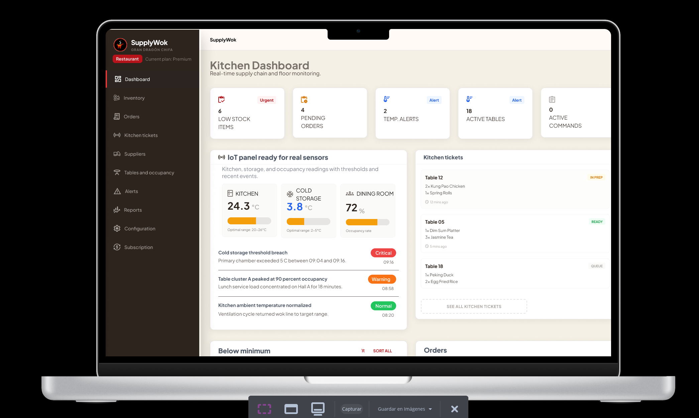

[https://www.figma.com/proto/JUBnvZfJvlrpxIpW8ICRvS/SupplyWok?node-id=428-4042&p=f&t=kGhZbpCdqH2BntGS-0&scaling=scale-down&content-scaling=fixed&page-id=428%3A2335](https://www.figma.com/proto/JUBnvZfJvlrpxIpW8ICRvS/SupplyWok?node-id=428-4042&p=f&t=kGhZbpCdqH2BntGS-0&scaling=scale-down&content-scaling=fixed&page-id=428%3A2335)

#### Mobile
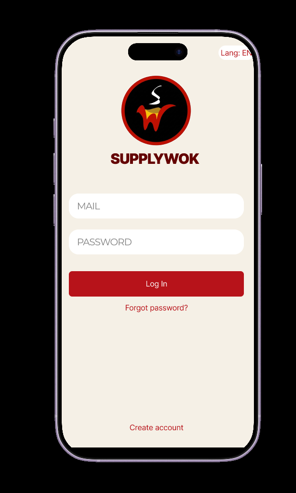

[https://www.figma.com/proto/JUBnvZfJvlrpxIpW8ICRvS/SupplyWok?node-id=428-2336&p=f&t=kGhZbpCdqH2BntGS-0&scaling=scale-down&content-scaling=fixed&page-id=428%3A2336](https://www.figma.com/proto/JUBnvZfJvlrpxIpW8ICRvS/SupplyWok?node-id=428-2336&p=f&t=kGhZbpCdqH2BntGS-0&scaling=scale-down&content-scaling=fixed&page-id=428%3A2336)

#### Video prototype
[https://tinyurl.com/3su7w5hs](https://tinyurl.com/3su7w5hs)

## 4.6. Domain-Driven Software Architecture.


### 4.6.1. Design-Level EventStorming.

En esta sección se detalla el proceso de Design-Level EventStorming realizado por el equipo para perfeccionar el modelo del dominio de Aurora. Partiendo del Big Picture, profundizamos en el comportamiento interno del sistema para alcanzar el mayor nivel de detalle arquitectónico posible.

Primero, refinamos la línea de tiempo original, eliminando eventos redundantes o procesos manuales que quedaban fuera del alcance tecnológico de la plataforma. Sobre este flujo depurado, incorporamos los elementos tácticos del Domain-Driven Design: Actores y Comandos para representar las intenciones, Políticas para las reglas automáticas, y Agregados (Aggregates) como responsables de procesar las operaciones y emitir los eventos de dominio. Este nivel de granularidad nos permitió consolidar y justificar las fronteras definitivas de nuestros Bounded Contexts.

#### Bounded context 1 
Este contexto delimitado constituye el núcleo operativo para la gestión de inventario en los restaurantes tipo chifa dentro de la plataforma Aurora. Se identificaron entidades como Insumo, Stock y Merma, junto con conceptos del lenguaje ubicuo como threshold (umbral). A partir de comandos como Register Daily Consumption e Increment Stock Levels, se generan eventos como Daily Consumption Registered y Stock Levels Incremented. Asimismo, se definieron políticas de negocio como el cálculo automático de incremento de stock al registrar nuevos productos y la validación de inconsistencias, por ejemplo, cuando se registra consumo sin stock previo, lo que puede desencadenar auditorías o alertas de riesgo.

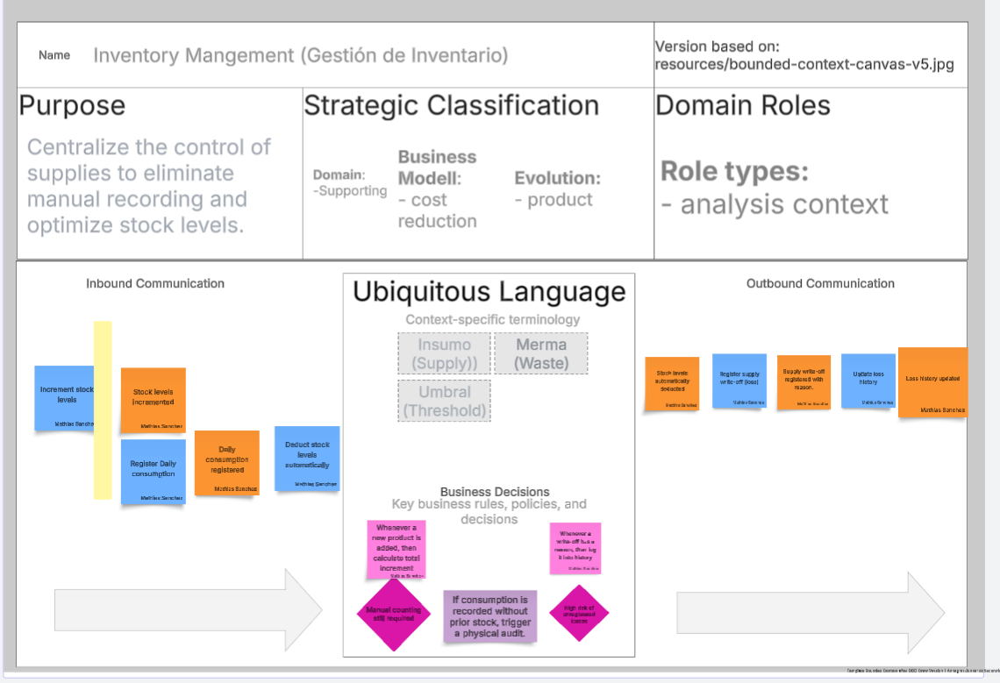

#### Bounded context 2 

Este contexto delimitado actúa como el puente transaccional entre los restaurantes y sus proveedores, permitiendo la gestión de abastecimiento del stock. Se identificaron entidades como Purchase Order y conceptos clave como Lead Time y Forecasting dentro del lenguaje ubicuo. A partir del comando Identify Low Stock Levels, se genera el evento Low Stock Levels Identified, el cual puede activar políticas como la generación automática de solicitudes de reposición. Asimismo, el flujo incluye eventos como Order Sent to Supplier, Supplier Notified y Delivery Order Sent to Restaurant, junto con reglas de negocio que contemplan seguimiento manual y actualización automática del estado de los pedidos.

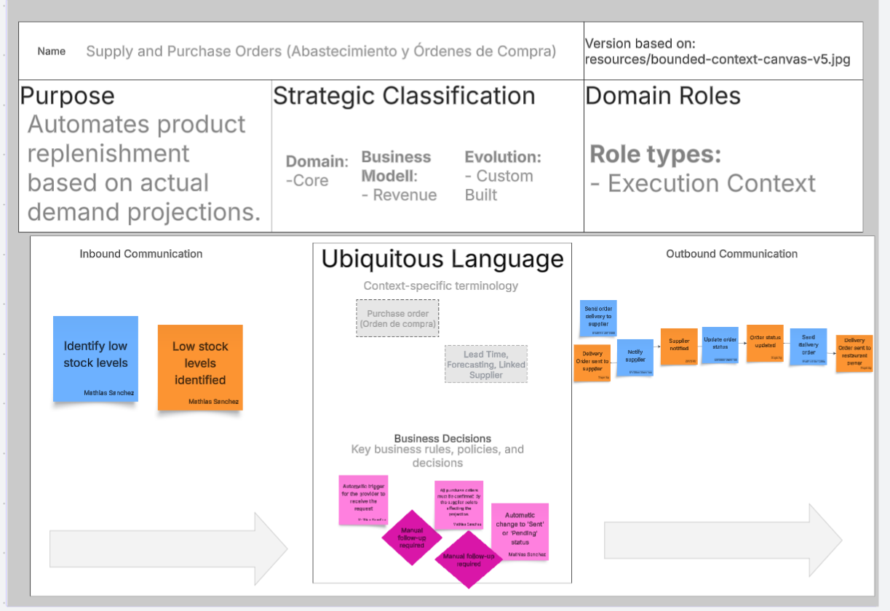

#### Bounded context 3

Este contexto delimitado tiene como propósito supervisar las condiciones físicas del entorno del restaurante mediante sensores. Se modelan entidades como Sensor y Lectura Ambiental, incorporando conceptos como safe range y downtime en el lenguaje ubicuo. A partir de comandos como Detect Disconnected Sensor y Define Safe Temperature Thresholds, se generan eventos como Disconnected Sensor Detected y Temperature Range Registered. Además, se establece una política que permite mostrar alertas cuando se detecta una desconexión, reflejada en eventos como Sensor Disconnected Warning Displayed.

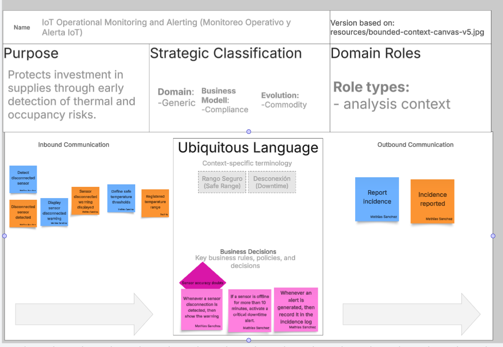

#### Bounded context 4

Este contexto delimitado gestiona la interacción con proveedores y el seguimiento del rendimiento en las entregas. A partir del comando Confirm Delivery Completion, se genera el evento Delivery Completion Confirmed, seguido por la recepción de notificaciones (Confirmation Notification Received). Dentro del lenguaje ubicuo se incorpora el concepto de performance, el cual permite evaluar el cumplimiento y eficiencia en el proceso de entrega, apoyando la toma de decisiones operativas.

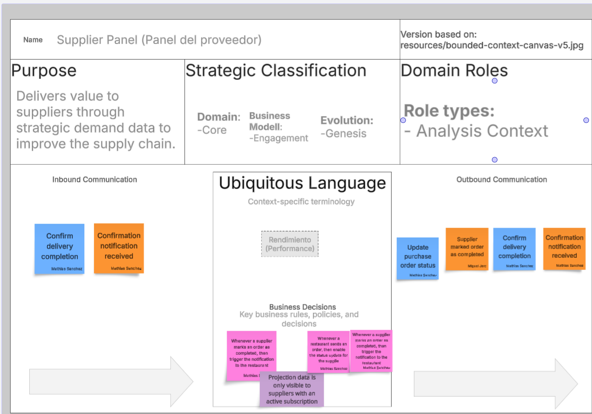

#### Bounded context 5

Este contexto delimitado representa la gestión de suscripciones y pagos dentro de la plataforma. Se identificaron comandos como Subscription Plan Comparison, Select Subscription Plan y Submit Payment Details, que generan eventos como Subscription Plan Selected y Completed Payment Form. Asimismo, se definieron políticas relacionadas con el control de acceso mediante mecanismos de lockdown y desbloqueo según el estado de la suscripción. El lenguaje ubicuo incluye conceptos como credentials, representando los datos de acceso del usuario.

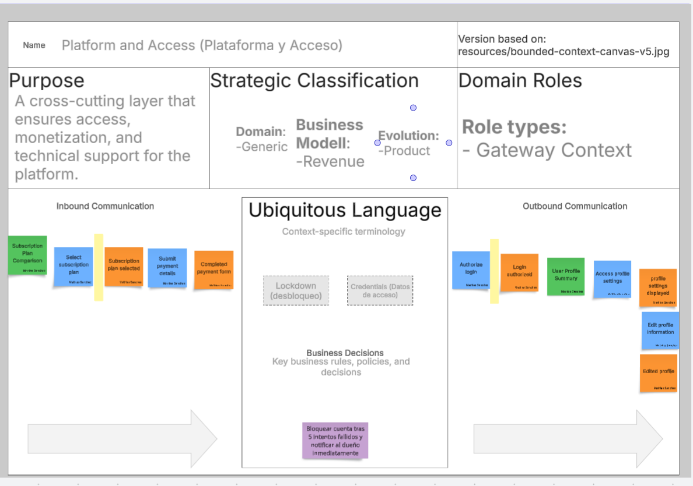

#### Bounded context 6

Este contexto delimitado modela la operación interna del restaurante en la gestión de pedidos entre salón y cocina. Se identificaron comandos como Assign Table to Order y Create Kitchen Order, que generan eventos como Table Assigned to Menu Order y Kitchen Order Created. Dentro del lenguaje ubicuo se incorporan términos como kitchen ticket (comanda) y lockdown mode, relacionado con el modo de operación en cocina. Este contexto permite garantizar la trazabilidad y correcta ejecución del flujo de pedidos.

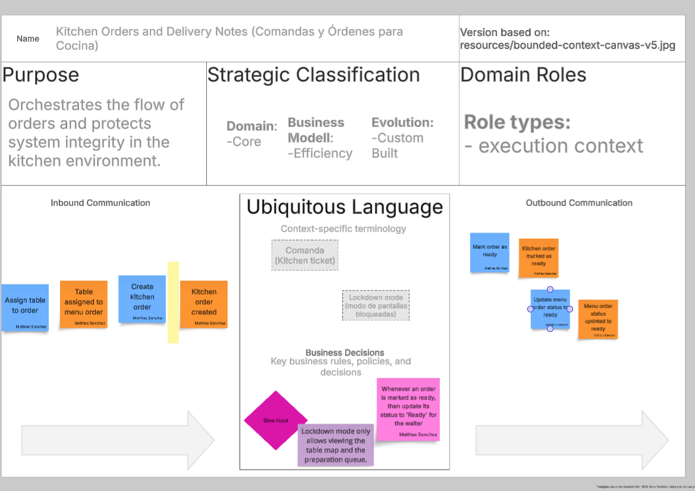

Aquí se encuentra el enlace de LucidChart del proceso:
[lucid chart](https://lucid.app/lucidspark/5b28482f-d099-4d83-a08c-9b7af6d88474/edit?view_items=bz3RN-x7D4~0&page=0_0&invitationId=inv_b6c94e5b-c9dc-4932-9e69-f11cae2d319d)

### 4.6.2. Software Architecture Context Diagram.

El Software Architecture Context Diagram de SupplyWok presenta el sistema como una solución central que interactúa con sus actores principales y con servicios externos necesarios para su funcionamiento. En este nivel, el objetivo no es mostrar detalles internos de implementación, sino delimitar claramente el alcance del sistema, sus usuarios y los sistemas externos con los que intercambia información.

En el diagrama se observa que los actores principales son el restaurante y el proveedor, quienes utilizan SupplyWok para gestionar abastecimiento, operación y seguimiento de pedidos. Asimismo, el sistema se relaciona con Stripe como servicio externo para la gestión de pagos o suscripciones. Esta representación permite comprender el lugar que ocupa SupplyWok dentro del ecosistema digital de la solución y deja clara la frontera entre la plataforma desarrollada por el equipo y los servicios de terceros.


### 4.6.3. Software Architecture Container Diagrams.

El Container Diagram de SupplyWok muestra la descomposición de la solución en sus principales contenedores de software y la forma en que se distribuyen las responsabilidades entre ellos. En este nivel se identifican la Landing Page, la Single Page Application, la Mobile Web App, la API principal, la base de datos y los servicios externos involucrados.

La Landing Page cumple una función de presentación y conversión, guiando al visitante hacia el registro o inicio de sesión. La Single Page Application concentra la experiencia operativa principal en navegador, mientras que la Mobile Web App ofrece acceso adaptado a pantallas reducidas y tareas rápidas. Ambas aplicaciones consumen la SupplyWok API mediante comunicación JSON/HTTPS, delegando en el backend la lógica de negocio, persistencia y coordinación entre módulos. La API, a su vez, se conecta con la base de datos PostgreSQL para almacenar y consultar la información del dominio, y con Stripe para funciones relacionadas con pagos o suscripción.

Este diagrama permite justificar las principales decisiones tecnológicas y evidencia una arquitectura desacoplada, donde la interfaz, la lógica de negocio y la persistencia mantienen responsabilidades diferenciadas.


### 4.6.4. Software Architecture Components Diagrams.

El Component Diagram de SupplyWok profundiza en la estructura interna del contenedor más crítico de la solución: la API. En este nivel se identifican los componentes responsables de atender operaciones específicas del dominio, así como sus relaciones con servicios de autenticación, persistencia y procesamiento de eventos del negocio.

Dentro del contenedor backend se distinguen componentes como Access Controller, Restaurant Controller, Orders Controller, Delivery Orders Controller, Provider Controller, Inventory Controller e IoT Controller. Cada uno encapsula una responsabilidad concreta del sistema: autenticación y control de acceso, gestión de operaciones del restaurante, procesamiento de órdenes, seguimiento de entregas, administración de proveedores, control de inventario y monitoreo operativo basado en sensores. Esta descomposición ayuda a visualizar cómo la API distribuye su lógica interna y cómo cada componente participa en el flujo general de la solución.

La representación también evidencia la relación de estos componentes con la base de datos y con los servicios de soporte, reforzando la idea de una arquitectura modular que facilita mantenimiento, escalabilidad y evolución del sistema.

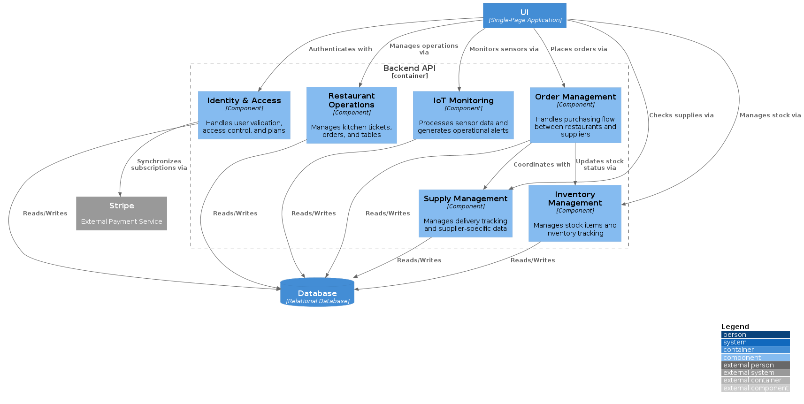


## 4.7. Software Object-Oriented Design.
### 4.7.1. Class Diagrams.

En esta seccion se presentar;a y se explicará el diagrama de clases por cada Bounded Context


El **Inventory Management Bounded Context** es el encargado de gestionar los recursos de inventario de cada restaurante, incluyendo el control de stock, niveles mínimos y movimientos de entrada y salida.

El **InventoryService** actúa como capa de aplicación, coordinando las operaciones del sistema. Este servicio utiliza el **InventoryRepository** para la persistencia de datos y el **InventoryItem** como entidad principal del dominio, encargada de representar cada insumo almacenado en el Inventario del restaurante.El **StockMovement** representa las modificaciones realizadas al stock de cada ítem, permitiendo llevar un registro detallado de entradas, salidas y ajustes.


El **Supply and Purchasing Bounded Context** es el encargado de gestionar las órdenes de compra realizadas por cada restaurante, incluyendo el registro, cancelación y seguimiento de los pedidos.

El **PurchaseOrderService** actúa como capa de aplicación, coordinando las operaciones del sistema. Este servicio utiliza el **PurchaseOrderRepository** para la persistencia de datos y el **PurchaseOrder** como entidad principal del dominio, encargada de representar toda la información de una orden de compra de insumos del restaurante. Además, el **OrderItem** encapsula las especificaciones de cada producto dentro de la orden, como la cantidad solicitada y el precio unitario, permitiendo un control detallado de cada pedido.

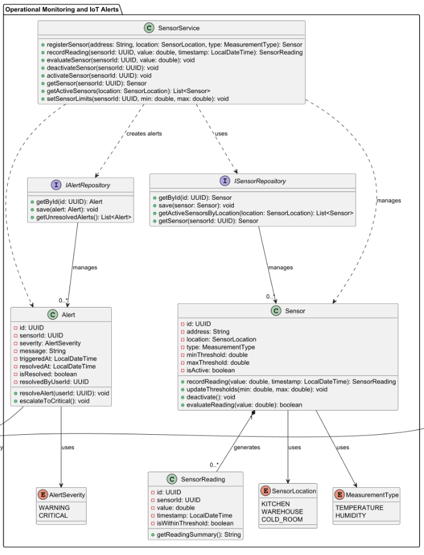

El **Operational Monitoring and IoT Alerts Bounded Context** es el encargado de gestionar la información recopilada por los sensores del restaurante, así como la configuración y generación de alertas ante condiciones fuera de los rangos establecidos.

El **SensorService** actúa como capa de aplicación, coordinando las operaciones del sistema. Este servicio utiliza los repositorios **IAlertRepository** y **ISensorRepository** para la persistencia de datos.

Además, emplea la entidad **Sensor**, junto con **SensorReading**, para representar la información capturada por los sensores. Por otro lado, la entidad **Alert** modela las alertas generadas cuando una medición supera los límites configurados.

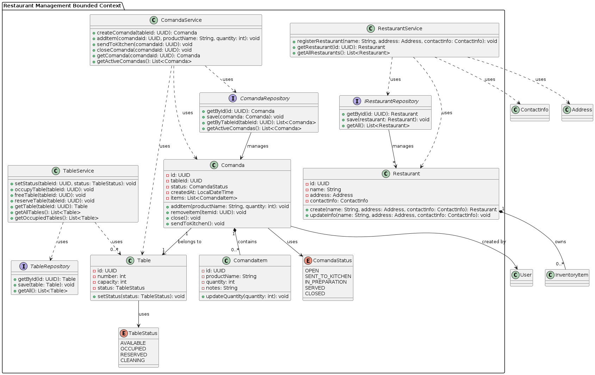

El **Restaurant Management Bounded Context** es el encargado de gestionar todo lo relacionado con la operación del establecimiento, incluyendo la administración de mesas y la gestión de comandas en cada restaurante.

Los servicios **ComandaService**, **RestaurantService** y **TableService** actúan como capa de aplicación, coordinando las distintas operaciones del sistema. Estos servicios utilizan los repositorios **ComandaRepository**, **IRestaurantRepository** y **TableRepository** respectivamente para la persistencia de datos.

Además, se emplean las entidades **Table**, que representa una mesa dentro del restaurante; **Comanda** y **ComandaItem**, que modelan las órdenes de consumo; y **Restaurant**, que encapsula la información principal de cada restaurante.


El **Supplier Management & Operations Bounded Context** es el encargado de gestionar la información de los proveedores, sus catálogos de productos y las operaciones relacionadas con el cumplimiento de pedidos.

Los servicios **SupplierService**, **SupplierCatalogService**, **DemandForecastService** y **OrderFulfillmentService** actúan como capa de aplicación, coordinando las distintas operaciones del sistema dentro de este contexto.

El **SupplierService** gestiona la información de los proveedores utilizando el repositorio **SupplierRepository**. Por su parte, el **SupplierCatalogService** administra los productos ofrecidos por cada proveedor mediante **SupplierCatalog** y **CatalogItem**, utilizando **SupplierCatalogRepository** para la persistencia.

Además, el **DemandForecastService** se encarga de generar proyecciones de demanda a través de la entidad **DemandForecast**, la cual contiene múltiples **ProductDemand** que representan estimaciones de consumo.

Finalmente, el **OrderFulfillmentService** gestiona el proceso de entrega de pedidos mediante la entidad **OrderFulfillment**, permitiendo hacer seguimiento al estado de los envíos desde su despacho hasta su entrega final.

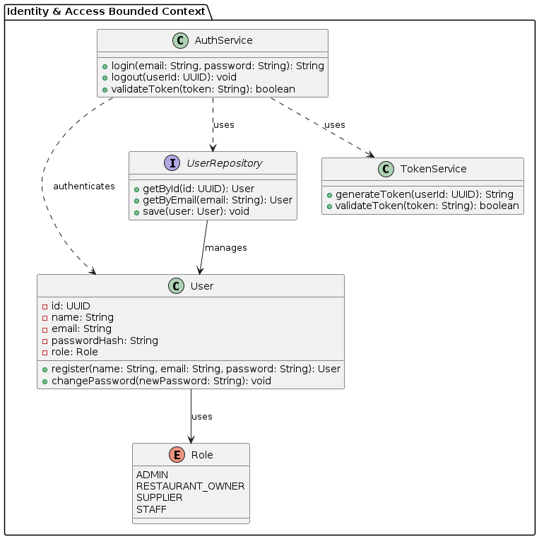

El **Identity & Access Bounded Context** es el encargado de gestionar todo lo relacionado con la autenticación y administración de cuentas de usuario en el sistema.

Los servicios **AuthService** y **TokenService** actúan como capa de aplicación, coordinando las operaciones de autenticación. El **AuthService** utiliza el repositorio UserRepository para la persistencia de datos, mientras que **TokenService** se encarga de la generación y validación de tokens de acceso.

La entidad **User** encapsula toda la información relevante de un usuario en la plataforma, como su correo electrónico, contraseña (almacenada de forma segura) y su **Role**, el cual define sus permisos dentro del sistema.

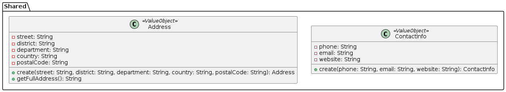

El **Shared Bounded Context** contiene Value Objects comunes que son reutilizados por múltiples bounded contexts del sistema, evitando duplicación y promoviendo consistencia en el modelo.

El **ContactInfo** encapsula la información de contacto relevante, como teléfono, correo electrónico y sitio web. Este value object es utilizado por entidades como **Supplier** y **Restaurant**. Por otro lado, **Address** encapsula la información de dirección necesaria, siendo utilizado también por entidades como **Supplier** y **Restaurant** para representar ubicaciones físicas de manera estructurada.

## 4.8. Database Design.

El siguiente Diagrama Entidad-Relación detalla la estructura de datos fundamental que soporta la lógica de la plataforma. A este modelo, compuesto por 25 entidades, se le aplicaron las tres fases de normalización para garantizar un diseño robusto y eficiente. Esto asegura la escalabilidad, la separación de responsabilidades y el mantenimiento de la aplicación, organizada en los siguientes seis módulos:

- #### Gestión de Inventario

Controla las entradas, salidas y niveles de stock para evitar desabastecimientos o excesos.

- #### Abastecimiento y Órdenes de Compra

Gestiona los pedidos de insumos entre el restaurante y el proveedor, reduciendo los tiempos de respuesta entre ambos.

- #### Panel del Proveedor

Centraliza la funcionalidad del proveedor, permitiendo una mejor gestión de catálogos y pedidos.

- #### Plataforma y Acceso

Administra el acceso seguro de los usuarios, sus cuentas y planes de suscripción.

- #### Monitoreo Operativo y Alertas IoT

Representa el núcleo operativo del sistema; controla sensores y notificaciones para garantizar la seguridad en el entorno de trabajo.

- #### Comandas y Órdenes para Cocina

Facilita la comunicación eficiente entre la cocina y las mesas para garantizar un servicio rápido y sin errores.


### 4.8.1. Database Diagrams.

El Database Diagram de SupplyWok representa la estructura relacional que soporta la persistencia de información del sistema. Aunque se presenta como un modelo integrado, su organización responde a los bounded contexts y módulos funcionales definidos previamente en la arquitectura del dominio. De esta manera, el diagrama no solo muestra tablas, sino también la forma en que se distribuyen responsabilidades de persistencia según cada área del sistema.

#### Inventory Management Bounded Context

En este contexto, la persistencia se centra en el control de insumos y movimientos de stock. Las tablas `INSUMOS`, `MOVIMIENTO_INVENTARIO` y `TIPO_MOVIMIENTO_INVENTARIO` permiten registrar productos, cambios de cantidad y clasificación del movimiento. Aquí se evidencia el uso de claves primarias y foráneas para relacionar cada movimiento con su insumo correspondiente y con el tipo de operación ejecutada.

#### Supply and Purchasing Bounded Context

La gestión de órdenes de compra se modela principalmente a través de `ORDEN_COMPRA`, `DETALLE_ORDEN` y `ESTADO_ORDEN_COMPRA`. Estas tablas permiten registrar el encabezado de cada pedido, sus ítems específicos y el estado transaccional de la orden. Las relaciones entre ellas garantizan integridad referencial y facilitan trazabilidad del pedido desde su creación hasta su entrega.

#### Supplier Management & Operations Bounded Context

La información de los proveedores y sus catálogos se representa mediante tablas como `PROVEEDOR` y `CATALOGO_PROVEEDOR`. Estas estructuras permiten asociar proveedores con los insumos que ofrecen, así como registrar precios, unidades y disponibilidad. Este módulo también se relaciona con el contexto de pedidos, ya que un proveedor puede participar en múltiples órdenes de compra.

#### Identity & Access Bounded Context

La persistencia del acceso y administración de usuarios se modela con `USUARIO`, `ROL_USUARIO`, `PLANES` y `NOMBRE_PLAN`. Estas tablas permiten gestionar credenciales, roles, tipo de plan y relación entre cuenta y nivel de suscripción. Esto asegura que la plataforma pueda distinguir permisos, acceso y condiciones comerciales de cada usuario registrado.

#### Operational Monitoring and IoT Alerts Bounded Context

El monitoreo operativo se soporta con tablas como `ALERTAS`, `TIPO_ALERTA`, `SENSORES`, `TIPO_SENSOR`, `LECTURA_SENSOR`, `UBICACION_SENSOR` y `NOTIFICACIONES`. Estas entidades permiten registrar lecturas provenientes de sensores, generar alertas cuando se superan umbrales definidos y mantener historial de eventos y notificaciones asociadas. La estructura favorece trazabilidad y análisis posterior de incidencias operativas.

#### Restaurant Management Bounded Context

La operación interna del restaurante se modela con `MESA`, `ESTADOS_MESA`, `COMANDA`, `DETALLE_COMANDA`, `MENU_PLATOS` y `ESTADO_COMANDA`. Estas tablas permiten representar la asignación de mesas, el registro de pedidos internos y el estado de preparación o atención en cocina. Este módulo complementa el enfoque de SupplyWok al conectar abastecimiento con operación diaria del restaurante.

En conjunto, el diagrama relacional de SupplyWok muestra una estructura con entidades claramente separadas por responsabilidad, relaciones explícitas mediante claves foráneas y soporte para la evolución del sistema en múltiples módulos funcionales. Esta base de datos relacional permite mantener consistencia en la información, facilitar consultas operativas y sostener la integración entre los distintos bounded contexts del dominio.

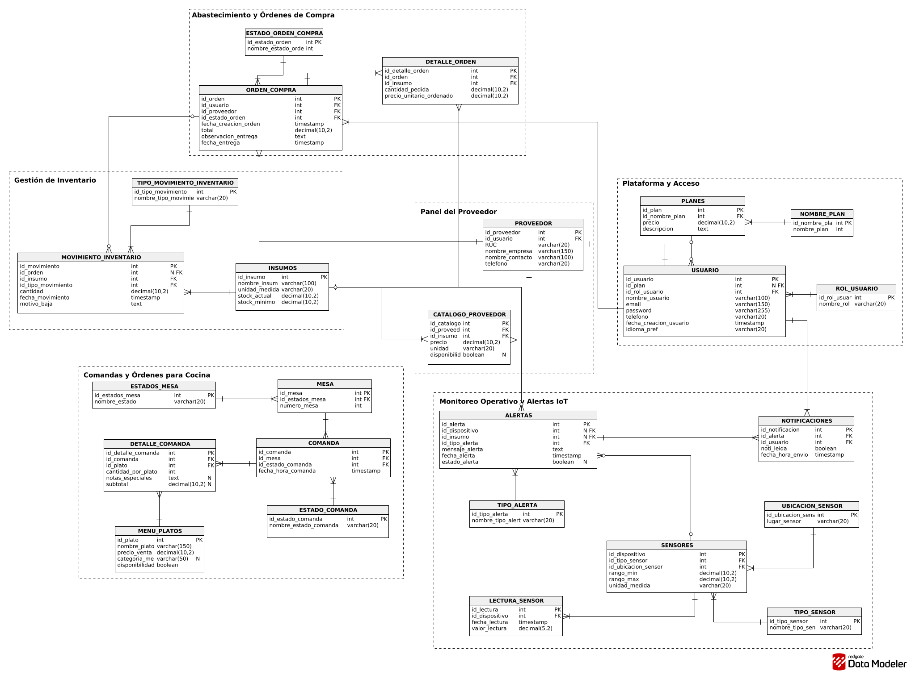


[^1]: Clec. (s.f.). El color rojo en China: orígenes y tradiciones. Recuperado el 23 de abril de 2026, de https://fundacionclec.org/el-color-rojo-en-china-origenes-y-tradiciones/


# Capítulo V: Product Implementation, Validation & Deployment.

## 5.1. Software Configuration Management. 
Para tener consistencia y seguimiento del desarrollo de la plataforma, se ha definido una serie de herramientas y estrategias de desarrollo. El metodo cubre la configuracion del entorno de desarrollo, la gestion del codigo y el despliegue, alineado a las buenas prácticas de ingenieria de software y metodologias ágiles.
### 5.1.1. Software Development Environment Configuration. 
Para facilitar la colaboración del equipo en todas las actividades del ciclo de vida de desarrollo de SupplyWok, se ha definido un entorno de desarrollo común. Este entorno está compuesto por herramientas especializadas para la gestión del proyecto, diseño UX/UI, modelado, desarrollo, pruebas, documentación y despliegue. La selección de estas herramientas se basa en criterios de eficiencia, compatibilidad con tecnologías open-source (Vue + C#), y alineación con prácticas recomendadas de la industria.

|        Categoría        |      Herramienta      |                                               Propósito                                               |                                      Tipo de acceso/enlace                                      |
| :---------------------: | :-------------------: | :---------------------------------------------------------------------------------------------------: | :---------------------------------------------------------------------------------------------: |
|    Project Management   |         Jira        |           Gestión del backlog, tareas y sprints del equipo usando metodología ágil (Scrum).           |                             [https://www.atlassian.com/software/jira](https://www.atlassian.com/software/jira)                            |
| Requirements Management |       UXPressia       |                  Creación de User Personas, Journey Maps y artefactos de needfinding.                 |                          [https://uxpressia.com](https://uxpressia.com)                         |
|   Product UX/UI Design  |         Figma         |                Diseño de wireframes, mockups y prototipos de la aplicación web y móvil.               |                              [https://figma.com](https://figma.com)                             |
|   Modelado de Software  |    LucidChart / Miro / Structurizr     |                 Modelado de arquitectura (UML, C4, Event Storming, Bounded Contexts).                 |               [https://www.lucidchart.com/](https://www.lucidchart.com/)     / [https://miro.com/](https://miro.com/) / [https://structurizr.com/](https://structurizr.com/)               |
|   Frontend Development  |   Visual Studio Code / WebStorm   |                 Desarrollo del Landing Page y Web Application (HTML, CSS, JavaScript).                |                  [https://code.visualstudio.com](https://code.visualstudio.com) / [https://www.jetbrains.com/webstorm/](https://www.jetbrains.com/webstorm/)                 |
|   Backend Development   |     Rider     |     Desarrollo del RESTful API en C# (.NET) siguiendo arquitectura orientada a servicios.    |                [https://www.jetbrains.com/rider/](https://www.jetbrains.com/rider/)               |
|       API Testing       |        Postman        |                           Pruebas y validación de endpoints del API RESTful.                          |                        [https://www.postman.com](https://www.postman.com)                       |
|     Version Control     |         GitHub        | Control de versiones del código fuente y documentación colaborativa (GitFlow + Conventional Commits). |                             [https://github.com](https://github.com)                            |
|  Software Documentation |        Markdown       |                     Redacción del informe del proyecto bajo enfoque Docs-as-Code.                     |                            Compatible con GitHub / editores de texto                            |


### 5.1.2. Source Code Management. 
Los repositorios utilizados para el desarrollo de código fuente son los siguientes:

<div align="center">

| Producto Digital | URL del Repositorio | 
|:----------------:|:-------------------:|
| Landing Page | https://github.com/Aurora-AplicacionesWeb/SupplyWok-Landing-Page | 
| Web Services (Backend API) | https://github.com/Aurora-AplicacionesWeb/SupplyWok-BackEnd  |
| Frontend Web Application | https://github.com/Aurora-AplicacionesWeb/SupplyWok-FrontEnd |

</div>

---

**Modelos de Ramificación**

Se implementará GitFlow, un modelo de ramificación estructurado, el cual permite separar de manera clara las etapas de desarrollo, pruebas, liberación y mantenimiento.

**La estructura de ramas en GitFlow será:**

- _Main_: Contiene el código en estado estable y listo para producción.
- _Develop_: Rama de integración para desarrollo activo.
- _Feature branches_: Para nuevas funcionalidades.
    - Convención: `feature/nombre-descriptivo`  
    - Ejemplo: `feature/US007-business-profiles`
- _Release branches_: Para preparar versiones antes de pasar a producción.
    - Convención: `release/X.Y.Z`  
    - Ejemplo: `release/1.0.0`
- _Hotfix branches_: Para correcciones urgentes.
    - Convención: `hotfix/X.Y.Z`  
    - Ejemplo: `hotfix/1.0.1`        

**Versionado Semántico (Semantic Versioning)**

- Se utiliza Semantic Versioning 2.0.0, con el esquema MAJOR.MINOR.PATCH:

    - **MAJOR:** Cambios incompatibles.
    - **MINOR:** Funcionalidades nuevas retrocompatibles.
    - **PATCH:** Correcciones retrocompatibles.

    **Ejemplos de versiones:**  
    `v1.0.0`, `v1.1.0`, `v1.1.1`.

**Convenciones para Commits**

El equipo sigue el estándar de Conventional Commits para los mensajes de commits, lo que permite claridad en el historial y facilita la generación automática de changelogs:

`<type>[optional scope]: <description>`

Tipos comunes:

- `feat`: Nueva funcionalidad.
- `fix`: Corrección de errores.
- `docs`: Cambios en documentación.
- `style`: Cambios de formato sin impacto funcional.
- `refactor`: Reestructuración del código.
- `test`: Relacionados con pruebas.
- `chore`: Tareas de mantenimiento.

Ejemplo:
```
  feat(auth): implement login via OAuth
  fix(api): handle null user tokens
```
### 5.1.3. Source Code Style Guide & Conventions. 

El equipo ha adoptado guías de estilo y convenciones de codificación para cada uno de los lenguajes utilizados. Estas convenciones permiten que todos los miembros del equipo desarrollen bajo un estándar común y que el código sea comprensible tanto para desarrolladores actuales como futuros.

Todos los identificadores, comentarios y documentación del código se escribirán en inglés.

---

**Backend: C# con .NET Framework**

Para el desarrollo del backend, se utilizará **C#** junto con el framework **.NET 10**. Se adoptan las siguientes convenciones:

- **Guía de estilo base:**  
  [Microsoft C# Coding Conventions](https://learn.microsoft.com/en-us/dotnet/csharp/fundamentals/coding-style/coding-conventions)

- **Estructura de carpetas basada en Domain-Driven Design (DDD):**  
  - `Domain`: Contiene las entidades, agregados y lógica de negocio.  
  - `Application`: Contiene los casos de uso y servicios de aplicación.  
  - `Infrastructure`: Contiene la implementación de repositorios, acceso a datos y servicios externos.  
  - `API`: Contiene los controladores y configuraciones específicas de la API.

- **Nomenclatura:**  
  - Clases nombradas en **PascalCase**:  
    Ejemplo: `UserService`, `MealPlanRepository`  
  - Métodos y variables en **camelCase**:  
    Ejemplo: `getAllUsers()`, `userEmail`  

- **Documentación:**  
  - Uso obligatorio de **XML Documentation Comments** para describir métodos y clases públicas.

- **Separación lógica del código:**  
  - Cada capa debe tener responsabilidades claras:  
    - Controladores (`[ApiController]`)  
    - Servicios (`Scoped` o `Singleton`)  
    - Repositorios (`IRepository`)  
    - Modelos  

- **Anotaciones de .NET:**  
  - Uso de atributos como `[HttpGet]`, `[HttpPost]`, `[FromBody]` para mantener claridad en los controladores.

---

**Frontend: Vue.js Framework (JavaScript, HTML, CSS)**

Para el desarrollo del frontend, el equipo utilizará **Vue 3**, basado en **JavaScript** junto con **HTML** y **CSS**. Las convenciones son:

- **Guías de estilo base:**  
  - [Vue.js Style Guide (Oficial)](https://vuejs.org/style-guide/)  
  - [Airbnb JavaScript Style Guide](https://github.com/airbnb/javascript)

- **Estructura modular y escalable:**  
  - Cada componente tendrá su propio directorio con los archivos `.vue`, `.js` y `.css` correspondientes.

- **Nomenclatura de archivos:**  
  - Archivos nombrados con **kebab-case**:  
    - Componentes: `user-profile.vue`  
    - Servicios: `auth-service.js`  
    - CSS asociados seguirán el mismo nombre base.

- **Nomenclatura de clases y componentes:**  
  - Componentes y clases en **PascalCase**:  
    Ejemplo: `UserProfile`, `MealPlanCard`  
  - Variables, métodos y propiedades en **camelCase**.

- **Modelos de datos:**  
  - Uso de **TypeScript interfaces** o **JavaScript objects** para definir modelos de datos (e.g., `User`, `MealPlan`, `Recipe`) y asegurar consistencia.

- **HTML:**  
  - Buenas prácticas semánticas y accesibles:  
    Uso de etiquetas apropiadas (`<main>`, `<section>`, `<button>`, etc.).

- **CSS:**  
  - Convenciones basadas en el [BEM (Block Element Modifier)](http://getbem.com/):  
    - Nombres de clase descriptivos en inglés:  
      Ejemplo: `.user-profile__header`  
    - Agrupación por tipo de selector.  
    - Estilos reutilizables mediante clases utilitarias.

---

Estas guías aseguran que el código sea limpio, mantenible y fácil de entender para todos los miembros del equipo.

### 5.1.4. Software Deployment Configuration.
La configuración de despliegue contempla mecanismos organizados para publicar correctamente cada uno de los productos digitales del sistema: **Landing Page**, **Web Services (Backend)** y **Frontend Web Application**. Esta configuración garantiza que el equipo pueda replicar y mantener el proceso de despliegue con consistencia y trazabilidad.

---

**Despliegue del Landing Page**

- **Tecnología:**  
  HTML5, CSS3, JavaScript (Vanilla), diseño responsivo.

- **Repositorio GitHub:**  
  [https://github.com/Aurora-AplicacionesWeb/SupplyWok-Landing-Page](https://github.com/Aurora-AplicacionesWeb/SupplyWok-Landing-Page)

- **Plataforma de despliegue:**  
  GitHub Pages

- **Método de despliegue:**  
  - La rama `main` contiene la versión estable y publicada del sitio.  
  - El contenido del directorio raíz se mantiene como fuente para GitHub Pages.  
  - Los cambios aprobados en `develop` son fusionados a `main` mediante pull request.  
  - GitHub Pages actualiza automáticamente la publicación al detectar cambios en `main`.

---

**Despliegue del Backend (Web Services)**

- **Tecnología:**  
  C# con .NET 10.

- **Repositorio GitHub:**  
  [https://github.com/Aurora-AplicacionesWeb/SupplyWok-BackEnd](https://github.com/Aurora-AplicacionesWeb/SupplyWok-BackEnd)

- **Plataforma de despliegue:**  
  Azure App Service.

- **Método de despliegue:**  
  - El backend se empaqueta como un archivo ejecutable o se publica directamente desde Visual Studio.  
  - Se configura un pipeline de despliegue automático en Azure DevOps para integrar los cambios desde el repositorio.  
  - Las variables de entorno (como credenciales de base de datos) se configuran en Azure App Service de forma segura.  
  - El servicio se expone mediante una URL pública que el frontend puede consumir vía HTTP/REST.

---

**Despliegue del Frontend Web Application**

- **Tecnología:**  
  Vue.js 3 (JavaScript, HTML, CSS).

- **Repositorio GitHub:**  
  [https://github.com/Aurora-AplicacionesWeb/SupplyWok-FrontEnd](https://github.com/Aurora-AplicacionesWeb/SupplyWok-FrontEnd)

- **Plataforma de despliegue:**  
  Firebase.

- **Método de despliegue:**  
  - Vue.js se compila con `npm run build` para generar los archivos estáticos de producción.  
  - La rama `main` sirve como fuente para el despliegue.  
  - Firebase debe crearse con cada modificación para que esté actualizado con el repositorio.  

---

**Consideraciones Finales**

- Se documentará el procedimiento de despliegue paso a paso en la wiki del repositorio principal.  
- Los entornos de desarrollo y producción estarán claramente separados mediante archivos de configuración.  
- Se establecerán pruebas manuales básicas post-despliegue para verificar la disponibilidad y funcionalidad de los servicios.  
- Se evaluará la incorporación de **GitHub Actions** o **Azure Pipelines** para automatizar los flujos de despliegue continuo (CI/CD).
  
## 5.2. Landing Page, Services & Applications Implementation.
### 5.2.1. Sprint 1 
#### 5.2.1.1. Sprint Planning 1

En el sprint 1 como equipo nos centramos en la creación de la Landing Page de SupplyWok, que será la cara visible de nuestra plataforma ante los usuarios. Definiendo las secciones claves de la página para informar y convencer a los visitantes que se interesen.

**Sprint Planning 1**

| **Sprint #** | 1 |
|---|---|
| **Date** | 20-04-2026 |
| **Time** | 15:00 |
| **Location** | Virtual, Discord |
| **Prepared by** | Zayd Ayasta, Juan Wang |
| **Attendees** | Marcelo Cuadros, Mathias Sanchez, Miguel Jara, Juan Wang, Zayd Ayasta |
| **Sprint 0 Review Summary** | *No aplica por ser el primer sprint.* |
| **Sprint 0 Retrospective Summary** | *No aplica por ser el primer sprint.* |
| **Sprint 1 Goal** | Nuestro enfoque en este sprint es la Landing Page que informará de nuestra plataforma, por lo que la desarrollaremos e implementaremos para que sea accesible y responsiva. Con la información que brindamos sobre nuestro producto esperamos ganarnos la confianza de los que visiten la página y que empiecen a usar nuestro sistema. Se confirmará cuando esté en producción y se pueda usar el enlace de la página. |
| **Sprint 1 Velocity** | Límite de **35 SP** |
| **Sum of Story Points** | **30 SP** |

#### 5.2.1.2. Aspect Leaders and Collaborators.

| Team Member | GitHub username | Estructure HTML | Design UI & responsive | Scripts and UX | SEO and Accessibility | Content and Assets |
|---|---|---|---|---|---|---|
| Cuadros, Marcelo | Marcelo-alt-lab | L | C | L | C | C |
| Sanchez, Mathias | Nounz27 | C | L | C | - | - |
| Jara, Miguel | MiguelJara2 | C | C | C| - | - |
| Ayasta, Zayd | ZaydAyasta | C | C | C | - | C |
| Wang, Juan | jwd3t | C | C | C | L | C |

#### 5.2.1.3. Sprint Backlog 1.

**Sprint 1 Backlog**

| US Id | US Title | Task Id | Task Title | Description | Estimation (Hours) | Assigned To | Status |
|---|---|---|---|---|---|---|---|
| US44 | Página de inicio con hero section | T01 | Crear estructura HTML de la Hero Section | Maquetar la sección principal (Hero) usando etiquetas semánticas de HTML5. | 2 | Marcelo Cuadros | Done |
| US44 | Página de inicio con hero section | T02 | Implementar estilos CSS de la Hero Section | Aplicar la hoja de estilos base para definir colores, tipografía y disposición. | 2 | Mathias Sanchez | Done |
| US44 | Página de inicio con hero section | T03 | Implementar CTAs y enlace al formulario de registro | Añadir botones llamativos que redirijan al usuario al proceso de registro. | 1 | Marcelo Cuadros | Done |
| US44 | Página de inicio con hero section | T04 | Adaptar Hero Section a diseño responsive | Asegurar que la sección principal se visualice correctamente en dispositivos móviles. | 2 | Marcelo Cuadros | Done |
| US45 | Sección de características principales | T05 | Crear estructura HTML de la sección de características | Construir la grilla o layout para mostrar los beneficios principales de la plataforma. | 1 | Juan Wang | Done |
| US45 | Sección de características principales | T06 | Agregar iconos y estilos visuales a cada característica | Incorporar elementos gráficos y CSS para hacer cada característica visualmente atractiva. | 2 | Mathias Sanchez | Done |
| US46 | Sección de planes y precios | T07 | Crear estructura HTML de la sección de planes | Maquetar el área donde se mostrarán las opciones de precios y suscripciones. | 1 | Zayd Ayasta | Done |
| US46 | Sección de planes y precios | T08 | Implementar estilos de tarjetas de planes y precios | Diseñar visualmente las tarjetas de precios para facilitar la comparación de planes. | 2 | Zayd Ayasta | Done |
| US46 | Sección de planes y precios | T09 | Agregar CTA de selección de plan con redirección al registro | Vincular cada tarjeta de precio con el flujo de creación de cuenta. | 1 | Marcelo Cuadros | Done |
| US47 | Sección de preguntas frecuentes | T10 | Crear estructura HTML del acordeón FAQ | Maquetar el contenedor base para las preguntas frecuentes de los usuarios. | 1 | Marcelo Cuadros | Done |
| US47 | Sección de preguntas frecuentes | T11 | Implementar lógica de expansión y colapso de preguntas | Programar la interactividad para mostrar u ocultar respuestas al hacer clic. | 2 | Marcelo Cuadros | Done |
| US48 | Navegación y menú principal | T12 | Crear navbar sticky con enlaces de navegación | Implementar un menú de navegación fijo en la parte superior con scroll suave. | 2 | Zayd Ayasta | Done |
| US48 | Navegación y menú principal | T13 | Implementar menú hamburguesa para dispositivos móviles | Desarrollar un menú lateral desplegable para resoluciones de pantalla pequeñas. | 2 | Zayd Ayasta | Done |
| US49 | Responsividad total y optimización mobile | T14 | Definir e implementar breakpoints responsive globales | Establecer las reglas CSS de diseño adaptable para toda la página de aterrizaje. | 2 | Zayd Ayasta | Done |
| US49 | Responsividad total y optimización mobile | T15 | Verificar tamaño mínimo de elementos interactivos | Validar que botones y enlaces tengan al menos 44px para facilitar el toque en móviles. | 1 | Miguel Jara | Done |
| US49 | Responsividad total y optimización mobile | T16 | Validar que las imágenes no generen scroll horizontal | Asegurar que ningún recurso visual exceda el ancho máximo de la pantalla. | 1 | Miguel Jara | Done |
| US50 | SEO y accesibilidad web | T17 | Configurar meta tags de SEO (título, descripción, keywords) | Añadir metadatos clave para mejorar la indexación y visibilidad en buscadores. | 1 | Miguel Jara | Done |
| US50 | SEO y accesibilidad web | T18 | Agregar atributos alt, roles ARIA y estructura semántica HTML5 | Mejorar la accesibilidad para usuarios que dependen de lectores de pantalla. | 2 | Miguel Jara | Done |
| US50 | SEO y accesibilidad web | T19 | Verificar navegación por teclado y visibilidad del foco | Asegurar que se pueda interactuar con la página usando únicamente el teclado. | 1 | Miguel Jara | Done |
| US51 | Footer con información adicional | T20 | Crear estructura HTML del footer | Maquetar la sección final de la página para enlaces secundarios y legales. | 1 | Miguel Jara | Done |
| US51 | Footer con información adicional | T21 | Implementar enlaces a redes sociales y páginas legales | Conectar los iconos sociales y los textos de términos y condiciones. | 1 | Zayd Ayasta | Done |
| US52 | Impacto apoyado en cifras | T22 | Crear sección de métricas e impacto con estadísticas | Diseñar un bloque visual que resalte los números clave para generar confianza. | 2 | Juan Wang | Done |
| US53 | Muestra del producto | T23 | Integrar galería de imágenes del producto con texto alternativo | Mostrar capturas de la plataforma asegurando que sean accesibles para todos. | 1 | Mathias Sanchez | Done |
| US53 | Muestra del producto | T24 | Integrar video del producto con fallback de texto alternativo | Incrustar un video demostrativo con opciones de texto para quienes no puedan verlo. | 2 | Mathias Sanchez | Done |
| US54 | Calls to action | T25 | Distribuir CTAs secundarios en secciones clave de la Landing Page | Añadir llamadas a la acción adicionales a lo largo del recorrido del usuario. | 1 | Marcelo Cuadros | Done |
| US55 | Scripts para ocultar contenido | T26 | Implementar scripts de show/hide para contenido condicional | Añadir lógica JavaScript para controlar elementos que se muestran bajo ciertas acciones. | 1 | Marcelo Cuadros | Done |
| US56 | Comentarios y nombres de variables | T27 | Agregar comentarios de código y estandarizar nombres de variables | Limpiar y documentar el código fuente para facilitar futuros mantenimientos. | 1 | Marcelo Cuadros | Done |
| US57 | Sobre el equipo detrás de SupplyWok | T28 | Crear sección del equipo con video y texto alternativo | Maquetar la presentación de los creadores de SupplyWok con soporte multimedia. | 2 | Marcelo Cuadros | Done |
| US58 | Prioridad en mostrar las funcionalidades a los Restaurantes | T29 | Ordenar sección de funcionalidades priorizando beneficios para restaurantes | Estructurar visualmente el contenido para destacar el valor aportado a los restaurantes. | 1 | Marcelo Cuadros | Done |

#### 5.2.1.4. Development Evidence for Sprint Review.

| Repository | Branch | Commit Id | Commit Message | Commit Message Body | Commited on (Date) |
|---|---|---|---|---|---|
| SupplyWok-Landing-Page | develop | 1eca1eb | feat: css hero section and CTA. | 25 de Abril, 2026 |
| SupplyWok-Landing-Page | develop | e7cfb4d | fix: Readme with wrong text. | 25 de Abril, 2026 |
| SupplyWok-Landing-Page | develop | 0a4749c | feat: responsive for hero sections. | 26 de Abril, 2026 |
| SupplyWok-Landing-Page | develop | 6f65577 | feat: add features section and update HTML structure; include new icons and license files. | 26 de Abril, 2026 |
| SupplyWok-Landing-Page | main | 0a1e1cc | feat(landing-page): add css and html for hero section and features section. | 26 de Abril, 2026 |
| SupplyWok-Landing-Page | main | d9651aa | feat(landing-page): add css and html for hero section and features section. | 26 de Abril, 2026 |
| SupplyWok-Landing-Page | develop | 62ce603 | feat(landing-page): add text information for plans. | 26 de Abril, 2026 |
| SupplyWok-Landing-Page | develop | 8967aeb | feat: add styles on plans. | 26 de Abril, 2026 |
| SupplyWok-Landing-Page | develop | 85fecd0 | docs(readme): fix README.md | 26 de Abril, 2026 |
| SupplyWok-Landing-Page | develop | 5bcaa5e | Merge remote-tracking branch 'origin/develop' into develop. | 26 de Abril, 2026 |
| SupplyWok-Landing-Page | develop | 5ba9214 | feat: add FAQ seccion. | 26 de Abril, 2026 |
| SupplyWok-Landing-Page | develop | 16d8090 | Merge branch 'develop' of https://github.com/Aurora-AplicacionesWeb/SupplyWok-Landing-Page into develop | 26 de Abril, 2026 |
| SupplyWok-Landing-Page | develop | ae2af7a | feat: add header. | 26 de Abril, 2026 |
| SupplyWok-Landing-Page | develop | - | feat: add uses you want, about our team and impact | 27 de Abril, 2026 |
| SupplyWok-Landing-Page | develop | 68c9d1d | feat: add footer. | 26 de Abril, 2026 |
| SupplyWok-Landing-Page | develop | 25283da | feat: add i18n al fixes to the footer. | 27 de Abril, 2026 |
| SupplyWok-Landing-Page | develop | 3452838 | Merge branch 'develop' of https://github.com/Aurora-AplicacionesWeb/SupplyWok-Landing-Page into develop | 27 de Abril, 2026 |

Destacar que el commit sin commit id es debido a que es un PR que se hace desde un fork del repositorio.
También se añadirá evidencia del Figma como pruebas de colaboración en el sprint.

Esta sería la captura antes de empezar el sprint con las task creadas en jira y listas para asignarse a los miembros respectivos:


Esta seria la captura de como quedo el board de jira al finalizar el sprint:


#### 5.2.1.5. Execution Evidence for Sprint Review.

Se presentarán las capturas que muestran el despliegue de la Landing Page en GitHub Pages. La interfaz es responsiva y soporta múltiples idiomas, asegurando accesibilidad para diversos perfiles de usuario.


*Figura: Hero Section de la Landing Page con propuesta de valor clara.*


*Figura: Sección de características principales resaltando beneficios para restaurantes.*


*Figura: Funcionamiento del sistema de internacionalización (i18n) en idioma chino.*


*Figura: Visualización de planes de suscripción y botones de acción (CTA).*


*Figura: Footer con información de contacto, redes sociales y navegación secundaria.*

Aquí está el enlace a la página desplegada: [https://aurora-aplicacionesweb.github.io/SupplyWok-Landing-Page/](https://aurora-aplicacionesweb.github.io/SupplyWok-Landing-Page/)

#### 5.2.1.6. Services Documentation Evidence for Sprint Review.

Como la Landing Page es una página estática, no fue necesario durante el Sprint el uso de servicios externos ni conexiones a API's, por lo cual no hay generación ni evidencia de documentación técnica relacionada.

#### 5.2.1.7. Software Deployment Evidence for Sprint Review.

La evidencia del despliegue de la Landing Page durante el Sprint se mostrará a continuación, el despliegue se realizará en GitHub Pages.


Revisamos que el repositorio esté en público:


Nos dirigimos a la seccion de deploy, y selecionamos la rama main:


Luego de unos minutos, el deploy se realizara correctamente:


#### 5.2.1.8. Team Collaboration Insights during Sprint.

Se anexa evidencia de la participación activa del equipo en el desarrollo de la Landing Page. Durante el Sprint 1, el equipo utilizó una metodología colaborativa mediante Pull Requests y revisiones de código, asegurando que cada sección cumpliera con los estándares de calidad definidos. El gráfico de contribuciones muestra una distribución equitativa de tareas entre maquetación, estilos, lógica de i18n y despliegue.


*Figura: Reporte de contribuciones y commits del equipo Aurora en el repositorio de la Landing Page.*

### 5.2.2. Sprint 2 
#### 5.2.2.1. Sprint Planning 2

En el Sprint 2, como equipo nos centramos en el desarrollo del frontend de SupplyWok, el cual será la interfaz principal de nuestra plataforma mediante la cual los usuarios podrán administrar sus servicios. Se implementaron diferentes dashboards para que tanto los dueños como los proveedores puedan gestionar las necesidades de sus respectivos negocios.

**Sprint Planning 2**

| **Sprint #** | 2 |
|---|---|
| **Date** | 10-05-2026 |
| **Time** | 13:00 |
| **Location** | Virtual, Discord |
| **Prepared by** | Zayd Ayasta, Juan Wang |
| **Attendees** | Marcelo Cuadros, Mathias Sanchez, Miguel Jara |
| **Sprint 1 Review Summary** | En el Sprint 1, el equipo se enfocó en el desarrollo del Landing Page de SupplyWok. Con ello, se logró configurar el entorno de trabajo, establecer los requerimientos principales del sistema, así como el diseño preliminar de la interfaz y la estructura de navegación de la plataforma. Por otro lado, el profesor a cargo brindó feedback positivo respecto al diseño inicial del sistema y sugirió corregir ciertos aspectos de la documentación del proyecto. |
| **Sprint 1 Retrospective Summary** | Durante el Sprint 1, surgieron dificultades relacionadas con la comunicación, la distribución de tareas y el cumplimiento de algunos entregables de la plataforma, afectando principalmente la documentación del proyecto. Sin embargo, a pesar de estas dificultades, se logró entregar un sprint casi completo y con una calidad aceptable. |
| **Sprint 2 Goal** | Nuestro enfoque en este sprint es desarrollar e implementar la interfaz principal de SupplyWok mediante dashboards funcionales para dueños y proveedores, permitiendo la visualización y gestión básica de la información del negocio. Además, se espera implementar la interfaz base de cada dashboard junto con las funcionalidades principales de cada bounded context. |
| **Sprint 2 Velocity** | Límite de **35 SP** |
| **Sum of Story Points** | **30 SP** |

#### 5.2.2.2. Aspect Leaders and Collaborators.

Durante el Sprint 2, el equipo se enfocó principalmente en el desarrollo del frontend de SupplyWok, priorizando las interfaz y funcionalidades principales de la plataforma. Los principales aspectos considerados en este sprint incluyen el desarrollo de los todos los bounded context.

- **Inventory Management Bounded Context**: Es el encargado de gestionar la informacion de los recursos de inventario de cada restaurante.

- **Supply and Purchasing Bounded Context**: Es el encargado de gestionar las órdenes de suplementos realizadas por cada restaurante.

- **Restaurant Management Bounded Context**: Es el encargado de gestionar todo lo relacionado con la operación del establecimiento.

- **Operational Monitoring and IoT Alerts Bounded Context**: Es el encargado de gestionar la información recopilada por los sensores del restaurante.

- **Supplier Management & Operations Bounded Context**: Es el encargado de gestionar la información de los proveedores y sus pedidos.

- **Identity & Access Bounded Context**: Es el encargado de gestionar todo lo relacionado con la autenticación y administración de cuentas.

- **Shared Bounded Context**: Contiene Value Objects y componenetes visuales comunes que son reutilizados por múltiples bounded contexts del sistema.

| Team Member | GitHub username | Inventory Management Bounded BC | Supply and Purchasing BC / Shared BC | Restaurant Management BC | Supplier Management & Operations BC | Operational Monitoring and IoT Alerts BC / Identity & Access BC  |
|---|---|---|---|---|---|---|
| Cuadros, Marcelo | Marcelo-alt-lab | C | C | C | - | L |
| Sanchez, Mathias | Nounz27             | - | C | L | C | C |
| Jara, Miguel | MiguelJara2     | L | C | - | C | C |
| Ayasta, Zayd | Zayd Ayasta         | C | L | C | C | - |
| Wang, Juan | jwd3t                 | C | - | C | L | C |

#### 5.2.2.3. Sprint Backlog 2.

**Sprint 2 Backlog**

| US Id | US Title | Task Id | Task Title | Description | Estimation (Hours) | Assigned To | Status |
|---|---|---|---|---|---|---|---|
| US11 | Proyección de demanda basada en historial | T30 | Diseño de interfaz de proyección | Diseñar la interfaz para visualizar la proyección de consumo de insumos. | 3 | Mathias Sanchez | Done |
| US11 | Proyección de demanda basada en historial | T31 | Implementación de gráficos estadísticos | Implementar gráficos y métricas de proyección de demanda. | 4 | Marcelo Cuadros | Done |
| US11 | Proyección de demanda basada en historial | T32 | Integración de datos históricos | Conectar la vista con los datos históricos de consumo. | 3 | Juan Wang | Done |
| US14 | Monitoreo de temperatura en almacén | T33 | Diseño del dashboard IoT | Diseñar el panel de monitoreo de sensores IoT. | 2 | Marcelo Cuadros | Done |
| US14 | Monitoreo de temperatura en almacén | T34 | Integración de datos de sensores | Implementar la recepción y visualización de temperatura en tiempo real. | 4 | Zayd Ayasta | Done |
| US15 | Alertas de riesgo en cocina | T35 | Sistema de alertas automáticas | Implementar alertas visuales ante condiciones peligrosas. | 3 | Miguel Jara | Done |
| US15 | Alertas de riesgo en cocina | T36 | Configuración de umbrales | Configurar parámetros de temperatura y humedad para activar alertas. | 2 | Marcelo Cuadros | Done |
| US17 | Control de ocupación de mesas | T37 | Diseño de estado de mesas | Crear componentes visuales para representar el estado de las mesas. | 2 | Juan Wang | Done |
| US17 | Control de ocupación de mesas | T38 | Actualización en tiempo real | Implementar actualización dinámica de ocupación de mesas. | 3 | Mathias Sanchez | Done |
| US18 | Historial de alertas e incidencias operativas | T39 | Registro de incidencias | Implementar almacenamiento de eventos y alertas. | 3 | Zayd Ayasta | Done |
| US18 | Historial de alertas e incidencias operativas | T40 | Vista histórica de alertas | Crear interfaz para consultar incidencias registradas. | 3 | Marcelo Cuadros | Done |
| US19 | Exportar reporte de monitoreo y alertas | T41 | Generación de reportes PDF | Implementar exportación de reportes en PDF. | 3 | Marcelo Cuadros | Done |
| US19 | Exportar reporte de monitoreo y alertas | T42 | Exportación CSV | Implementar exportación de datos en formato CSV. | 2 | Juan Wang | Done |
| US20 | Registro y perfil del proveedor | T43 | Formulario de registro | Implementar formulario para registro de proveedores. | 3 | Miguel Jara | Done |
| US20 | Registro y perfil del proveedor | T44 | Vista de perfil del proveedor | Crear pantalla de perfil y edición de datos. | 3 | Zayd Ayasta | Done |
| US21 | Recepción y gestión de órdenes de compra | T45 | Panel de órdenes recibidas | Implementar listado de órdenes de compra recibidas. | 4 | Mathias Sanchez | Done |
| US21 | Recepción y gestión de órdenes de compra | T46 | Gestión de estado de pedidos | Permitir actualizar estados de órdenes de compra. | 3 | Marcelo Cuadros | Done |
| US24 | Confirmación y seguimiento de entregas | T47 | Registro de entregas | Implementar formulario para confirmar entregas realizadas. | 3 | Juan Wang | Done |
| US24 | Confirmación y seguimiento de entregas | T48 | Seguimiento de despachos | Implementar visualización del estado de entregas. | 3 | Miguel Jara | Done |
| US25 | Panel de rendimiento por cliente | T49 | Dashboard de clientes frecuentes | Implementar métricas de pedidos por cliente. | 4 | Zayd Ayasta | Done |
| US25 | Panel de rendimiento por cliente | T50 | Estadísticas comerciales | Mostrar estadísticas y tendencias de consumo. | 3 | Miguel Jara | Done |
| US27 | Selección y gestión del plan de suscripción | T51 | Vista de planes disponibles | Diseñar pantalla de planes y beneficios. | 2 | Marcelo Cuadros | Done |
| US27 | Selección y gestión del plan de suscripción | T52 | Gestión de suscripción | Implementar selección y activación de planes. | 2 | Juan Wang | Done |
| US28 | Notificaciones en tiempo real | T53 | Sistema de notificaciones | Implementar notificaciones dinámicas en la plataforma. | 4 | Mathias Sanchez | Done |
| US28 | Notificaciones en tiempo real | T54 | Alertas en tiempo real | Mostrar alertas instantáneas relacionadas al sistema. | 3 | Zayd Ayasta | Done |
| US29 | Inicio de sesión y registro de cuenta | T55 | Formulario de login | Implementar formulario de inicio de sesión con validación. | 3 | Marcelo Cuadros | Done |
| US29 | Inicio de sesión y registro de cuenta | T56 | Formulario de registro | Implementar formulario de registro de nueva cuenta con validación. | 3 | Marcelo Cuadros | Done |

#### 5.2.2.4. Development Evidence for Sprint Review.


[https://trello.com/b/07LRT0At/sprint-2](https://trello.com/b/07LRT0At/sprint-2)

| Repository | Branch | Commit Id | Commit Message | Commit Message Body | Commited on (Date) |
|---|---|---|---|---|---|
| SupplyWok-FrontEnd | feature | 66c85df | feat: setup project architecture and shared modules | - | 10/05/2026 |
| SupplyWok-FrontEnd | feature | 6039b3b | feat: configure application routing | - | 10/05/2026 |
| SupplyWok-FrontEnd | feature | 4cd7752 | feat: add purchase order domain entities | - | 10/05/2026 |
| SupplyWok-FrontEnd | feature | fab4097 | feat: implement purchase order api integration | - | 10/05/2026 |
| SupplyWok-FrontEnd | feature | d6f5221 | feat: add purchase order store management | - | 10/05/2026 |
| SupplyWok-FrontEnd | feature | bb8db44 | feat: configure supply and purchasing routes | - | 10/05/2026 |
| SupplyWok-FrontEnd | feature | 546855e | feat: create purchase order reusable components | - | 10/05/2026 |
| SupplyWok-FrontEnd | feature | 4e2fcff | feat: implement supply and purchasing pages | - | 10/05/2026 |
| SupplyWok-FrontEnd | feature | f34ffae | refactor: reorganize shared layout and state management | - | 11/05/2026 |
| SupplyWok-FrontEnd | feature | 21f4bff | feat: implement supply and purchasing bounded context | - | 11/05/2026 |
| SupplyWok-FrontEnd | develop | 2dc2096 | Merge pull request #5 from Aurora-AplicacionesWeb/develop | - | 11/05/2026 |
| SupplyWok-FrontEnd | feature | 752abc5 | feat(iot-monitoring): add IoT monitoring components and alerts, update environment variables | - | 11/05/2026 |
| SupplyWok-FrontEnd | feature | 0e1b7e3 | feat(entities): add initial entities for restaurant management bounded context | - | 11/05/2026 |
| SupplyWok-FrontEnd | feature | 9e705a8 | feat(restaurant-management/infrastructure): implement assemblers for restaurant management entities. | - | 11/05/2026 |
| SupplyWok-FrontEnd | feature | 9f17ee0 | feat(restaurant-management): implement base API and endpoint classes for restaurant management. | - | 11/05/2026 |
| SupplyWok-FrontEnd | feature | 2e948ec | feat(restaurant-management/application): add Pinia store for managing restaurant operations. | - | 11/05/2026 |
| SupplyWok-FrontEnd | feature | 9f72302 | feat(restaurant-management/locales): update translations for restaurant management pages in English, Spanish, and Chinese. | - | 11/05/2026 |
| SupplyWok-FrontEnd | feature | 7375fba | feat(restaurant-management/presentation): add components for dish menu, kitchen tickets, and tables occupancy management. | - | 11/05/2026 |
| SupplyWok-FrontEnd | feature | 45892cb | feat(shared/presentation): implement layout components and add language switcher component. | - | 11/05/2026 |
| SupplyWok-FrontEnd | feature | 4c4bf96 | feat: rename restaurant-management.json to db.json and update table structure and routing | - | 11/05/2026 |
| SupplyWok-FrontEnd | feature | 6ca5639 | chore: add new SVG icons for alerts, configuration, dashboard, inventory, kitchen tickets, orders, reports, subscription, and suppliers | - | 11/05/2026 |
| SupplyWok-FrontEnd | feature | 0fa27a0 | feat: add environment configuration for development and production with API endpoints | - | 11/05/2026 |
| SupplyWok-FrontEnd | feature | efe9e7f | feat: initialize supplier management module with the sidebar for suppliers and update translations | - | 12/05/2026 |
| SupplyWok-FrontEnd | feature | 22a5d5f | fix: correct syntax and an typing error in zh.json | - | 12/05/2026 |
| SupplyWok-FrontEnd | develop | 92f7703 | Merge branch 'feature/restaurant-management-bc' into develop | - | 12/05/2026 |
| SupplyWok-FrontEnd | feature | c22a4df | fix: fix some errors in sidebar-menu | - | 12/05/2026 |
| SupplyWok-FrontEnd | feature | 5e4e350 | refactor: update method names for consistency and improve layout styling | - | 12/05/2026 |
| SupplyWok-FrontEnd | feature | 3915b4f | feat: integrate pinia store and vue router, initialize router with supplier routes | - | 12/05/2026 |
| SupplyWok-FrontEnd | feature | 3bafae0 | fix: correct API URL typo, and adjust app title | - | 12/05/2026 |
| SupplyWok-FrontEnd | feature | a5a54a5 | Merge branch 'develop' into feature/operational-monitoring-and-iot-alerts-bc | - | 12/05/2026 |
| SupplyWok-FrontEnd | feature | a295c25 | feat(operational-monitoring-and-iot-alerts-bc): add iot and alerts bc to the main branch for develop. | - | 12/05/2026 |
| SupplyWok-FrontEnd | feature | 064a209 | chore: update package-lock.json to reflect dependency version changes | - | 12/05/2026 |
| SupplyWok-FrontEnd | feature | d91f6b3 | feat: add orders entities and assembler for transforming purchase orders resources | - | 12/05/2026 |
| SupplyWok-FrontEnd | feature | 74a02aa | feat(iot-monitoring): change IoT monitoring components and alerts, update environment variables. | - | 12/05/2026 |
| SupplyWok-FrontEnd | feature | e201320 | fix: update OrdersAssembler to use correct Orders entity | - | 12/05/2026 |
| SupplyWok-FrontEnd | feature | a7257bd | feat: add supply management api and initialize json server setup | - | 12/05/2026 |
| SupplyWok-FrontEnd | feature | 7bd9292 | feat(supply-and-purchasing): add mock backend with db.json | - | 12/05/2026 |
| SupplyWok-FrontEnd | feature | bcf87fa | feat: add supplier management store with state, getters, and fetch logic | - | 12/05/2026 |
| SupplyWok-FrontEnd | feature | 739b84d | feat(supply-and-purchasing): add orders summary card | - | 12/05/2026 |
| SupplyWok-FrontEnd | feature | 78e1edd | Merge remote-tracking branch 'origin/develop' into feature/supply-and-purchasing-bc | - | 12/05/2026 |
| SupplyWok-FrontEnd | feature | c0b77d3 | feat: add mock api fallback and dashboard enhancements | - | 12/05/2026 |
| SupplyWok-FrontEnd | feature | 0694d59 | feat(supply-and-purchasing): enhance dashboard integration and mock api support | - | 12/05/2026 |
| SupplyWok-FrontEnd | develop | 1232115 | Merge branch 'develop' of https://github.com/Aurora-AplicacionesWeb/SupplyWok-FrontEnd into develop | - | 13/05/2026 |
| SupplyWok-FrontEnd | feature | c77d755 | feat: implement inventory item and stock movement entities | - | 13/05/2026 |
| SupplyWok-FrontEnd | feature | 405c216 | feat: implement inventory management API with mock data fallback | - | 13/05/2026 |
| SupplyWok-FrontEnd | feature | ee58105 | feat: implement inventory management API with mock data fallback | - | 13/05/2026 |
| SupplyWok-FrontEnd | feature | 274c281 | feat: add inventory management page and data table component | - | 13/05/2026 |
| SupplyWok-FrontEnd | feature | 87c6730 | feat: add internationalization support for inventory management | - | 13/05/2026 |
| SupplyWok-FrontEnd | feature | 2dc4f94 | feat: add delete confirmation dialog and functionality to inventory management | - | 13/05/2026 |
| SupplyWok-FrontEnd | feature | b2cb7d1 | feat: add inventory API configuration and update stock percentage calculation | - | 13/05/2026 |
| SupplyWok-FrontEnd | feature | 8ec5d44 | feat: integrate confirmation dialog into inventory data table component | - | 13/05/2026 |
| SupplyWok-FrontEnd | feature | 40c3912 | feat: refactor inventory and stock movement entities to use public properties | - | 13/05/2026 |
| SupplyWok-FrontEnd | develop | d663118 | Merge remote-tracking branch 'origin/develop' into develop | - | 13/05/2026 |
| SupplyWok-FrontEnd | feature | 90b902b | feat(iam): add user validation and notifies in header. | - | 13/05/2026 |
| SupplyWok-FrontEnd | feature | 6f68afb | feat(alerts): enhance alert management with status and source properties, add acknowledgment functionality | - | 13/05/2026 |
| SupplyWok-FrontEnd | feature | 30b0f7c | feat: finish supplier management store with CRUD methods and documentation | - | 13/05/2026 |
| SupplyWok-FrontEnd | feature | 7e1145c | feat(supply-management): add catalog entity and assembler | - | 13/05/2026 |
| SupplyWok-FrontEnd | feature | 3885462 | feat(supply-management): update store and api | - | 13/05/2026 |
| SupplyWok-FrontEnd | feature | 547bcf2 | feat(supply-management): update db.json to include catalog items | - | 13/05/2026 |
| SupplyWok-FrontEnd | feature | ab5066d | feat(supply-management): add routing in sidebar menu for supplier and restaurant and switching roles | - | 13/05/2026 |
| SupplyWok-FrontEnd | feature | cf1fc68 | feat(supply-management): add catalog supplier components and functionality | - | 13/05/2026 |
| SupplyWok-FrontEnd | feature | f1569f9 | feat(supply-management): add supplier management orders view | - | 13/05/2026 |
| SupplyWok-FrontEnd | feature | 0dc1f27 | . | - | 13/05/2026 |
| SupplyWok-FrontEnd | feature | 5e25a4f | Merge remote-tracking branch 'origin/develop' into feature/supplier-management-and-operations-bc | - | 13/05/2026 |
| SupplyWok-FrontEnd | feature | e10ad29 | . | - | 13/05/2026 |
| SupplyWok-FrontEnd | feature | 25d7752 | refactor: improve restaurant management bc and styling consistency across components | - | 13/05/2026 |
| SupplyWok-FrontEnd | feature | 8965e0a | feat: add active commands and kitchen tickets cards to restaurant management dashboard | - | 13/05/2026 |
| SupplyWok-FrontEnd | feature | a71db21 | feat: enhance restaurant management dashboard with kitchen tickets and active commands functionality | - | 13/05/2026 |
| SupplyWok-FrontEnd | feature | d243b6b | feat: add pending orders card to dashboard with dynamic count | - | 13/05/2026 |
| SupplyWok-FrontEnd | feature | cc267ea | delete: App.vue | - | 13/05/2026 |
| SupplyWok-FrontEnd | feature | 661ac88 | feat: add below minimum stock card component with internationalization support | - | 13/05/2026 |
| SupplyWok-FrontEnd | feature | 21227b6 | feat: add Chinese localization for below minimum stock component | - | 13/05/2026 |
| SupplyWok-FrontEnd | feature | 71d72db | fix: update role routing | - | 13/05/2026 |
| SupplyWok-FrontEnd | feature | dbef84e | fix: update route routing and dashboard view | - | 13/05/2026 |
| SupplyWok-FrontEnd | develop | 1bec258 | Merge branch 'develop' of https://github.com/Aurora-AplicacionesWeb/SupplyWok-FrontEnd into develop | - | 13/05/2026 |
| SupplyWok-FrontEnd | develop | f7e8c05 | feat(supply-management): add client view | - | 14/05/2026 |
| SupplyWok-FrontEnd | develop | ceebb76 | fix: remove unnecessary endpoint paths | - | 14/05/2026 |
| SupplyWok-FrontEnd | develop | b876bf0 | feat(supply-management): add alert endpoint and assembler and api | - | 14/05/2026 |
| SupplyWok-FrontEnd | develop | 45d7066 | feat(supply-management): add endpoins for alerts and store for alerts | - | 14/05/2026 |
| SupplyWok-FrontEnd | develop | 329deb7 | Merge branch 'feature/supplier-management-and-operations-bc' into develop | - | 14/05/2026 |
| SupplyWok-FrontEnd | develop | edfce1d | fix(restaurant-management): fix routing for create kitchen ticket | - | 14/05/2026 |
| SupplyWok-FrontEnd | develop | 601aedb | fix: unify purchase orders data source | - | 14/05/2026 |
| SupplyWok-FrontEnd | develop | 0e01c56 | feat: add inventory, configuration, reports page | - | 14/05/2026 |
| SupplyWok-FrontEnd | develop | 7a31adf | Merge remote-tracking branch 'origin/develop' into feature/supply-and-purchasing-bc | - | 14/05/2026 |
| SupplyWok-FrontEnd | develop | 7d2759f | fix: delete app.vue | - | 14/05/2026 |
| SupplyWok-FrontEnd | develop | aee254d | fix: repair routing and orders api fallbacks | - | 14/05/2026 |
| SupplyWok-FrontEnd | develop | f50f699 | feature: add views and fix routes errors | - | 14/05/2026 |
| SupplyWok-FrontEnd | develop | 2fe0640 | feat(supply-management): add client entity and assembler and endpoint and store | - | 14/05/2026 |
| SupplyWok-FrontEnd | develop | 7684ba8 | feat(supply-management): add supplier alerts view | - | 14/05/2026 |
| SupplyWok-FrontEnd | develop | 553e723 | feat(supply-management): add demand forecast endpoint and assembler and entity | - | 14/05/2026 |
| SupplyWok-FrontEnd | develop | b5b11b1 | feat(supply-management): add data for demand forecast and install chart.js dependency | - | 14/05/2026 |
| SupplyWok-FrontEnd | develop | adb9344 | feat(supply-management): add demand forecast view and internationalization | - | 14/05/2026 |
| SupplyWok-FrontEnd | develop | c4ed789 | Merge remote-tracking branch 'origin/feature/supplier-management-and-operations-bc' into develop | - | 14/05/2026 |
| SupplyWok-FrontEnd | develop | a001a24 | fix: inventory management api and iam | - | 14/05/2026 |
| SupplyWok-FrontEnd | develop | 6bb63fa | refactor: align inventory data flow | - | 14/05/2026 |
| SupplyWok-FrontEnd | develop | f944122 | feat(supply-management): add delivery route endpoint and assembler and entity and update store and data | - | 14/05/2026 |
| SupplyWok-FrontEnd | develop | aa2b8e2 | feat(supply-management): add delivery planning view | - | 14/05/2026 |
| SupplyWok-FrontEnd | develop | d97eace | refactor: adjust layout styling for IoT panel and placeholder page | - | 14/05/2026 |
| SupplyWok-FrontEnd | develop | 35afb4a | feat: implement add table functionality in tables and occupancy page | - | 14/05/2026 |
| SupplyWok-FrontEnd | develop | 6802e29 | fix: fix route for views | - | 14/05/2026 |
| SupplyWok-FrontEnd | develop | abbc374 | fix(supply-management): update delivery status filter | - | 14/05/2026 |
| SupplyWok-FrontEnd | develop | 5aeeedf | fix(supply-management): add supplier settings and subscription endpoints and assemblers entity stores and data | - | 14/05/2026 |
| SupplyWok-FrontEnd | develop | 84727b4 | fix(supply-management): add supplier settings and subscription views | - | 14/05/2026 |
| SupplyWok-FrontEnd | develop | d0ad0f5 | fix(supply-management): add dashboard components and view | - | 14/05/2026 |
| SupplyWok-FrontEnd | develop | 83bbae1 | refactor: rename files to "-view" | - | 14/05/2026 |
| SupplyWok-FrontEnd | develop | 0e8b291 | feat: add table deletion functionality and enhance table details view | - | 14/05/2026 |
| SupplyWok-FrontEnd | develop | bfd7a0a | Merge remote-tracking branch 'origin/feature/supplier-management-and-operations-bc' into develop | - | 14/05/2026 |
| SupplyWok-FrontEnd | develop | 77f8271 | feat(i18n): implement internationalization for various components and routes | - | 14/05/2026 |
| SupplyWok-FrontEnd | develop | d228610 | refactor: update supplier API endpoints for supply management and purchase order | - | 14/05/2026 |
| SupplyWok-FrontEnd | develop | fe76c7f | feat(subscription): integrate subscription plan management and update UI components | - | 14/05/2026 |
| SupplyWok-FrontEnd | develop | 245b495 | feat: update environment variables and enhance restaurant management api with new endpoints | - | 14/05/2026 |
| SupplyWok-FrontEnd | develop | 736f77a | feat(alerts): enhance alert display logic and add supplier notification messages | - | 14/05/2026 |
| SupplyWok-FrontEnd | develop | e2fe602 | Merge remote-tracking branch 'origin/develop' into develop | - | 14/05/2026 |
| SupplyWok-FrontEnd | develop | 1fb79dc | fix(supplier-api.js): connect suppliers page to mock api | - | 14/05/2026 |
| SupplyWok-FrontEnd | develop | 1f0a08e | Merge branch from develop | - | 14/05/2026 |
| SupplyWok-FrontEnd | develop | 0541dca | fix(supplier-api.js): connect suppliers page to mock api | - | 14/05/2026 |
| SupplyWok-FrontEnd | develop | e5af4fe | Merge pull request #14 from Aurora-AplicacionesWeb/develop | - | 14/05/2026 |
| SupplyWok-FrontEnd | develop | 66c71ce | Dejar de rastrear archivos de entorno (manteniendo copias locales) | - | 14/05/2026 |
| SupplyWok-FrontEnd | develop | ea24093 | chore(app): complete bounded-context architecture migration, routing normalization, and i18n fixes | - | 14/05/2026 |


#### 5.2.2.5. Execution Evidence for Sprint Review.

En este Sprint se logró desarrollar gran parte del frontend de la plataforma SupplyWok. Se integraron funcionalidades como el inicio de sesión, el dashboard general, los módulos de inventario, pedidos, comandas, sensores y alertas, junto con sus funcionalidades básicas principales.

Link de la plataforma de SupplyWok: https://supplywok.web.app/


#### 5.2.2.6. Services Documentation Evidence for Sprint Review.

Para esta sección se dirán los servicios que se utilizaron para simular los json que devolvería nuestro backend, los cuales se implementaron en dos servicios, en mockapi y en my json server.


Estos implementaron endpoints para manejar los datos y mostrarlos en nuestros componentes que permiten utilizar nuestro sistema sin necesidad de tener un backend por el momento.

#### 5.2.2.7. Software Deployment Evidence for Sprint Review.

En esta sección mostramos como se realizó el deploy de la plataforma junto con el json server.

**Deploy del Json Server**

1. Accedemos a https://my-json-server.typicode.com/ y seguimos los pasos para publicar el Json Server


2. Creamos un nuevo repositorio y subimos el archivo Json.


3. Accedemos al enlace de nuestro Json server de forma  https://my-json-server.typicode.com/< your-username >/< your-repo >. 


**Deploy de la Plataforma en Firebase**

1. Accedemos a https://firebase.google.com/ y accedemos con nuestra cuenta. Después creamos nuestro proyecto.


2. Luego de instalar e iniciar sesión en firebase la terminal de Jetbrains para construir, inicializar y deployar nuestro proyecto, para posteriormente acceder al enlace publico.


Estos implementarion endpoints para majenar los datos y mostrarlos en nuestros componentes que permiten utilizar nuestro sistema sin necesidad de tener un backend por el momento.
[https://supplywok.web.app/](https://supplywok.web.app/)

#### 5.2.2.8. Team Collaboration Insights during Sprint.

En este apartado se visualiza todos los gráficos que representan la participación de cada integrante en el repositorio del fronted.


### 5.2.3. Sprint 3

En esta sección se registra y explica el avance realizado durante el Sprint 3 en términos de producto y trabajo colaborativo. El enfoque principal de este Sprint es el desarrollo e implementación de los servicios backend mediante C# y Entity Framework Core para los bounded context priorizados, así como la validación y correcto funcionamiento de sus endpoints REST.

#### 5.2.3.1. Sprint Planning 3

Durante la reunión de Sprint Planning del Sprint 3, se estableció como objetivo principal avanzar significativamente en el desarrollo backend de la plataforma SupplyWok, planteando alcanzar aproximadamente el 70% de implementación de los servicios backend del sistema. Para ello, se priorizó el desarrollo de los bounded contexts correspondientes al núcleo del negocio, incluyendo  . Asimismo, el equipo revisó los resultados obtenidos durante el sprint anterior e identificó oportunidades de mejora con el fin de corregir errores, optimizar el proceso de desarrollo y garantizar una base sólida para las siguientes etapas del proyecto.

**Sprint Planning 3**

| **Sprint #**                       | 3                                                                                                                                                                                                                                                                                                                                                                                                                                                                                                                                                                                                                                                 |
|------------------------------------|---------------------------------------------------------------------------------------------------------------------------------------------------------------------------------------------------------------------------------------------------------------------------------------------------------------------------------------------------------------------------------------------------------------------------------------------------------------------------------------------------------------------------------------------------------------------------------------------------------------------------------------------------|
| **Date**                           | 2026-06-18                                                                                                                                                                                                                                                                                                                                                                                                                                                                                                                                                                                                                                        |
| **Time**                           | 17:00                                                                                                                                                                                                                                                                                                                                                                                                                                                                                                                                                                                                                                             |
| **Location**                       | Virtual, Discord                                                                                                                                                                                                                                                                                                                                                                                                                                                                                                                                                                                                                                  |
| **Prepared by**                    | Mathias Sanchez, Juan Wang                                                                                                                                                                                                                                                                                                                                                                                                                                                                                                                                                                                                                        |
| **Attendees**                      | Marcelo Cuadros, Zayd Ayasta, Juan Wang, Mathias Sanchez, Milenko Cayanchi                                                                                                                                                                                                                                                                                                                                                                                                                                                                                                                                                                        |
| **Sprint 2 Review Summary**        | Durante el Sprint 2 se completó el desarrollo de la aplicación frontend utilizando una Fake API para simular la comunicación con los servicios backend. Se implementaron las principales interfaces y flujos de usuario previstos para la plataforma, obteniendo resultados satisfactorios en términos de funcionalidad, organización del código y experiencia de usuario. Como parte del feedback recibido, se destacó la calidad de la implementación realizada; sin embargo, se recomendó fortalecer la documentación técnica del proyecto para facilitar su comprensión, mantenimiento y futura integración con los servicios backend reales. |
| **Sprint 2 Retrospective Summary** | El equipo consideró que la distribución de tareas y la colaboración durante el Sprint 2 fueron adecuadas, permitiendo cumplir los objetivos establecidos dentro del plazo previsto. Asimismo, se identificó como principal oportunidad de mejora la elaboración de una documentación más completa y detallada, tanto del proceso de desarrollo como de los componentes implementados, con el fin de mejorar la comunicación interna y facilitar el trabajo en las siguientes iteraciones.                                                                                                                                                         |
| **Sprint 3 Goal**                  | Habilitar la comunicación centralizada de datos en la plataforma SupplyWok mediante la implementación del Web Service principal, garantizando que los sistemas externos puedan consultar a los bounded context Inventory Management, Procurement & Purchasing, Operations, IoT Operational Monitoring & Alerts, Supplier Panel, Identity And Access Management, Profiles y Analytics de manera segura y eficiente al cierre del sprint.                                                                                                                                                                                                           |
| **Sprint 3 Velocity**              | Límite de **45 SP**                                                                                                                                                                                                                                                                                                                                                                                                                                                                                                                                                                                                                               |
| **Sum of Story Points**            | **55 SP**                                                                                                                                                                                                                                                                                                                                                                                                                                                                                                                                                                                                                                         |

**Link del Sprint 3 Board:** [https://trello.com/b/vRbx1S2v/supplywok-sprint-backlog-3](https://trello.com/b/vRbx1S2v/supplywok-sprint-backlog-3)

#### 5.2.3.2. Aspect Leaders and Collaborators

En esta sección se presenta la matriz de liderazgo y colaboración correspondiente al Sprint 3. Dado que el objetivo principal de esta iteración es avanzar en el desarrollo backend de SupplyWok, los aspectos considerados corresponden a los bounded contexts de negocio. Para cada aspecto se asigna un líder responsable de coordinar el desarrollo y uno o más colaboradores encargados de apoyar en la implementación, validación y pruebas de los servicios y endpoints asociados.

**Consider Aspects**

- **Inventory Management Bounded Context**: Es el encargado de gestionar la información de los recursos de inventario del restaurante. 
- **Procurement & Purchasing Bounded Context**: Es el encargado de gestionar las órdenes de productos realizadas por el restaurante. 
- **Operations Bounded Context**: Es el encargado de gestionar las comandas, tickets de cocina y mesas dentro del restaurante. 
- **IoT Operational Monitoring & Alerts Bounded Context**: Es el encargado de monitorear y alertar sobre los dispositivos IoT del restaurante.
- **Supplier Panel Bounded Context**: Es el encargado de gestionar los datos de los proveedores y sus clientes. 
- **Identity And Access Management Bounded Context**: Es el encargado de gestionar todo lo relacionado con la autenticación y administración de cuentas.
- **Profiles Bounded Context**: Es el encargado de gestionar los perfiles de los usuarios del sistema.
- **Analytics Bounded Context**: Es el encargado de gestionar los diferentes gráficos que se pueden visualizar en la plataforma.
- **Shared Bounded Context**: Es el encargado de gestionar los datos compartidos que son reutilizados entre los diferentes bounded contexts del sistema.

| Team Member| Github Username | Inventory Management Bounded Context | Procurement & Purchasing Bounded Context | Operations Bounded Context | IoT Operational Monitoring & Alerts Bounded Context | Supplier Panel Bounded Context | Identity And Access Management Bounded Context | Profiles Bounded Context | Analytics Bounded Context |
|-----------|-----------------|--------------------------------------|------------------------------------------|----------------------------|-----------------------------------------------------|--------------------------------|------------------------------------------------|--------------------------|---------------------------|
| Cuadros, Macelo| Marcelo-alt-lab | -                                    | -                                        | -                          | L                                                   | C                              | L                                              | C                        | L                         | 
| Ayasta, Zayd | Zayd Ayasta     | -                                    | L                                        | -                          | -                                                   | C                              | -                                              | -                        | C                         |
| Wang, Juan | jwd3t           | -                                    | C                                        | -                          | -                                                   | L                              | -                                              | C                        | -                         | 
| Sánchez, Mathias | Nounz27         | L                                    | -                                        | L                          | -                                                   | -                              | -                                              | -                        | -                         |
| Cayanchi, Milenko | MaxghZZ         | -                                    | -                                        | -                          | -                                                   | C                              | -                                              | L                        | -                         |

#### 5.2.3.3. Sprint Backlog 3

En esta sección se presenta el Sprint Backlog correspondiente al Sprint 3. Los elementos incluidos fueron seleccionados en función del Sprint Goal establecido para esta iteración, el cual busca habilitar la comunicación centralizada de datos en la plataforma SupplyWok mediante la implementación del Web Service principal, garantizando que los sistemas externos puedan consultar inventario, pedidos, usuarios, reportes, monitoreo operativo, órdenes de cocina de SupplyWok mediante servicios backend funcionales. Para elo, se definieron las historias de usuario y tareas necesarias para implementar, validar y documentar los endpoints REST de los bounded contexts priorizados, asegurando su correcto funcionamiento antes de la integración con los componentes frontend de la plataforma.

**Link del Sprint 3 Board:** [https://trello.com/b/vRbx1S2v/supplywok-sprint-backlog-3](https://trello.com/b/vRbx1S2v/supplywok-sprint-backlog-3)

**Sprint 3 Backlog** Marcelo Cuadros, Zayd Ayasta, Juan Wang, Mathias Sanchez, Milenko Cayanchi

| US ID | US Title | Task Id | Task Title | Description | Assigned To | Estimation (Hours) | Status    |
|-------|----------|---------|------------|-------------|------------------|--------------------|-----------|
| TS-SHR-001 | Como Arquitecto de Software, Quiero que el proyecto siga las convenciones de diseño, Para mantener una escalabilidad y mantenibilidad en el desarrollo. | TS-SHR-001-001 | Create Shared directory | Create `Shared` directory within `Domain`, `Infrastructure` and `Application`. | Marcelo Cuadros, Zayd Ayasta, Juan Wang, Mathias Sanchez, Milenko Cayanchi | 1                  | Done      |
| TS-SHR-001 | Como Arquitecto de Software, Quiero que el proyecto siga las convenciones de diseño, Para mantener una escalabilidad y mantenibilidad en el desarrollo. | TS-SHR-001-002 | Add Base content in the directories. | Create file `Result` in `Application`; `IAuditableEntity`, `IBaseRepository`, and `IUnitOfWork` in `Domain`; `StringExtensions` and extensions in `Infrastructure`. | Marcelo Cuadros, Zayd Ayasta, Juan Wang, Mathias Sanchez, Milenko Cayanchi | 2                  | Done      |
| TS-SHR-001 | Como Arquitecto de Software, Quiero que el proyecto siga las convenciones de diseño, Para mantener una escalabilidad y mantenibilidad en el desarrollo. | TS-SHR-001-003 | Create Files for the DataBase conexion | N/A | Marcelo Cuadros, Zayd Ayasta, Juan Wang, Mathias Sanchez, Milenko Cayanchi | 2                  | Done      |
| TS-INM-001 | Como desarrollador backend, quiero gestionar supplies y consultar el stock consolidado, para mantener actualizado el inventario del restaurante. | TS-INM-001-001 | Implement Supply Query Endpoints | N/A | Mathias Sanchez | 4                  | Done      |
| TS-INM-001 | Como desarrollador backend, quiero gestionar supplies y consultar el stock consolidado, para mantener actualizado el inventario del restaurante. | TS-INM-001-002 | Implement Supply Command Endpoints | N/A | Mathias Sanchez | 5                  | Done      |
| TS-INM-001 | Como desarrollador backend, quiero gestionar supplies y consultar el stock consolidado, para mantener actualizado el inventario del restaurante. | TS-INM-001-003 | Define Supply Resources and Assemblers | N/A | Mathias Sanchez | 2                  | Done      |
| TS-INM-001 | Como desarrollador backend, quiero gestionar supplies y consultar el stock consolidado, para mantener actualizado el inventario del restaurante. | TS-INM-001-004 | Implement Total Stock Endpoint and Missing Supply Handling | N/A | Mathias Sanchez | 5                  | Done      |
| TS-ORD-001 | Como desarrollador backend, quiero gestionar órdenes de compra y obtener datos de proveedores para soportar el flujo de abastecimiento en el sistema. | TS-ORD-001-001 | Implement Purchase Order Query Service | Create `PurchaseOrderQueryService` with `GetAllPurchaseOrdersAsync()` to retrieve purchase order data from `IPurchaseOrderRepository` without side effects. | Zayd Ayasta | 4                  | Done      |
| TS-ORD-001 | Como desarrollador backend, quiero gestionar órdenes de compra y obtener datos de proveedores para soportar el flujo de abastecimiento en el sistema. | TS-ORD-001-002 | Implement Supplier Query Service | Create `SupplierQueryService` with `GetAllSuppliersAsync()` to retrieve supplier data from `ISupplierRepository` without side effects. | Zayd Ayasta | 3                  | Done      |
| TS-ORD-001 | Como desarrollador backend, quiero gestionar órdenes de compra y obtener datos de proveedores para soportar el flujo de abastecimiento en el sistema. | TS-ORD-001-003 | Implement Purchase Order Command Service | Create `PurchaseOrderCommandService` with `CreatePurchaseOrderAsync(CreatePurchaseOrderCommand command)` to validate and persist new purchase orders. | Zayd Ayasta | 6                  | Done      |
| TS-ORD-001 | Como desarrollador backend, quiero gestionar órdenes de compra y obtener datos de proveedores para soportar el flujo de abastecimiento en el sistema. | TS-ORD-001-004 | Define PurchaseOrderResource | Define `PurchaseOrderResource` as an immutable record containing the fields required to represent a purchase order in the public REST API contract. | Zayd Ayasta | 1                  | Done      |
| TS-ORD-001 | Como desarrollador backend, quiero gestionar órdenes de compra y obtener datos de proveedores para soportar el flujo de abastecimiento en el sistema. | TS-ORD-001-005 | Define SupplierResource | Define `SupplierResource` as an immutable record containing the fields required to represent a supplier in the public REST API contract. | Zayd Ayasta | 1                  | Done      |
| TS-ORD-001 | Como desarrollador backend, quiero gestionar órdenes de compra y obtener datos de proveedores para soportar el flujo de abastecimiento en el sistema. | TS-ORD-001-006 | Define CreatePurchaseOrderRequest | Define `CreatePurchaseOrderRequest` as an immutable record containing `supplierId`, `orderDate`, `priority`, and `items` as the request contract. | Zayd Ayasta | 1                  | Done      |
| TS-ORD-001 | Como desarrollador backend, quiero gestionar órdenes de compra y obtener datos de proveedores para soportar el flujo de abastecimiento en el sistema. | TS-ORD-001-007 | Implement PurchaseOrderResource Assembler | Create `PurchaseOrderResourceAssembler` with mapping methods to transform `PurchaseOrder` entities into `PurchaseOrderResource` instances. | Zayd Ayasta | 2                  | Done      |
| TS-ORD-001 | Como desarrollador backend, quiero gestionar órdenes de compra y obtener datos de proveedores para soportar el flujo de abastecimiento en el sistema. | TS-ORD-001-008 | Implement SupplierResource Assembler | Create `SupplierResourceAssembler` with mapping methods to transform `Supplier` entities into `SupplierResource` instances. | Zayd Ayasta | 2                  | Done      |
| TS-ORD-001 | Como desarrollador backend, quiero gestionar órdenes de compra y obtener datos de proveedores para soportar el flujo de abastecimiento en el sistema. | TS-ORD-001-009 | Implement Purchase Orders Controller Endpoints | Create controller endpoints for `GET /api/v1/purchase-orders` and `POST /api/v1/purchase-orders`, delegating query and command execution. | Zayd Ayasta | 4                  | Done      |
| TS-ORD-001 | Como desarrollador backend, quiero gestionar órdenes de compra y obtener datos de proveedores para soportar el flujo de abastecimiento en el sistema. | TS-ORD-001-010 | Implement Suppliers Controller Endpoint | Create controller endpoint for `GET /api/v1/suppliers`, delegating supplier retrieval through `SupplierQueryService`. | Zayd Ayasta | 2                  | Done      |
| TS-ORD-002 | Como desarrollador backend, quiero validar la información de órdenes de compra para garantizar consistencia en el registro y seguimiento del abastecimiento. | TS-ORD-002-001 | Validate Purchase Order Creation Command | Implement validation rules in `CreatePurchaseOrderCommand` or its validator to ensure `supplierId`, `orderDate`, `priority`, and `items` are present and valid. | Zayd Ayasta | 4                  | Done      |
| TS-ORD-002 | Como desarrollador backend, quiero validar la información de órdenes de compra para garantizar consistencia en el registro y seguimiento del abastecimiento. | TS-ORD-002-002 | Validate Purchase Order Item Structure | Implement validation rules for each purchase order item to ensure valid product data, quantity, unit type, and unit price before persistence. | Zayd Ayasta | 3                  | Done      |
| TS-ORD-002 | Como desarrollador backend, quiero validar la información de órdenes de compra para garantizar consistencia en el registro y seguimiento del abastecimiento. | TS-ORD-002-003 | Validate Supplier Existence | Implement supplier existence verification in `PurchaseOrderCommandService` before creating a purchase order, using `ISupplierRepository`. | Zayd Ayasta | 2                  | Done      |
| TS-ORD-002 | Como desarrollador backend, quiero validar la información de órdenes de compra para garantizar consistencia en el registro y seguimiento del abastecimiento. | TS-ORD-002-004 | Define Validation Error Response Contract | Define a response contract for validation failures that includes invalid fields and their corresponding error messages. | Zayd Ayasta | 1                  | Done      |
| TS-ORD-002 | Como desarrollador backend, quiero validar la información de órdenes de compra para garantizar consistencia en el registro y seguimiento del abastecimiento. | TS-ORD-002-005 | Handle Invalid Purchase Order Requests | Implement application-layer handling for invalid purchase order requests, returning `400 Bad Request` when required data is missing or malformed. | Zayd Ayasta | 3                  | Done      |
| TS-ORD-002 | Como desarrollador backend, quiero validar la información de órdenes de compra para garantizar consistencia en el registro y seguimiento del abastecimiento. | TS-ORD-002-006 | Handle Missing Supplier in Purchase Order Creation | Implement application-layer handling to return `404 Not Found` when the supplier referenced by `supplierId` does not exist. | Zayd Ayasta | 2                  | To-Fix    |
| TS-ORD-002 | Como desarrollador backend, quiero validar la información de órdenes de compra para garantizar consistencia en el registro y seguimiento del abastecimiento. | TS-ORD-002-007 | Add Purchase Order Validation Tests | Create unit tests covering valid and invalid purchase order creation scenarios, including missing fields, invalid items, and nonexistent suppliers. | Zayd Ayasta | 6                  | Done      |
| TS-ORD-003 | Como desarrollador backend, quiero actualizar el estado de las órdenes de compra para soportar su seguimiento dentro del flujo de abastecimiento. | TS-ORD-003-002 | Implement Purchase Order Status Command Service | Create `PurchaseOrderStatusCommandService` with `UpdatePurchaseOrderStatusAsync()` to validate and persist order status updates. | Zayd Ayasta | 5                  | Done      |
| TS-ORD-003 | Como desarrollador backend, quiero actualizar el estado de las órdenes de compra para soportar su seguimiento dentro del flujo de abastecimiento. | TS-ORD-003-003 | Define Purchase Order Status Transition Rules | Implement the allowed purchase order status transition rules in the application or domain layer to prevent invalid state changes. | Zayd Ayasta | 4                  | Done      |
| TS-ORD-003 | Como desarrollador backend, quiero actualizar el estado de las órdenes de compra para soportar su seguimiento dentro del flujo de abastecimiento. | TS-ORD-003-004 | Implement Purchase Order Lookup for Status Updates | Add repository lookup logic to retrieve purchase orders by identifier before attempting a status update. | Zayd Ayasta | 2                  | Done      |
| TS-ORD-003 | Como desarrollador backend, quiero actualizar el estado de las órdenes de compra para soportar su seguimiento dentro del flujo de abastecimiento. | TS-ORD-003-005 | Handle Missing Purchase Order on Status Update | Implement application-layer handling to return `404 Not Found` when the target purchase order does not exist. | Zayd Ayasta | 2                  | Done      |
| TS-ORD-003 | Como desarrollador backend, quiero actualizar el estado de las órdenes de compra para soportar su seguimiento dentro del flujo de abastecimiento. | TS-ORD-003-006 | Handle Invalid Status Transitions | Implement application-layer handling to return `400 Bad Request` when the requested purchase order status transition is invalid. | Zayd Ayasta | 3                  | Done      |
| TS-ORD-003 | Como desarrollador backend, quiero actualizar el estado de las órdenes de compra para soportar su seguimiento dentro del flujo de abastecimiento. | TS-ORD-003-007 | Implement Purchase Order Status Update Endpoint | Create controller endpoint for `PUT` or `PATCH /api/v1/purchase-orders/{purchaseOrderId}` to delegate status updates. | Zayd Ayasta | 3                  | Done      |
| TS-ORD-004 | Como desarrollador backend, quiero actualizar y eliminar ordenes de compra, para mantener vigente la informacion del flujo de abastecimiento. | TS-ORD-004-001 | Implement Purchase Order Update Command Handling | N/A | Zayd Ayasta | 4                  | Done      |
| TS-ORD-004 | Como desarrollador backend, quiero actualizar y eliminar ordenes de compra, para mantener vigente la informacion del flujo de abastecimiento. | TS-ORD-004-002 | Define UpdatePurchaseOrderResource and Assembler | N/A | Zayd Ayasta | 2                  | Done      |
| TS-ORD-004 | Como desarrollador backend, quiero actualizar y eliminar ordenes de compra, para mantener vigente la informacion del flujo de abastecimiento. | TS-ORD-004-003 | Implement Purchase Order Update and Delete Endpoints | N/A | Zayd Ayasta | 4                  | Done      |
| TS-ORD-004 | Como desarrollador backend, quiero actualizar y eliminar ordenes de compra, para mantener vigente la informacion del flujo de abastecimiento. | TS-ORD-004-004 | Handle Missing Purchase Order on Update or Delete | N/A | Zayd Ayasta | 2                  | Done      |
| TS-SUP-001 | Como desarrollador frontend, Quiero obtener los datos relevantes de los clientes mediante una solicitud GET, Para poder mostrarlo en la vista de mis clientes. | TS-SUP-001-01 | Implement Supplier Clients Listing Endpoint | Expose GET /api/v1/suppliers/{supplierId}/clients to return the ClientResource list linked to a supplier and respond 404 Not Found when no linked clients. | Milenko Cayanchi, Juan Wang | 4                  | Done      |
| TS-SUP-002 | Como desarrollador backend, quiero administrar el catalogo de proveedores, para consultar y mantener catalog items por proveedor desde la API. | TS-SUP-002-001 | Implement Supplier and Client Query Endpoints | N/A | Milenko Cayanchi, Juan Wang | 4                  | Done      |
| TS-SUP-002 | Como desarrollador backend, quiero administrar el catalogo de proveedores, para consultar y mantener catalog items por proveedor desde la API. | TS-SUP-002-002 | Implement Catalog Item Query Endpoints | N/A | Milenko Cayanchi, Juan Wang | 3                  | Done      |
| TS-SUP-002 | Como desarrollador backend, quiero administrar el catalogo de proveedores, para consultar y mantener catalog items por proveedor desde la API. | TS-SUP-002-003 | Implement Catalog Item Command Endpoints | N/A | Milenko Cayanchi, Juan Wang | 5                  | Done      |
| TS-SUP-002 | Como desarrollador backend, quiero administrar el catalogo de proveedores, para consultar y mantener catalog items por proveedor desde la API. | TS-SUP-002-004 | Define Supplier, Client and Catalog Item Resources and Assemblers | N/A | Milenko Cayanchi, Juan Wang | 3                  | Done      |
| TS-AIM-003 | Como desarrollador backend, quiero administrar sensores IoT desde la API, para registrar, consultar, actualizar y eliminar sensores. | TS-AIM-003-001 | Implement Sensor Query Endpoints | N/A | Marcelo Cuadros | 3                  | Done      |
| TS-AIM-003 | Como desarrollador backend, quiero administrar sensores IoT desde la API, para registrar, consultar, actualizar y eliminar sensores. | TS-AIM-003-002 | Implement Sensor Command Endpoints | N/A | Marcelo Cuadros | 4                  | Done      |
| TS-AIM-003 | Como desarrollador backend, quiero administrar sensores IoT desde la API, para registrar, consultar, actualizar y eliminar sensores. | TS-AIM-003-003 | Define Sensor Resources and Assembler | N/A | Marcelo Cuadros | 2                  | Done      |
| TS-AIM-003 | Como desarrollador backend, quiero administrar sensores IoT desde la API, para registrar, consultar, actualizar y eliminar sensores. | TS-AIM-003-004 | Handle Invalid or Missing Sensor Requests | N/A | Marcelo Cuadros | 3                  | To-Review |
| TS-AIM-004 | Como desarrollador backend, quiero administrar alertas operativas de proveedores y restaurantes, para registrar, consultar y reconocer incidentes. | TS-AIM-004-001 | Implement Supplier Alert Endpoints | N/A | Marcelo Cuadros | 4                  | Done      |
| TS-AIM-004 | Como desarrollador backend, quiero administrar alertas operativas de proveedores y restaurantes, para registrar, consultar y reconocer incidentes. | TS-AIM-004-002 | Implement Restaurant Alert Endpoints | N/A | Marcelo Cuadros | 4                  | Done      |
| TS-AIM-004 | Como desarrollador backend, quiero administrar alertas operativas de proveedores y restaurantes, para registrar, consultar y reconocer incidentes. | TS-AIM-004-003 | Implement Inventory-based Restaurant Alert Endpoint | N/A | Marcelo Cuadros | 6                  | Done      |
| TS-AIM-004 | Como desarrollador backend, quiero administrar alertas operativas de proveedores y restaurantes, para registrar, consultar y reconocer incidentes. | TS-AIM-004-004 | Define Alert Resources, Assemblers and Acknowledge Handling | N/A | Marcelo Cuadros | 3                  | Done      |
| TS-OPR-003 | Como desarrollador backend, quiero gestionar comandas desde la API, para crear, consultar, actualizar estado, agregar items y eliminar comandas. | TS-OPR-003-001 | Implement Comanda Query Endpoints | N/A | Mathias Sanchez | 4                  | Done      |
| TS-OPR-003 | Como desarrollador backend, quiero gestionar comandas desde la API, para crear, consultar, actualizar estado, agregar items y eliminar comandas. | TS-OPR-003-002 | Implement Comanda Command Endpoints | N/A | Mathias Sanchez | 5                  | Done      |
| TS-OPR-003 | Como desarrollador backend, quiero gestionar comandas desde la API, para crear, consultar, actualizar estado, agregar items y eliminar comandas. | TS-OPR-003-003 | Define Comanda Resources and Assembler | N/A | Mathias Sanchez | 2                  | Done      |
| TS-OPR-003 | Como desarrollador backend, quiero gestionar comandas desde la API, para crear, consultar, actualizar estado, agregar items y eliminar comandas. | TS-OPR-003-004 | Implement Comanda Status and Item Endpoints | N/A | Mathias Sanchez | 5                  | To-Review |
| TS-OPR-004 | Como desarrollador backend, quiero gestionar mesas desde la API, para crear, consultar, actualizar estado y eliminar mesas. | TS-OPR-004-001 | Implement Table Query Endpoints | N/A | Mathias Sanchez | 3                  | Done      |
| TS-OPR-004 | Como desarrollador backend, quiero gestionar mesas desde la API, para crear, consultar, actualizar estado y eliminar mesas. | TS-OPR-004-002 | Implement Table Command Endpoints | N/A | Mathias Sanchez | 4                  | Done      |
| TS-OPR-004 | Como desarrollador backend, quiero gestionar mesas desde la API, para crear, consultar, actualizar estado y eliminar mesas. | TS-OPR-004-003 | Define Table Resources and Assembler | N/A | Mathias Sanchez  | 2                   | Done      |
| TS-OPR-004 | Como desarrollador backend, quiero gestionar mesas desde la API, para crear, consultar, actualizar estado y eliminar mesas. | TS-OPR-004-004 | Implement Table Status and Delete Endpoints | N/A | Mathias Sanchez | 4                  | Done      |

#### 5.2.3.4. Development Evidence for Sprint Review

En esta sección se presentan los avances realizados durante el Sprint 3 en la implementación de los componentes backend de SupplyWok. El trabajo desarrollado se centró en la construcción de los bounded contexts priorizados del núcleo del negocio, incluyendo la implementación de entidades de dominio, repositorios, servicios de aplicación y endpoints REST mediante C# y Entity Framework Core.

| Repository | Branch | Commit Id | Commit Message | Commit Message Body | Committed on (Date) |
|---|---|---|---|---|---|
| supply-wok-platform | feature/shared | 8360eca | feat(shared): add domain layer |  | 2026-06-04 23:02:58 |
| supply-wok-platform | feature/shared | c51af55 | feat(shared): add Infrastructure Layer and related components. |  | 2026-06-05 04:16:25 |
| supply-wok-platform | feature/shared | b8ed23d | feat(shared): update .gitignore and add Application Layer. |  | 2026-06-05 01:27:09 |
| supply-wok-platform | feature/shared | 2962552 | feat(shared): add problem details factory and shared resource files |  | 2026-06-05 06:58:16 |
| supply-wok-platform | feature/shared | bd075fd | feat(shared): update project file with new package references and configurations. |  | 2026-06-05 22:04:51 |
| supply-wok-platform | feature/shared | 9fdf8ad | feat(shared): correct namespace casing and update access modifiers in iauditable-entity. |  | 2026-06-05 22:09:54 |
| supply-wok-platform | feature/shared | a307fa2 | fix(shared): refactor imports and update namespaces |  | 2026-06-05 23:14:49 |
| supply-wok-platform | feature/shared | e2b7120 | fix(shared): fix class to interface |  | 2026-06-05 23:15:38 |
| supply-wok-platform | feature/shared | fccc994 | feat(shared): update project file with new package references and configurations |  | 2026-06-05 23:16:20 |
| supply-wok-platform | develop | 386fb48 | Merge branch 'feature/shared' into develop |  | 2026-06-05 23:25:09 |
| supply-wok-platform | develop | 916076f | fix:  correct name format convention |  | 2026-06-05 21:21:24 |
| supply-wok-platform | develop | 7a274d9 | fix:  update gitignore |  | 2026-06-05 23:15:08 |
| supply-wok-platform | develop | c5f3939 | chore: initial commit |  | 2026-05-29 23:06:14 |
| supply-wok-platform | feature/iot | 800da01 | feat(Sensor): add sensor definition. |  | 2026-06-06 22:58:50 |
| supply-wok-platform | feature/iot | 988c2b6 | feat(Sensor): finish the Domain Layer for the moment. |  | 2026-06-06 23:24:02 |
| supply-wok-platform | feature/iot | 0f34884 | feat(Sensor): add Infrastructure Layer and related components. |  | 2026-06-07 00:30:00 |
| supply-wok-platform | feature/iot | e35fa82 | feat(Sensor): integrate IoT context and add sensor-related services |  | 2026-06-07 04:51:01 |
| supply-wok-platform | feature/iot | 8bc8c91 | feat(Sensor): implement interfaces layer for REST API. |  | 2026-06-07 04:21:27 |
| supply-wok-platform | feature/iot | d02cc8f | feat(Sensor): add Resources Layer and related components |  | 2026-06-07 04:37:07 |
| supply-wok-platform | develop | 2ccb027 | Merge branch 'feature/sensors' into develop |  | 2026-06-07 04:54:08 |
| supply-wok-platform | develop | 20e983f | Merge pull request #1 from Aurora-AplicacionesWeb/release/0.2.0 | Release/0.2.0 | 2026-06-07 04:55:48 |
| supply-wok-platform | feature/purchasing | cbca652 | feat(purchasing): add purchase order domain model |  | 2026-06-08 04:54:50 |
| supply-wok-platform | feature/purchasing | 3fd812c | feat(purchasing): add purchase order application services |  | 2026-06-08 04:56:06 |
| supply-wok-platform | feature/purchasing | 0b000fd | feat(purchasing): add persistence configuration and repositories |  | 2026-06-08 04:57:09 |
| supply-wok-platform | feature/purchasing | ddf9ff9 | feat(purchasing): add purchase order rest endpoints |  | 2026-06-08 04:57:44 |
| supply-wok-platform | feature/purchasing | 1f04c5e | feat(purchasing): register purchasing dependencies |  | 2026-06-08 04:57:58 |
| supply-wok-platform | develop | 666a88d | Merge branch 'feature/purchase-orders' into develop |  | 2026-06-08 05:35:20 |
| supply-wok-platform | develop | 7d30e0d | Merge branch 'release/0.3.0' |  | 2026-06-08 05:48:15 |
| supply-wok-platform | develop | 59fb5ef | Merge tag '0.3.0' into develop | Release v0.3.0 - Purchase Orders 0.3.0 | 2026-06-08 05:48:16 |
| supply-wok-platform | develop | 0f7c9bb | Merge pull request #3 from Aurora-AplicacionesWeb/release/0.3.0 | Merge tag '0.3.0' into develop | 2026-06-08 06:00:35 |
| supply-wok-platform | feature/restaurant-management | 80b55d9 | feat(tables): add commands, queries and status enumeration for table management |  | 2026-06-08 17:06:30 |
| supply-wok-platform | feature/restaurant-management | 1f2e851 | feat(tables): add operations context and repository for table management |  | 2026-06-08 17:07:25 |
| supply-wok-platform | feature/restaurant-management | d0d7bc6 | feat(tables): add resource and command assemblers for table creation and updates |  | 2026-06-08 17:08:27 |
| supply-wok-platform | feature/restaurant-management | 7aa7ac9 | feat(tables): implement command and query services for table management |  | 2026-06-08 17:10:23 |
| supply-wok-platform | feature/restaurant-management | 080d896 | feat(tables): add localized operation messages for table management |  | 2026-06-08 17:10:38 |
| supply-wok-platform | feature/restaurant-management | b1de2d2 | feat(operations): add operations bounded context with repositories and services |  | 2026-06-08 17:11:01 |
| supply-wok-platform | develop | 919385c | Conflicts resolved from feature/tables to develop |  | 2026-06-08 17:19:10 |
| supply-wok-platform | develop | 71a025f | feat(settings): add user-specific settings for resource editor |  | 2026-06-08 17:27:34 |
| supply-wok-platform | master | 3faa38d | Merge branch 'release/0.4.0' into master |  | 2026-06-08 17:33:20 |
| supply-wok-platform | feature/purchasing | 426e307 | refactor(purchasing): align purchase order architecture with context patterns |  | 2026-06-09 06:22:45 |
| supply-wok-platform | develop | 366721e | Merge branch 'feature/purchase-order-architecture-alignment' into develop |  | 2026-06-09 06:32:40 |
| supply-wok-platform | develop | 13a453c | Merge branch 'release/0.3.1' |  | 2026-06-09 06:36:56 |
| supply-wok-platform | develop | 21813b3 | Merge pull request #4 from Aurora-AplicacionesWeb/master | feat(merge): updating commits for prevent errors. | 2026-06-09 23:09:28 |
| supply-wok-platform | feature/alerts | 29e8fd0 | feat(alerts): create intefaces for command,queries; add ValueObjects and entities. |  | 2026-06-09 23:57:15 |
| supply-wok-platform | feature/alerts | 22fe8ba | feat(alerts): implement alert context with commands, queries, and REST resources |  | 2026-06-09 23:58:07 |
| supply-wok-platform | feature/alerts | 21390e4 | feat(alerts): add resources for alert messages. |  | 2026-06-09 23:58:26 |
| supply-wok-platform | develop | 7591b51 | Merge pull request #5 from Aurora-AplicacionesWeb/release/0.4.0 | Release/0.4.0 | 2026-06-10 00:00:48 |
| supply-wok-platform | feature/suppliers | cd164e0 | feat(suppliers): add client domain and query service |  | 2026-06-11 07:50:58 |
| supply-wok-platform | feature/suppliers | 709d42d | feat(suppliers): add client persistence and register context |  | 2026-06-11 07:52:35 |
| supply-wok-platform | feature/suppliers | 1f47b8d | feat(suppliers): add clients interface layer |  | 2026-06-11 07:53:11 |
| supply-wok-platform | develop | c7142b2 | feat(database): create connection string for development environment database |  | 2026-06-11 20:55:40 |
| supply-wok-platform | develop | ff08982 | Merge pull request #8 from Aurora-AplicacionesWeb/release/0.5.0 | Release/0.5.0 | 2026-06-11 20:59:55 |
| supply-wok-platform | develop | afa8e31 | Merge pull request #6 from Aurora-AplicacionesWeb/master | Merge pull request #5 from Aurora-AplicacionesWeb/release/0.4.0 | 2026-06-11 20:29:36 |
| supply-wok-platform | develop | 1817395 | Merge pull request #7 from Aurora-AplicacionesWeb/develop | Develop | 2026-06-11 20:29:36 |
| supply-wok-platform | develop | c9d9321 | fix(swagger): fix swagger ui to show it |  | 2026-06-11 21:26:42 |
| supply-wok-platform | master | c80bf59 | Merge branch 'release/0.5.0' into master |  | 2026-06-11 21:56:46 |
| supply-wok-platform | develop | e1f7dbd | Merge pull request #10 from Aurora-AplicacionesWeb/release/0.5.0 | Release/0.5.0 | 2026-06-11 22:00:08 |
| supply-wok-platform | develop | 9a5b84a | Merge pull request #11 from Aurora-AplicacionesWeb/master | Merge pull request #10 from Aurora-AplicacionesWeb/release/0.5.0 | 2026-06-11 22:01:18 |
| supply-wok-platform | develop | 422bec7 | Merge pull request #9 from Aurora-AplicacionesWeb/release/0.5.0 | fix(swagger): fix swagger ui to show it | 2026-06-11 21:29:32 |
| supply-wok-platform | feature/inventory-management | abded98 | feat(inventory): add folder structure for inventory application and domain layers |  | 2026-06-12 20:53:37 |
| supply-wok-platform | feature/suppliers | ef4cb30 | feat(suppliers): implement supplier aggregate and related query services |  | 2026-06-12 21:12:35 |
| supply-wok-platform | develop | af73e64 | Merge branch 'release/0.6.0' |  | 2026-06-12 23:06:25 |
| supply-wok-platform | develop | 3562393 | Merge branch 'master' of https://github.com/Aurora-AplicacionesWeb/supply-wok-platform |  | 2026-06-12 23:05:49 |
| supply-wok-platform | develop | eb647fe | Merge branch 'feature/supplier-orders-facade' into develop. Related to Ts-SHR-001-003, TS-ORD-001-002, TS-ORD-001-001 |  | 2026-06-12 23:44:30 |
| supply-wok-platform | develop | dbd74be | fix: update namespace. |  | 2026-06-12 23:53:09 |
| supply-wok-platform | develop | fbd12d5 | Merge branch 'feature/supplier-orders-acl' into develop |  | 2026-06-12 23:53:44 |
| supply-wok-platform | develop | 92e3998 | Merge pull request #12 from Aurora-AplicacionesWeb/master | Merge branch 'release/0.6.0' | 2026-06-12 23:34:33 |
| supply-wok-platform | master | 68bc4bc | Merge branch 'release/0.6.1' into master |  | 2026-06-12 23:54:40 |
| supply-wok-platform | feature/inventory-management | d19dd90 | feat(supply): implement Supply aggregate with queries and auditing |  | 2026-06-13 21:00:57 |
| supply-wok-platform | feature/inventory-management | 1a5ff2b | feat(supply): add supply commands and unit of measure enumeration |  | 2026-06-13 20:55:16 |
| supply-wok-platform | feature/inventory-management | 8b917e4 | feat(inventory): add stock movement entity, commands and queries. |  | 2026-06-13 21:02:23 |
| supply-wok-platform | feature/inventory-management | be5f3f1 | feat(inventory): implement command and query services for supply and stock movement. |  | 2026-06-13 21:02:58 |
| supply-wok-platform | feature/inventory-management | d008cee | feat(stock-movement): refactor StockMovement and Supply command services to use SupplyRepository for stock movements |  | 2026-06-13 22:27:14 |
| supply-wok-platform | feature/inventory-management | 21d7cb8 | feat(supply): update CreateSupplyCommand and UpdateSupplyCommand to use 'Category' parameter |  | 2026-06-13 22:26:38 |
| supply-wok-platform | feature/inventory-management | 4e86a7d | feat(supply): add CreateSupply and UpdateSupply resources and their corresponding command assemblers |  | 2026-06-13 22:28:40 |
| supply-wok-platform | feature/inventory-management | 6a977df | feat(inventory): implement ISupplyRepository and SupplyRepository for managing supplies and stock movements |  | 2026-06-13 22:29:02 |
| supply-wok-platform | feature/inventory-management | 6ce0afc | feat(inventory): integrate Inventory context into application services and configuration |  | 2026-06-13 22:29:33 |
| supply-wok-platform | feature/inventory-management | fb46024 | feat(inventory): implement InventoryContextFacade and GetTotalSupplyStockQuery for stock retrieval |  | 2026-06-13 23:12:30 |
| supply-wok-platform | feature/inventory-management | 8d055b0 | refactor(inventory): rename namespace from Ad to Acl in InventoryContextFacade and update references |  | 2026-06-14 00:34:33 |
| supply-wok-platform | develop | 9011893 | Merge branch 'feature/stock' into develop |  | 2026-06-14 00:39:34 |
| supply-wok-platform | master | 5cbb494 | Merge branch 'release/0.7.0' into master |  | 2026-06-14 00:52:24 |
| supply-wok-platform | feature/restaurant-management | 7db6668 | feat(dish): add dish, dish-category entities, commands, and queries for dish management in operations bounded context. |  | 2026-06-17 17:47:55 |
| supply-wok-platform | feature/suppliers | 59437d9 | feat(suppliers): get clients by supplier id |  | 2026-06-17 23:15:29 |
| supply-wok-platform | feature/iot | 2cffd69 | refactor(iot): split alert controllers and add inventory alert flow |  | 2026-06-17 23:31:46 |
| supply-wok-platform | develop | 92d076c | fix: rename application ad facades to acl |  | 2026-06-17 20:54:07 |
| supply-wok-platform | develop | 18177c6 | Merge remote-tracking branch 'origin/develop' into develop |  | 2026-06-17 20:55:07 |
| supply-wok-platform | feature/restaurant-management | e5266ed | feat(operations): add repositories, services, and EF configurations for dish and dish-category management |  | 2026-06-18 01:58:48 |
| supply-wok-platform | feature/restaurant-management | d9c16f3 | feat(operations): implement controllers and resource assemblers for dish and dish category management |  | 2026-06-18 01:59:16 |
| supply-wok-platform | feature/restaurant-management | 6b57268 | feat(operations): add query services and extend error handling for dish category management in operations context. |  | 2026-06-18 01:57:56 |
| supply-wok-platform | develop | 0bde108 | chore: update migration and model definitions for initial create. |  | 2026-06-18 02:00:20 |
| supply-wok-platform | develop | 2b147e9 | chore: update user settings and remove unused Operations domain folder in project file |  | 2026-06-18 02:00:28 |
| supply-wok-platform | develop | 31361e0 | Merge remote-tracking branch 'origin/develop' into feature/alert_controllers |  | 2026-06-18 02:00:49 |
| supply-wok-platform | develop | b43dcd8 | Merge branch 'feature/dish' into develop |  | 2026-06-18 02:10:33 |
| supply-wok-platform | master | bdd8336 | Merge branch 'release/0.9.0' into master |  | 2026-06-18 02:15:15 |
| supply-wok-platform | develop | 22610ee | Merge remote-tracking branch 'origin/develop' into feature/alert_controllers |  | 2026-06-18 02:30:44 |
| supply-wok-platform | develop | 5fcd5c5 | Merge branch 'feature/alert_controllers' into develop |  | 2026-06-18 02:36:51 |
| supply-wok-platform | master | abea41d | Merge branch 'release/0.10.0' into master |  | 2026-06-18 02:40:56 |
| supply-wok-platform | feature/iot | 5d37281 | feat(iot): seed alerts and expose restaurant alert sensor details |  | 2026-06-18 06:01:21 |
| supply-wok-platform | develop | c1de080 | Merge branch 'feature/iot-alerts' into develop |  | 2026-06-18 06:02:17 |
| supply-wok-platform | master | 5e1de89 | Merge branch 'release/0.10.1' into master |  | 2026-06-18 06:05:28 |
| supply-wok-platform | feature/suppliers | 8e55d7e | feat(suppliers): add supplier catalog crud and catalog acl facade |  | 2026-06-18 01:11:51 |
| supply-wok-platform | develop | 0c24dc5 | Merge branch 'feature/catalog' into develop |  | 2026-06-18 01:14:00 |
| supply-wok-platform | master | 56e5b83 | Merge branch 'release/0.8.0' into master |  | 2026-06-18 01:15:02 |
| supply-wok-platform | feature/restaurant-management | 4894e79 | feat(kitchen-order): add KitchenOrder aggregate with entities, commands, queries, and value objects for kitchen order management. |  | 2026-06-18 17:02:09 |
| supply-wok-platform | feature/restaurant-management | 1e97476 | feat(kitchen-order): implement command and query services for KitchenOrder management. |  | 2026-06-18 17:03:28 |
| supply-wok-platform | feature/restaurant-management | 37fbffa | feat(kitchen-order): add repository, EF configurations, and entity mappings for KitchenOrder and related items management |  | 2026-06-18 17:05:51 |
| supply-wok-platform | feature/restaurant-management | cde1953 | feat(kitchen-order): implement REST controllers, resources, and assemblers for KitchenOrder management. |  | 2026-06-18 17:06:14 |
| supply-wok-platform | feature/restaurant-management | 9171072 | feat(operations): add localization messages, repository, and services registration for KitchenOrder management. |  | 2026-06-18 17:06:44 |
| supply-wok-platform | develop | 3a99fd8 | Merge branch 'feature/kitchen-orders' into develop |  | 2026-06-18 17:07:51 |
| supply-wok-platform | master | 7a79d00 | Merge branch 'release/0.11.0' into master |  | 2026-06-18 17:11:08 |
| supply-wok-platform | develop | cc46700 | Add MIT License to the project |  | 2026-06-19 08:46:36 |
| supply-wok-platform | develop | 840e091 | Merge pull request #13 from Aurora-AplicacionesWeb/license | Add MIT License to the project | 2026-06-19 08:47:05 |
| supply-wok-platform | develop | 2db75c6 | Merge pull request #14 from Aurora-AplicacionesWeb/develop | Add MIT License to the project | 2026-06-19 08:50:33 |
| supply-wok-platform | develop | 653b114 | feat(profile): add restaurant and supplier profile queries and commands. |  | 2026-06-19 10:48:01 |
| supply-wok-platform | develop | ac11497 | feat(profile): add restaurant and supplier profile command and query services. |  | 2026-06-19 11:00:57 |
| supply-wok-platform | develop | c2e8841 | feat(profile): add supplier profile command and query services. |  | 2026-06-19 11:01:32 |
| supply-wok-platform | develop | e5e0181 | feat(profile): implement ProfilesContextFacade with command and query services for restaurant and supplier profiles. |  | 2026-06-19 11:02:18 |
| supply-wok-platform | develop | f2d5783 | feat(profile): implement restaurant and supplier profile command and query services. |  | 2026-06-19 11:03:52 |
| supply-wok-platform | develop | 9c65b86 | feat(profile): update query parameters to match new user id types. |  | 2026-06-19 11:03:20 |
| supply-wok-platform | develop | a1a5476 | feat(profile): implement restaurant and supplier profile query services. |  | 2026-06-19 11:04:37 |
| supply-wok-platform | develop | faab6d1 | feat(profile): add entity framework model configuration extensions for profiles. |  | 2026-06-19 11:16:14 |
| supply-wok-platform | develop | 34e4aa7 | feat(profile): implement restaurant and supplier profile repository implementations and query services. |  | 2026-06-19 11:16:35 |
| supply-wok-platform | feature/shared | 2be9cd5 | feat(shared): update query parameters to match new user id types. |  | 2026-06-19 11:18:06 |
| supply-wok-platform | develop | 3985ad6 | feat(profile): implement restaurant and supplier profile context facade and query services. |  | 2026-06-19 11:27:38 |
| supply-wok-platform | develop | 690255a | feat(profile): implement restaurant and supplier profile resource and command assemblers. |  | 2026-06-19 11:28:46 |
| supply-wok-platform | develop | 85ec80e | feat(profile): implement restaurant and supplier profile resource models and record types. |  | 2026-06-19 11:28:23 |
| supply-wok-platform | develop | b92b96e | feat(profile): implement restaurant and supplier profile rest controllers and query services. |  | 2026-06-19 11:29:00 |
| supply-wok-platform | develop | 803ea04 | chore: ignore Rider DotSettings.user file |  | 2026-06-19 11:45:30 |
| supply-wok-platform | develop | 3ab3c36 | feat: update profile bounded context services and repositories. |  | 2026-06-19 11:46:25 |
| supply-wok-platform | develop | d7ba99d | Merge branch 'feature/profile' into develop |  | 2026-06-19 13:16:11 |
| supply-wok-platform | master | 80deb3a | Merge branch 'release/0.12.0' into master |  | 2026-06-19 13:23:24 |
| supply-wok-platform | feature/inventory-management | e1aa7c6 | feat(inventory): refactor stock movement into inventory transaction with extended operations and queries. |  | 2026-06-19 18:04:54 |
| supply-wok-platform | feature/inventory-management | ec38e3c | feat(inventory): replace stock movement with inventory transaction, adding new services, extended operations, and queries. |  | 2026-06-19 18:06:41 |
| supply-wok-platform | feature/inventory-management | deff419 | feat(inventory): finalize migration from stock movement to inventory transaction with updated models, repositories, and EF configurations. |  | 2026-06-19 18:08:12 |
| supply-wok-platform | feature/inventory-management | f552426 | feat(inventory): implement InventoryTransaction REST controllers, resources, and assemblers with extended operations and localization support. |  | 2026-06-19 18:09:19 |
| supply-wok-platform | feature/inventory-management | 1a2189c | feat(inventory): add multilingual localization resources for inventory messages. |  | 2026-06-19 18:09:52 |
| supply-wok-platform | feature/inventory-management | c5fb27e | feat(inventory): register InventoryMessages localization and add services for InventoryTransaction operations. |  | 2026-06-19 18:10:47 |
| supply-wok-platform | develop | 7dc4ebb | chore: remove outdated migrations for aligning IoT alerts and inventory schema |  | 2026-06-19 18:10:15 |
| supply-wok-platform | develop | 92adcc9 | chore: update EF configurations to set `longtext` mapping for string-converted enums across multiple modules. |  | 2026-06-19 18:10:34 |
| supply-wok-platform | develop | 885a6df | chore(settings): enable `InventoryMessages` localization in .DotSettings user file |  | 2026-06-19 18:16:57 |
| supply-wok-platform | develop | 6ae88d8 | Merge branch 'feature/stock-movement' into develop |  | 2026-06-19 18:21:55 |
| supply-wok-platform | develop | d3733c7 | chore: update EF configurations to include `CreatedAt` and `UpdatedAt` for seed data and map `Id` in owned entities. |  | 2026-06-19 18:41:10 |
| supply-wok-platform | develop | 8852cf6 | feat: add migration for restaurant and supplier profiles module |  | 2026-06-19 18:41:45 |
| supply-wok-platform | master | 72599bd | Merge branch 'release/0.13.0' into master |  | 2026-06-19 18:43:54 |
| supply-wok-platform | master | ba54410 | Merge branch 'release/0.13.0' into master |  | 2026-06-19 18:43:53 |
| supply-wok-platform | develop | 8d2bf13 | Merge branch 'master' into develop |  | 2026-06-19 18:58:49 |
| supply-wok-platform | develop | 35c3a5e | ci(configuration): assign parameters for development and production environments. |  | 2026-06-19 19:52:19 |
| supply-wok-platform | develop | f3cbe1f | chore(docker): add Dockerfile to build and run Aurora.SupplyWok.Platform. |  | 2026-06-19 20:06:05 |
| supply-wok-platform | develop | 1ef23a8 | feat(profile): add street address, email address, and person name value objects. |  | 2026-06-19 10:29:55 |
| supply-wok-platform | develop | 59bdd97 | feat(profile): add restaurant and supplier profile aggregates. |  | 2026-06-19 10:33:49 |
| supply-wok-platform | develop | 59dde6d | feat(profile): add create restaurant and supplier profile commands. |  | 2026-06-19 10:34:22 |
| supply-wok-platform | develop | d071e53 | feat(profile): add restaurant and supplier profile queries. |  | 2026-06-19 10:35:17 |
| supply-wok-platform | develop | 902e8b8 | feat(profile): add supplier and restaurant profile repositories. |  | 2026-06-19 10:35:50 |
| supply-wok-platform | develop | 846fe82 | chore: update project folders for new profiles modules. |  | 2026-06-19 10:36:05 |
| supply-wok-platform | develop | a0fab97 | feat(profile): add profiles error enum and enum values. |  | 2026-06-19 10:36:22 |
| supply-wok-platform | develop | 436cbe8 | Merge branch 'release/0.13.1' into master |  | 2026-06-19 23:19:22 |
| supply-wok-platform | master | 2cb2d58 | Merge branch 'release/0.13.1' into master |  | 2026-06-19 23:19:23 |
| supply-wok-platform | develop | c783443 | Merge branch 'master' into develop |  | 2026-06-19 23:20:46 |
| supply-wok-platform | develop | e672962 | chore(migrations): remove initial database migration file. |  | 2026-06-19 23:18:08 |
| supply-wok-platform | develop | ca747f6 | feat(migrations): create initial database schema with multiple tables |  | 2026-06-19 23:40:20 |
| supply-wok-platform | develop | 54250c2 | Merge branch 'release/0.13.2' into master |  | 2026-06-19 23:40:44 |
| supply-wok-platform | master | 3ee0203 | Merge branch 'release/0.13.2' into master |  | 2026-06-19 23:40:43 |
| supply-wok-platform | feature/analytics | c4478c5 | feat(analytics): add analytics context with migration for restaurant and supplier analytics tables |  | 2026-06-20 05:41:03 |
| supply-wok-platform | feature/alerts | 69d79e8 | refactor(alerts): remove unused alert assemblers and resources; streamline alert handling logic |  | 2026-06-20 05:00:18 |
| supply-wok-platform | develop | 9130f0c | Merge pull request #15 from Aurora-AplicacionesWeb/feature/analytics | Feature/analytics | 2026-06-20 05:44:27 |
| supply-wok-platform | develop | 3a3d33a | Merge pull request #16 from Aurora-AplicacionesWeb/develop | Develop | 2026-06-20 06:48:32 |
| supply-wok-platform | feature/restaurant-management | 7205064 | feat(kitchen-orders): add support for listing kitchen orders with items included. |  | 2026-06-20 21:29:30 |
| supply-wok-platform | feature/inventory-management | 73bf618 | feat(inventory): improve validation and error handling for supply commands, add logging, and configure JSON enum serialization. |  | 2026-06-20 21:29:43 |
| supply-wok-platform | develop | 01eae3b | Merge branch 'release/0.13.3' into master |  | 2026-06-20 21:33:04 |
| supply-wok-platform | master | 09ca317 | Merge branch 'release/0.13.3' into master |  | 2026-06-20 21:33:03 | 


#### 5.2.3.5. Execution Evidence for Sprint Review

Durante el Sprint 3 se completó la implementación y validación de los principales servicios backend de SupplyWok correspondientes a los bounded contexts priorizados del núcleo del negocio. Como parte de la revisión del sprint, se verificó el correcto funcionamiento de los endpoints REST desarrollados mediante pruebas realizadas en Swagger, comprobando la ejecución satisfactoria de las operaciones expuestas por la API. Además, se validó la persistencia de la información en la base de datos MySql mediante MySql Workbench.


**Link del vídeo de explicación del Execution:** [Vídeo del Sprint](https://youtu.be/olHC8_y3YLo)

#### 5.2.3.6. Services Documentation Evidence for Sprint Review

Durante el Sprint 3 se documentaron los servicios web desarrollados para los bounded contexts priorizados de SupplyWok utilizando Swagger. La documentación generada permite visualizar y comprender la estructura de los endpoints implementados, incluyendo los métodos HTTP soportados, parámetros de entrada, cuerpos de solicitud, respuestas esperadas y códigos de estado asociados. A continuación, se presenta el detalle de los endpoints documentados, los enlaces correspondientes a la documentación generada y evidencias de interacción utilizando datos de prueba.

- **Repository URL:** https://github.com/Aurora-AplicacionesWeb/supply-wok-platform
- **Swagger URL:** https://supply-wok-platform-cgbs.onrender.com/swagger/index.html

| Endpoint | Action | HTTP Verb | Parameters | Response Example | Documentation URL |
|---|---|---|---|---|---|
| /api/v1/suppliers/{supplierId}/catalog-items | Create catalog item for a supplier | POST | supplierId (integer, Required), body: CreateCatalogItemResource | 201: The catalog item was created successfully. | https://supply-wok-platform-cgbs.onrender.com/swagger/index.html |
| /api/v1/suppliers/{supplierId}/catalog-items | Get catalog items by supplier | GET | supplierId (integer, Required) | 200: Catalog items retrieved successfully. | https://supply-wok-platform-cgbs.onrender.com/swagger/index.html |
| /api/v1/suppliers/{supplierId}/catalog-items/{catalogItemId} | Get catalog item by ID | GET | supplierId (integer, Required), catalogItemId (integer, Required) | 200: The catalog item was found and returned. | https://supply-wok-platform-cgbs.onrender.com/swagger/index.html |
| /api/v1/suppliers/{supplierId}/catalog-items/{catalogItemId} | Update catalog item | PUT | supplierId (integer, Required), catalogItemId (integer, Required), body: UpdateCatalogItemResource | 200: The catalog item was updated successfully. | https://supply-wok-platform-cgbs.onrender.com/swagger/index.html |
| /api/v1/suppliers/{supplierId}/catalog-items/{catalogItemId} | Delete catalog item | DELETE | supplierId (integer, Required), catalogItemId (integer, Required) | 204: The catalog item was deleted successfully. | https://supply-wok-platform-cgbs.onrender.com/swagger/index.html |
| /api/v1/suppliers/{supplierId}/clients | Get clients by supplier | GET | supplierId (integer, Required) | 200: Clients retrieved successfully. | https://supply-wok-platform-cgbs.onrender.com/swagger/index.html |
| /api/v1/dish-categories | Get dish categories | GET | - | 200: Dish categories retrieved successfully. | https://supply-wok-platform-cgbs.onrender.com/swagger/index.html |
| /api/v1/dishes | Get dishes | GET | - | 200: Dishes retrieved successfully. | https://supply-wok-platform-cgbs.onrender.com/swagger/index.html |
| /api/v1/inventory-transactions | Create inventory transaction | POST | body: CreateInventoryTransactionResource | 201: The inventory transaction was created successfully. | https://supply-wok-platform-cgbs.onrender.com/swagger/index.html |
| /api/v1/inventory-transactions | Get inventory transactions | GET | - | 200: Inventory transactions retrieved successfully. | https://supply-wok-platform-cgbs.onrender.com/swagger/index.html |
| /api/v1/inventory-transactions/{inventoryTransactionId} | Get inventory transaction by ID | GET | inventoryTransactionId (integer, Required) | 200: The inventory transaction was found and returned. | https://supply-wok-platform-cgbs.onrender.com/swagger/index.html |
| /api/v1/inventory-transactions/by-supply/{supplyId} | Get transactions by supply | GET | supplyId (integer, Required) | 200: Inventory transactions retrieved successfully. | https://supply-wok-platform-cgbs.onrender.com/swagger/index.html |
| /api/v1/kitchen-orders | Create kitchen order | POST | body: CreateKitchenOrderResource | 201: The kitchen order was created successfully. | https://supply-wok-platform-cgbs.onrender.com/swagger/index.html |
| /api/v1/kitchen-orders | Get kitchen orders | GET | - | 200: Kitchen orders retrieved successfully. | https://supply-wok-platform-cgbs.onrender.com/swagger/index.html |
| /api/v1/kitchen-orders/{id} | Get kitchen order by ID | GET | id (integer, Required) | 200: The kitchen order was found and returned. | https://supply-wok-platform-cgbs.onrender.com/swagger/index.html |
| /api/v1/kitchen-orders/{id} | Update kitchen order | PUT | id (integer, Required), body: CreateKitchenOrderResource | 200: The kitchen order was updated successfully. | https://supply-wok-platform-cgbs.onrender.com/swagger/index.html |
| /api/v1/kitchen-orders/{id} | Delete kitchen order | DELETE | id (integer, Required) | 204: The kitchen order was deleted successfully. | https://supply-wok-platform-cgbs.onrender.com/swagger/index.html |
| /api/v1/kitchen-orders/{id}/status | Update kitchen order status | PUT | id (integer, Required), body: UpdateKitchenOrderStatusResource | 200: The kitchen order status was updated successfully. | https://supply-wok-platform-cgbs.onrender.com/swagger/index.html |
| /api/v1/kitchen-orders/{id}/dishes | Add dish to kitchen order | POST | id (integer, Required), body: AddDishToKitchenOrderResource | 200: The dish was added to the kitchen order successfully. | https://supply-wok-platform-cgbs.onrender.com/swagger/index.html |
| /api/v1/purchase-orders | Create purchase order | POST | body: CreatePurchaseOrderResource | 201: The purchase order was created successfully. | https://supply-wok-platform-cgbs.onrender.com/swagger/index.html |
| /api/v1/purchase-orders | Get purchase orders | GET | - | 200: Purchase orders retrieved successfully. | https://supply-wok-platform-cgbs.onrender.com/swagger/index.html |
| /api/v1/purchase-orders/{purchaseOrderId} | Get purchase order by ID | GET | purchaseOrderId (integer, Required) | 200: The purchase order was found and returned. | https://supply-wok-platform-cgbs.onrender.com/swagger/index.html |
| /api/v1/purchase-orders/{purchaseOrderId} | Update purchase order | PUT | purchaseOrderId (integer, Required), body: UpdatePurchaseOrderResource | 200: The purchase order was updated successfully. | https://supply-wok-platform-cgbs.onrender.com/swagger/index.html |
| /api/v1/purchase-orders/{purchaseOrderId} | Delete purchase order | DELETE | purchaseOrderId (integer, Required) | 204: The purchase order was deleted successfully. | https://supply-wok-platform-cgbs.onrender.com/swagger/index.html |
| /api/v1/purchase-orders/{purchaseOrderId}/status | Update purchase order status | PUT | purchaseOrderId (integer, Required), body: UpdatePurchaseOrderStatusResource | 200: The purchase order status was updated successfully. | https://supply-wok-platform-cgbs.onrender.com/swagger/index.html |
| /api/v1/restaurant/alerts | Get restaurant alerts | GET | - | 200: Restaurant alerts retrieved successfully. | https://supply-wok-platform-cgbs.onrender.com/swagger/index.html |
| /api/v1/restaurant/alerts/{alertId} | Get restaurant alert by ID | GET | alertId (integer, Required) | 200: The alert was found and returned. | https://supply-wok-platform-cgbs.onrender.com/swagger/index.html |
| /api/v1/restaurant/alerts/{alertId}/acknowledge | Acknowledge restaurant alert | POST | alertId (integer, Required) | 200: The alert was acknowledged successfully. | https://supply-wok-platform-cgbs.onrender.com/swagger/index.html |
| /api/v1/analytics/restaurant | Get restaurant analytics | GET | - | 200: Restaurant analytics retrieved successfully. | https://supply-wok-platform-cgbs.onrender.com/swagger/index.html |
| /api/v1/restaurant-profiles | Create restaurant profile | POST | body: CreateRestaurantProfileResource | 201: The restaurant profile was created successfully. | https://supply-wok-platform-cgbs.onrender.com/swagger/index.html |
| /api/v1/restaurant-profiles | Get restaurant profiles | GET | - | 200: Restaurant profiles retrieved successfully. | https://supply-wok-platform-cgbs.onrender.com/swagger/index.html |
| /api/v1/restaurant-profiles/{restaurantProfileId} | Get restaurant profile by ID | GET | restaurantProfileId (integer, Required) | 200: The restaurant profile was found and returned. | https://supply-wok-platform-cgbs.onrender.com/swagger/index.html |
| /api/v1/restaurant-profiles/by-user/{userId} | Get restaurant profile by user | GET | userId (integer, Required) | 200: The restaurant profile was found and returned. | https://supply-wok-platform-cgbs.onrender.com/swagger/index.html |
| /api/v1/sensors | Create sensor | POST | body: CreateSensorResource | 201: The sensor was created successfully. | https://supply-wok-platform-cgbs.onrender.com/swagger/index.html |
| /api/v1/sensors | Get sensors | GET | - | 200: Sensors retrieved successfully. | https://supply-wok-platform-cgbs.onrender.com/swagger/index.html |
| /api/v1/sensors/{sensorId} | Get sensor by ID | GET | sensorId (integer, Required) | 200: The sensor was found and returned. | https://supply-wok-platform-cgbs.onrender.com/swagger/index.html |
| /api/v1/sensors/{sensorId} | Update sensor | PUT | sensorId (integer, Required), body: UpdateSensorResource | 200: The sensor was updated successfully. | https://supply-wok-platform-cgbs.onrender.com/swagger/index.html |
| /api/v1/sensors/{sensorId} | Delete sensor | DELETE | sensorId (integer, Required) | 204: The sensor was deleted successfully. | https://supply-wok-platform-cgbs.onrender.com/swagger/index.html |
| /api/v1/supplier/alerts | Get supplier alerts | GET | - | 200: Supplier alerts retrieved successfully. | https://supply-wok-platform-cgbs.onrender.com/swagger/index.html |
| /api/v1/supplier/alerts/{alertId} | Get supplier alert by ID | GET | alertId (integer, Required) | 200: The alert was found and returned. | https://supply-wok-platform-cgbs.onrender.com/swagger/index.html |
| /api/v1/supplier/alerts/{alertId}/acknowledge | Acknowledge supplier alert | POST | alertId (integer, Required) | 200: The alert was acknowledged successfully. | https://supply-wok-platform-cgbs.onrender.com/swagger/index.html |
| /api/v1/analytics/supplier | Get supplier analytics | GET | - | 200: Supplier analytics retrieved successfully. | https://supply-wok-platform-cgbs.onrender.com/swagger/index.html |
| /api/v1/supplier-profiles | Create supplier profile | POST | body: CreateSupplierProfileResource | 201: The supplier profile was created successfully. | https://supply-wok-platform-cgbs.onrender.com/swagger/index.html |
| /api/v1/supplier-profiles | Get supplier profiles | GET | - | 200: Supplier profiles retrieved successfully. | https://supply-wok-platform-cgbs.onrender.com/swagger/index.html |
| /api/v1/supplier-profiles/{supplierProfileId} | Get supplier profile by ID | GET | supplierProfileId (integer, Required) | 200: The supplier profile was found and returned. | https://supply-wok-platform-cgbs.onrender.com/swagger/index.html |
| /api/v1/supplier-profiles/by-user/{userId} | Get supplier profile by user | GET | userId (integer, Required) | 200: The supplier profile was found and returned. | https://supply-wok-platform-cgbs.onrender.com/swagger/index.html |
| /api/v1/suppliers | Get suppliers | GET | - | 200: Suppliers retrieved successfully. | https://supply-wok-platform-cgbs.onrender.com/swagger/index.html |
| /api/v1/supplies | Create supply | POST | body: CreateSupplyResource | 201: The supply was created successfully. | https://supply-wok-platform-cgbs.onrender.com/swagger/index.html |
| /api/v1/supplies | Get supplies | GET | - | 200: Supplies retrieved successfully. | https://supply-wok-platform-cgbs.onrender.com/swagger/index.html |
| /api/v1/supplies/total-stock | Get total stock | GET | - | 200: Total stock retrieved successfully. | https://supply-wok-platform-cgbs.onrender.com/swagger/index.html |
| /api/v1/supplies/{supplyId} | Get supply by ID | GET | supplyId (integer, Required) | 200: The supply was found and returned. | https://supply-wok-platform-cgbs.onrender.com/swagger/index.html |
| /api/v1/supplies/{supplyId} | Update supply | PUT | supplyId (integer, Required), body: UpdateSupplyResource | 200: The supply was updated successfully. | https://supply-wok-platform-cgbs.onrender.com/swagger/index.html |
| /api/v1/supplies/{supplyId} | Delete supply | DELETE | supplyId (integer, Required) | 204: The supply was deleted successfully. | https://supply-wok-platform-cgbs.onrender.com/swagger/index.html |
| /api/v1/tables | Create table | POST | body: CreateTableResource | 201: The table was created successfully. | https://supply-wok-platform-cgbs.onrender.com/swagger/index.html |
| /api/v1/tables | Get tables | GET | - | 200: Tables retrieved successfully. | https://supply-wok-platform-cgbs.onrender.com/swagger/index.html |
| /api/v1/tables/{tableId} | Get table by ID | GET | tableId (integer, Required) | 200: The table was found and returned. | https://supply-wok-platform-cgbs.onrender.com/swagger/index.html |
| /api/v1/tables/{tableId} | Update table | PUT | tableId (integer, Required), body: UpdateTableResource | 200: The table was updated successfully. | https://supply-wok-platform-cgbs.onrender.com/swagger/index.html |
| /api/v1/tables/{tableId} | Delete table | DELETE | tableId (integer, Required) | 204: The table was deleted successfully. | https://supply-wok-platform-cgbs.onrender.com/swagger/index.html |

#### 5.2.3.7. Software Deployment Evidence for Sprint Review

En esta sección se muestra el deploy de los componentes backend de SupplyWok implementados en la plataforma Aurora-AplicacionesWeb en la plataforma Render junto con el deploy de la base de datos en la plataforma Filess.

**Backend Deployment:**

1. Entramos a la página de Render: https://render.com/. Iniciamos sesión con cualquier cuenta (Google, Github, Microsoft, etc). Nos dirigimos a la sección "Projects" y damos clicks al botón "New" y escogemos la opción "Web Service".


2. Después de rellenar todos los campos, empezamos a realizar el deploy y saldrá la siguiente vista, donde se tendrá que esperar hasta que termine el proceso de deploy.


**Backend Deployment URL:** [https://supply-wok-platform-cgbs.onrender.com/swagger/index.html](https://supply-wok-platform-cgbs.onrender.com/swagger/index.html)

**Database Deployment:**


**Frontend Deployment:**

**Link del Deploy del Frontend:** [https://supplywok.web.app/](https://supplywok.web.app/)

#### 5.2.3.8. Team Collaboration Insights during Sprint

Durante el Sprint 3, el equipo trabajó de manera colaborativa en el desarrollo de los servicios backend de SupplyWok utilizando una estrategia basada en ramas de Git y GitHub. Las tareas fueron distribuidas entre los integrantes de acuerdo con los bounded contexts priorizados, permitiendo que cada miembro asumiera la responsabilidad principal de un área específica del negocio. En este sprint, todos los integrantes contribuyeron activamente mediante commits, revisiones e integración de cambios en el repositorio del proyecto. A continuación, se presentan evidencias de colaboración obtenidas a partir de los analíticos de GitHub, incluyendo contribuciones, historial de commits y actividad realizada durante el sprint.

 

Como se observa en la sección Contributors del repositorio backend, durante el Sprint 3 se realizaron un total de 169 commits, reflejando una participación activa por parte de los miembros del equipo en el desarrollo de los servicios y endpoints de la plataforma.


Como se observa en el detalle de la sección Contributors, todos los integrantes realizaron contribuciones al repositorio. En promedio, cada miembro efectuó aproximadamente 20 commits y contribuyó con alrededor de 28040 líneas de código agregadas, evidenciando una distribución equilibrada del trabajo durante el sprint.


Como se observa en la sección Pulse del repositorio backend, durante la última semana se integraron 4 Pull Requests y se registraron 60 commits excluyendo merges. Asimismo, la rama principal del proyecto acumuló 10195 líneas agregadas y 1641 líneas eliminadas, reflejando el avance significativo realizado en la implementación de los bounded contexts y servicios backend planificados para este sprint.

## 5.3. Validation Interviews.

En esta sección se presentan las actividades de validación realizadas con usuarios pertenecientes a los segmentos objetivos de SupplyWok. El objetivo de estas entrevistas fue recopilar retroalimentación sobre la propuesta de valor, la experiencia de navegación en la Landing Page y el uso de las funcionalidades implementadas en la plataforma. Los resultados obtenidos permitieron identificar fortalezas, oportunidades de mejora y validar los principales supuestos planteados durante el desarrollo del proyecto.

### 5.3.1. Diseño de Entrevistas.
En esta sección se presenta el diseño de las sesiones de validación realizadas sobre la Landing Page y la Web Application de SupplyWok. A diferencia de las entrevistas de descubrimiento desarrolladas durante el needfinding, estas sesiones tuvieron como objetivo evaluar el comportamiento de usuarios representativos al interactuar con la propuesta de valor del producto y con los principales flujos de la solución digital implementada.

Las sesiones de validación se diseñaron para observar si los participantes comprendían el propósito del producto, si podían navegar por las vistas principales sin asistencia excesiva y si lograban completar tareas representativas del core business. Asimismo, se buscó recopilar comentarios espontáneos de los participantes sobre claridad, utilidad, confianza, facilidad de uso y valor percibido de la solución.

Para ello, se trabajó con usuarios correspondientes a los dos segmentos objetivos del proyecto: dueños o administradores de restaurantes chifa y proveedores de insumos para restaurantes. Cada sesión fue moderada por un integrante del equipo y registrada en video como evidencia de validación.

**Objetivo general de validación**

- Verificar si los usuarios comprenden la propuesta de valor de SupplyWok al interactuar con la Landing Page.
- Evaluar si los usuarios pueden navegar por la Web Application y completar tareas clave sin fricción significativa.
- Identificar problemas de usabilidad, arquitectura de información y diseño inclusivo en los flujos implementados.
- Recoger observaciones cualitativas que permitan priorizar mejoras para las siguientes iteraciones del producto.

**Segmentos validados**

- **Segmento 1:** Dueños o administradores de restaurantes chifa.
- **Segmento 2:** Proveedores de insumos para restaurantes.

**Escenarios y tareas de validación**

Las sesiones se estructuraron alrededor de tareas concretas, alineadas con los flujos principales del producto.

**Para el segmento de restaurantes**

- Identificar, a partir de la Landing Page, cuál es la propuesta de valor principal de SupplyWok.
- Navegar desde la Landing Page hacia la aplicación.
- Iniciar sesión y reconocer el propósito general del dashboard.
- Ubicar módulos clave como inventario, pedidos, alertas o mesas.
- Interpretar la información presentada en una vista principal del sistema.

**Para el segmento de proveedores**

- Identificar, a partir de la Landing Page, cómo SupplyWok puede aportar valor al proveedor.
- Navegar desde la Landing Page hacia la aplicación.
- Iniciar sesión en la vista de proveedor.
- Ubicar funcionalidades principales como clientes, catálogo, órdenes o demanda proyectada.
- Interpretar la información mostrada en una vista principal del panel del proveedor.

**Preguntas de validación posteriores a la demostración**

Después de mostrar la Landing Page y los principales flujos de la Web Application, el moderador realizó preguntas orientadas a recoger la percepción del participante sobre la utilidad, claridad y aplicabilidad real de la solución.

- Después de ver la aplicación, ¿te parece útil para tu trabajo o negocio?
- ¿Qué parte de la aplicación te gustó más?
- ¿Hubo algo que no entendiste o que te confundió?
- ¿Usarías una aplicación como esta en la vida real? ¿Por qué?
- ¿Qué cambiarías o mejorarías?

### 5.3.2. Registro de Entrevistas.
En esta sección se presenta el registro de las sesiones de validación realizadas con representantes de los segmentos objetivo. Cada sesión permitió observar cómo los usuarios interactuaron con el Landing Page y con la Web Application, así como registrar comentarios, dudas y observaciones generadas durante la navegación.

Las entrevistas de validación fueron registradas en video y consolidadas en un único material de evidencia, siguiendo las indicaciones del project statement. En cada caso se documenta la información del participante, el segmento representado, la fecha de la sesión y un resumen de los principales hallazgos obtenidos.

**Video consolidado de validación**
- **Enlace en Microsoft Stream:** [Vídeo de Validación](https://upcedupe-my.sharepoint.com/:v:/g/personal/u202318609_upc_edu_pe/IQBNPmcdTVCFRIyAVH7xDnAtAXWfSILtxJUzz8KwcBEKa64?e=iLzLn6)
- **Captura de evidencia:**  
  

### Segmento Objetivo Restaurantes

#### Entrevista de validación #1


**Resumen de la sesión:**

El primer entrevistado Weiquan Wang, un dueño de restaurante de 55 años ubicado en el Callao, logró comprender la idea general de la landing page y también el flujo principal de la aplicación, especialmente las pantallas de inventario, pedidos, comandas, mesas y alertas. Su percepción general fue positiva, ya que consideró que el sistema era fácil de usar y que podría manejarlo sin demasiada dificultad; sin embargo, aportó una observación importante sobre el módulo de pedidos, indicando que sería más práctico no agregar productos uno por uno, sino contar con una forma más rápida de seleccionar varios insumos en una sola acción.

| Detalle | Información |
|---|---|
| **Entrevistador** | Juan Sung Jau Wang Chen |
| **Entrevistado** | Weiquan Wang |
| **Segmento objetivo** | Restaurante  |
| **Edad** | 55 |
| **Ubicación** | La Perla, Callao |
| **Duración / Empieza en** | [14:18 minutos] / [0:00] |
| **Enlace** | [https://tinyurl.com/53azn8f8](https://tinyurl.com/53azn8f8) |

*Tabla. Registro de validación 1*


#### Entrevista de validación #2


**Resumen de la sesión:**

La segunda entrevistada Ana Chen, una dueña de restaurante de 50 años de Callao, entendió de forma clara las funciones principales de la aplicación, sobre todo el inventario, la creación de órdenes a proveedores, los tickets de cocina, la gestión de mesas y las alertas. Comentó que el sistema le parecía sencillo y fácil de seguir, sin encontrar grandes dificultades en su uso; no obstante, brindó una sugerencia bastante valiosa al señalar que, en la sección de pedidos, sería más útil manejar horarios de entrega además de la prioridad, ya que en la práctica casi todos los pedidos se consideran importantes y lo realmente decisivo suele ser el momento en que deben recibirse.

| Detalle | Información |
|---|---|
| **Entrevistador** | Juan Sung Jau Wang Chen |
| **Entrevistado** | Ana Chen |
| **Segmento objetivo** | Restaurante |
| **Edad** | 50 |
| **Ubicación** | La Perla, Callao |
| **Duración / Empieza en** | [12 minutos] / [14:20] |
| **Enlace** | [https://tinyurl.com/53azn8f8](https://upcedupe-my.sharepoint.com/:v:/g/personal/u202318609_upc_edu_pe/IQBNPmcdTVCFRIyAVH7xDnAtAXWfSILtxJUzz8KwcBEKa64?e=iLzLn6) |

*Tabla. Registro de validación 2*

#### Entrevista de validación #3


**Resumen de la sesión:**

La tercera entrevistada, Lili, de 54 años y dueña de un restaurante chifa en La Perla, mostró una validación claramente favorable tanto de la landing page como de la aplicación. Después de revisar las pantallas principales, afirmó que la plataforma le parecía útil para su trabajo diario, que el flujo era entendible y que no percibía confusión importante en el uso de las funciones. Entre todos los módulos presentados, destacó especialmente el de alertas como la parte que más le interesó, señalando además que sí utilizaría la aplicación en un contexto real y que, al menos en esta etapa, no veía cambios urgentes que realizar.

| Detalle | Información |
|---|---|
| **Entrevistador** | Juan Sung Jau Wang Chen |
| **Entrevistado** | Lily 蔡 |
| **Segmento objetivo** | Restaurante  |
| **Edad** | 54 |
| **Ubicación** | La Perla, Callao |
| **Duración / Empieza en** | [8 minutos] / [26:18] |
| **Enlace** | [https://tinyurl.com/53azn8f8](https://upcedupe-my.sharepoint.com/:v:/g/personal/u202318609_upc_edu_pe/IQBNPmcdTVCFRIyAVH7xDnAtAXWfSILtxJUzz8KwcBEKa64?e=iLzLn6) |

*Tabla. Registro de validación 3*


### Segmento Objetivo Proveedores

#### Entrevista de validación #4


**Resumen de la sesión:**

El cuarto entrevistado, Alberto Copa Villa, de 37 años, trabajador de una carnicería en La Perla y representante del perfil proveedor, valoró de manera positiva la propuesta para este segundo segmento de usuarios, especialmente en las pantallas de órdenes, clientes, delivery planning, alertas, demanda y catálogo. Indicó que las funcionalidades que más le llamaron la atención fueron las alertas, el control del stock y la planificación de rutas, ya que las percibió como herramientas útiles para el trabajo real de un proveedor. Además, propuso dos mejoras importantes: reemplazar o complementar la prioridad de las órdenes con horarios de entrega más concretos, y añadir dentro de la misma aplicación una función de mensajería o chat tipo WhatsApp para comunicarse con los restaurantes sin depender de otros medios externos.

| Detalle | Información |
|---|---|
| **Entrevistador** | Juan Sung Jau Wang Chen |
| **Entrevistado** | Alberto Copa Villa |
| **Segmento objetivo** | Proveedor |
| **Edad** | 37 |
| **Ubicación** | La Perla, Callao |
| **Duración / Empieza en** | [8 minutos] / [34:00] |
| **Enlace** | [https://tinyurl.com/53azn8f8](https://upcedupe-my.sharepoint.com/:v:/g/personal/u202318609_upc_edu_pe/IQBNPmcdTVCFRIyAVH7xDnAtAXWfSILtxJUzz8KwcBEKa64?e=iLzLn6) |

*Tabla. Registro de validación 3*


### 5.3.3. Evaluaciones según heurísticas.
Como complemento a la observación de las sesiones de validación, el equipo realizó una evaluación de experiencia de usuario basada en heurísticas. Esta revisión tomó como referencia los criterios de usabilidad, diseño inclusivo y arquitectura de información indicados en el project statement del curso.

El objetivo de esta evaluación fue sistematizar los principales problemas detectados durante la interacción de los usuarios con el Landing Page y la Web Application, asignándoles un nivel de severidad y relacionándolos con la heurística o principio incumplido. De este modo, los hallazgos cualitativos obtenidos en las entrevistas de validación pudieron complementarse con una revisión experta centrada en identificar oportunidades concretas de mejora para la siguiente iteración del producto.

**Aplicación evaluada**

- **Site o app a evaluar:** SupplyWok
- **Auditor:** Aurora
- **Clientes participantes:** Usuarios de los segmentos restaurante y proveedor entrevistados durante la validación

**Tareas evaluadas**

- Comprender la propuesta de valor de la Landing Page.
- Navegar hacia la Web Application desde los Call To Action.
- Reconocer el propósito del dashboard según el rol del usuario.
- Ubicar funcionalidades principales del sistema.
- Interpretar información clave en vistas como inventario, pedidos, clientes o catálogo.

**Escala de severidad utilizada**

| Nivel | Descripción |
|---|---|
| 1 | Problema superficial que no afecta significativamente la experiencia. |
| 2 | Problema menor que genera fricción, pero puede ser superado por el usuario. |
| 3 | Problema mayor que ocurre con frecuencia o dificulta seriamente completar la tarea. |
| 4 | Problema muy grave que impide continuar con el uso de la herramienta. |

**Tabla resumen de hallazgos**

| # | Problema | Escala de severidad | Heurística o principio violado |
|---|---|---|---|
| 1 | La aplicación no ofrece una guía inicial ni ayuda contextual para usuarios nuevos. | 3 | Ayuda y documentación |
| 2 | No existen diálogos de confirmación antes de ejecutar acciones destructivas como eliminar registros. | 4 | Prevención de errores |
| 3 | Se identificaron inconsistencias visuales entre pantallas, componentes y estilos del sistema. | 2 | Consistencia y estándares |

**Descripción de problemas**

**Problema #1: Ausencia de guía de uso o acompañamiento inicial**

- **Severidad:** 3
- **Heurística violada:** Ayuda y documentación
- **Problema:** Durante la evaluación se observó que la aplicación no brinda una orientación inicial para usuarios nuevos. No se encontraron mensajes introductorios, explicaciones contextuales ni elementos que indiquen con claridad cómo iniciar el uso de los módulos principales. Esto puede dificultar la adopción de la plataforma, especialmente para usuarios que ingresan por primera vez y aún no conocen la lógica del sistema ni el propósito de cada sección.
- **Recomendación:** Incorporar una breve guía de bienvenida, textos de apoyo o mensajes contextuales que orienten al usuario sobre el propósito de cada módulo y las acciones principales que puede realizar.


**Problema #2: Falta de confirmación antes de eliminar información**

- **Severidad:** 4
- **Heurística violada:** Prevención de errores
- **Problema:** Se identificó que la aplicación no presenta un cuadro de confirmación antes de ejecutar acciones irreversibles como la eliminación de registros. Esta situación representa un riesgo importante, ya que el usuario puede borrar información por equivocación sin una oportunidad previa para cancelar la acción. La ausencia de esta validación reduce la sensación de control y puede ocasionar pérdida accidental de datos.
- **Recomendación:** Implementar diálogos de confirmación antes de eliminar elementos, con mensajes claros sobre la acción que se va a realizar y opciones visibles para confirmar o cancelar.


**Problema #3: Inconsistencias visuales en el diseño de la interfaz**

- **Severidad:** 2
- **Heurística violada:** Consistencia y estándares
- **Problema:** Durante la revisión se detectaron diferencias visuales entre pantallas y componentes, como variaciones en estilos, jerarquías visuales, tamaños o distribución de elementos. Aunque estas diferencias no impiden por completo el uso del sistema, sí afectan la percepción de uniformidad y profesionalismo de la plataforma, y obligan al usuario a reinterpretar cada pantalla en lugar de reconocer patrones consistentes.
- **Recomendación:** Definir y aplicar criterios visuales uniformes para componentes, botones, tablas, encabezados, colores, espaciados y estilos tipográficos en todas las vistas del sistema.


**Conclusión de la evaluación heurística**

La evaluación heurística permitió identificar problemas relevantes que complementan los hallazgos obtenidos en las entrevistas de validación. En particular, se evidenció la necesidad de mejorar el acompañamiento al usuario, reforzar la prevención de errores en acciones sensibles y unificar la experiencia visual del sistema. Estos aspectos no siempre son mencionados de forma explícita por los entrevistados, pero sí impactan de manera significativa en la usabilidad general de la plataforma.

La incorporación de estas mejoras contribuirá a que SupplyWok ofrezca una experiencia más clara, confiable y consistente, alineada con los principios de diseño centrado en el usuario y con los criterios de calidad esperados para una aplicación web funcional.

## 5.4. Video About-the-Product.


* Microsoft Stream: [https://tinyurl.com/4a9ucufx](https://tinyurl.com/4a9ucufx)
* YouTube: [https://youtu.be/AzOyy7Oak_w](https://youtu.be/AzOyy7Oak_w)


# Conclusiones

## Conclusiones y recomendaciones

El proceso de desarrollo de SupplyWok mostró una evolución progresiva y coherente a lo largo de los sprints documentados en este capítulo. En el Sprint 1, el equipo logró construir y desplegar la Landing Page del producto, estableciendo una base sólida de comunicación de propuesta de valor, navegación inicial, diseño responsivo e internacionalización. Esta primera iteración permitió consolidar el entorno de trabajo, definir convenciones de desarrollo y demostrar la capacidad del equipo para entregar una primera versión visible del producto en producción.

Durante el Sprint 2, el avance se concentró en la construcción del frontend de la Web Application, organizando la solución en bounded contexts y desarrollando dashboards diferenciados para restaurantes y proveedores. En esta etapa se implementaron las principales vistas funcionales del sistema, así como la estructura compartida de navegación, componentes reutilizables, manejo de estado y configuración de entornos. Aunque el frontend aún se apoyaba en una Fake API para simular datos, este sprint fue importante porque permitió validar la arquitectura de la aplicación, aterrizar los user flows principales y preparar la plataforma para la integración posterior con servicios reales.

El Sprint 3 representó el avance técnico más importante del ciclo actual, ya que permitió trasladar la solución hacia una capa real de servicios backend mediante C#, Entity Framework Core, persistencia en MySql y documentación de endpoints en Swagger. En esta iteración se implementaron los bounded contexts priorizados del núcleo del negocio y se habilitaron operaciones REST funcionales para módulos como inventario, órdenes de compra, comandas, alertas, perfiles, analytics y supplier management. Además, el despliegue del backend en Render y la verificación de persistencia en MySql Workbench evidencian que el proyecto ya no se mantiene solo en nivel prototípico, sino que cuenta con una base técnica operativa y desplegada.

Desde una perspectiva de desarrollo, uno de los principales logros del equipo fue haber construido el producto por capas y en etapas claras: primero la presencia pública del producto, luego la experiencia de usuario en frontend y finalmente la infraestructura de servicios que soporta la lógica de negocio. Esta secuencia permitió reducir complejidad, distribuir mejor el trabajo entre los integrantes y mantener continuidad entre diseño, implementación y validación. Asimismo, la evidencia de commits, Pull Requests, boards de sprint, despliegues y documentación técnica muestra que el trabajo no solo avanzó en funcionalidad, sino también en prácticas colaborativas y de ingeniería de software.

No obstante, el propio desarrollo también dejó en evidencia aspectos que todavía deben fortalecerse. En el frontend aún existen oportunidades de mejora en consistencia visual, acompañamiento al usuario y algunos flujos operativos, mientras que en backend todavía queda pendiente seguir ampliando cobertura funcional, consolidar integraciones completas entre cliente y servidor, y profundizar pruebas con escenarios más cercanos al uso real. Del mismo modo, varias métricas de éxito definidas en Lean UX todavía no pueden validarse cuantitativamente, pues requieren una etapa posterior de uso continuo con usuarios reales sobre la versión integrada del sistema.

Como recomendación para la siguiente etapa del roadmap, el equipo debería priorizar la integración completa entre el frontend y los Web Services ya desplegados, reemplazando definitivamente dependencias simuladas donde aún existan. Junto con ello, conviene continuar refinando los bounded contexts ya implementados, reforzar validaciones y manejo de errores, completar evidencias visuales faltantes del sprint y ejecutar pruebas funcionales integrales por flujo de negocio. En paralelo, resulta recomendable mantener el mismo nivel de documentación técnica y colaboración evidenciado en este capítulo, ya que ha sido una de las fortalezas más claras del proceso de desarrollo.

En conjunto, el trabajo realizado demuestra que SupplyWok alcanzó un nivel importante de madurez para esta etapa del curso: existe una propuesta validada, una interfaz funcional, un backend desplegado y una arquitectura organizada que permite seguir creciendo el producto. Más allá de las mejoras pendientes, el desarrollo documentado en los sprints confirma que el equipo logró transformar una idea inicial en una solución web estructurada, técnicamente consistente y preparada para una integración y validación más profunda en las siguientes entregas.

## Video About-The-Team


### Enlaces del Video

* Microsoft Stream: [https://tinyurl.com/2acmmayx](https://upcedupe-my.sharepoint.com/:v:/g/personal/u202422890_upc_edu_pe/IQDySsjWzeU3QJIfvb_8FEj8AQdXLUYVA6erYiIsj7Xe7eU?e=qVnNMj&nav=eyJyZWZlcnJhbEluZm8iOnsicmVmZXJyYWxBcHAiOiJTdHJlYW1XZWJBcHAiLCJyZWZlcnJhbFZpZXciOiJTaGFyZURpYWxvZy1MaW5rIiwicmVmZXJyYWxBcHBQbGF0Zm9ybSI6IldlYiIsInJlZmVycmFsTW9kZSI6InZpZXcifX0%3D)
* YouTube: [https://www.youtube.com/watch?v=V8HEQALGMGo](https://www.youtube.com/watch?v=V8HEQALGMGo)


Annosi, M. C., Brunetta, F., Bimbo, F., & Kostoula, M. (2021). Digitalization within food supply chains to prevent food waste: Drivers, barriers and collaboration practices. *Industrial Marketing Management, 93*, 208–220. https://doi.org/10.1016/j.indmarman.2021.01.005

Bouzembrak, Y., Klüche, M., Gavai, A., & Marvin, H. J. P. (2019). Internet of things in food safety: Literature review and a bibliometric analysis. *Trends in Food Science & Technology, 94*, 54–64. https://doi.org/10.1016/j.tifs.2019.11.002

Clec. (s.f.). El color rojo en China: orígenes y tradiciones. Recuperado el 23 de abril de 2026, de https://fundacionclec.org/el-color-rojo-en-china-origenes-y-tradiciones/

Instituto Nacional de Calidad (INACAL). (2023). *Turismo: Inacal promueve la calidad en servicios de restaurantes*. https://www.gob.pe/institucion/inacal/noticias/809133-turismo-inacal-promueve-la-calidad-en-servicios-de-restaurantes

Instituto Nacional de Estadística e Informática (INEI). (2024). *Actividad de restaurantes aumentó en 2,57% en febrero de 2024*. https://m.inei.gob.pe/prensa/noticias/actividad-de-restaurantes-aumento-en-257-en-febrero-de-2024-15121/

Tanizaki, T., Hoshino, T., Shimmura, T., & Takenaka, T. (2020). Restaurant store management based on demand forecasting. *Procedia CIRP, 88*, 580–583. https://doi.org/10.1016/j.procir.2020.05.101

Wassif, G. O., Abdelsalam, A., Eldin, W. S., Abdel-Hamid, M. A., & Damaty, S. I. (2024). Work-related injuries and illnesses among kitchen workers at two major students’ hostels. *Journal of the Egyptian Public Health Association, 99*, Article 16. https://doi.org/10.1186/s42506-024-00163-x

Apicbase. (s.f.). _Plataforma líder de gestión de F&B_. https://get.apicbase.com/es/

MarketMan. (s.f.). _Software De Gestión De Inventario Para Restaurantes Para El Control De Costes Y La Eficiencia_. https://es.marketman.com/

WISK.ai. (s.f.). _Bar and Restaurant Inventory Management Software_. https://www.wisk.ai/

Restaurant365. (s.f.). _Restaurant Management Software_. https://www.restaurant365.com/

# Anexo A - Videos de exposiciones

# Anexo B - Code Conventions
## JavaScript Style Guide 
https://github.com/airbnb/javascript

## Official Vue.js Style Guide
https://vuejs.org/style-guide/

# Anexo C - Videos de entrevistas

## Entrevistas

https://tinyurl.com/3vrfn8nn

## Entrevistas de validacion

[https://tinyurl.com/53azn8f8](https://tinyurl.com/53azn8f8)

# Anexo D - Video de prototipos

## Prototype

[https://tinyurl.com/3su7w5hs](https://upcedupe-my.sharepoint.com/:v:/g/personal/u202318609_upc_edu_pe/IQDkq2Qv2M5aR40vWnyGaTpSAfxzErIKTIrpk9ecgyM3YHI?e=dJMWyy&nav=eyJyZWZlcnJhbEluZm8iOnsicmVmZXJyYWxBcHAiOiJTdHJlYW1XZWJBcHAiLCJyZWZlcnJhbFZpZXciOiJTaGFyZURpYWxvZy1MaW5rIiwicmVmZXJyYWxBcHBQbGF0Zm9ybSI6IldlYiIsInJlZmVycmFsTW9kZSI6InZpZXcifX0%3D)

# Anexo E - About the team

[https://tinyurl.com/2acmmayx](https://tinyurl.com/2acmmayx)